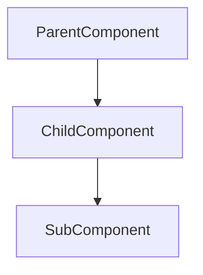
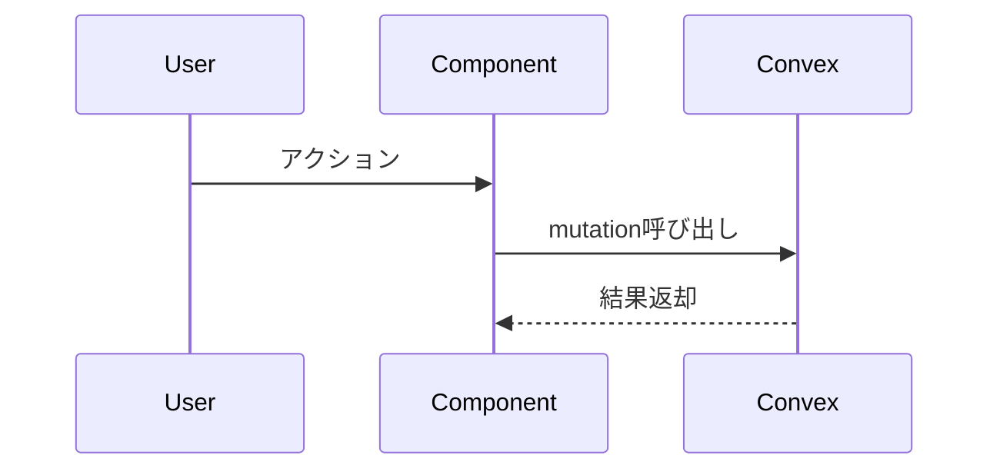

# PR作成スキル

## 前提条件

- コミット済み
- プッシュ済み
- GitHubリポジトリと連携済み

## ワークフロー

### 1. 現在のブランチ情報を取得

```bash
git branch --show-current
```

### 2. デフォルトブランチを自動検出

```bash
gh repo view --json defaultBranchRef --jq '.defaultBranchRef.name'
```

### 3. 変更内容を把握

デフォルトブランチとの差分コミットを取得:

```bash
git log <default-branch>..HEAD --oneline
```

詳細な変更内容を確認:

```bash
git diff <default-branch>...HEAD --stat
```

### 4. PRを作成

```bash
gh pr create --title "<タイトル>" --body "<本文>"
```

## PR本文フォーマット（日本語で出力）

```markdown
## Summary
<!-- なぜこの変更が必要か（背景・目的）を1-2文で -->


## Design
<!-- 設計の全体像をmermaid図で表現 -->

### コンポーネント構成


### データフロー


## Changes
<!-- 主要な変更点を箇条書きで -->
- **変更1**: 具体的な説明
- **変更2**: 具体的な説明
```

## 注意事項

- PRのタイトルと本文は**日本語**で作成すること
- コミットメッセージを参考にしつつ、読み手にわかりやすい表現にする
- mermaid図は変更内容に応じて適切なものを選択（不要なら省略可）
  - コンポーネント構成: 新規コンポーネント追加時
  - データフロー: API連携やデータの流れが重要な場合
- 変更が小さい場合はDesignセクションを省略してシンプルに保つ
