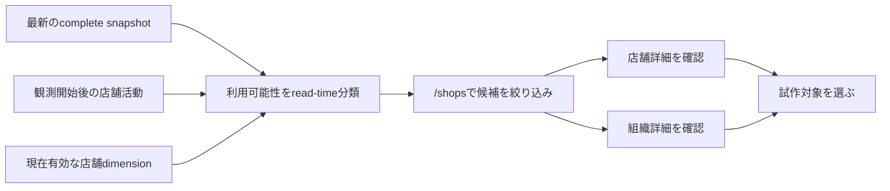

# Analytics利用候補店舗 実装計画

> Archive日: 2026-09-05
>
> 理由: `superseded`
>
> 後継: [日次利用指標](../../features/analytics.md)、[問い合わせ閲覧](../../features/analytics-dashboard.md)

作成日: 2026-08-12
状態: completed
対象: `convex/analyticsDashboard/`、`apps/analytics-dashboard/`の店舗一覧と既存詳細導線
関連計画: [Analytics夜間バッチ簡素化](2026-08-08_Analytics夜間バッチ簡素化_実装計画.md)、[Analytics画面情報設計改善](2026-08-03_Analytics画面情報設計改善_実装計画.md)

## 1. 結論

「現在利用中の店舗」を正確に確定することは、観測開始前の履歴を復元しない現行Analyticsだけではできない。
一方、最新の完全な日次snapshotにある現在所属、次回シフトと、観測開始後の店舗活動を組み合わせれば、「現在利用している可能性がある店舗」を根拠付きで抽出できる。

この計画では、店舗を次の三段階へread-timeで分類する。

- 利用の可能性が高い
- 利用の可能性あり
- 状態不明

分類は断定ではなく、内部担当者が試作対象を探すための絞り込みである。
`状態不明`は`未利用`を意味しない。

新しいtable、index、job、migration、backfillは追加しない。
既存の`/shops`、店舗詳細、組織詳細、BFFとinternal queryの境界を再利用する。

## 2. 目的と完了導線

| 項目 | 契約 |
|---|---|
| actor | Cloudflare Accessを通過した内部BI担当者 |
| trigger | 試作、検証、ヒアリングの対象となる店舗を探したいとき |
| user goal | 現在利用している可能性がある店舗を、根拠と現在のAnalytics情報から選ぶ |
| completion | 候補を絞り込み、店舗詳細または組織詳細を開いて対象を判断できる |
| frequency | 必要時。日次集計完了後の最新snapshotを基準にする |

完了導線は次のとおりとする。



## 3. 現行実装から確認できたこと

| 観点 | 現行契約 | この計画での扱い |
|---|---|---|
| 店舗の母集団 | `analyticsShops.deletedAt`がない店舗を一覧化し、削除済み組織も除外する | 現在有効な店舗の母集団として維持する |
| 現在所属 | 最新日次KPIにスタッフ所属数とシフト対象人数がある | 肯定材料として使う |
| 次回シフト | 最新日次KPIに`nextCyclePeriodStart`がある | 強い肯定材料として使う |
| 店舗活動 | `analyticsShops.latestActivityAt`に観測開始後の最終活動がある | 最近の活動と過去の活動を分けて使う |
| reset直後 | 既存店舗の`latestActivityAt`はreset時に復元しない | `null`を未利用へ変換しない |
| 稼働店舗数 | 切替前店舗は観測開始日をactivity baselineとして30日間active扱いする | 候補判定には使わない |
| 詳細情報 | 店舗詳細と組織詳細は既に現在値、要確認状態、所属、周期を表示する | 内容を作り直さず、そのまま判断材料にする |
| API境界 | BrowserからAccess、BFF、credential付きHTTP Action、internal queryを通る | 公開境界を増やさず維持する |

`latestActivityAt`は一度値が入ると古い活動でも残る。
そのため、単に`null`でない店舗をすべて最上位候補にしてはならない。

また、選択期間の`to`を過去へ変えた場合、現行`getShops`の表示KPIはその期間末のcomplete runを使う。
今回の候補判定だけは目的どおり「現在」を表すため、URLの選択期間とは独立してサービス全体の最新complete runを基準にする。

## 4. 変更範囲

### 4.1 対象

- 最新complete snapshotを基準にした店舗利用可能性の純粋な分類関数
- `/api/analytics/shops`の`usage` filter
- 店舗一覧response専用の候補区分と根拠
- `/shops`のURLへ保存される「利用の可能性」filter
- 店舗名cell内の候補badgeと可視の根拠
- モバイルカードでの候補区分と根拠
- 店舗一覧から既存店舗詳細と既存組織詳細を開く導線
- Convex Logic、Function Testとrequest schema test
- [分析KPI可視化アプリ](../../features/analytics-dashboard.md)の更新

### 4.2 対象外

- 過去日付のbackfill、過去snapshotの再生成、推計値の永続化
- Convex schema、table、index、migration、reset、cron、job、queueの変更
- 「利用中」「未利用」「非稼働」の確定判定
- 店舗候補の総数、割合、ranking、組織別rollup
- 全店舗の一括scanまたは候補専用materialized view
- 店舗詳細、組織詳細のKPI構成変更
- サマリーと組織詳細への候補badge展開
- JSONL exportへの候補filterまたは表示名追加
- 新しいpublic Convex function、汎用proxy、外部API
- Production deployment、Function Runner、環境変数、実データの操作

## 5. 利用可能性の判定契約

### 5.1 基準時点

判定時点は`getAnalyticsReadState`が返すサービス全体の`latestCompleteRun.cutoffAt`とする。
画面では既存metadataの`latestCompleteSnapshotDate`を基準日として表示する。

候補判定はURLの`from`と`to`に連動させない。
表示期間を過去へ変更しても、候補badgeと`usage` filterは最新complete snapshotを基準にする。

### 5.2 区分

| 区分 | 条件 | 表示 |
|---|---|---|
| `high` | 次回シフトがある、または`latestActivityAt`が最新cutoff直前の活動窓内にある | 利用の可能性が高い |
| `possible` | `high`ではなく、観測開始後の古い活動、シフト対象者、スタッフ所属のいずれかがある | 利用の可能性あり |
| `unknown` | 上記の肯定材料を確認できない | 状態不明 |

最近の活動窓は`ANALYTICS_POLICY.health.activityWindowDays`を再利用し、30日を別の定数として重複定義しない。
時刻境界は`latestActivityAt >= cutoffAt - ANALYTICS_POLICY.health.activityWindowDays * DAY_MS`かつ`latestActivityAt < cutoffAt`とする。
`DAY_MS`は`convex/constants.ts`の既存定数を使う。

`kpis === null`でも最近の`latestActivityAt`があれば`high`、古い`latestActivityAt`があれば`possible`にできる。
活動もKPIもない場合だけ`unknown`にする。

`latestActivityAt >= cutoffAt`は未公開の未来値として肯定材料に使わない。
通常はrunのavailability fenceで行自体を返さないが、純粋関数でも防御する。

### 5.3 根拠

```ts
type AnalyticsShopUsageLikelihood = "high" | "possible" | "unknown";

type AnalyticsShopUsageReason =
  | "recentActivity"
  | "hasUpcomingCycle"
  | "observedActivity"
  | "hasShiftTargets"
  | "hasStaffMemberships";

type AnalyticsShopUsageFilter = "candidate" | AnalyticsShopUsageLikelihood;
```

根拠は次の固定順で返す。

1. `recentActivity`: 最近の活動あり
2. `hasUpcomingCycle`: 次回シフトあり
3. `observedActivity`: 観測開始後の活動あり
4. `hasShiftTargets`: シフト対象者あり
5. `hasStaffMemberships`: スタッフ所属あり

最近の活動がある場合は、重複する`observedActivity`を返さない。
それ以外の肯定材料は、区分の決定に使わないものも含めてすべて返す。

`candidate` filterは`high`と`possible`だけに一致する。
`unknown`は候補外へ絞り込めるが、未利用とは表示しない。

### 5.4 既定値

`usage`未指定時は従来どおり全店舗を返す。
画面の既定値も「すべて」とし、不確実な分類によって初期表示から店舗を除外しない。

## 6. APIとデータフロー

### 6.1 response型

既存の`AnalyticsShopRowDto`は組織詳細と店舗詳細でも共有している。
候補区分を全画面へ漏らさないため、`/shops`専用のrow型を追加する。

```ts
type AnalyticsShopListRowDto = AnalyticsShopRowDto & {
  usageLikelihood: AnalyticsShopUsageLikelihood;
  usageReasons: AnalyticsShopUsageReason[];
};
```

`ShopsResponse.rows`だけを`AnalyticsShopListRowDto[]`へ変更する。
`OrganizationDetailResponse.shops`と`ShopDetailResponse.shop`は`AnalyticsShopRowDto`のまま維持する。

`validators.ts`ではbase row field定義を共有し、list row validatorへ候補fieldを追加する。
同じfield集合を手作業で二重管理しない。

### 6.2 request型

`AnalyticsShopsRequest`へ次を追加する。

```ts
usage: AnalyticsShopUsageFilter | null;
```

`schemas.ts`のendpoint別allowlistとenum parser、`httpActions.ts`のinternal query引数、`queries.ts`のvalidatorを同時に更新する。
不明なkeyと不明な`usage`値はserver側で拒否する。

### 6.3 query

`getShops`は一つのraw page内で次を行う。

1. 現行どおり、選択期間末runのKPIを表示用rowへ変換する。
2. サービス全体の最新complete runを候補判定runとして解決する。
3. 二つのrunはobject identityではなく`_id`で比較し、同じrun IDならKPI readを再利用する。
4. 異なる場合だけ、raw page内の各店舗について最新runのKPIを追加取得する。
5. `analyticsShops.latestActivityAt`、最新KPI、最新cutoffを純粋関数へ渡す。
6. 候補fieldをlist rowへ追加し、既存filterと`usage` filterを適用する。

追加readは最大page sizeに比例させる。
全件`collect`、全件scan、新indexは追加しない。

`ShopsResponse.metadata.computedAt`は、返却行に使った表示期間末KPIと候補判定用最新KPIの`computedAt`の最大値とする。
候補の基準時点はmetadataの`asOf`と`latestCompleteSnapshotDate`を正本にする。

### 6.4 pagination

`usage`は現行の複合filterと同じくraw page取得後に適用する。
そのため、一pageの表示件数は50件未満になり得る。

現在pageの一致が0件でもraw cursorに続きがある場合は、次を維持する。

- `continueCursor`を返す
- `isDone: false`を返す
- 既存の`filtered_page_incomplete` warningを返す
- 「このページには一致するデータがありません。次の候補を確認できます」を表示する

候補総数を現在pageから推計しない。

## 7. UI契約

### 7.1 店舗一覧

| surface | 変更 | 維持するもの |
|---|---|---|
| page heading | 利用候補から店舗を選ぶ主作業へ説明を合わせる | title「店舗」、DataStatus |
| 表示条件 | 「利用の可能性」をfilter群の先頭へ追加する | 期間、組織、plan、規模、周期、LINE、要確認状態、sort |
| desktop table | 店舗名cell内へbadgeと根拠を追加する | 最大7列、既存KPI列、row全体の店舗詳細導線 |
| mobile card | 店舗meta直後、要確認状態より前へ区分と根拠を置く | 主要KPI、詳細導線、折り返し |
| organization | 組織名を既存組織詳細への副導線にする | organization IDと既存詳細画面 |

filter optionは次の順にする。

- すべて
- 利用候補（高い・あり）
- 可能性が高い
- 可能性あり
- 状態不明

候補表示は色だけに依存せず、区分文言をbadgeへ必ず表示する。
根拠はtooltipだけへ隠さず、「最新集計の根拠」というlabelと短い可視テキストを折り返して表示する。
過去期間の既存KPI列と、最新snapshotの候補根拠が同じrow内で異なっても、どちらの時点かを識別できるようにする。

組織linkのクリックとEnter keyは店舗rowのnavigationを発火させない。
`DataTable`のrow keyboard handlerでも、event targetが`a`または`button`内ならrow navigationを行わない。

説明文は次を基準にする。

> 利用の可能性は、最新の完全な集計と観測開始後の活動をもとに推定します。状態不明は、未利用を意味しません。

候補badgeと根拠は常に最新complete snapshot基準で、既存KPI列は選択期間末基準のまま維持する。
過去期間を選べる画面で二つの時点を混同しないよう、候補の基準日はpage-levelのDataStatusと説明文で示す。

`high`、`possible`、`unknown`は既存semantic paletteのbadgeで区別する。
action buttonやfilterのselected背景へ低階調tealを追加しない。

### 7.2 URL state

URL keyは`usage`とする。

```text
usage=candidate
usage=high
usage=possible
usage=unknown
```

filter適用時はURLへ保存し、変更時は`cursor`を削除する。
解除時は`usage`自体をURLから削除する。
browser back、forwardと共有URLで復元する。

frontendの`parseSearch`でもenumへ正規化する。
不正なURL値を有効なfilter件数として表示しながら、APIへは送らない不整合を作らない。

### 7.3 状態

| 状態 | 表示 |
|---|---|
| loading | 既存の店舗一覧loading |
| API error | 既存の取得失敗 |
| Analytics unavailable | 候補行を返さず、既存DataStatusへ理由を表示 |
| candidate最終結果0件 | 利用候補がないのではなく、条件に一致する候補を確認できないと表示 |
| page内0件、次cursorあり | 既存の次候補案内を表示 |
| unknown | 状態不明。未利用、非稼働とは表示しない |

## 8. 互換性、rollout、rollback

保存済みデータ形式を変更しないため、widen-migrate-narrowとbackfillは不要である。
rollbackでデータを復元する必要もない。

既存URLは`usage`を送らないため、従来の返却集合を維持する。
旧frontendは追加response fieldを無視できる。

実環境へ反映する場合の順序は次とする。

1. Convex APIを先にdeployする。
2. Analytics WorkerとStatic Assetsを後にdeployする。
3. rollbackはfrontendを先に戻し、その後にConvex APIを戻す。

新frontendを先に出すと、旧APIが未知の`usage` keyを拒否するため順序を逆にしない。
この実装計画の実行にはdeploymentを含めず、Production状態は別途証跡で確認する。

## 9. Security Lens

| 観点 | 契約 |
|---|---|
| actor | Cloudflare Accessを通過した内部BI閲覧者。BFFはservice credentialでConvexへ接続する |
| asset | 組織・店舗ID、表示名、運用KPI、利用可能性とその根拠 |
| trust boundary | Browser → Cloudflare Access → Worker BFF → credential付きHTTP Action → internal query |
| abuse case | Access迂回、HTTP Action直叩き、未知filter、過大page、secret漏洩後の列挙 |
| server enforcement | credential、request size、endpoint別allowlist、enum、page size、response size、rate limit、削除済み対象除外を維持する |
| rate / idempotency | read-onlyなのでidempotency不要。追加readはpage上限に比例させ、既存rate limitを維持する |
| lifecycle / recovery | 保存と外部副作用なし。code rollbackだけで復旧できる |
| log / PII | filter、row、表示名、ID、credentialを新しいlogへ出さない。スタッフ氏名、email、電話番号、LINE IDをDTOへ追加しない |
| regression | 未知keyと値の拒否、internal-only境界、候補DTO、削除済み対象除外、pagination warningを確認する |

候補区分は既存の内部運用データから導出するが、利用状況そのものが内部情報である。
既存のAccess、BFF、service credentialを迂回するpublic queryは追加しない。

## 10. 実装単位

### Phase 1: 判定契約とDTO

- `convex/analyticsDashboard/dto.ts`
  - 候補区分、根拠、list row型を追加する。
- `convex/analyticsDashboard/validators.ts`
  - list row response validatorを追加する。
- `convex/analyticsDashboard/queryHelpers.ts`
  - `classifyShopUsage`と`usageMatches`相当の純粋関数を追加する。
- `convex/analyticsDashboard/queryHelpers.test.ts`
  - 時刻境界、優先順位、根拠順、filterを検証する。

### Phase 2: requestとinternal query

- `convex/analyticsDashboard/schemas.ts`
  - 候補filter型と`usage`のallowlist、enum parserを追加する。
- `convex/analyticsDashboard/schemas.test.ts`
  - valid、未指定、不正値、未知keyを検証する。
- `convex/analyticsDashboard/queries.ts`
  - 最新runのKPIを有界に取得し、list rowへ分類を付け、filterとwarningへ接続する。
- `convex/analyticsDashboard/httpActions.ts`
  - 検証済み`usage`を`getShops`へ転送する。
- `convex/analyticsDashboard/refs.ts`
  - request型変更がinternal referenceへ伝播することを確認する。
- `convex/analyticsDashboard/queries.test.ts`
  - 最新run基準、返却集合、pagination warningをFunction Testする。

### Phase 3: Analytics Dashboard UI

- `apps/analytics-dashboard/src/api/analyticsTypes.ts`
  - 新しいDTOとfilter型を再exportする。
- `apps/analytics-dashboard/src/api/analyticsClient.ts`
  - `ShopsParams.usage`を追加する。
- `apps/analytics-dashboard/src/features/analytics/useAnalyticsSearch.ts`
  - enum正規化、URL保存、API paramsへの変換を追加する。
- `apps/analytics-dashboard/src/features/analytics/AnalysisControls.tsx`
  - 「利用の可能性」filterを追加する。
- `apps/analytics-dashboard/src/features/analytics/viewModels.ts`
  - list専用の候補表示modelを追加する。
- `apps/analytics-dashboard/src/features/analytics/adapters.ts`
  - list row DTOを表示modelへ変換する。
- `apps/analytics-dashboard/src/features/analytics/Presentation.tsx`
  - 区分と根拠の表示辞書、badgeを置く。
- `apps/analytics-dashboard/src/components/DataTable.tsx`
  - 子linkのEnter keyをrow navigationとして扱わない。
- `apps/analytics-dashboard/src/features/analytics/AnalyticsTables.tsx`
  - `/shops`だけで店舗cellとmobile cardへ候補情報を表示する。
- `apps/analytics-dashboard/src/features/analytics/ShopsView.tsx`
  - 主作業、filter、説明、詳細導線を更新する。
- `apps/analytics-dashboard/src/pages/ShopsPage.tsx`
  - list専用adapterと取得失敗時の説明を接続する。

`apps/analytics-dashboard/`にはLogic、UI、Storybook、VRT、E2E testを追加しない。
同appの現行規約どおり、静的検証を主担当にする。

### Phase 4: 現行文書と自己レビュー

- `doc/features/analytics-dashboard.md`
  - 候補区分、最新snapshot基準、URL filter、状態不明、pagination制約を現在仕様へ反映する。
- 本計画
  - 実施結果、検証結果、Production未反映を記録する。
- `doc/plans/INDEX.md`
  - 実装状況に合わせて分類を更新する。

## 11. テスト契約

| ID | 主担当層 | 契約 |
|---|---|---|
| `USAGE-LOGIC-01` | Convex Logic | 最近の活動だけ、または次回シフトだけで`high`になる |
| `USAGE-LOGIC-02` | Convex Logic | 古い活動だけ、対象者だけ、所属だけで`possible`になる |
| `USAGE-LOGIC-03` | Convex Logic | 活動なし、KPIなし、人数0で`unknown`になる |
| `USAGE-LOGIC-04` | Convex Logic | 活動窓の開始時刻は`high`、その直前は`possible`、cutoff以後は肯定材料にならない |
| `USAGE-LOGIC-05` | Convex Logic | `high`が優先され、根拠が重複せず固定順ですべて返る |
| `USAGE-FILTER-01` | Convex Logic | `candidate`は`high`と`possible`だけを含む |
| `USAGE-SCHEMA-01` | Schema Logic | validな`usage`と未指定時`null`を受け付け、不正値と未知keyを拒否する |
| `USAGE-QUERY-01` | Convex Function | 選択期間が過去でも候補判定は最新complete runを使い、metadataへ両KPIの最新`computedAt`を反映する |
| `USAGE-QUERY-02` | Convex Function | `usage`が実際の`getShops`返却集合へ適用される |
| `USAGE-PAGE-01` | Convex Function | 一致0件でもraw pageに続きがあればcursorとwarningが残る |
| `USAGE-COMPAT-01` | Convex Function | `usage`未指定の既存requestは従来の店舗集合を返す |
| `USAGE-READ-01` | Static Review | run `_id`が同じ経路では、店舗あたりのKPI readを二重化していない |

Scenario Testは追加しない。
この変更には複数操作、非同期workflow、外部副作用がないため、Logicとfocused Function Testが主担当である。

## 12. 検証コマンド

対象testを先に実行する。

```bash
pnpm vitest run --project='convex(logic)' \
  convex/analyticsDashboard/queryHelpers.test.ts \
  convex/analyticsDashboard/schemas.test.ts \
  convex/analyticsDashboard/queries.test.ts
```

Analytics Dashboardは次を実行する。

```bash
pnpm analytics:lint
pnpm analytics:type-check
pnpm analytics:build
```

最後にrepository全体へ広げる。

```bash
pnpm lint
pnpm type-check
pnpm test
pnpm build
git diff --check
```

ブラウザの手動操作確認は追加せず、自動testと静的検証で契約を確認する。

## 13. 受入条件

- 現在有効な店舗だけを候補判定の母集団にする
- 判定基準がサービス全体の最新complete snapshotであり、選択期間へ引きずられない
- 最近の活動または次回シフトがある店舗を`high`にする
- 古い活動、シフト対象者、スタッフ所属だけがある店舗を`possible`にする
- 肯定材料を確認できない店舗を`unknown`にし、未利用と表示しない
- `latestActivityAt === null`と`activeShopCount`を未利用判定に使わない
- `candidate`が`high`と`possible`だけを返す
- `usage`未指定の既存URL、sort、filter、paginationを維持する
- 不正なURL値を有効filterとして画面表示せず、serverも不正値を拒否する
- page内0件でも次cursorがあれば次候補案内を維持する
- desktopの店舗一覧を8列へ増やさない
- mobileでも店舗、組織、区分、根拠、店舗詳細導線を読める
- desktopとmobileの候補部分に「最新集計の根拠」を表示し、選択期間末の既存KPIと区別できる
- 組織linkのクリックとEnter keyが組織詳細だけを開き、店舗row navigationと競合しない
- 店舗詳細と組織詳細の既存データを変更せず開ける
- 新table、index、migration、backfill、public function、export変更を追加しない
- 新しいPIIと秘密値をresponse、log、文書へ追加しない
- 対象testと必須検証が成功する
- [分析KPI可視化アプリ](../../features/analytics-dashboard.md)を実装後の現在仕様へ更新する
- ローカル実装完了とProduction反映を分けて報告する

## 14. リスクと緩和

| リスク | 緩和 |
|---|---|
| 活動が古くても永久に最上位候補になる | 最新cutoffからの活動窓内だけを`high`にする |
| reset由来baselineを実活動と誤認する | `activeShopCount`と日次KPIの`hasRecentActivity`を使わず、dimensionの`latestActivityAt`を見る |
| 過去期間URLで候補時点がずれる | 候補判定だけは最新complete runへ固定し、画面で基準を説明する |
| page filterを全件結果と誤認する | 既存cursor warningと次page導線を維持し、候補総数を表示しない |
| badgeが「利用中」の断定に見える | 「可能性」と根拠を常に併記し、`unknown`を未利用と呼ばない |
| APIとfrontendのdeploy順で400になる | APIを先、frontendを後にする |
| 候補区分が他の画面へ漏れる | list専用DTOと表示modelを使う |

## 15. 採用しない案

| 案 | 採用しない理由 |
|---|---|
| 過去全期間をbackfillする | 観測開始前の状態履歴を正確に復元できず、今回の現在候補には不要 |
| `activeShopCount`を候補に使う | reset後のbaselineにより実活動なしでも一定期間activeになる |
| `latestActivityAt !== null`をすべて`high`にする | 古い活動が残り続け、現在らしさを失う |
| 現在の運用tableをDashboard queryから直接読む | Analyticsのcomplete snapshotとPII境界を崩す |
| frontendだけで分類する | server filter、共有契約、pagination warningを一貫して検証できない |
| 候補専用tableとindexを作る | 現在のpage上限内でread-time導出でき、永続状態を増やす必要がない |
| 初期表示をcandidateへ固定する | 状態不明の店舗を無言で除外し、誤った確信を生む |
| JSONL exportも同時に変更する | 既存の匿名化とfilter伝播を別契約で扱う必要があり、今回のUI目的を超える |

## 16. 参考にした現行ファイル

- `convex/analytics/reset.ts`
- `convex/analytics/projection.ts`
- `convex/analytics/aggregation.ts`
- `convex/analytics/registry.ts`
- `convex/analyticsDashboard/dto.ts`
- `convex/analyticsDashboard/validators.ts`
- `convex/analyticsDashboard/schemas.ts`
- `convex/analyticsDashboard/queryHelpers.ts`
- `convex/analyticsDashboard/queries.ts`
- `convex/analyticsDashboard/httpActions.ts`
- `apps/analytics-dashboard/src/api/analyticsClient.ts`
- `apps/analytics-dashboard/src/features/analytics/useAnalyticsSearch.ts`
- `apps/analytics-dashboard/src/features/analytics/AnalysisControls.tsx`
- `apps/analytics-dashboard/src/features/analytics/AnalyticsTables.tsx`
- `apps/analytics-dashboard/src/features/analytics/ShopsView.tsx`
- `apps/analytics-dashboard/src/features/analytics/ShopDetailView.tsx`
- `doc/features/analytics.md`
- `doc/features/analytics-dashboard.md`
- `doc/rules/convex-design-strategy.md`
- `doc/rules/security-strategy.md`
- `doc/rules/testing-strategy.md`
- `doc/rules/ui-design.md`

## 17. 実行用ゴールプロンプト

```text
/Users/natani/work/yps-crispy-carnival の現在のcheckoutで、doc/plans/2026-08-12_Analytics利用候補店舗_実装計画.mdを最後まで実装してください。

目的は、内部Analytics Dashboardの店舗一覧から「現在利用している可能性がある店舗」を根拠付きで絞り込み、既存の店舗詳細と組織詳細を使って試作対象を選べるようにすることです。
これは利用中を確定する機能ではありません。
サービス全体の最新complete runに属する店舗KPIと、そのrunまでにprojectionされたanalyticsShops.latestActivityAtから候補をread-timeで導出してください。

着手前に現在のgit statusと対象実装を確認してください。
ルートと対象ディレクトリのAGENTS.md、convex/_generated/ai/guidelines.md、本計画が参照するrulesとFeature Docを全文読んでください。
shiftori-coding、convex-expert、convex-design-review、shiftori-security-review、ui-architect、test-strategyを計画どおり使用し、文書更新にはjapanese-tech-writingを使用してください。

候補判定はURLの選択期間ではなく、getAnalyticsReadStateが返すサービス全体のlatestCompleteRunを基準にしてください。
最近の活動窓はANALYTICS_POLICY.health.activityWindowDaysとconvex/constants.tsのDAY_MSを再利用し、latestActivityAt >= cutoffAt - activityWindowDays * DAY_MSかつlatestActivityAt < cutoffAtで判定してください。
latestActivityAtが最新cutoff以後の場合は未公開の未来値として、recentActivityにもobservedActivityにも使わないでください。

区分は次の優先順位で導出してください。

- high:
  次回シフトがある、またはanalyticsShops.latestActivityAtが最新cutoff直前の活動窓内にある
- possible:
  highではなく、観測開始後の古い活動、shiftTargetCountが1以上、staffMembershipCountが1以上のいずれかがある
- unknown:
  上記の肯定材料を確認できない

根拠はrecentActivity、hasUpcomingCycle、observedActivity、hasShiftTargets、hasStaffMembershipsの固定順で返してください。
recentActivityがある場合は重複するobservedActivityを返さず、それ以外の該当根拠はすべて返してください。
candidate filterはhighとpossibleだけを含めてください。

画面表示は「利用の可能性が高い」「利用の可能性あり」「状態不明」とし、「利用中」「未利用」「非稼働」と断定しないでください。
latestActivityAtがnullの店舗を未利用と扱わず、activeShopCountと日次KPIのhasRecentActivityを候補判定に使わないでください。

ShopsResponseだけにusageLikelihoodとusageReasonsを持つlist専用DTOを追加してください。
OrganizationDetailResponseとShopDetailResponseの共有rowへ候補fieldを追加しないでください。
DTO、returns validator、request parser、internal query args、HTTP Action、frontend client、URL search state、adapter、view modelを同じ契約で接続してください。

Browser query parameterはusageとし、candidate、high、possible、unknownだけを受け付けてください。
usage未指定は全件です。
frontendのURL parserでも不正値を除外し、serverは不明な値とrequest keyを拒否してください。
filter変更時はcursorを削除し、back、forward、共有URLで状態を復元してください。

店舗一覧のfilterには「すべて」「利用候補（高い・あり）」「可能性が高い」「可能性あり」「状態不明」を追加してください。
既定値は「すべて」とし、候補外の店舗を初期表示から除外しないでください。
候補区分と根拠は既存の店舗名cell内へ表示し、desktopの8列目を追加しないでください。
モバイルでは店舗metaの直後、要確認状態より前へ置いてください。
区分は色だけでなく文言で示し、根拠をtooltipだけへ隠さず、「最新集計の根拠」という可視labelを付けてください。
過去期間の既存KPI列と最新snapshotの候補根拠を同じrowで区別し、長い店舗名と複数根拠を折り返してください。

/shopsの店舗名から既存店舗詳細を、組織名から既存組織詳細を開けるようにしてください。
組織linkのクリックとEnter keyでは店舗row navigationを発火させず、DataTableのrow keyboard handlerでも子a、buttonを除外してください。
既存の店舗詳細、組織詳細、filter、sort、pagination、warning、loading、error、unavailableの内容と挙動を維持してください。
候補情報は/shopsだけへ表示し、サマリーと組織詳細へ展開しないでください。

候補filterは現行どおりraw page取得後に適用してください。
最新runと表示期間末runはobject identityではなく_idで比較し、同じrun IDならKPI readを再利用し、異なる場合もraw page上限内の追加readだけにしてください。
ShopsResponse.metadata.computedAtには、返却行で使った表示期間末KPIと候補判定用最新KPIのcomputedAtの最大値を反映してください。
全件collect、全件scan、pagination再設計、候補総数の推計を行わないでください。
page内0件でもraw cursorに続きがある場合はcontinueCursor、isDone=false、既存warningと次候補案内を維持してください。

既存のBrowser、Cloudflare Access、Worker BFF、service credential付きHTTP Action、internal queryという境界を維持してください。
新しいpublic Convex function、外部route、汎用proxyを追加しないでください。
既存のcredential、request size、page size、response size、rate limit、削除済み対象除外を弱めないでください。
秘密値、店舗名、組織名、ID、filter値を新しいlogへ出さず、スタッフ氏名、email、電話番号、LINE IDをDTOへ追加しないでください。

この変更では保存済みdocumentを書き換えないでください。
schema、table、index、migration、backfill、reset、bootstrap、cron、job、queue、永続cacheを追加しないでください。
Productionを含むConvex deployment、Function Runner、環境変数、実データを操作しないでください。
JSONL exportの既存契約を変更しないでください。

Convex側では計画のUSAGE-LOGIC、USAGE-FILTER、USAGE-SCHEMA、USAGE-QUERY、USAGE-PAGE、USAGE-COMPATを自動testしてください。
pure helperとschema testだけで終わらず、getShopsのfocused Function Testで最新run基準、filter配線、0件pageと次cursorを確認してください。
Scenario Testは追加しないでください。

apps/analytics-dashboard配下へLogic、UI、Storybook、VRT、E2E testを追加しないでください。
同appはpnpm analytics:lint、pnpm analytics:type-check、pnpm analytics:buildで検証してください。
対象Convex testの後にpnpm lint、pnpm type-check、pnpm test、pnpm build、git diff --checkを実行してください。
sandboxまたは実行環境に起因する失敗はcode failureと区別し、実行command、結果、未検証契約を報告してください。
依頼と無関係な既存failureは修正範囲へ取り込まず、証拠を添えて報告してください。

doc/features/analytics-dashboard.mdを実装後の現在仕様へ更新してください。
実装と検証が完了した場合だけ、本計画へ実施結果を記録し、doc/plans/INDEX.mdの分類を実態に合わせて更新してください。
ローカル実装の完了をProduction反映済みとは表現しないでください。

実装後は差分全体を自己レビューし、可能なら別エージェントへConvex設計、Security Lens、UI、test契約の独立レビューを依頼してください。
不要な抽象化、候補判定の重複、期間末runとの混同、secret流出、public API拡大、保存データ変更、誤断定する文言、既存詳細画面の退行を確認し、指摘を修正して再検証してください。

ファイル名や既存helperの配置が計画から変わっているだけなら、現在のリポジトリ構造に合わせて同じ契約を実装してください。
候補判定、保存データ、public API、PII、export、Production操作、既定表示からの店舗除外を変更する必要が生じた場合は、推測で進めず理由と選択肢を報告して確認を待ってください。
対象ファイルに依頼外の既存変更が重なり、安全に保持できない場合も停止して報告してください。

新しいbranchやworktreeを作らないでください。
依頼外の既存変更をrevert、削除、上書き、stageしないでください。
commit、push、Pull Request作成を行わないでください。
Convex、Vite、Storybookの開発serverを新規起動せず、convex/_generated、src/routeTree.gen.ts、pnpm-lock.yamlを手動編集しないでください。

最後に次を日本語で報告してください。

- 変更ファイルと各変更の目的
- 候補判定規則、基準snapshot、状態不明の意味
- Browserからinternal queryまでの接続結果
- 店舗一覧、店舗詳細、組織詳細で維持した内容
- 実行した検証と結果
- 更新した文書と計画status
- 独立レビューまたは自己レビューの結果
- 未実行項目、既知の制約、Production未反映であること
```

## 18. 実施結果

2026-08-12に、現在のcheckoutへ計画どおり実装した。

- 店舗一覧専用DTOへ`usageLikelihood`と`usageReasons`を追加した
- 最新complete runのKPIと、同runのcutoffより前に観測した`latestActivityAt`から利用可能性をread-timeで分類した
- `usage`のrequest validation、HTTP Action、internal query、frontend client、URL stateを接続した
- raw page後のfilter、cursor、warning、返却行だけを対象とする`computedAt`を維持した
- `/shops`の店舗名領域とモバイルカードへ区分と「最新集計の根拠」を表示した
- 店舗詳細と組織詳細への既存導線を維持し、組織linkと店舗rowのkeyboard操作を分離した
- [分析KPI可視化アプリ](../../features/analytics-dashboard.md)を現在仕様へ更新した

Convex schema、table、index、migration、backfill、public Convex function、外部route、JSONL exportは変更していない。
Production deployment、Function Runner、環境変数、実データの操作も行っていない。

## 19. 検証結果

次の検証に成功した。

- 対象Convex Logic・Schema・Function Test: 3 files、26 tests
- `pnpm analytics:lint`
- `pnpm analytics:type-check`
- `pnpm analytics:build`
- `pnpm lint`
- `pnpm type-check`
- `pnpm test`
- `pnpm build`
- `git diff --check`

`pnpm lint`の初回実行は`tsx`のIPC socket、`pnpm build`の初回実行はprerender用preview serverのlistenをsandboxが拒否した。
どちらも同一commandを制限外で再実行し、成功を確認した。

独立レビューでは、Convex設計・Security Lensに指摘はなかった。
UIレビューで組織詳細へ店舗専用sortを持ち越す問題、testレビューで`metadata.computedAt`の表示KPI側が最大となる逆向き境界の不足が見つかったため修正し、対象検証を再実行した。

この完了記録はローカル実装と自動検証の完了を示す。
Productionへの反映と実データ量での負荷計測は未実施である。
