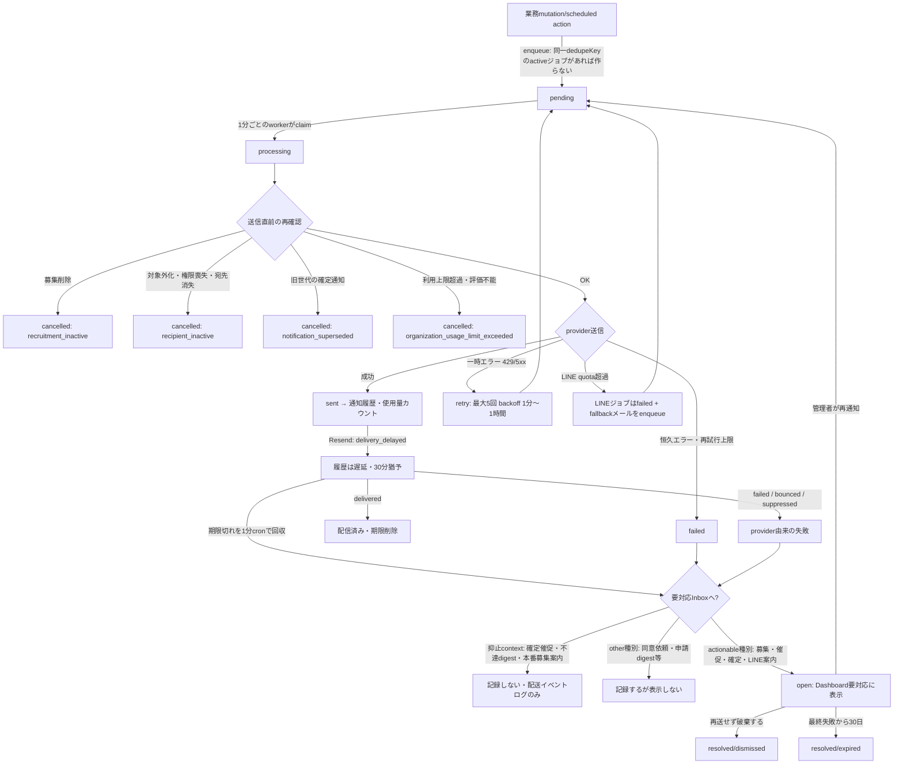

# 条件別仕様: 通知マトリクス

> 文書種別: behavior（条件→結果の詳細仕様。機能文書・業務仕様・コードから導出）
>
> 作成日: 2026-08-16 ／ 基準commit: `37c908f`
>
> 正本: [通知配送outbox](notification-outbox.md)、[LINE通知連携](line-notification.md)、[スタッフ通知履歴](notification-history.md)、[通知不達Dashboard](notification-failure-dashboard.md)、[業務仕様4.4・21章](../specs/organization-billing-business-flow.md)

「誰に・何を・いつ・どのチャネルで送るか」と、**送らない条件**、失敗時の扱いを通知種別ごとに定める。  
すべての外部送信はNotification Outboxが非同期で行い、アプリの「送りました」は**受付**を意味する（providerへの到達は保証しない）。

## 1. チャネル選択の共通規則

利用者がチャネルを選ぶ設定はなく、送信時点の状態で自動選択する。

| # | 条件 | チャネル |
|---|---|---|
| 1 | 組織共通のLINE連携が有効 かつ 友だち状態 | **LINE優先** |
| 2 | LINE未連携／友だち解除（ブロック） | メール（現在のシフト連絡先へ） |
| 3 | LINE quotaが`exceeded` | LINEジョブは`failed`にし、payloadにfallbackメールがあればメールを別ジョブで送る |
| 4 | quota状態を取得できない | LINE送信を試みる |
| 5 | LINE APIの429／5xx | **fallbackせず再試行**（恒久的4xxは`failed`） |
| 6 | 課金通知・管理者招待 | **常にメール**（LINE連携済みでもLINEへ送らない） |

- 宛先メールの正本は`organizationPeople.email`（シフト連絡先）。Clerkのログイン用メールや`users.email`を通知先にしない。
- Stripe発の請求書・領収書・カード関連だけは組織の請求先メールアドレス（`organizations.billingEmail`）へ届く。

チャネル決定の早見表（○×）:

| LINE連携 | 友だち状態 | quota | 実際のチャネル |
|:-:|:-:|:-:|---|
| ○ | ○ | 正常・不明 | **LINE** |
| ○ | ○ | 超過 | fallbackメールがあれば**メール**、なければ失敗 |
| ○ | ×（ブロック・解除） | − | **メール** |
| × | − | − | **メール** |
| −（課金通知・管理者招待） | − | − | **常にメール**（LINE配送を作らない） |

## 2. 宛先解決の共通規則

| 通知の分類 | 宛先 | 0人の場合 |
|---|---|---|
| スタッフ向けシフト通知 | 対象店舗のactiveな正規staffのうち**シフト対象**（`excludedFromShift`でない）の者 | 送らない |
| 店舗管理通知（参加申請digest・確定催促・本番募集案内・不達digest） | activeな`organizationMembers`のうち、**同じ組織人物が対象店舗のactiveな正規staffとしても所属**する人物だけ | **送らない**（店舗詳細に「管理者を店舗所属に置く」推奨を表示） |
| 組織通知（課金・管理者招待・招待承認完了） | 有効管理者（＋文脈により復旧担当者）。店舗所属を受信条件にしない | - |

組織から削除された人物は、すべての組織通知から除外する。各送信時点で宛先を再抽出する。

受信者ロール別の早見表（○＝受信対象、×＝対象外）:

| 通知グループ | シフト対象スタッフ | 対象外スタッフ | 店舗所属のactive管理者 | 店舗未所属のactive管理者 | 復旧担当者（readOnly） | 請求先メール |
|---|:-:|:-:|:-:|:-:|:-:|:-:|
| シフト運用（募集・催促・確定・再送） | ○ | × | △（自分がその店舗のシフト対象スタッフでもある場合） | × | × | × |
| 店舗管理通知（申請digest・確定催促・不達digest・本番募集案内） | × | × | ○ | **×** | × | × |
| 同意依頼・LINE連携案内 | ○ | ○（シフト以外は届く） | − | − | − | × |
| 課金通知（シフトリ発） | × | × | ○（有効管理者として） | ○（同左。店舗所属は条件でない） | △（支払い失敗系・復旧・請求先変更） | × |
| 管理者招待 | ×（招待先メールのみ） | − | − | − | × | × |
| Stripe直送（請求書・領収書・カード） | × | × | × | × | × | ○ |

## 3. 送信直前の再確認（provider gate）

Outboxに入った後でも、provider呼び出しの**直前**に次を再確認し、満たさなければ送信せずcancelする。

| 再確認 | cancel理由 |
|---|---|
| 募集の存在・論理削除 | `recruitment_inactive` |
| スタッフのシフト対象性・active状態 | `recipient_inactive` |
| 管理者権限・店舗staff所属・現在の宛先（店舗管理通知） | `recipient_inactive` |
| 確定通知の世代（募集の最新確定operationと一致するか） | `notification_superseded` |
| 組織の現在プランと利用上限状態（業務通知） | 上限超過または利用上限評価不能なら停止 |
| 組織の削除・受信者の所属（課金・業務通知） | 対象外なら停止 |
| 招待の有効性（管理者招待） | 投入済みでも取消 |

利用上限状態は、未承認の管理者招待を除く実利用人数、稼働店舗数、有効管理者数から送信時に導出する。
課金通知は、上限超過または利用上限評価不能による業務通知の停止対象に含めない。

## 4. 通知マトリクス

### 4.1 スタッフ向け（シフト運用）

| 通知 | トリガー | 宛先 | 送らない条件 | 不達時に要対応Inboxへ |
|---|---|---|---|---|
| 募集開始 | 募集作成時 | 対象店舗のシフト対象スタッフ（最大50名、10名ずつ） | シフト対象外／削除済みスタッフ／募集が削除済み（gate） | **載る** |
| 提出催促 | 締切**前日17:00**（作成時に予約。予定時刻が過去なら予約しない） | **未提出**のシフト対象スタッフのみ | 募集が`open`でない／削除済み／**送信済み（1回だけ）**／デプロイ前から存在する募集（予約なし） | 載る |
| 確定シフト | 確定・再確定時 | 前回確定通知との**差分があるスタッフ**＋**前回の確定通知が未配送のスタッフ** | 差分がなく前回通知も配送済み／分割⇔統合の表現差のみ／シフト対象外／旧世代（superseded） | 載る |
| 募集の個別再送 | 管理者の手動操作 | 指定スタッフ | 対象外スタッフ（ボタン無効）／同種の送信受付から10分未満／再送quota超過（操作者10/日・組織20/日） | 載る |
| 確定シフトの個別再送 | 管理者の手動操作 | 指定スタッフ | **終了日が過去**の募集／対象が40件超（全部送らない）／同種の送信受付から10分未満／quota超過 | 載る |
| メール変更時の再送 | シフト連絡先の変更 | **LINEを受信できない**スタッフのみ、新宛先へ | 受付中募集（未削除・open・開始前・締切以前）がない | 載る |
| LINE連携完了・follow時の追送 | 連携完了またはfollow受信 | 対象スタッフへ受付中募集をLINEで | 受付中募集がない | 載る |
| 閲覧リンク再発行 | スタッフの再発行要求 | 本人（メール一致時のみ実送信。**応答は一致有無で同一**） | メール不一致／対象外／確定済み募集でない／レート制限 | 載る |
| 法務同意依頼 | スタッフ追加時 | 未同意スタッフ | **QR申請で同意済み**／別店舗追加の再利用人物 | 記録のみ（`other`種別のため表示されない） |
| LINE連携依頼 | スタッフ追加時、または管理者の手動送信 | 組織人物が**LINE未連携**の場合のみ | 連携済み（別店舗追加でも重ねて送らない）／メール未登録／同一組織人物への送信受付から10分未満 | 載る（再通知は**毎回新しい連携トークン**を発行） |

募集、確定シフト、LINE連携依頼の個別再送は、自動送信と手動再送を区別せず、履歴の`requestedAt`から10分間停止する。  `queued`、`sent`、`delivered`、`delayed`は対象とし、`failed`、`cancelled`、`bounced`、`suppressed`は対象外とする。10分ちょうどで再送を許可する。

クールダウン拒否はOutbox、Scheduler、fanout operationを作らず、既存のquotaも消費しない。  履歴の有限走査が上限に達した場合は、未走査の有効履歴を取りこぼさないよう安全側に停止する。

### 4.2 管理者向け（店舗管理通知、時刻はJST）

| 通知 | トリガー | 宛先 | 送らない条件 | 要対応Inboxへ |
|---|---|---|---|---|
| シフト確定催促 | 締切**翌日17:00**（作成時に予約） | 対象店舗にスタッフ所属するactive管理者（最大20名） | 発火時に確定済み／削除済み／宛先0人／予定時刻が作成時点で過去 | **載せない**（配送イベントログには残る） |
| スタッフ参加申請digest | 毎日17:00 | 同上 | 直近24時間以内の承認待ちがない（＝通常1回だけ送る）／宛先0人 | 記録は残るが表示されない（`other`種別） |
| 通知不達digest | 毎日17:00 | 同上 | `open`の不達がない／最終失敗から24時間超過／宛先0人 | **載せない**（メタ失敗でInboxを汚さない） |
| 本番募集リマインダー | 初回店舗登録の**7日後17:00**（登録時に予約、backfillなし） | 同上 | 発火時に本人以外のシフト対象スタッフが登録済み／宛先0人 | 載せない |

- 申請digestには申請者名・メール・件数を載せず、Dashboardリンクだけを案内する。
- CTAは通知元店舗を`shop`クエリで指定したDashboard URL。
- 「要対応Inboxへ」の区別は2段階ある。確定催促・不達digest・本番募集リマインダーは**抑止context**によりInboxへの記録自体を作らない（配送イベントログには残る）。参加申請digestや法務同意依頼は抑止contextを持たず記録は作られるが、種別が`other`（「通知」）のため一覧・要対応カード・日次リマインダーには表示されない（`isManagerActionableNotificationFailure`）。

### 4.3 組織向け（課金・招待。すべてメールのみ）

| 通知 | トリガー | 宛先 |
|---|---|---|
| 管理者招待 | 発行・再送 | 招待先メールアドレス |
| 招待承認完了 | 承認 | 承認者本人＋他の全有効管理者 |
| Trial終了案内 | 終了の**7日前** | 全有効管理者 |
| 契約開始・プラン変更 | 各操作の確定 | 全有効管理者 |
| 解約の予約・取消・適用 | 各操作 | 直前までの全有効管理者 |
| 支払い失敗 | 最初の失敗を確認した直後 | 全有効管理者 |
| 猶予期限前の再案内 | 猶予終了の**3日前**（未払いの場合） | 有効管理者＋復旧担当者 |
| Free移行・利用状況案内 | Trial未契約終了・解約適用・猶予終了・想定外解約 | 全有効管理者 |
| 支払い復旧完了 | 支払い成功 | 有効管理者＋復旧担当者 |
| 請求先メールアドレス変更 | 変更操作 | 全有効管理者＋復旧担当者 |
| 請求書・領収書・カード関連 | Stripeの請求イベント | 組織の請求先メールアドレス（**Stripeが直接送る**） |

- 課金通知はLINE連携の有無にかかわらずメールで送り、LINE配送を1件も作らない。複数宛先はメールアドレスを相互に見せないよう個別送信する。
- 支払い不要Pro相当では課金通知を一切発生させない。

## 5. 送らない共通条件（全通知に適用）

| # | 条件 | 挙動 |
|---|---|---|
| 1 | `NOTIFICATION_DELIVERY_MODE`がdry-run／disabled／mock | 外部配送を抑止。**通知履歴も作成しない**。使用量にも数えない |
| 2 | `DEBUG_NOTIFY_FAIL`設定時 | dry-runより優先して非リトライ失敗にする（FailureInbox確認用。実送信しない） |
| 3 | 上限超過または利用上限評価不能 | **判定時刻以降に送信予定だった業務通知を停止**。外部送信直前にも現在プランと実利用数から再判定する |
| 4 | Trial未契約終了・解約適用・猶予終了・想定外解約による`active.free`への移行、ProからStandardへの`active.standard`への移行、Trial→初回請求処理中・有料プラン・支払い猶予への移行 | 状態遷移だけを理由に業務通知を停止しない。移行後の上限内外を別に判定する |
| 5 | 停止された過去の業務通知 | 再契約後も**自動再送しない** |
| 6 | 同じ`dedupeKey`のactiveジョブ（pending/processing）が存在 | 重複作成しない |
| 7 | 店舗・組織・人物・staffの削除、店舗所属解除 | 対象scopeの未送信通知を停止 |
| 8 | dry-run判定（管理者宛）で対象店舗のactive管理者全員がallowlist一致 | 抑止。走査上限超過で全員を確認できない場合は**抑止せず通常配送**（fail-safe） |

## 6. 配送の状態と再試行

| 表示（通知履歴） | 意味 |
|---|---|
| 送信待ち | Outbox登録済み、外部送信前 |
| 送信済み | providerが送信要求を受け付けた（LINEはここまでしか確認できない） |
| 配信済み | メールのみ。受信側メールサーバーへの到達（**開封ではない**） |
| 配信が遅れています | メールのみ。Resendが遅延を通知 |
| 送れませんでした | 送信処理またはprovider配送の失敗 |
| キャンセル | 削除・対象外化などによる配送中止 |

- 再試行は最大5回（1分〜1時間のbackoff）。LINEの429/5xxは再試行、恒久4xxは失敗。
- Resendの配送遅延は履歴へ即時反映する。
  最初の遅延から30分間は要対応へ出さず、同じOutboxの遅延eventを再受信しても期限を延長しない。
  1分間隔の期限切れ回収後も配信成功していなければ、既存の失敗経路へ移す。
- 配送遅延の猶予中により新しい配信成功を受信した場合は失敗扱いを取り消す。
  Resendの失敗・bounce・抑止は猶予を待たず即時に失敗扱いとする。
  猶予期限を持たない導入前の配送遅延状態は、既存データ互換のため失敗として読む。
- LINEからメールへfallbackした場合は、LINEとメールが**別の履歴**として残る。
- 通知履歴・要対応Inboxには宛先・本文・リンクURL・provider生エラーを保存しない（固定taxonomyのみ）。

## 7. 不達（要対応Inbox）の扱い

| # | 規則 |
|---|---|
| 1 | 最終失敗・enqueue失敗、Resendの失敗・bounce・抑止が`open`として載る。Resendの遅延は30分の猶予期限を過ぎた場合だけ載る。いずれも既存Outboxへ照合できた場合に限る |
| 2 | 同じ通知種別×募集×スタッフの失敗は**最新1件だけ**が`open`（古い行は`resolved/superseded`） |
| 3 | 確定催促・不達digest・本番募集リマインダーは抑止contextによりInboxに**記録自体を作らない**（配送イベントログには残る）。種別を判定できない`other` contextはInboxに記録されるが、一覧・要対応カード・日次digestには**表示されない** |
| 4 | 募集に紐づく不達は、募集が**非削除かつ`open`**の場合だけ表示・再通知対象（募集終了後の行は記録のみ） |
| 5 | 再通知は「受付済み」で成功扱い（配送完了ではない）。再失敗すれば同じ行が`open`へ戻る |
| 6 | 「再送せず破棄する」は確認Dialogを経て`resolved/dismissed`（物理削除しない）。再失敗すれば再表示される |
| 7 | 最終失敗から**30日**で`resolved/expired`になり、表示・再通知対象から外れる |
| 8 | LINE連携案内の再通知は毎回**新しい連携トークン**を発行する（古いトークンの使い回しをしない） |

## 8. 使用量カウント

- 店舗×月（JST）でメール／LINE件数を集計する。実際に`sent`へ遷移したときだけ数え、dedupe・失敗・再試行中・dry-runは数えない。LINEのfallbackメールは送れた時点でメールとして数える。
- 閲覧UIはなく、Convex Dashboardで直接確認する（運用手順）。

## 9. 付録: 配送パイプライン図

## 10. テスト観点への変換メモ

- 4章の各行は「送る1ケース＋送らない条件ごとの1ケース」で展開する。**送らない側の網羅が本体**。
- 1章のチャネル選択は「連携×友だち×quota×429」の組み合わせ表で検証する。特に「quota超過→fallbackメール」と「429→fallbackしない」を対にする。
- 3章のprovider gateは「Outbox投入後に募集削除／対象外化／権限剥奪／上限超過または評価不能」の後出しシナリオで検証する。
- 上限による停止では業務通知のprovider呼び出しが0件であり、課金通知は停止しないことを対で検証する。
- 時刻系（17:00発火・24時間ウィンドウ・7日後・30日expire）は、発火直前・直後の境界と「発火時に条件が消えていた」ケースを対にする。
- 再送クールダウンは10分未満とちょうどの境界、失敗・キャンセル履歴、最新履歴が失敗でその直前の有効履歴が期限内のケースを対にする。
