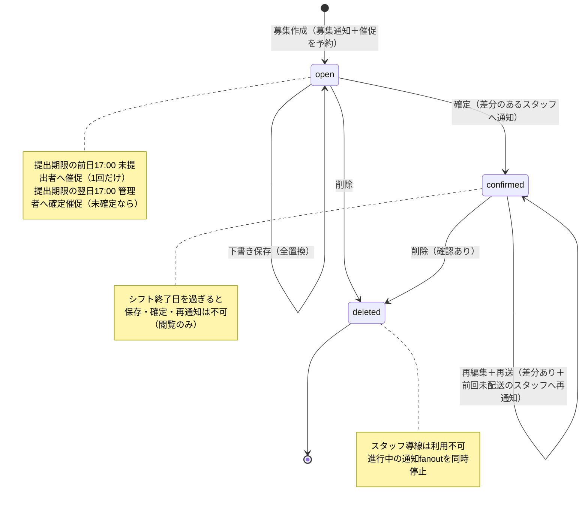

# 条件別仕様: 募集・提出・シフト表・確定

> 文書種別: 現行実装仕様（behavior。条件→結果の詳細を機能文書・業務要件・コードから導出）
>
> コード照合日: 2026-08-26
>
> 正本: [シフト募集管理](shift-recruitment-management.md)、[シフト表](shift-board.md)、[希望シフト提出](shift-submission.md)、[シフト確定催促リマインダー](shift-confirmation-reminder.md)、`convex/_lib/dateFormat.ts`、`convex/shiftBoard/validation.ts`

シフト運用の中心である募集ライフサイクルについて、日時境界・状態・操作者の組み合わせごとの結果を定める。

## 1. 日時の定義（すべてJST）

| 名称 | 定義 | 実装 |
|---|---|---|
| 提出期限 | 当日の**23:59まで有効**（cutoff＝提出期限の翌日0:00） | `getDeadlineCutoff` |
| スタッフ提出催促の予定時刻 | cutoff − 31時間 ＝ **提出期限の前日17:00** | `getReminderScheduledAt` |
| 管理者確定催促の予定時刻 | cutoff ＋ 17時間 ＝ **提出期限の翌日17:00** | `getManagerConfirmationReminderAt` |
| 提出リンクが開ける期限 | **シフト開始日0:00より前**まで |  |
| 「過去のシフト」の始まり | シフト**終了日の翌日**から（終了日当日は過去に含めない） |  |
| 募集期間の上限 | 最大31日 | `RECRUITMENT_PERIOD_DAYS_MAX` |

提出期限は募集作成後に**編集できない**（募集APIは作成と削除のみ）。催促の再スケジュールは存在しない。

## 2. 募集の状態遷移

保存状態は`open`と`confirmed`の2値。論理削除（`isDeleted`）はどちらの状態からでも可能。

```text
[作成] → open → (確定) → confirmed → (再編集・再確定を繰り返せる) → [シフト終了日翌日: 実質read-only]
              ↘ (削除) isDeleted ← どの時点からでも可（確定済みも削除前確認のうえ削除できる）
```



### 2.1 状態×イベントの結果表

| 現在の状態 | イベント | 結果 |
|---|---|---|
| open（終了日前） | 管理者が保存（`saveShiftAssignments`） | validation通過分を**一募集分の全置換**で下書き保存 |
| open（終了日前） | 管理者が確定（`confirmRecruitment`） | `confirmed`へ。差分のあるスタッフへ確定通知を予約。**提出期限前の確定を禁止する条件はない** |
| confirmed（終了日前） | 管理者が再編集→再確定 | 前回通知snapshotとの**差分があるスタッフ**と、**前回の確定通知が未配送のスタッフ**へ再通知 |
| open/confirmed | **シフト終了日を過ぎた** | 保存・確定・再通知を**画面とmutationの両方で拒否**。閲覧のみ |
| open | 提出期限の前日17:00到来 | 未提出のシフト対象スタッフへ催促（1回だけ。`lastReminderSentAt`で再送防止） |
| open | 提出期限の翌日17:00到来 | 対象店舗にスタッフ所属するactive管理者へ確定催促 |
| confirmed／削除済み | 催促の発火時刻到来 | **送らない**（発火時に状態を再確認） |
| open/confirmed | 管理者が削除 | 論理削除。スタッフ向け導線を失効し、進行中の通知fanoutを同一transactionで停止。Outbox投入済み分もprovider呼出し直前に無効化 |
| 削除済み | すべての操作・スタッフアクセス | 一覧・シフト表・提出画面から除外（`getShiftBoardData`は`null`） |

補足:

- 確定済みの募集へ「確定」意図で`confirmRecruitment`を呼んでもエラーにならず**no-op（`null`を返す）**。再通知は「再送」意図（`intent: "resend"`）で行い、未確定の募集への再送意図はエラーになる。
- 募集作成時、催促は**予定時刻が作成時点より未来の場合だけ**予約する（提出期限が近すぎる募集には催促が付かない）。機能デプロイ前から存在する募集にも予約はない。
- Dashboardの分類は「現在のシフト」（今日が期間内の確定済み）→「要シフト調整」（提出期限超過のopen）→「募集中」→「確定済み（未来）」→「過去のシフト」の順で、空の分類は表示しない。
- 提出期限を過ぎてもopenの募集は`/actions`（要対応）にも表示される。提出期限の判定はserver時刻が正本で、画面を開いたまま提出期限が到来しても再評価される。
- 募集の削除に日付条件はない（存在・店舗一致だけを確認するため、過去の募集も削除できる）。

### 2.2 時期×操作の可否マトリクス（○×早見表）

○＝可、△＝条件付き、×＝不可、−＝該当なし。2.1と3章の内容を時期軸で並べ直したもの。

| 操作 | 提出期限前（open） | 提出期限後〜開始前（open） | 確定後〜終了日 | 終了日翌日以降 | 削除済み |
|---|:-:|:-:|:-:|:-:|:-:|
| スタッフ: 初回提出 | ○ | △（確認ダイアログ後） | × | × | × |
| スタッフ: 再提出（上書き） | ○ | × | × | × | × |
| スタッフ: 提出内容の閲覧（提出リンク） | ○ | ○（開始日0:00まで） | ×（受付終了） | × | × |
| スタッフ: 確定シフトの閲覧（閲覧リンク） | − | − | ○ | △（リンク有効期間内） | × |
| スタッフ: 閲覧リンクの再発行 | − | − | ○ | ○（確定済み・未削除なら期間条件なし） | × |
| 管理者: シフト表の閲覧 | ○ | ○ | ○ | ○ | ×（データは`null`） |
| 管理者: 下書き保存 | ○ | ○ | ○ | × | × |
| 管理者: 確定 | ○ | ○ | −（確定済み。confirm意図はno-op） | × | × |
| 管理者: 再送（再確定通知） | × | × | ○（差分＋前回未配送分） | × | × |
| 管理者: 確定シフトの個別再送 | − | − | ○（40件まで） | × | × |
| 管理者: 募集の削除 | ○ | ○ | ○（確認あり） | ○ | − |

## 3. スタッフの提出可否（デシジョンテーブル）

前提: リンク（magic link→session）が有効で、スタッフがシフト対象であること。リンク・session自体の失効条件は[認可・制限](behavior-authorization.md)を参照。

| # | 募集の状態 | 現在時刻 | 提出済みか | 結果 |
|---|---|---|---|---|
| 1 | open | 提出期限当日23:59まで | 未提出 | 提出できる |
| 2 | open | 提出期限当日23:59まで | 提出済み | **再提出できる**（上書き） |
| 3 | open | **提出期限後**〜シフト開始日0:00前 | 提出済み | **閲覧のみ**（再提出不可） |
| 4 | open | 提出期限後〜シフト開始日0:00前 | **未提出** | **確認ダイアログを経て初回提出のみ可** |
| 5 | open | シフト開始日0:00以降 | - | 提出画面を開けない（提出受付終了） |
| 6 | confirmed | - | - | 提出受付終了（確定シフトは閲覧リンクで見る） |
| 7 | 削除済み | - | - | 「募集削除済み」の利用不可表示 |
| 8 | token不正・用途違い・使用済みviewリンク・スタッフ削除済み | - | - | 詳細を出さず一律「リンク無効」（存在を漏らさない） |

### 3.1 提出内容の規則（提出方法別）

募集は**作成時点**の店舗の提出方法をsnapshotする。店舗設定を後から変えても既存募集の提出画面とvalidationは変わらない。

| 提出方法 | 入力 | 保存先・規則 |
|---|---|---|
| 時間指定（`time`） | 日ごとの開始・終了時間（店舗設定の範囲内） | `shiftSubmissionSlots`。1回の提出は最大31件 |
| 日ごと（`dateOnly`） | 出勤可能日のみ選択 | `shiftSubmissionDates`。時間スロットは作らない。通知上は「出勤」と表示 |
| 勤務区分（`shiftType`） | 区分を選択（同じ日に複数区分可） | 区分の時間を`shiftSubmissionSlots`へ保存。**同じ日の同じ区分は重複登録しない** |

- 「前回と同じシフトを適用」は、今回募集より前の日付で**シフトが1件以上ある最新週**（月曜始まり）を提出明細から参照する。全休み提出しか履歴がない、または提出経験がないスタッフには表示しない。適用はフォーム入力を埋めるだけで、提出はスタッフが明示的に押す。
- 管理者の割当編集は希望の原本（提出明細）を書き換えない。

### 3.2 提出完了画面の表示条件

「提出が完了しました」は、次を**すべて**server側で照合できた場合だけ表示する。

- 同じ募集の保存済み`submit` sessionが存在する
- session・店舗・スタッフ・募集・本人の提出recordの対応が取れる

URLを直接開いた、sessionが無効、提出recordがない場合は成功を表示しない。query失敗は利用不可と区別し、画面内から再試行できる。

## 4. シフト表（管理者の編集）

### 4.1 画面へ入る条件

routeは募集から店舗を解決し、URLの組織との一致を確認する。読み込み・保存・確定は店舗IDと`expectedOrganizationId`を同時に渡し、次を**server側で拒否**する。

- 別組織の店舗、募集と店舗の不一致
- legacy店舗所属だけの利用者、canonical所属のないアクセス
- `removed`所属の利用者による管理操作、非active店舗
- 削除済み募集（データは`null`）

### 4.2 編集の規則

- 募集期間外の日付は表示できても**編集できない**。
- 画面幅（PC週表／SP日別）で操作方法は違うが、保存する割当とserver validationは共通。時間単位は30分。
- 時間入力方式のSPは、勤務区間0件なら新規追加、1件なら置換、**2件以上はPC版での編集を案内**（全削除は可能）。
- 編集後に戻る操作をすると「保存して戻る／保存せず戻る」の確認Dialogを表示する。serverから届いた提出更新だけでは未保存扱いにしない。

### 4.3 validationの2階層

| 階層 | 内容 | 例 |
|---|---|---|
| **違反（保存・確定を拒否）** | `validateShiftAssignments`が収集。一覧・日付badge・該当スタッフ強調が連動 | スタッフ・ポジションの店舗境界違反、休業日への割当、時間の重複（overlap）、不正時刻 |
| **確認事項（確定を拒否しない）** | 希望との食い違いとして表示のみ | 未提出スタッフへの割当、休み希望日への割当、希望時間外、希望していない勤務区分 |

同じセルに違反と確認事項がある場合は違反（拒否理由）を優先表示する。  
`saveShiftAssignments`はraw割当を先にvalidationし、overlapや不正時刻を正規化で隠さず拒否する。

### 4.4 確定（`confirmRecruitment`）

- 確定操作は「検証済み内容を`saveShiftAssignments`で保存→`confirmRecruitment`」の2段で行う。
- `confirmRecruitment`自身が再確認するのは**募集の存在・終了日・状態・保存済み割当の休業日だけ**であり、共通validation全体を単独で再実行しない（既知の差分として記録済み。直接API呼び出しの保証は現行この範囲）。
- 確定通知の対象は「前回の確定通知snapshotと現在の割当を比較して**変更があるスタッフ**」に加えて、「**前回の確定通知がまだ配送されていないスタッフ**」（`undeliveredStaffIds`。割当が変わっていなくても最新内容で通知する）。
  - 時間入力方式では、区間の分割・統合だけの表現差は再通知しない。snapshotのsignatureが壊れている場合は安全側で再通知する。
  - snapshotがない既存募集は、導入後の初回再通知だけ全員が対象。
- 同じ内容の確定・再通知はsemantic key（店舗×募集×用途×スタッフ×文面に影響する値）へ収束し、重複送信しない。

## 5. 確定シフトの閲覧・再発行

| # | 状況 | 結果 |
|---|---|---|
| 1 | 確定通知のリンク（view token）から開く | 提出方法snapshotに沿った確定割当・定休日を表示。時間入力方式は隣接区間を統合して表示 |
| 2 | リンクが無効で、募集IDを復元できる | 閲覧画面から再発行画面（`/shifts/reissue`）へ案内 |
| 3 | リンクから募集IDを復元できない | 再発行ボタンを案内せず、元のメール・LINEを開くかシフト担当者への連絡を案内 |
| 4 | 再発行要求: 登録メールと確定済み募集の対象スタッフが一致 | 新しい閲覧リンクの通知を予約 |
| 5 | 再発行要求: メール不一致・対象外 | **一致した場合と同じ応答**（登録の有無を漏らさない）。実際には送らない |
| 6 | 短時間の重複要求・連続試行 | レート制限 |
| 7 | シフト対象外・削除済みスタッフ | スタッフ認証境界で拒否（リンク無効扱い） |

- 管理者による確定シフトの個別再送は、**終了日が今日以降**の募集だけが対象で、1回につき40件まで。超過時は一部だけ送らず開始しない。

## 6. 提出率・件数表示の規則

- 提出率の母数は「activeかつシフト対象のスタッフ数」。対象外スタッフの過去提出が残っても、分子は母数を上限にクランプする。
- スタッフscanが安全上限に達した場合、分母を確定値として表示せず、下限件数とoverflowを明示する（黙って不正確な値にしない）。
- `recruitmentStats`未作成の旧募集は提出記録の読取件数を制限し、上限到達時は下限値として表示する。
- 店舗所属の変更（追加・解除）があったopen募集は、回答数を現在のactiveかつシフト対象staffの提出だけから再計算する。

## 7. テスト観点への変換メモ

- 1章の各時刻は境界値テストの中心。**23:59:59／0:00:00、前日17:00の前後、終了日当日／翌日**を最低ペアで検証する。
- 3章の表は8行×リンク失効条件の直積が提出系の主要ケース。#8は「応答が区別できないこと」まで確認する。
- 4.3は「違反→保存拒否」「確認事項→確定は通る」を対で検証する。`confirmRecruitment`直接呼び出しの保証範囲（4.4）は現行仕様として扱い、強化するならまず文書と差分調査を更新する。
- 再確定の差分通知は「変更なし・全員配送済み→通知0件」「1名だけ変更→1名だけ」「分割⇔統合のみ→0件」「変更なしでも前回未配送の1名→その1名だけ」の4点セット。
