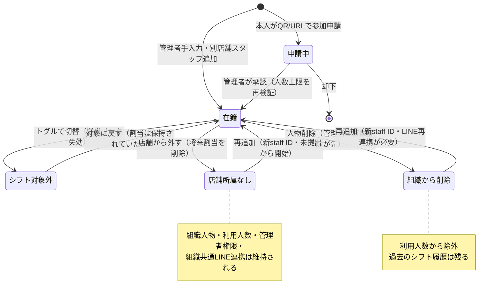

# 条件別仕様: スタッフ管理

> 文書種別: behavior（条件→結果の詳細仕様。機能文書・業務仕様・コードから導出）
>
> 作成日: 2026-08-16 ／ 基準commit: `37c908f`
>
> 正本: [スタッフ参加QR・承認導線](staff-registration.md)、[スタッフ詳細](user-detail.md)、[シフト対象外スタッフ](shift-exclusion.md)、[業務仕様7・15章](../specs/organization-billing-business-flow.md)

スタッフの追加、承認、変更、シフト対象外、店舗所属変更、削除、再追加、並び替えについて、条件の組み合わせごとの結果を定める。
通知の詳細は[通知マトリクス](behavior-notification.md)、認可・レート制限の横断規則は[認可・制限](behavior-authorization.md)を参照する。

## 1. 共通の前提

- スタッフ・管理者の追加にはメールアドレスが必須である。
- メールアドレスは正規化（前後の空白除去、大文字小文字の同一視）して、**同じ組織内だけ**を照合する。別組織に同じメールの人物がいても、名前・所属・役割を一切参照しない。
- 同じ組織に通常利用中または通常削除された既存人物（`organizationPeople`）がいる場合はその人物を再利用する。アカウント削除済みuserに紐づく削除済み人物は履歴として保持し、再利用しない。
- 利用人数は人物単位で数える。管理者兼スタッフ、複数店舗所属、シフト対象外、アーカイブ店舗のみ所属はいずれも1名。詳細は[認可・制限](behavior-authorization.md)を参照。
- スタッフ一覧の任意順は組織人物単位で1つだけ持つ。店舗一覧は組織共通順の部分列とし、シフト表と希望シフト入力の勤務開始時刻順には適用しない。詳細は[スタッフの並び順](staff-order.md)を参照。

スタッフのライフサイクル全体像:

## 2. スタッフ追加

追加経路は3つある。どの経路でも結果の人物・staffの形は同じになる。

| 経路 | 入口 | 完了条件 |
|---|---|---|
| 管理者手入力 | Dashboard「スタッフを追加する」→手入力（`addStaffs`、1回最大50名） | 即時 |
| 本人QR/URL申請 | `/staff/register` → 管理者承認（`approveRequest`） | 管理者の承認 |
| 別店舗スタッフの追加 | 追加ダイアログ「別店舗のスタッフを追加する」（`addOrganizationPersonToShop`） | 即時 |

### 2.1 追加時のデシジョンテーブル（3経路共通）

| # | 同一組織に同じ正規化メールの人物 | その他の条件 | 結果 |
|---|---|---|---|
| 1 | なし | 利用人数に空きあり | 新しい人物＋staffを作成し、利用人数+1 |
| 2 | なし | 利用人数が上限（Standardの26人目、Proの51人目等） | **確定前に拒否**。一部だけ保存しない。上位の標準プランがある場合だけプラン変更を案内し、Pro上限では現在値と上限だけを表示 |
| 3 | active人物あり（対象店舗に未所属） | - | 人物を再利用し店舗所属だけ追加。利用人数は増えない。名前は登録済みの値が正 |
| 4 | active人物あり（対象店舗に所属済み） | - | 重複追加しない |
| 5 | **削除済み人物あり** | 上限に空きあり | **削除履歴の確認を出さず通常追加として完了**。内部では同じ人物をactiveへ戻し、今回の氏名・メールを人物へ反映し、**新しいstaff ID**を作る |
| 6 | 削除済み人物あり | 利用人数上限（再追加は1人増として判定） | 汎用的な追加不可（削除履歴を示さない） |
| 7 | account deletion受付済みまたは削除済みuserに紐づく削除済み人物だけあり | 上限に空きあり | 旧人物を履歴として維持し、**新しい人物＋staff**を作成する。旧user・人物・所属・権限は変更しない |
| 8 | - | 人物とstaffの対応が一意に解決できない不整合 | 汎用的な追加不可（fail-closed、部分適用なし） |
| 9 | - | 操作者が旧`readOnly`／旧`restricted` state／権限なし | 拒否（スタッフ追加ボタンも理由付きで無効） |

再追加（#5・#7）で**復元しないもの**: 旧staffの表示情報、旧staffのシフト提出と割当、管理者権限、ほかの店舗所属、session、magic link、LINE token、canonical LINE連携（組織から削除されていた場合）。
新しいstaffは各募集に**未提出**の状態から開始する。

### 2.2 QR/URL申請（公開HTTP）の受付条件

`POST /staff-registration/submit`は次をすべて満たす場合だけ申請を保存する。

| 条件 | 満たさない場合 |
|---|---|
| 許可Origin（`STAFF_REGISTRATION_ALLOWED_ORIGINS`）からの`application/json`、8KiB以下 | 拒否 |
| Turnstile検証（`staff_registration` action、hostname一致） | 拒否 |
| レート制限内（メール3回/短時間・10回/日、リンク5回/短時間・40回/日、IP 10回/短時間・100回/日、global 100回/短時間） | 拒否 |
| 店舗の承認待ち申請が20件未満 | **受付結果だけ返して保存しない**（申請者には成功と同じ応答） |
| 登録リンクが有効、店舗・契約状態が利用可能 | 利用不能を同じ受付結果へ変換 |

**新規申請・登録済み・申請済み・上限到達のすべてで同じ受付結果を返し、登録済みメールの有無を公開しない。**  
IP制限は`STAFF_REGISTRATION_TRUSTED_IP_HEADER`が信頼できる環境だけで適用し、未設定時はclientの`X-Forwarded-For`を信頼せずIP制限を省略する。

### 2.3 承認・却下

- 承認時にも利用人数上限・契約状態を再検証する（`getPendingRequests`の承認可否表示は参考値で、mutationが最終判定）。
- 安全な通常削除人物とアカウント削除履歴だけに一致する申請は承認できる。不整合または利用人数上限では、一覧の時点から**削除履歴を示さない汎用的な承認不可状態**として返す。
- QRで規約同意済みのスタッフには、承認後に法務同意メールを送らない。
- 承認後、同じ組織人物がLINE未連携の場合だけLINE連携案内を送り、受付中の募集があれば提出リンクも送る。
- 却下は申請を`rejected`にするだけで、人物・staffを作らない。

### 2.4 経路ごとの通知の違い

| 経路 | 法務同意依頼 | LINE連携依頼 | 受付中募集の提出リンク |
|---|---|---|---|
| 管理者手入力 | 送る | 未連携なら送る | 受付中募集があれば送る |
| QR申請の承認 | **同意済みなら送らない** | 未連携なら送る | 受付中募集があれば送る |
| 別店舗スタッフ追加 | 送らない（同意済みの人物を再利用） | **連携済みなら送らない**。未連携なら追加先スタッフへ送る | 受付中募集があれば送る |

## 3. プロフィール変更（氏名・シフト連絡先）

`updatePersonProfile`は、対象の`organizationPeople`と、**同じ組織で同じ人物に紐づく未削除の全`staffs`行**へ一括同期する。

| 変更 | 連動して変わるもの | 変わらないもの |
|---|---|---|
| 氏名 | 同一組織の未削除staff全行、`users`の表示名（本人の場合） | 別組織の人物 |
| シフト連絡先 | 同一組織の未削除staff全行 | **Clerkのログイン方法、`users.email`、別組織の人物、組織の請求先メールアドレス** |

- 権限を持つ管理者は本人・他者のどちらも編集できる。アカウント連携の有無で画面は変わらない。
- 所属に1件でも不整合があれば**全体をfail-closed**にし、部分更新しない。
- メール変更後は、**LINEを受信できないスタッフに限り**、変更後の宛先へ受付中の募集（未削除・`open`・シフト開始前・締切以前）を再送する。

## 4. シフト対象外の切替（`setShiftExclusion`）

店舗ごとの設定。「このユーザーをシフト対象とする」トグルで切り替える。管理者本人も対象外にできる。

| 対象外にすると | 対象に戻すと |
|---|---|
| シフト表・スタッフ向け確定シフト表示から除外 | 再び表示 |
| シフト関連通知（募集開始・提出催促・確定、一括/個別再送/追加・メール変更・LINE follow追送のすべて）から除外 | 再び通知対象 |
| 提出率の母数から除外（分子は母数を上限にクランプし「3/2人」を出さない） | 母数に戻る |
| **発行済みの提出用session・magic linkを失効**（古いリンクからの閲覧・提出・再発行を全て拒否） | 新しいリンクは通常どおり発行される |
| 行に「シフト対象外」バッジ、「募集中/確定シフトを再送する」ボタンが無効化 | 解除 |

- LINE連携tokenはシフト以外の通知（同意依頼など）で使うため**失効させない**。LINE連携依頼・規約同意などシフト以外の通知は従来どおり送る。
- 確定済みの`shiftAssignments`は削除しない。対象に戻せば再び表示・通知される。
- UIは先に表示を切り替え、失敗時に元へ戻す。切替直後1000msは再操作を無効にする。

## 5. 店舗所属の変更（desired-set一括変更）

スタッフ詳細の「所属店舗を変更」（人物側）と店舗詳細の「所属スタッフを変更する」（店舗側）は、同じ契約で動く。

### 5.1 変更の前提条件

| 条件 | 結果 |
|---|---|
| Dialogを開いた時点の`membershipFingerprint`が保存時も一致 | 続行 |
| fingerprintが変わった（他の変更が挟まった） | **変更全体を拒否**し、最新状態の再取得と選択し直しを求める。DB・scheduler・Outbox・監査を一切変更しない |
| 解除対象の将来シフト割当previewが取得後に変化 | 同上 |
| previewが`tooMany`、または解除対象全体の割当がtransaction上限（500件）超過 | 一部だけ処理せず、確定を無効にして「対象が多いため変更できない」と表示 |
| 差分なし／処理中／旧`readOnly`／旧`restricted` state | 「変更する」ボタンを無効化。mutationも拒否 |
| 同じ`requestId`＋同じ変更内容の再実行 | 最初に確定した結果を返す（staff・通知・監査を重複させない） |
| 同じ`requestId`を**異なる内容**へ再利用 | 拒否 |

### 5.2 チェックの扱い

- `active`店舗は所属中・未所属を問わず編集できる。
- `archived`・`planSuspended`の既存所属は**チェック済みの変更不可**として保持する（desired-setから脱落させない）。非activeの未所属店舗と削除済み店舗は表示しない。
- 追加と解除は「変更する」1回で確定し、二重確認Dialogは開かない。解除行にだけ赤字で影響（今日以降の割当削除・通知停止・LINE連携は組織に残る）を表示する。

### 5.3 解除の効果

| 終了するもの | 保持するもの |
|---|---|
| 対象店舗のstaff（論理削除、**新staff IDでの再開始**） | 過去のシフト割当・提出（履歴として保持、新staffへ継承しない） |
| **今日以降のシフト割当（削除）** | 組織人物（`organizationPeople`）、利用人数への算入 |
| staff用session・magic link・LINE token・互換用店舗LINE投影 | **組織共通のcanonical LINE連携** |
| 対象店舗からの未送信通知 | 管理者権限、ほかの店舗所属 |
| 通知履歴（画面から即時対象外→cleanupで物理削除） | - |

- **全店舗のチェックを外すことは許可**する。「無所属としてスタッフは残り続けます」と表示し、利用人数は減らない（人数枠を空けるにはユーザー削除）。
- **解除の対象**はactive/readOnlyの管理者人物でもよい（先に管理者権限を外す必要はなく、管理者権限と組織人物は維持する）。ただし**操作できるのは対象組織のactiveな管理者だけ**で、readOnlyの操作者は拒否される（`removePersonFromShop`は`allowReadOnly`なしの権限確認＋業務書き込み確認を行う）。
- 変更後にその店舗のactive管理者所属が0人になる場合は、店舗管理通知（参加申請digest・確定催促・不達digest等）が送信されなくなる警告をDialog内に表示する。警告は変更を**拒否しない**。
- 解除・追加で影響するopen募集は、回答数を変更後のactiveかつシフト対象のstaffの提出だけで再計算する（旧staffの提出は履歴に残すが現在の回答数から除外）。

## 6. 組織からの削除（`removePersonFromOrganization`）

### 6.1 削除できない条件

| 条件 | 結果 |
|---|---|
| 対象がactiveまたはreadOnlyの管理者 | **拒否**。先に管理者設定で権限を外す（mutationがserver-side guardで再確認） |
| 対象が最後のactive管理者（＝自分の権限解除が先に拒否される） | 権限解除の時点で拒否 |
| 対象が旧`restricted`に残る最後の`readOnly`管理者 | 内部互換の安全条件として拒否。現行ロール名は表示せず、一般的な削除不可理由を返す |
| 今日以降の割当が一度に処理できる上限（500件）超過 | 削除を止め、先に対象シフトの整理を案内 |
| 確認画面表示後に割当件数・対象が変化 | 削除せず最新内容を再確認させる |

請求先メールアドレスは通知先の文字列であり、人物の権限や削除可否には影響しない。

### 6.2 削除の効果

- その組織における全店舗所属・管理権限・スタッフ権限・閲覧権限を終了し、利用人数から除外する。
- 今日以降のシフト割当を、所属の終了と**同じ処理**で削除する（確認画面にはJST業務日付で数えた「今日以降のシフトN件からも外れます」を表示）。
- 既存のアプリ内session・スタッフ向けリンク・その人物が発行した未使用招待を失効させる。
- 削除開始後は新しい通知を予約せず、未送信通知を停止する。外部送信の直前にも組織所属を再確認する。
- その組織のLINE連携を終了する（別組織の連携は影響なし）。
- **保持**: 過去の確定シフト・割当・監査履歴（削除済み人物と分かる表示）、ログインアカウント、別組織の所属。募集の状態・確定日時・他の人物の割当と提出は変更しない。
- 組織からの削除はサービス上の所属解除であり、個人情報の完全消去とは別の手続きである。
- 自分自身を削除した場合はsearchを外した`/dashboard`へ戻り、残っている組織を再解決する。

## 7. イベント別のデータ残存マトリクス（○×早見表）

4〜6章の効果を1枚に並べ直したもの。○＝残る・継続、×＝消える・停止、△＝条件付き、−＝該当なし。

| 項目 | シフト対象外化 | 店舗所属の解除 | 組織から削除 | （参考）再追加後 |
|---|:-:|:-:|:-:|:-:|
| 過去の提出・シフト割当 | ○ | ○（履歴として） | ○（削除済み表示） | ○（旧staffの履歴。新staffへ継承しない） |
| 今日以降のシフト割当 | ○（削除しない） | ×（削除） | ×（削除） | ×（復元しない） |
| 提出・閲覧のsession／magic link | × | ×（対象店舗分） | ×（全店舗分） | 新規発行から利用 |
| シフト関連通知（募集・催促・確定） | × | ×（対象店舗分） | × | ○（新staffとして） |
| シフト以外の通知（同意依頼・LINE案内） | ○ | ×（対象店舗分） | × | ○ |
| 組織共通のLINE連携（canonical） | ○ | **○（残り得る）** | ×（その組織分を終了） | 店舗解除後の再追加は○／組織削除後は×（再連携が必要） |
| 利用人数への算入 | ○ | ○（無所属でも1名） | ×（除外） | ○（1名として再算入） |
| 管理者権限 | ○ | ○ | −（先に権限解除が前提） | ×（自動復元しない） |
| ほかの店舗への所属 | ○ | ○（個別解除の場合） | × | − |
| 通知履歴（管理画面表示） | ○ | ×（即時非表示→cleanupで物理削除） | ×（同左） | 新規分のみ |

## 8. テスト観点への変換メモ

- 2.1の表の各行がそのまま1ケースになる。特に#5〜#8は「**応答から削除履歴・存在が判別できないこと**」まで検証する。
- 5.1のstale系は「Dialogを開いたまま別経路で同じ人物を変更→保存」の並行シナリオで再現する。
- 境界値: 手入力50名/51名、承認待ち20件/21件、割当500件/501件、利用人数上限ちょうど/+1。
- 再追加後の検証は「旧リンクが無効」「新staffは未提出」「回答数が再計算される」「LINE連携の保持/非保持（店舗解除のみ vs 組織削除後）」の4点を必ず含める。
