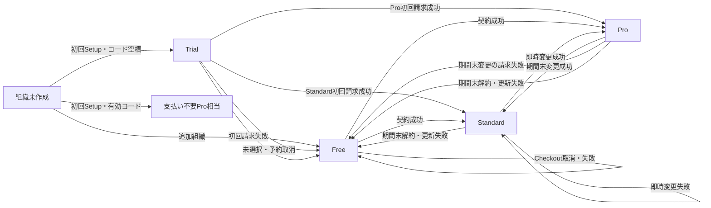

# 組織プラン遷移の手動シナリオテスト

この手順は、開発用Convex deploymentとStripe Sandboxを使い、人が画面を操作して組織プランの遷移を確認するためのものである。
内部状態やWebhookの競合を網羅する自動テストの代わりではなく、実ブラウザ、Convex、Stripe、Webhookをまたぐ利用者向けの結果を確認する。

## 所要日数

手動で確認するケースは22件とする。
一日に完了判定するケースを3件までにすると、実施量は8日分である。

準備日を1日、決済やWebhookの遅延と再実施の予備を1日含め、**9日を最短、10日を推奨**とする。
StandardとProのSandbox Priceが日次でない場合はこの日数では完了しない。月次Priceのままでは、期間末の変更、解約、更新失敗の確認に約1か月かかる。

`DEBUG_TRIAL_DURATION_DAYS=1`は登録から24時間後ではなく、登録日の翌日00:00 JSTを表す。
Stripeの請求確定とWebhook反映は同時刻に完了するとは限らないため、期限直後に待機せず翌朝9時から10時を判定時間とする。

## 対象と対象外

対象は、利用者が画面から開始できる契約、プラン変更、予約取消、解約、再契約と、Stripe Sandboxで人が作れる支払い失敗、3Dセキュア、想定外解約である。

次は人手で再現せず、既存のFunction testまたはScenario testへ任せる。

- Webhookの重複、順不同、古いSubscriptionからの遅延event
- operationの冪等性競合、rate limit、内部workerのretry上限
- 保存済み内部状態の直接書換え、scheduled functionの直接実行
- Productionの設定、実カード、実請求、顧客メールの実到着

## 全体の遷移

支払い終了処理中は利用者向けプランではない。
その処理中も画面と利用権限はFreeとして確認し、処理完了後に再契約できることを確認する。

## 準備条件

次のすべてを満たせない場合は、ケースを開始しない。

| 項目 | 条件 |
|---|---|
| 対象環境 | Productionではない、対象を一意に特定したConvex deployment |
| Trial短縮 | [Trial期限の開発用設定](organization-billing.md#trial期限の開発用設定)と[デバッグ環境変数の運用](debug-mode.md)に従い、`DEBUG_MODE=true`と1日から4日を設定できる |
| プロモーション | 支払い不要Pro相当の確認用コードが対象deploymentに設定済みで、値を証跡へ残さず利用できる |
| Price | StandardとProが別Price IDで、同じ通貨、`day × 1`、active、recurring、licensed、per-unitである |
| Webhook | 対象deploymentの直接Webhook endpointがStripe Sandboxで有効である |
| 決済手段 | [Stripe公式のテストカード](https://docs.stripe.com/testing#cards)だけを使い、成功、定期請求失敗、3Dセキュア成功・失敗を選べる |
| 証跡 | アプリとStripe Dashboardの対象組織を識別できる、アクセス制限された記録先がある |

Stripe Test Clockは使わない。
現行実装で作るCustomerとSubscriptionはTest Clockへ関連付けられず、Test Clockを進めてもConvexのTrial期限jobは進まないためである。

Trialの環境変数は、設定後に作る初回組織だけへ反映される。
保存済みTrialの期限は変更されないため、次の順番で各アカウントの初回Setupを完了する。

| 組織 | 作成時の`DEBUG_TRIAL_DURATION_DAYS` | 目的 |
|---|---:|---|
| `T0` | 1 | 未選択終了とFree上限超過 |
| `TS` | 2 | TrialからStandard |
| `TP` | 3 | TrialからPro |
| `TF` | 4 | Trial初回支払い失敗 |

すべての初回Setupが終わる前に、アカウント同士を別組織へ招待しない。
先に招待すると所属0件の条件を満たさず、初回組織がTrialまたは支払い不要Pro相当にならない。

## 作成するアカウントと組織

必要なログインアカウントは5件、組織は8件である。
請求先メールは一つのアクセス制限済み受信箱へ届く`+`エイリアスで分けてもよい。

| アカウント | 初回組織 | 追加組織 | 主な用途 |
|---|---|---|---|
| `A` | `T0` | `X` | 未選択Trial、Free上限、Checkout失敗、権限確認 |
| `B` | `TS` | なし | TrialからStandard、StandardからPro、Pro解約 |
| `C` | `TP` | なし | TrialからPro、ProからStandard、Standard解約 |
| `D` | `TF` | なし | Trial初回請求失敗、Freeからの再契約、Stripe側解約 |
| `E` | `CP` | `FS`、`FP` | 支払い不要Pro相当、Free起点のStandard系とPro系 |

`E`は自己作成できる3組織を使い切る。
追加組織は必ずFreeで始まり、Trialケースの代用にはならない。

`T0`は、全アカウントの初回Setup後に`B`と`C`を管理者へ招待し、スタッフ専用3名、第2店舗、確認用シフト1件を追加する。
これにより6人、3管理者、2店舗となり、Freeへ移行した後のデータ保持、操作制限、整理後の自動回復を画面で確認できる。

ログイン不要のスタッフを除き、アカウントを追加作成しない。
開発用網羅シードは全tableのresetを伴い、Stripeと期限処理のfixtureにならないため利用しない。

## 共通の合否判定

各ケースは、次のすべてが一致した時点でPassとする。

1. 「プランと支払い」の現在プラン、変更前後、適用日、案内文が期待どおりである。
2. 画面を再読み込みし、ログアウトと再ログインを行っても同じ状態を表示する。
3. Stripe DashboardのCustomer、Subscription、Invoice、Scheduleが対象組織と対応し、現在有効なSubscriptionが複数ない。
4. プランに応じた機能と上限が適用され、プラン変更だけを理由に店舗、人物、所属、シフトが削除されない。
5. 取消、失敗、権限拒否では、想定外の請求、Customer、Subscription、Scheduleが増えない。

決済完了ページへ戻ったことだけでPassにしない。
アプリの表示とStripeの対象objectが一致するまで待ち、Stripeの`current_period_end`を期間末判定の正本とする。

各ケースには、実施者、開始時刻、境界時刻、判定時刻、対象アカウント、対象組織、期待結果、実結果、Pass / Fail / Blocked、証跡を記録する。
秘密値、プロモーションコード、カード番号、個人情報は記録しない。

## 手動テストケース

### 初期状態とTrial

| ID | 組織 | 人が行う操作 | 期待結果 | 判定時期 |
|---|---|---|---|---|
| `M01` | `T0` | コードを空欄にして初回Setupを完了する | Trial、期限日、Pro相当の機能を表示し、Stripe CustomerとSubscriptionはない | 即時 |
| `M02` | `CP` | 無効なコードで作成できないことを確認し、値を記録せず有効なコードでSetupする | 支払い不要Pro相当となり、期限、課金操作、Stripe objectがない | 即時 |
| `M03` | `FS` | `E`で二つ目の組織を作る | TrialではなくFreeで始まり、Free上限と課金導線を表示する | 即時 |
| `M04` | `TS` | Trial中にStandard継続を登録し、予約を取り消してから再登録する | 取消中もTrialを維持し、取消後は初回請求せず、再登録後はStandard継続と請求開始日を表示する | 期限前 |
| `M05` | `TP` | Trial中にPro継続を登録する | その場では請求せず、TrialとPro継続予約、初回請求日を表示する | 期限前 |
| `M06` | `T0` | 継続を登録せず期限を迎える | Freeへ移行し、6人、3管理者、2店舗と既存シフトを保持する。通常操作を制限し、人数、管理者、店舗を上限内へ整理すると自動で通常利用へ戻る | 翌朝 |
| `M07` | `TS` | 成功する支払い方法のままTrial期限を迎える | 初回請求成功後にStandardとなり、Standard上限を適用する | 翌朝 |
| `M08` | `TP` | 成功する支払い方法のままTrial期限を迎える | 初回請求成功後にProとなり、Pro上限を適用する | 翌朝 |
| `M09` | `TF` | 定期請求に失敗するテスト支払い方法を登録してTrial期限を迎える | Free表示とFree権限へ変わり、失敗案内を表示する。終了処理中は再契約できず、完了後は再契約できる | 翌朝。未確定なら同日中に再確認 |

### Freeからの契約とCheckout

| ID | 組織 | 人が行う操作 | 期待結果 | 判定時期 |
|---|---|---|---|---|
| `M10` | `FS` | FreeからStandardのCheckoutを開始し、ブラウザで戻る。画面の「支払いを続ける」から再開して成功させる | 戻っただけではStandardにならず、支払い成功後だけStandardになる | 即時から数分後 |
| `M11` | `FP` | FreeからProを直接契約し、3Dセキュアを成功させる | 支払い成功後だけProとなり、正しいPriceと次回更新日を表示する | 即時から数分後 |
| `M12` | `X` | FreeからCheckoutを明示的に取り消し、再試行では決済失敗または3Dセキュア失敗を選ぶ | どちらもFreeを維持し、有料機能を開放しない。再試行の導線を利用できる | 即時から数分後 |

### StandardとProの変更、解約、失敗

| ID | 組織 | 人が行う操作 | 期待結果 | 判定時期 |
|---|---|---|---|---|
| `M13` | `TS` | StandardからProへ変更し、日割り支払いを成功させる | 支払いとSubscription変更を確認した後にProへ即時変更する | 即時から数分後 |
| `M14` | `FS` | StandardからProへ変更し、日割り支払いを失敗または取り消す | Proを開放せずStandardを維持し、今回の未払い変更を残さない | 即時から数分後 |
| `M15` | `TP` | ProからStandardを予約し、予約を取り消す。再度予約して期間末を迎える | 期間末まではProを維持し、取消後もProを継続する。再予約後は支払い成功を確認してStandardになる | 予約は即時、確定は`current_period_end`後 |
| `M16` | `FP` | ProからStandardを予約し、期間末のStandard初回支払いを失敗させる | StandardにせずFree表示とFree権限へ変わり、終了処理完了後に再契約できる | `current_period_end`後 |
| `M17` | `TP` | Standardの期間末解約を予約し、取り消す。再度予約して期間末を迎える | 期間末まではStandardを維持し、取消後もStandardを継続する。期間末終了後にFreeとなる | `current_period_end`後 |
| `M18` | `TS` | Proの期間末解約を予約し、取り消す。再度予約して期間末を迎える | 期間末まではProを維持し、取消後もProを継続する。期間末終了後にFreeとなる | `current_period_end`後 |
| `M19` | `FS` | Standardの次回更新前に定期請求失敗用の支払い方法へ変更する | 更新失敗後にFree表示とFree権限へ変わる。終了処理完了後に新しいStandard契約を成功させると失敗案内が消える | `current_period_end`後 |
| `M20` | `X` | `M12`後にProを契約し、次回更新前に定期請求失敗用の支払い方法へ変更する | 更新失敗後にFree表示とFree権限へ変わり、データを保持する | `current_period_end`後 |
| `M21` | `TF` | `M09`の終了処理後にProを契約し、Stripe Dashboardで対象Subscriptionを想定外に即時取消する | Webhook反映後にFreeとなり、別組織や別Subscriptionへ影響しない | 取消後から翌朝 |
| `M22` | `FS` | `A`を有効管理者にして課金画面を開き、操作できることを確認する。`E`が`A`を管理者から外し、`A`の開いたままの画面と別組織URLから契約操作を試す | 解除後と別組織の操作を拒否し、新しいStripe objectや課金変更を作らない。未ログイン時はログインを要求する | 即時 |

## 実施日程

1日3ケースを上限にする場合は、次の順で進める。
期限前の支払い方法登録や翌日のケース準備は、判定ケースとは別の短い準備作業として扱う。

| 日 | 完了判定の目安 | 主な作業 |
|---|---:|---|
| 0日目 | 0件 | 対象deployment、日次Price、Webhook、テスト支払い方法、証跡先、5アカウントを準備する |
| 1日目 | 3件 | `M01`から`M03`。Trial 4組織を1日、2日、3日、4日に分けて作る |
| 2日目 | 3件 | `M04`から`M06`。翌日以降の継続登録も期限前に済ませる |
| 3日目 | 3件 | `M07`と即時判定できるFree / 権限系を合わせる |
| 4日目 | 3件 | `M08`とFree起点の契約を確認する |
| 5日目 | 3件 | `M09`とStandard / Proの予約・即時変更を確認する |
| 6日目 | 3件 | 日次Priceの最初の期間末変更、解約、更新結果を確認する |
| 7日目 | 3件 | 残りの期間末結果、支払い失敗後の再契約を確認する |
| 8日目 | 1件 | `M21`または未完了の遅延ケースと全証跡を確定する |
| 9日目 | 0件 | Fail / Blockedの再実施と遅延吸収の予備日にする |

日ごとのケースはStripeの`current_period_end`に合わせて入れ替えてよい。
一日に開始と確認が重なって負荷が高い場合は、同じPriceと組織を維持したまま10日目以降へ繰り越す。

## 停止条件と後片付け

次のいずれかが起きた場合は、新しいケースを開始しない。

- 対象deployment、Stripe account、Sandbox / live modeのいずれかを一意に確認できない
- StandardとProの通貨または請求周期が異なる
- Webhookが失敗または長時間滞留し、アプリとStripeの状態が一致しない
- 一つの組織に複数の非terminal Subscription、または複数のStripe Customerがある
- 支払い不要Pro相当にStripe objectが作成された

完了後は、証跡を残してから専用組織とStripe Sandbox objectを識別可能な状態で整理する。
Trialケースをすべて作成済みであることを確認した後、[組織課金の運用](organization-billing.md)に従ってTrial短縮用の二つの環境変数を無効化する。

## 参照先

- 現行の状態遷移と不変条件: [組織課金の業務要件](../specs/organization-billing-business-flow.md#22-契約状態の遷移)
- 画面と利用権限: [組織課金、複数店舗、複数管理者](../features/organization-billing.md)
- 環境変数、Stripe設定、日常probe: [組織課金の運用](organization-billing.md)
- Stripe Sandboxの確認方法: [Stripe Billingのテスト](https://docs.stripe.com/billing/testing)
- Stripe SetupIntentの考え方: [SetupIntents API](https://docs.stripe.com/payments/setup-intents)
