# 事業者課金、複数店舗、複数管理者 実装計画

**作成日：2026-07-14**

**ステータス：S01進行中**

**ステップ進捗：0 / 17ステップ完了**

**Codex実行単位進捗：0 / 43タスク完了**

この文書は、事業者単位の契約、複数店舗、複数管理者、無料体験、Free移行、Stripe課金を実装するための実行計画である。

業務ルールの正は `doc/specs/organization-billing-business-flow.md` とし、この文書は実装順、依存関係、対象外、完了条件、進捗を管理する。

コードの詳細設計を先に固定する文書ではない。

各タスクを開始するときに対象コードを確認し、この文書で固定した責務と境界の範囲内で配置とAPIを決める。

---

## 1. 完成状態

実装完了時には、次の状態を満たす。

- 契約、利用人数、管理権限、店舗上限をOrganization単位で管理している。
- 一つのOrganizationが複数店舗と複数管理者を持てる。
- 一人の人物が管理者とスタッフを兼ねても、複数店舗へ所属しても、Organizationの利用人数には一名として算入される。
- 公開プランはFree、Pro、Businessの三種類である。
- 既存利用者向けに内部専用の `legacyBusiness` を持つ。
- `legacyBusiness` はBusinessと同じ利用上限と有料機能を持つが、Stripeによる請求を行わない。
- 新規Organizationは無料体験から開始する。
- 無料体験、Free移行、プラン変更、支払い猶予、契約制限、再契約が一つの契約状態モデルで動く。
- 管理者招待は期限付き、一回限り、取消可能であり、利用枠を予約する。
- 契約制限中もデータを削除せず、許可された整理と復旧を行える。
- 支払い結果はStripeから確認した状態を根拠とし、Checkoutの完了画面だけでは有料機能を開放しない。
- 旧店舗課金と旧店舗メンバーを契約と管理者権限の正として使わない。

---

## 2. 確定事項

以下は実装中に再検討しない。

この節の箇条書きは確定した判断であり、進捗チェックには数えない。

- 契約単位をOrganizationとする。
- 既存店舗一件からOrganization一件を作る。
- 移行で作るOrganization名の初期値には店舗名を使う。
- Organization名と店舗名は移行後に自動同期しない。
- 同じ管理者、メールアドレス、店舗名を持つ既存店舗でも、自動的に同じOrganizationへ統合しない。
- 既存の有効店舗から移行したOrganizationには、内部無償プランを設定する。
- 内部無償プランの内部キーは `legacyBusiness` とする。
- `legacyBusiness` はBusinessと同じentitlement定義を参照する。
- `legacyBusiness` ではStripe CustomerとSubscriptionを作らない。
- `legacyBusiness` は初回請求、支払い猶予、支払い失敗による契約制限の対象外とする。
- 通常の管理者API、Checkout、Stripe Webhookから `legacyBusiness` を設定できないようにする。
- Migration後に手動で付与する場合も、対象は店舗ではなくOrganizationとする。
- 本番Migrationではアプリの業務writeを完全に停止する。
- 停止Migrationを採用するため、旧モデルと新モデルへのdual-writeは行わない。
- 新モデルでwriteを再開した後は、旧モデルへ単純に戻さない。
- Narrowは本番Migrationと同じ作業に含めず、観測期間後に実施する。

---

## 3. 実装前に決める事項

未決事項を実装担当が独自判断で確定してはならない。

該当タスクを開始する前に決定し、業務仕様とこの文書へ反映する。

### 3.1 停止Migrationまでに決める事項

- [ ] 削除済み店舗からも履歴保持用Organizationを作るか決める。
- [ ] `legacyBusiness` の付与対象を、移行時点の有効店舗だけにするか決める。
- [ ] 既存Organizationの利用人数が30名を超える場合の扱いを決める。
- [ ] 既存Organizationの稼働店舗数が5店舗を超える場合の扱いを決める。
- [ ] 既存管理者の無料体験利用権を使用済みとして記録するか決める。
- [ ] 既存Organizationの初期課金連絡先を決める。
- [ ] `legacyBusiness` のユーザー向け表示名を決める。
- [ ] `legacyBusiness` の手動付与時に必須とする理由と承認記録を決める。
- [ ] `legacyBusiness` を手動解除した後にFree、Trial、通常のBusinessのどこへ遷移するか決める。
- [ ] `legacyBusiness` から通常のBusinessへ変更するときのStripe契約開始方法を決める。
- [ ] 管理者兼スタッフを同一人物と判断する識別子の優先順位を決める。
- [ ] 空メール、重複メール、確認前メールがある人物を自動統合するか、no-goにするか決める。
- [ ] 削除済みスタッフと削除済み店舗メンバーへ新しい必須参照を付ける範囲を決める。
- [ ] 招待発行者の管理権限が失効したとき、未承認招待を失効させるか決める。

### 3.2 Stripe実装までに決める事項

- [ ] ProとBusinessの価格を決める。
- [ ] Stripe Price IDと環境ごとの管理方法を決める。
- [ ] 税の表示と請求書上の扱いを決める。
- [ ] ProとBusiness間の変更時に適用する日割りルールを決める。
- [ ] 返金ルールを決める。
- [ ] 未払い請求書が残る場合のFree移行と再契約の扱いを決める。
- [ ] Customer Portalで利用者に許可する操作を決める。

---

## 4. 進捗管理ルール

### 4.1 チェック方法

- 進捗の正は、5.1のステップチェックリストと5.2のCodex実行単位チェックリストとする。
- 最上位のS01からS17は、配下の実行単位と完了条件をすべて満たしたときだけ `[x]` にする。
- 一部だけ完了したステップは最上位を `[ ]` のままにし、実行単位と詳細項目だけを更新する。
- テスト未実行、文書未更新、自己レビュー未完了のタスクは完了扱いにしない。
- 外部状態や未決事項で止まった場合はチェックせず、作業記録へ阻害要因を書く。
- 各Codexタスクでは一つの実行IDだけを対象にし、次のIDへ着手しない。
- `S06-A` のようにサブIDがあるステップは、サブIDごとに必ず別のCodexタスクへ分ける。
- 既存の確定事項と矛盾を見つけた場合は、独自判断で変更せずユーザーへ報告する。
- 作業完了時に、ステップ、実行単位、詳細項目、作業記録を同じ変更で更新する。

### 4.2 マイルストーン

- [ ] M1：仕様と業務policyを固定する（S01からS02）。
- [ ] M2：Organization基盤へ本番切替する（S03からS07）。
- [ ] M3：複数管理者と複数店舗を完成させる（S08からS11）。
- [ ] M4：Stripeを使わない契約機能を完成させる（S12からS14）。
- [ ] M5：Stripe課金を完成させる（S15からS16）。
- [ ] M6：旧基盤を撤去する（S17）。

### 4.3 依存関係

```mermaid
flowchart LR
  S01["S01 仕様と計画"] --> S02["S02 業務policy"]
  S02 --> S03["S03 Schema Widen"]
  S03 --> S04["S04 Migration準備"]
  S03 --> S05["S05 認証とコンテキスト"]
  S04 --> S06["S06 Cutover準備"]
  S05 --> S06
  S06 --> S07["S07 停止Migration"]
  S07 --> S08["S08 UI基盤"]
  S08 --> S09["S09 人物と利用人数"]
  S09 --> S10["S10 管理者と招待"]
  S09 --> S11["S11 複数店舗"]
  S10 --> S12["S12 契約状態"]
  S11 --> S12
  S12 --> S13["S13 通知と期限処理"]
  S13 --> S14["S14 契約UI"]
  S14 --> S15["S15 Stripe backend"]
  S15 --> S16["S16 Stripe UI"]
  S16 --> S17["S17 Narrow"]
```



### 4.4 本番公開ゲート

実装順と本番公開順を分ける。

- [ ] R1：S01からS06を完了し、S07の停止Migrationを実行できる。
- [ ] R1では、移行済みの内部無償プラン利用者が既存業務を継続できる範囲だけを再開する。
- [ ] R1からR2まで、新規Organization作成とTrial開始をserver-side release gateで停止する。
- [ ] R1からR2まで、複数管理者、複数店舗、契約操作の未完成UIを公開しない。
- [ ] R2：S08からS14を同じ公開単位として確認し、新規Organization、Trial、Free移行、複数管理者、複数店舗を有効化する。
- [ ] R3：S15とS16を同じ公開単位として確認し、Stripe契約操作を有効化する。
- [ ] release gateはUI表示だけでなく、server-side mutation、action、HTTP Actionでも強制する。
- [ ] gate解除前に、対象機能の期限処理、状態表示、復旧導線が揃っていることを確認する。

---

## 5. 進捗チェックリスト

### 5.1 ステップチェックリスト

- [ ] S01：業務仕様と実装計画を確定する。
- [ ] S02：プラン、利用人数、権限、状態遷移の純粋な業務policyを実装する。
- [ ] S03：Organization SchemaをWidenする。
- [ ] S04：停止Migrationと検証機能を実装し、リハーサルする。
- [ ] S05：Organization認証、認可、選択コンテキストを実装する。
- [ ] S06：既存機能をOrganization基盤で動かすcutover準備を完了する。
- [ ] S07：本番停止MigrationとOrganization基盤への切替を実施する。
- [ ] S08：店舗選択と事業者設定の読み取りUIを実装する。
- [ ] S09：Organization内人物と利用人数管理を実装する。
- [ ] S10：複数管理者、招待、管理権限状態を実装する。
- [ ] S11：複数店舗と店舗ライフサイクルを実装する。
- [ ] S12：Stripeを使わない契約ライフサイクルを実装する。
- [ ] S13：契約通知、監査、期限処理を実装する。
- [ ] S14：契約状態とプラン管理のUIを実装する。
- [ ] S15：Stripeバックエンド連携を実装する。
- [ ] S16：Stripe契約操作のUIを実装する。
- [ ] S17：観測後にSchemaをNarrowし、旧基盤を撤去する。

### 5.2 Codex実行単位チェックリスト

- [ ] S01：業務仕様、Migration判断、内部無償プランを確定する。
- [ ] S02-A：プラン、entitlement、人数、店舗上限policyを実装する。
- [ ] S02-B：契約、権限、店舗の状態遷移とoperation policyを実装する。
- [ ] S03：Migrationに必要なOrganization SchemaだけをWidenする。
- [ ] S04-A：冪等なMigrationを実装する。
- [ ] S04-B：preflightとMigration検証機能を実装する。
- [ ] S04-C：中断、再開、dry-run、本番相当データ量のリハーサルを完了する。
- [ ] S05-A：Organization認証、認可、IDOR境界を実装する。
- [ ] S05-B：選択コンテキストと最小DTOを実装する。
- [ ] S06-A：セットアップ、Organization内人物の中核、既存利用者管理をcutover対応する。
- [ ] S06-B：募集、提出、シフトをcutover対応する。
- [ ] S06-C：通知と既存非同期処理をcutover対応する。
- [ ] S06-D：Dashboardと分析をcutover対応する。
- [ ] S06-E：server-side maintenance gateとcutover運用基盤を実装する。
- [ ] S06-F：Migration直後に必要な最小店舗選択UIを実装する。
- [ ] S07：本番停止Migrationと基盤切替を実施する。
- [ ] S08：事業者設定の読み取りshellと店舗選択UXを仕上げる。
- [ ] S09-A：Organization内人物の一覧、利用人数、所属表示を実装する。
- [ ] S09-B：店舗所属解除、Organization解除、再追加を実装する。
- [ ] S10-A：管理者招待Capabilityと利用枠予約を実装する。
- [ ] S10-B：招待通知、再送、取消、失効を実装する。
- [ ] S10-C：管理権限状態と復旧契約を実装する。
- [ ] S10-D：複数管理者UIを実装する。
- [ ] S11-A：複数店舗と店舗ライフサイクルのbackendを実装する。
- [ ] S11-B：複数店舗UIを実装する。
- [ ] S12-A：provider非依存の契約状態と内部eventを実装する。
- [ ] S12-B：日常業務の契約guardを実装する。
- [ ] S12-C：Free移行、契約制限、復旧を実装する。
- [ ] S12-D：内部無償プランの運営用付与、解除を実装する。
- [ ] S13-A：契約通知を実装する。
- [ ] S13-B：期限job、lease、reconciliationを実装する。
- [ ] S13-C：監査、保持、redaction、運用healthを実装する。
- [ ] S14-A：アプリ全体の契約状態UIを実装する。
- [ ] S14-B：provider非依存のプラン、Free変更UIを実装する。
- [ ] S15-A：Stripe Sessionとdurable billing operationを実装する。
- [ ] S15-B：Webhookとreconciliationを実装する。
- [ ] S15-C：Stripe契約操作を実装する。
- [ ] S16-A：契約開始と支払い確認UIを実装する。
- [ ] S16-B：ProとBusinessの変更UIを実装する。
- [ ] S16-C：Customer Portal導線を実装する。
- [ ] S16-D：Free変更予約をStripe解約予約へ接続する。
- [ ] S16-E：支払い復旧と再契約UIを実装する。
- [ ] S17：観測後にSchemaをNarrowし、旧基盤を物理撤去する。

---

## 6. S01 業務仕様と実装計画

**状態：進行中**

**依存：なし**

### 6.1 目的

実装中に業務判断をやり直さないように、正となる仕様、用語、内部専用プラン、Migration条件を確定する。

### 6.2 チェックリスト

- [x] チェックリスト付きの実装計画書を作成する。
- [ ] 業務仕様へ内部専用の `legacyBusiness` を追加する。
- [ ] `legacyBusiness` がBusinessと共有する権利と、共有しない請求動作を明記する。
- [ ] 公開プランと内部専用プランを区別する。
- [ ] `legacyBusiness` のユーザー向け表示方針を決める。
- [ ] `legacyBusiness` の運営用付与、解除、解除後遷移を明記する。
- [ ] `legacyBusiness` の対象が店舗ではなくOrganizationであることを明記する。
- [ ] 既存店舗からOrganizationを作るMigration規則を明記する。
- [ ] 削除済み店舗と上限超過OrganizationのMigration規則を明記する。
- [ ] 管理者兼スタッフの同一人物判定と、衝突時のno-go条件を明記する。
- [ ] 削除済みスタッフと店舗メンバーのMigration対象範囲を明記する。
- [ ] 旧店舗課金とBillingManagerを前提にした資料を、廃止、更新、参照停止のいずれかへ整理する。
- [ ] 契約状態、管理者状態、店舗状態の用語を統一する。
- [ ] 状態ごとの許可操作を仕様の表へ反映する。
- [ ] 業務受入条件へ `legacyBusiness` と停止Migrationを追加する。
- [ ] `doc/INDEX.md` の関連項目を必要に応じて更新する。

### 6.3 対象外

- Schema変更。
- Migrationコード。
- UI実装。
- Stripe設定。

### 6.4 完了条件

- [ ] 未決事項が、解決済みまたは後続タスクの明示的な開始条件として分類されている。
- [ ] 店舗課金と事業者課金の資料が、どちらを正とするか分からない状態になっていない。
- [ ] `legacyBusiness` を実装担当が別解釈できない粒度で定義している。
- [ ] 文書差分を日本語の技術文書として自己レビューしている。

---

## 7. S02 純粋な業務policy

**状態：未着手**

**依存：S01**

### 7.1 目的

DB、UI、Stripeから独立した業務判断を先に実装し、後続処理が同じ契約を参照できるようにする。

### 7.2 チェックリスト

#### S02-A プラン、entitlement、上限policy

- [ ] Free、Pro、Business、内部無償プラン（内部キー：`legacyBusiness`）の定義を実装する。
- [ ] Businessと内部無償プランが同じentitlement定義を参照するようにする。
- [ ] 公開選択可能なプランから内部無償プランを除外する。
- [ ] 利用人数をOrganization内のユニーク人物数として数えるpolicyを実装する。
- [ ] 管理者兼スタッフを一名として数える。
- [ ] 複数店舗所属を一名として数える。
- [ ] 招待予約枠を含めた見込み利用人数を計算する。
- [ ] 稼働店舗数と店舗上限を計算する。

#### S02-B 状態遷移とoperation policy

- [ ] 無料体験終了日時をJSTで計算する。
- [ ] Free移行後の有効管理者、閲覧のみ管理者、稼働店舗、プラン停止中店舗を投影する。
- [ ] 契約状態と管理者状態から許可操作を返すoperation policyを実装する。
- [ ] 状態遷移を純粋関数または同等にテスト可能な形で表現する。

### 7.3 対象外

- Convex Schema。
- 永続化。
- Stripe SDK。
- React UI。

### 7.4 テスト

- [ ] 人数上限の境界値をLogic Testで検証する。
- [ ] 同一人物の重複算入をLogic Testで検証する。
- [ ] 招待予約枠を含む上限をLogic Testで検証する。
- [ ] 無料体験終了日の月末とJST境界をLogic Testで検証する。
- [ ] Free移行見込みをLogic Testで検証する。
- [ ] 内部無償プランがBusinessと同じ機能を持つことを検証する。
- [ ] 内部無償プランが公開選択対象にならないことを検証する。
- [ ] 主要な状態遷移と禁止遷移を検証する。

### 7.5 完了条件

- [ ] S02-Aのテストと自己レビューが完了している。
- [ ] S02-Bのテストと自己レビューが完了している。
- [ ] 後続のConvexとUIが独自にプラン上限を再定義する必要がない。
- [ ] 仕様の受入条件とLogic Testが対応している。
- [ ] `pnpm test:logic`、`pnpm type-check`、`pnpm lint`が通る。
- [ ] 不要な抽象化と重複を自己レビューしている。

---

## 8. S03 Organization SchemaのWiden

**状態：未着手**

**依存：S02**

### 8.1 目的

既存データを保持したまま、Organization単位の人物、管理権限、店舗、契約を格納できるSchemaを追加する。

### 8.2 チェックリスト

- [ ] Organizationを表すデータ領域を追加する。
- [ ] Organization内人物を表すデータ領域を追加する。
- [ ] Organization管理権限と `active`、`readOnly`、`recovery` を表すデータ領域を追加する。
- [ ] Organization契約状態を表すデータ領域を追加する。
- [ ] `legacyBusiness` を契約の内部無償プランとして格納できるようにする。
- [ ] 店舗へOrganization参照をoptionalで追加する。
- [ ] スタッフへOrganization内人物参照をoptionalで追加する。
- [ ] 店舗へ `active`、`archived`、`planSuspended` を表す状態をoptionalで追加する。
- [ ] Migration元の店舗、管理者、スタッフを再実行時に識別できる情報を保持する。
- [ ] Organization境界、一意性、状態取得に必要なindexを追加する。
- [ ] 一Organizationにつき契約状態一件を維持するための書き込み契約を定義する。
- [ ] 新規データ領域の容量上限とboundednessを確認する。
- [ ] 既存readerとwriterをこのタスクでは切り替えない。

### 8.3 Migration上の制約

- [ ] 既存ドキュメントが新しい参照を持たなくてもSchemaをデプロイできる。
- [ ] 新しい必須参照をMigration完了前にrequiredへしない。
- [ ] 旧フィールドと旧tableを削除しない。
- [ ] 管理者招待のSchemaはS10まで先行投入しない。
- [ ] 汎用監査とWebhook受信記録のSchemaはS13とS15まで先行投入しない。
- [ ] 現在のmigration runnerの空き連番を実装時に確認し、固定した番号を計画書から先取りしない。

### 8.4 テスト

- [ ] 新しいvalidatorと状態の境界を定義元で検証する。
- [ ] 新Schemaだけを使うScenario fixtureを作成できることを確認する。
- [ ] 既存fixtureと既存テストがWiden後も動くことを確認する。

### 8.5 完了条件

- [ ] 既存データのままSchemaをデプロイできる。
- [ ] 既存アプリの読み書きが変化していない。
- [ ] `pnpm test:convex`、`pnpm type-check`、`pnpm lint`が通る。
- [ ] Schema不変条件と後続Migrationの前提をコメントまたは設計文書へ記録している。

---

## 9. S04 停止Migrationとリハーサル

**状態：未着手**

**依存：S03**

### 9.1 目的

既存データをOrganizationモデルへ冪等に変換し、本番実行前に結果を検証できるようにする。

### 9.2 S04-A Migration実装

- [ ] Migrationを役割ごとの複数ファイルへ分割する。
- [ ] 現在のmigration runnerの次の空き連番から追加する。
- [ ] 既存店舗一件につきOrganization一件を作る。
- [ ] Organization名へ移行時点の店舗名をコピーする。
- [ ] 店舗由来のOrganizationを再実行時に識別できるようにする。
- [ ] 同じ管理者や店舗名を根拠にOrganizationを自動統合しない。
- [ ] 店舗へOrganizationを関連付ける。
- [ ] 既存管理者とスタッフからOrganization内人物を作る。
- [ ] S01で決めた識別子の優先順位だけで、同じOrganization内の管理者兼スタッフを同一人物へ統合する。
- [ ] 空メール、衝突、orphanなどのno-goデータを誤統合せず停止できるようにする。
- [ ] 既存店舗メンバーからOrganization管理権限を作る。
- [ ] スタッフへOrganization内人物を関連付ける。
- [ ] 店舗状態を初期化する。
- [ ] 対象Organizationへ内部無償プランの契約状態を作る。
- [ ] 内部無償プランへStripe識別子を設定しない。
- [ ] 無料体験利用履歴の決定内容を反映する。
- [ ] 各Migrationを途中停止後に再開できるようにする。
- [ ] 各Migrationを再実行しても重複データを作らない。

### 9.3 S04-B preflightと検証機能

- [ ] developとproductionで先行Migrationがすべて完走していることを開始条件にする。
- [ ] 先行Migrationのpreflightエラーと未完了件数を一覧化する。

- [ ] Organization未設定店舗を検出する。
- [ ] Organization内人物未設定スタッフを検出する。
- [ ] 管理者権限の欠落と重複を検出する。
- [ ] Organization内人物の意図しない重複を検出する。
- [ ] Organization契約状態の欠落と重複を検出する。
- [ ] 内部無償プランとStripe契約の共存を検出する。
- [ ] orphanになった店舗、人物、管理権限を検出する。
- [ ] Migration前後の店舗、人物、スタッフ、管理者、契約件数を比較する。
- [ ] 利用人数30名超過と稼働店舗5店舗超過を一覧化する。
- [ ] 個人情報を含まないMigration結果サマリーを出力する。

### 9.4 S04-C リハーサル

- [ ] 通常店舗のfixtureでdry-runを確認する。
- [ ] 管理者兼スタッフのfixtureを確認する。
- [ ] 同じ管理者または同じメールを持つ二つの既存店舗が、別Organizationと別Organization内人物になるfixtureを確認する。
- [ ] 削除済み店舗と論理削除データのfixtureを確認する。
- [ ] 上限超過データのfixtureを確認する。
- [ ] Migrationを途中停止して再開するScenario Testを追加する。
- [ ] Migrationをリセットしても重複しないことを検証する。
- [ ] 本番相当データ量でbatch sizeと実行時間の目安を確認する。

### 9.5 対象外

- 本番Migrationの実行。
- readerとwriterの本番切替。
- Narrow。

### 9.6 完了条件

- [ ] S04-A、S04-B、S04-Cを別々のCodexタスクで完了している。
- [ ] dry-run、実行、再開、検証の手順が文書化されている。
- [ ] MigrationのFunction TestとScenario Testが通る。
- [ ] 本番実行前に人間が確認するgo/no-go項目が揃っている。
- [ ] `pnpm test:convex`、`pnpm type-check`、`pnpm lint`が通る。

---

## 10. S05 Organization認証、認可、選択コンテキスト

**状態：未着手**

**依存：S03、S02**

### 10.1 目的

Clerk identityからOrganization管理権限と対象店舗を解決し、すべての後続APIが同じ認可境界を使えるようにする。

### 10.2 チェックリスト

#### S05-A 認証、認可、IDOR境界

- [ ] identityからアプリ内userを解決する。
- [ ] userからOrganization管理権限を解決する。
- [ ] `active`、`readOnly`、`recovery` を認可判断へ反映する。
- [ ] Organizationと選択店舗の所属関係を検証する。
- [ ] クライアントから渡されたOrganization IDや店舗IDだけを信頼しない。
- [ ] 管理者向けquery、mutation、actionの共通境界を設計する。
- [ ] スタッフ向けsessionから店舗を解決し、店舗からOrganization契約状態を確認できるようにする。

#### S05-B 選択コンテキストとDTO

- [ ] bootstrap前だけに限定した例外と、通常の選択店舗必須APIを分ける。
- [ ] 所属Organizationと店舗を返す最小DTOを定義する。
- [ ] DTOへOrganization名、店舗名、店舗状態、管理権限状態、契約概要、許可操作を含める。
- [ ] 別Organizationの存在を不要に漏らさないエラー契約を統一する。
- [ ] 公開APIが過剰なドキュメントを返さないようにする。

### 10.3 Security Lens

- [ ] Actor、Asset、Trust boundary、Abuse caseを対象APIごとに確認する。
- [ ] 別OrganizationのIDORをFunction Testで検証する。
- [ ] readOnlyとrecoveryが許可されていない業務操作を実行できないことを検証する。
- [ ] 論理削除済みまたはアクセス不能な店舗を選択できないことを検証する。
- [ ] 認可判断へクライアント指定userIdを使わないことを確認する。

### 10.4 対象外

- 店舗Switcher UI。
- 管理者招待。
- Stripe。
- 本番Migration。

### 10.5 完了条件

- [ ] S05-AとS05-Bを別々のCodexタスクで完了している。
- [ ] 後続APIが利用できる共通認可境界が完成している。
- [ ] 新SchemaだけをseedしたFunction TestとScenario Testが通る。
- [ ] IDOR、readOnly、recoveryの回帰テストが通る。
- [ ] `pnpm test:convex`、`pnpm type-check`、`pnpm lint`が通る。

---

## 11. S06 既存機能のcutover準備

**状態：未着手**

**依存：S04、S05**

### 11.1 目的

新機能を公開せず、現在の主要業務をOrganizationモデルだけで継続できる状態にする。

このステップは変更範囲が広いため、S06-AからS06-Fを必ず別々のCodexタスクとして実施する。

S06全体はすべてのサブタスクが完了するまで未完了とする。

### 11.2 S06-A セットアップと利用者関連

- [ ] 新規セットアップでOrganization、店舗、人物、管理権限、契約状態を一つのmutationで作る。
- [ ] 新規Organizationは無料体験から開始できるように実装する。
- [ ] R2まで本番の新規Organization作成をserver-side release gateで拒否する。
- [ ] 移行済みOrganizationは内部無償プランとして読み取れる。
- [ ] Organization内人物の作成と再利用を一つのserviceへ集約する。
- [ ] 管理者兼スタッフと複数店舗所属を、同じOrganizationでは一人物として扱う。
- [ ] 別Organizationの同一メールアドレスを別人物として扱う。
- [ ] 利用人数と招待予約枠を副作用と同じtransactionで確認する。
- [ ] 上限超過時に部分保存しない。
- [ ] スタッフ追加、編集、登録承認がOrganization内人物を扱えるようにする。
- [ ] 人物を作る既存経路を同じserviceへ接続する。
- [ ] 現在の主要な利用者管理導線を壊さない。
- [ ] 途中失敗でOrganizationだけ、または店舗だけが残らないことを検証する。

### 11.3 S06-B 募集、提出、シフト関連

- [ ] 募集、希望提出、シフト調整、確定処理がOrganization認可後の選択店舗で動くようにする。
- [ ] スタッフsessionが店舗所属とOrganization契約状態の両方を確認する。
- [ ] 別Organizationの募集、提出、シフトへアクセスできないことを検証する。
- [ ] 現在の主要業務フローのScenario Testを新しいfixtureで通す。

### 11.4 S06-C 通知と非同期処理

- [ ] 管理者通知の受信者をOrganization管理権限から解決できるようにする。
- [ ] 通知enqueue時と外部送信直前に対象Organizationと店舗状態を再確認できるようにする。
- [ ] 既存のoutbox、fanout、lease recoveryを維持する。
- [ ] 削除、アクセス停止、送信処理の競合をScenario Testで確認する。

### 11.5 S06-D Dashboardと分析

- [ ] Dashboard queryが選択店舗とOrganization権限を確認する。
- [ ] 現在の契約表示がOrganization契約状態を参照する。
- [ ] 旧店舗課金状態を直接読む処理を段階的に切り替える。
- [ ] 分析snapshotへ新旧プラン体系を混同しないversion境界を設ける。
- [ ] 過去snapshotを新しい意味へ書き換えない。

### 11.6 S06-E maintenance gateとcutover運用基盤

- [ ] server-sideの一つのmaintenance状態で、業務writeを一括遮断できるようにする。
- [ ] 開いたままの旧クライアントからのpublic mutationもmaintenance状態で拒否する。
- [ ] public mutation、action、HTTP Action、cron、scheduled function、workerを棚卸しする。
- [ ] Migration runner、Migration検証query、health queryだけをmaintenance中の明示的なallowlistへ入れる。
- [ ] 業務scheduled functionだけを停止し、Migration runnerの再帰scheduleを停止しない。
- [ ] Webhookは検証済みeventを安全に保留するか、再送で回復できる応答契約を定義する。
- [ ] outbox、fanout、lease workerを新規取得停止へ切り替え、実行中jobをdrainできるようにする。
- [ ] maintenance開始後のwrite件数と、拒否されたwriteを個人情報なしで観測できるようにする。
- [ ] maintenance画面と再開操作を実装する。
- [ ] maintenance gateの許可、拒否、解除をFunction TestとScenario Testで検証する。

### 11.7 S06-F 最小店舗選択UI

- [ ] 複数Organizationに所属する管理者が、Migration直後に対象店舗を選べる画面を実装する。
- [ ] 永続化する選択値を店舗ID一つにし、Organizationは選択店舗から導出する。
- [ ] 有効候補が一店舗なら自動選択し、複数なら選択画面を表示する。
- [ ] 店舗選択画面をOrganizationごとにグルーピングする。
- [ ] Headerへ最小の店舗Switcherを追加する。
- [ ] 店舗切替時に前店舗のDialog、pagination、編集state、購読結果を破棄する。
- [ ] 無効な保存店舗、所属なし、Loading、Errorを扱う。
- [ ] キーボードで選択でき、Menuを閉じた後に起点へフォーカスを戻す。
- [ ] Behavior TestでUI stateの破棄を確認する。
- [ ] 最小E2Eで複数Organizationを切り替え、切替先のbackendデータへ接続することを確認する。

### 11.8 対象外

- 複数管理者招待の公開。
- 複数店舗追加の公開。
- Stripe。
- Narrow。
- 事業者設定の全タブと完成版UI。

### 11.9 完了条件

- [ ] S06-AからS06-Fを別々のCodexタスクで完了している。
- [ ] Organizationモデルだけをseedした状態で主要な既存導線が完了する。
- [ ] 新規Organization作成は実装済みだが、R2まで本番ではserver-sideで無効である。
- [ ] 既存利用者が内部無償プランとして既存業務を継続できる。
- [ ] 複数Organizationの既存管理者が対象店舗を選択できる。
- [ ] maintenance中はMigration系allowlist以外のwriteが拒否される。
- [ ] 旧店舗メンバーと旧店舗課金を、切替後の正として使わない準備が整っている。
- [ ] 変更した各層のLogic、Function、Scenario Testが通る。
- [ ] `pnpm test`、`pnpm type-check`、`pnpm lint`が通る。

---

## 12. S07 本番停止Migrationと基盤切替

**状態：未着手**

**依存：S04、S05、S06**

### 12.1 目的

すべての業務writeを停止した状態で既存データをMigrationし、Organizationモデルを正としてアプリを再開する。

このタスクは専用のCodexタスクで実施し、機能追加やリファクタを同時に行わない。

### 12.2 事前準備

- [ ] S01からS06のステップと、配下の実行単位がすべて完了している。
- [ ] Widen済みSchemaが本番へデプロイされている。
- [ ] Migrationコードと検証queryが本番へデプロイされている。
- [ ] S06までのcutoverコードがリリース可能な状態にある。
- [ ] メンテナンス開始と終了の手順が決まっている。
- [ ] write停止対象のpublic function、HTTP Action、cron、scheduled function、workerを一覧化している。
- [ ] rollback可能な最終時点を決めている。
- [ ] 関係者へ停止時間を案内している。
- [ ] 本番public APIを棚卸しし、認可と契約判定で旧店舗メンバーまたは旧店舗課金を読む箇所が0件である。
- [ ] maintenance中のwrite allowlistを静的に確認し、Migration系以外の抜けがない。
- [ ] 複数Organization切替、管理者主要導線、スタッフ提出、募集から確定、通知enqueue、代表IDORの自動回帰ゲートが通る。
- [ ] Productionで必要な確認を、読み取り専用smokeまたは明示的に隔離したcanaryで実行できる。

### 12.3 write停止

- [ ] メンテナンス表示へ切り替える。
- [ ] 管理者向け業務mutationを停止する。
- [ ] スタッフ向け業務mutationを停止する。
- [ ] 初回登録、招待、登録申請を停止する。
- [ ] 外部Webhookからのwriteを停止または安全に保留する。
- [ ] 業務cronと業務scheduled functionを停止し、Migration runnerのallowlistだけを動かす。
- [ ] outboxとfanout workerを停止する。
- [ ] 実行中のleaseとscheduled jobが終了または安全に停止したことを確認する。
- [ ] 停止後にwriteが発生していないことを確認する。

### 12.4 backupとMigration

- [ ] Migration直前の本番バックアップを取得する。
- [ ] backupの取得時刻と識別情報を記録する。
- [ ] 本番環境でdry-runを実行する。
- [ ] dry-runの件数と上限超過一覧を確認する。
- [ ] go/no-goを判断する。
- [ ] Migrationを定義済みの順番で実行する。
- [ ] Migration statusを監視する。
- [ ] 失敗時は原因を確認し、冪等性を維持したまま再開する。

### 12.5 検証と再開

- [ ] Organization未設定店舗が0件である。
- [ ] Organization内人物未設定スタッフが0件である。
- [ ] 管理者権限の欠落と重複が0件である。
- [ ] Organization契約状態の欠落と重複が0件である。
- [ ] 対象の移行済みOrganizationが内部無償プランである。
- [ ] 内部無償プランにStripe CustomerとSubscriptionが0件である。
- [ ] orphanが0件である。
- [ ] cutoverコードをデプロイする。
- [ ] 管理者ログインと店舗選択を確認する。
- [ ] 読み取り専用smokeまたは隔離canaryでスタッフの主要導線を確認する。
- [ ] 自動回帰ゲートで募集、提出、確定、通知受付の主要導線を確認する。
- [ ] 自動テストで別Organizationへのアクセスが拒否されることを確認する。
- [ ] 再開前のgo/no-goを判断する。
- [ ] メンテナンスを解除する。
- [ ] workerとscheduled jobを新モデルで再開する。
- [ ] R2まで新規Organization作成のserver-side release gateを有効なままにする。
- [ ] 実行結果と残課題を作業記録へ残す。

### 12.6 rollback境界

- [ ] 新モデルでwriteを再開する前なら、backupと旧コードへ戻せることを確認する。
- [ ] 新モデルでwriteを再開した後は、旧モデルへ単純rollbackしないことを確認する。
- [ ] 再開後の重大障害では、書き込み再停止と新モデル上での修復を第一候補とする。

### 12.7 完了条件

- [ ] Organizationモデルを正として本番アプリが再開している。
- [ ] 旧店舗メンバーと旧店舗課金を認可または契約判定の正として読む本番APIが0件である。
- [ ] Migration検証結果が保存されている。
- [ ] 主要導線と認可境界の確認が完了している。
- [ ] 旧モデルへのdual-writeが存在しない。

---

## 13. S08 事業者設定の読み取りUIと店舗選択UXの仕上げ

**状態：未着手**

**依存：S07**

### 13.1 目的

S06-Fの最小店舗選択UIを再利用し、選択中Organizationの設定を安全に確認できる完成版の読み取りshellへ仕上げる。

### 13.2 チェックリスト

- [ ] S06-Fの選択state、Switcher、選択画面を作り直さず拡張する。
- [ ] Organizationと店舗を独立して選択できる矛盾したstateがないことを再確認する。
- [ ] 最後に開いた有効店舗を初期候補にする。
- [ ] 店舗名と補助情報としてのOrganization名を表示する。
- [ ] `archived`、`planSuspended`、`readOnly` を区別して表示する。
- [ ] 店舗変更時に店舗固有のDialog、pagination、編集stateをリセットする。
- [ ] 専用の事業者設定ページを追加する。
- [ ] `利用者`、`店舗`、`プランと支払い` の三領域を読み取り専用で用意する。
- [ ] UserMenuなど既存導線から事業者設定へ移動できるようにする。
- [ ] Loading、Empty、Error、readOnly、recoveryの状態を設計する。
- [ ] タブ、Menu、Dialogをキーボード操作でき、閉じた後に起点へフォーカスを戻す。
- [ ] このタスクでは危険なmutationを接続しない。

### 13.3 UI検証

- [ ] 一候補、複数候補、所属なし、無効な保存店舗のLogic Testを追加する。
- [ ] OrganizationごとのグルーピングをLogic Testで検証する。
- [ ] 店舗選択、Switcher、事業者設定の代表Storyを追加する。
- [ ] PCとモバイルのVRTを追加する。
- [ ] 店舗切替後に前店舗のデータが表示されないことをBehavior Testで検証する。
- [ ] S06-Fの複数Organization切替E2Eを維持する。
- [ ] 静的な見出しの存在確認だけをplay functionで重複検証しない。

### 13.4 完了条件

- [ ] 複数Organizationと複数店舗を取り違えずに選択できる。
- [ ] 別Organizationへ切り替えた直後に前のデータが表示されない。
- [ ] 事業者設定の読み取りshellが完成している。
- [ ] `pnpm test:logic`、`pnpm test:ui`、`pnpm type-check`、`pnpm lint`が通る。

---

## 14. S09 Organization内人物と利用人数

**状態：未着手**

**依存：S08、S02**

### 14.1 目的

Organization内人物を利用人数の正とし、複数店舗と複数役割をまたいでも一人を一名として扱う。

### 14.2 S09-A 人物一覧と利用人数

- [ ] S06-Aの人物serviceと同一性policyを再利用する。
- [ ] 人物単位の一覧DTOをboundedなqueryで返す。
- [ ] 所属店舗、スタッフ、管理者、閲覧のみ、復旧担当者を区別して返す。
- [ ] 現在の利用人数、招待予約枠、見込み利用人数、上限をserverで計算する。
- [ ] 利用者タブを人物単位の一覧として実装する。
- [ ] 利用人数への算入状態を表示する。
- [ ] 一覧の一部だけを根拠に上限や最後の管理者をフロントで判断しない。

### 14.3 S09-B 所属解除と再追加

- [ ] 店舗から外す操作とOrganizationから外す操作を分ける。
- [ ] 将来シフトがある人物をOrganizationから外すときの制約を実装する。
- [ ] 再追加時にS06-Aの既存人物を再利用する。
- [ ] 上限確認、所属変更、下流状態更新を同じtransactionで行う。
- [ ] 店舗から外す操作とOrganizationから外す操作で別の確認文を表示する。
- [ ] serverが返した阻害理由と次の行動を表示する。
- [ ] Submitへ同期的なsingle-flight guardを付ける。
- [ ] 確認Dialogをキーボード操作でき、閉じた後に起点へフォーカスを戻す。

### 14.4 テスト

- [ ] 管理者兼スタッフを一名として数えるScenario Testを追加する。
- [ ] 複数店舗所属を一名として数えるScenario Testを追加する。
- [ ] 別Organizationの同一メールを統合しないことを検証する。
- [ ] 上限超過時に部分保存しないことをFunction Testで検証する。
- [ ] 店舗解除とOrganization解除の下流影響をScenario Testで検証する。
- [ ] 代表状態のStory、VRT、Behavior Testを追加する。

### 14.5 完了条件

- [ ] S09-AとS09-Bを別々のCodexタスクで完了している。
- [ ] 利用人数の全作成経路がOrganization内人物を正としている。
- [ ] 重複算入と越境再利用がない。
- [ ] 利用者タブで人物の所属と役割を確認、変更できる。
- [ ] 変更範囲のLogic、Function、Scenario、UIテストが通る。

---

## 15. S10 複数管理者と招待

**状態：未着手**

**依存：S09**

### 15.1 目的

Organization単位の管理者権限と、安全で回復可能な招待ライフサイクルを実装する。

### 15.2 S10-A 招待Capabilityと利用枠予約

- [ ] 管理者招待と利用枠予約に必要なSchemaをWidenする。
- [ ] 管理者招待をOrganization単位で作成する。
- [ ] 招待の有効期限を7日間にする。
- [ ] 招待tokenを十分な乱数、Organization scope、期限、取消状態と結び付ける。
- [ ] tokenをdigestで保存し、生tokenをログへ出さない。
- [ ] 招待を一回限りにする。
- [ ] ログイン済みアカウントの確認済みメールと、招待先の正規化メールが一致する場合だけ承認する。
- [ ] 同一Organizationと正規化メールへの有効招待を並行発行できないようにする。
- [ ] 未承認招待が必要な利用枠を予約する。
- [ ] 既存人物を管理者化する招待では人物枠を重複予約しない。
- [ ] token消費、予約枠消費、人物関連付け、管理権限作成を同じtransactionで行う。

### 15.3 S10-B 招待通知、再送、取消、失効

- [ ] 招待をメールだけで通知する。
- [ ] 招待を取消可能にする。
- [ ] 再発行時は最新の招待だけを有効にする。
- [ ] 取消、期限切れ、使用済みで予約枠を正しく解放または消費する。
- [ ] 発行者の管理権限が失効したとき、S01で決めた未承認招待policyを適用する。
- [ ] 既存アカウントと未登録者の承認導線を分ける。
- [ ] 招待作成、再送、承認へrate limitを設ける。
- [ ] 同じoperation keyの連続実行で招待とメールを重複作成しない。

### 15.4 S10-C 管理権限状態

- [ ] `active`、`readOnly`、`recovery` の遷移を実装する。
- [ ] readOnlyを通常追加できる役割として扱わない。
- [ ] 最後の有効管理者を外せないようにする。
- [ ] 契約制限時に復旧担当者を維持する。
- [ ] 承認完了時にOrganization内の全店舗へ管理権限を付与する。
- [ ] 招待、取消、承認、権限変更を監査記録へ残す。

### 15.5 S10-D UI

- [ ] 利用者タブへ管理者招待を追加する。
- [ ] 招待中、期限切れ、取消済みを区別する。
- [ ] 再送と取消の結果を過剰に約束しない文言で表示する。
- [ ] 最後の管理者などの阻害理由を確認Dialogへ表示する。
- [ ] Submitへsingle-flight guardを付ける。
- [ ] Menuと確認Dialogをキーボード操作でき、閉じた後に起点へフォーカスを戻す。

### 15.6 テスト

- [ ] 別Organizationの招待を利用できないことをFunction Testで検証する。
- [ ] 期限切れ、取消済み、使用済み、旧招待を拒否することを検証する。
- [ ] 招待先と異なる確認済みメールのアカウントを拒否することを検証する。
- [ ] 同一Organizationと正規化メールへの並行発行を一件に制限することを検証する。
- [ ] token消費と権限作成の途中失敗で部分保存しないことを検証する。
- [ ] 取消、期限切れ、使用済みで予約枠が正しく変化することを検証する。
- [ ] 同時承認でも予約枠を超えないことをScenario Testで検証する。
- [ ] 最後の有効管理者を外せないことを検証する。
- [ ] 招待承認後にOrganization内の全店舗を管理できることを検証する。
- [ ] 代表状態のStory、VRT、Behavior Testを追加する。

### 15.7 完了条件

- [ ] S10-AからS10-Dを別々のCodexタスクで完了している。
- [ ] 招待の発行、再発行、取消、承認、失効が一貫している。
- [ ] 利用枠と管理権限を競合で突破できない。
- [ ] token、メールアドレス、provider errorを安全に扱っている。
- [ ] 変更範囲のFunction、Scenario、UIテストが通る。

---

## 16. S11 複数店舗と店舗ライフサイクル

**状態：未着手**

**依存：S09、S08**

### 16.1 目的

一つのOrganizationで複数店舗を運用し、履歴を失わずに停止と再稼働を行えるようにする。

### 16.2 S11-A バックエンド

- [ ] Organizationへ店舗を追加する。
- [ ] 稼働店舗を最大5店舗に制限する。
- [ ] 上限確認と店舗作成を同じトランザクションで行う。
- [ ] 店舗を `active` から `archived` へ変更する。
- [ ] `archived` から `active` へ再稼働する。
- [ ] `planSuspended` を削除やアーカイブと分ける。
- [ ] アーカイブ時に履歴データを削除しない。
- [ ] アーカイブ済み店舗を稼働店舗数に含めない。
- [ ] プラン停止中店舗を稼働店舗数に含めない。
- [ ] Free移行が利用する店舗状態変更の内部操作を用意する。
- [ ] 店舗状態と通知、session、招待の関係を定義する。

### 16.3 S11-B UI

- [ ] 店舗タブを状態別に表示する。
- [ ] 店舗追加UIを実装する。
- [ ] 既存セットアップと店舗追加で店舗設定の業務ロジックを共有する。
- [ ] propsを渡すだけの薄いラッパーを作らない。
- [ ] アーカイブと再稼働の確認Dialogを実装する。
- [ ] プラン停止中を削除済みと表示しない。
- [ ] アーカイブ済み店舗の履歴閲覧導線を維持する。
- [ ] PCでは比較しやすい一覧、モバイルでは操作しやすい縦配置にする。
- [ ] タブと確認Dialogをキーボード操作でき、閉じた後に起点へフォーカスを戻す。

### 16.4 テスト

- [ ] 6店舗目を部分保存しないことをFunction Testで検証する。
- [ ] アーカイブと再稼働の状態遷移を検証する。
- [ ] アーカイブ後も履歴が残ることをScenario Testで検証する。
- [ ] planSuspendedとarchivedを混同しないことを検証する。
- [ ] 店舗切替が無効な店舗を選ばないことを検証する。
- [ ] 代表状態のStory、VRT、Behavior Testを追加する。

### 16.5 完了条件

- [ ] S11-AとS11-Bを別々のCodexタスクで完了している。
- [ ] 最大5店舗を安全に運用できる。
- [ ] アーカイブ、再稼働、プラン停止を区別できる。
- [ ] 履歴を削除せず店舗状態を変更できる。
- [ ] 変更範囲のFunction、Scenario、UIテストが通る。

---

## 17. S12 Stripeを使わない契約ライフサイクル

**状態：未着手**

**依存：S10、S11、S02**

### 17.1 目的

Stripeイベントを模擬した内部イベントだけで、契約状態、利用制限、Free移行、復旧を最後まで動かせるようにする。

### 17.2 S12-A 契約状態と内部event

- [ ] Trialを実装する。
- [ ] Freeを実装する。
- [ ] Proを実装する。
- [ ] Businessを実装する。
- [ ] 内部無償プラン（内部キー：`legacyBusiness`）を実装する。
- [ ] 初回請求処理中を実装する。
- [ ] ProとBusinessの変更予約を実装する。
- [ ] Free変更予約を実装する。
- [ ] 支払い猶予を実装する。
- [ ] 契約制限中を実装する。
- [ ] 再契約処理中と復旧を実装する。
- [ ] provider固有データと業務契約状態を分離する。
- [ ] 内部eventをoperation keyで冪等に適用する。

### 17.3 S12-B 日常業務の契約guard

- [ ] 契約状態と管理権限状態から許可操作をサーバーで判定する。
- [ ] すべての日常業務mutationへ契約guardを適用する。
- [ ] UI表示だけを契約認可に使わない。
- [ ] public mutationとactionを棚卸しし、guard未適用を静的に検出できるようにする。
- [ ] 支払い成功確認前にProまたはBusinessを有効化しない。

### 17.4 S12-C Free移行、契約制限、復旧

- [ ] Free移行時に管理者状態、店舗状態、契約状態を一つの処理で更新する。
- [ ] Free条件を期間終了時に再確認する。
- [ ] 条件不成立時は誤ってFreeへ移行せず契約制限中にする。
- [ ] ProとBusinessの変更時に見込み利用人数と招待予約枠を確認する。
- [ ] 内部無償プランを請求状態、期間終了、支払い猶予の対象にしない。
- [ ] 契約操作をoperation keyで冪等にする。

### 17.5 S12-D 内部無償プランの運営用操作

- [ ] `legacyBusiness` の付与と解除をinternal operationだけで提供する。
- [ ] 対象Organization、運営actor、理由、operation keyを必須にする。
- [ ] 付与と解除のためのpublic functionを公開しない。
- [ ] S15のCheckoutとWebhookがこのinternal operationへ到達できない契約を定義する。
- [ ] Stripe Customerまたは有効Subscriptionとの共存を拒否する。
- [ ] 付与、再実行、解除を冪等にする。
- [ ] 解除後はS01で決めた契約状態へだけ遷移する。
- [ ] 付与と解除の前後状態、理由、actorを監査記録へ残す。
- [ ] 内部キーを利用者向けDTOへ露出しない。

### 17.6 テスト

- [ ] TrialからFreeへのScenario Testを追加する。
- [ ] Trialから契約制限中へのScenario Testを追加する。
- [ ] Free変更予約と期間終了適用のScenario Testを追加する。
- [ ] ProからBusinessへの成功と失敗を検証する。
- [ ] BusinessからProへの予約条件を検証する。
- [ ] 14日間の支払い猶予と終了を検証する。
- [ ] 契約制限中の許可操作と禁止操作を検証する。
- [ ] 再契約と復元後上限を検証する。
- [ ] 内部無償プランが請求状態へ遷移しないことを検証する。
- [ ] public functionから内部無償プランを付与、解除できないことを検証する。
- [ ] Stripe契約との共存を拒否することを検証する。
- [ ] 手動付与と解除の再実行で監査と状態が重複しないことを検証する。
- [ ] 同じ内部イベントの再実行で副作用が重複しないことを検証する。

### 17.7 対象外

- Stripe SDK。
- Webhook。
- CheckoutとPortal UI。

### 17.8 完了条件

- [ ] S12-AからS12-Dを別々のCodexタスクで完了している。
- [ ] Stripeなしで業務仕様の契約状態遷移が完走する。
- [ ] Free移行と契約制限の下流状態が一貫している。
- [ ] すべての業務guardがOrganization契約を参照する。
- [ ] `pnpm test:convex`、`pnpm type-check`、`pnpm lint`が通る。

---

## 18. S13 契約通知、監査、期限処理

**状態：未着手**

**依存：S12**

### 18.1 目的

無料体験、契約期間、支払い猶予を時刻どおりに処理し、中断や重複実行から回復できるようにする。

### 18.2 S13-A 契約通知

- [ ] Organization単位の課金連絡先を管理する。
- [ ] 課金メールの受信者をOrganizationから解決する。
- [ ] 課金通知はメールだけで送る。
- [ ] 業務通知と課金通知を分類する。
- [ ] 契約制限中は新しい業務通知を停止する。
- [ ] 契約制限中も必要な課金メールを送る。
- [ ] 無料体験終了前通知を実装する。
- [ ] プラン変更、支払い失敗、猶予終了、復旧の通知を実装する。
- [ ] 通知enqueue時と外部送信直前に対象状態を再確認する。
- [ ] 受信者削除や権限変更と送信処理の競合方針を実装する。

### 18.3 S13-B durable jobとreconciliation

- [ ] 無料体験終了処理をdurable jobとして実装する。
- [ ] 契約期間終了処理をdurable jobとして実装する。
- [ ] 支払い猶予終了処理をdurable jobとして実装する。
- [ ] jobへversionまたは同等の陳腐化判定を持たせる。
- [ ] lease取得、更新、期限切れ回収を実装する。
- [ ] stale workerの完了更新を拒否する。
- [ ] batch途中から再開できるようにする。
- [ ] 冪等なoperation keyを設定する。
- [ ] 定期的なreconciliationで未処理と不整合を検出する。

### 18.4 S13-C 監査、保持、redaction、運用health

- [ ] 契約操作と権限操作の監査、保持、pruneに必要なSchemaをWidenする。
- [ ] 契約変更、管理権限変更、招待、内部無償プラン付与を監査記録へ残す。
- [ ] actor、対象Organization、操作、結果、時刻を記録する。
- [ ] 生token、完全なメールアドレス、Webhook本文、provider error本文をログへ残さない。
- [ ] 期限切れ、使用済み、取消済みの招待recordの保持期間を定義する。
- [ ] 通知payload内のtokenと個人情報を送信完了後にredactする。
- [ ] Webhook受信記録とprovider識別子の保持期間をS15の開始条件として定義する。
- [ ] 監査、招待、通知、期限jobをbounded batchでpruneする。
- [ ] legal holdまたは調査対象をpruneから除外する運用契約を定義する。
- [ ] 失敗件数、停滞job、lease期限切れ、reconciliation差分を確認できるhealth queryを用意する。
- [ ] 復旧手順をFeature Docまたは運用文書へ記載する。

### 18.5 テスト

- [ ] 同じ期限処理の重複実行をFunction Testで検証する。
- [ ] job中断、lease期限切れ、再開をScenario Testで検証する。
- [ ] stale workerが状態を巻き戻せないことを検証する。
- [ ] 契約制限中の業務通知が0件であることを検証する。
- [ ] 契約制限中も課金メールが対象者へ作られることを検証する。
- [ ] 受信者削除と外部送信の競合を検証する。

### 18.6 完了条件

- [ ] S13-AからS13-Cを別々のCodexタスクで完了している。
- [ ] 期限処理が中断と重複実行から回復できる。
- [ ] 業務通知と課金通知の停止条件が分離されている。
- [ ] 個人情報とcredentialを安全に扱っている。
- [ ] `pnpm test:convex`、`pnpm type-check`、`pnpm lint`が通る。

---

## 19. S14 契約状態とプラン管理UI

**状態：未着手**

**依存：S12、S13、S08**

### 19.1 目的

管理者が現在の契約状態、利用状況、次に必要な操作を理解し、Stripeを使わない範囲の設定を完了できるようにする。

### 19.2 S14-A アプリ全体の状態表示

- [ ] 無料体験と終了日を表示する。
- [ ] 初回請求処理中を「支払い結果を確認中」と表示する。
- [ ] 支払い猶予と期限を表示する。
- [ ] Free変更予約と適用予定日を表示する。
- [ ] 契約制限中と停止理由を表示する。
- [ ] readOnlyとrecoveryの操作範囲を表示する。
- [ ] 契約状態Bannerから次に必要な設定へ移動できるようにする。
- [ ] 支払い猶予中は通常業務を停止したように表示しない。

### 19.3 S14-B provider非依存のプランとFree変更

- [ ] 現在プランを表示する。
- [ ] 利用人数、招待予約枠、稼働店舗数を表示する。
- [ ] 無料体験終了日、次回契約処理日、Free変更予定を表示する。
- [ ] Freeで残す管理者と店舗を設定できるようにする。
- [ ] Free移行後にreadOnlyになる管理者とplanSuspendedになる店舗を確認画面へ表示する。
- [ ] 契約制限中の利用者整理、店舗整理、復旧導線を表示する。
- [ ] backendの `availableActions` を根拠に操作を表示する。
- [ ] Free変更予約と取消をprovider非依存のmutationまで完成させる。
- [ ] S16-Dではこの画面とmutationを再実装せず、StripeのSubscription終了予約だけを接続する。
- [ ] `legacyBusiness` という内部キーを画面へ表示しない。
- [ ] 決定済みの表示名で、内部無償プランに請求がないことを誤解なく表示する。
- [ ] 内部無償プランではS01で許可した遷移だけを表示し、未許可のCheckout、Portal、プラン変更を表示しない。

### 19.4 UI品質

- [ ] 事業者設定をDialogへ詰め込まず専用ページとして維持する。
- [ ] 利用者、店舗、プランと支払いの各領域で主タスクを一つに絞る。
- [ ] Loadingにはレイアウトを維持するSkeletonを優先する。
- [ ] EmptyとErrorへ事実と次の行動を表示する。
- [ ] 非同期処理で受付と完了を区別する。
- [ ] PCとモバイルで操作対象を取り違えない配置にする。
- [ ] Submitへsingle-flight guardを付ける。
- [ ] Banner、タブ、確認Dialogをキーボード操作でき、Dialogを閉じた後に起点へフォーカスを戻す。

### 19.5 テスト

- [ ] 契約状態から表示modelへのLogic Testを追加する。
- [ ] 内部無償プランの表示mappingをLogic Testで検証する。
- [ ] 全主要契約状態のStoryを追加する。
- [ ] PCとモバイルのVRTを追加する。
- [ ] Free設定と確認DialogをBehavior Testで検証する。
- [ ] 初回請求処理中に契約完了と表示しないことを検証する。
- [ ] 静的文言の存在確認だけをplay functionで重複検証しない。

### 19.6 完了条件

- [ ] S14-AとS14-Bを別々のCodexタスクで完了している。
- [ ] Stripeなしで必要な契約状態と整理導線を確認、操作できる。
- [ ] 内部状態名が利用者へ露出していない。
- [ ] UI表示とサーバー認可が一致している。
- [ ] S08からS14の自動回帰ゲートが通り、R2を解除できる。
- [ ] `pnpm test:logic`、`pnpm test:ui`、`pnpm type-check`、`pnpm lint`が通る。

---

## 20. S15 Stripeバックエンド連携

**状態：未着手**

**依存：S12、S13、S14、Stripe関連の未決事項解決**

### 20.1 目的

Stripeを外部決済providerとして接続し、業務契約状態を安全に更新できるようにする。

### 20.2 S15-A Stripe Sessionとdurable billing operation

- [ ] 環境ごとのPrice IDと設定値を管理する。
- [ ] 外部APIを呼ぶ前にbilling operationを永続化する。
- [ ] billing operationへ受付、外部要求済み、確認済み、失敗のdurable状態を持たせる。
- [ ] operation keyからStripe idempotency keyを安定して生成する。
- [ ] Stripe metadataへ再照合に必要な最小のOrganization識別子を設定し、認可根拠や個人情報として使わない。
- [ ] 一OrganizationにつきStripe Customer一件を維持する。
- [ ] 一Organizationにつき有効Subscriptionを最大一件にする。
- [ ] 無料体験中のカード登録を実装する。
- [ ] 無料体験終了後の初回決済を実装する。
- [ ] CheckoutまたはSetup Session作成を冪等にする。
- [ ] 一時的なCustomer Portal Sessionを発行する。
- [ ] Portal URLを保存、共有、再利用しない。
- [ ] Stripe側成功後にローカル保存が失敗しても、operationとmetadataから外部IDを回収できるようにする。
- [ ] 内部無償プランではStripe Customer、Subscription、Sessionを作成しない。

### 20.3 S15-B Webhookとreconciliation

- [ ] HTTP Actionでraw bodyを使った署名検証を行う。
- [ ] 許可するHTTP methodとbody sizeを制限する。
- [ ] Webhook受信記録とpruneに必要なSchemaをWidenする。
- [ ] Webhook eventを受信記録へ保存する。
- [ ] event IDで重複排除する。
- [ ] 順不同のeventで状態を巻き戻さない。
- [ ] 署名、event ID、CustomerとSubscriptionのOrganization対応、pending billing operation、invoice用途を検証する。
- [ ] Webhookには管理者actorが存在しないため、現在の管理権限を処理条件にしない。
- [ ] provider stateを業務状態へ変換するservice境界を作る。
- [ ] Checkout完了URLを有料化の根拠にしない。
- [ ] 支払い成功確認後だけProまたはBusinessを有効化する。
- [ ] 支払い失敗時は既存契約状態に応じて猶予または現状維持へ遷移する。
- [ ] Stripe APIとローカル状態のreconciliationを実装する。
- [ ] orphanになったCustomer、Subscription、Session、invoiceを検出して回収または運用対象にする。
- [ ] 想定外のPortal変更を検出し、許可した業務状態へ補正する。
- [ ] Webhook本文とprovider error本文をログへ残さない。

### 20.4 S15-C 契約操作

- [ ] ProからBusinessへの変更を実装する。
- [ ] BusinessからProへの期間末変更予約を実装する。
- [ ] Free変更予約とSubscription終了予約を連携する。
- [ ] Free変更予約取消を連携する。
- [ ] 支払い復旧を実装する。
- [ ] 再契約を実装する。
- [ ] 各操作をoperation keyで冪等にする。
- [ ] 利用者が開始する操作では、Organization所属、管理権限、契約状態を外部API呼び出し前に確認する。
- [ ] Webhookでは利用者権限ではなく、S15-Bのprovider対応関係とpending operationを確認する。
- [ ] 初回請求、更新、upgradeのinvoice失敗を区別して業務状態へ反映する。

### 20.5 テスト

- [ ] Webhook署名不正をFunction Testで拒否する。
- [ ] 重複eventを一度だけ処理することを検証する。
- [ ] 古いeventで状態が巻き戻らないことを検証する。
- [ ] Checkout成功画面だけでは有料化しないことを検証する。
- [ ] 同じ操作で複数Sessionを作らないことを検証する。
- [ ] 外部成功後のローカル失敗からreconciliationで回復できることを検証する。
- [ ] 別OrganizationのCheckoutとPortalを開始できないことを検証する。
- [ ] 一Organizationに複数の有効Subscriptionを作らないことを検証する。
- [ ] 内部無償プランへStripe処理が到達しないことを検証する。
- [ ] CheckoutとWebhookからプランを内部無償プランへ変更できないことを検証する。
- [ ] 開始者の権限が後から失効しても、正当な支払い結果をWebhookで確定できることを検証する。
- [ ] 初回、更新、upgradeのinvoice失敗を区別することを検証する。
- [ ] reconciliationで未処理状態を回復できることをScenario Testで検証する。

### 20.6 対象外

- Stripe操作UI。
- Narrow。
- 本番価格の独自変更。

### 20.7 完了条件

- [ ] S15-AからS15-Cを別々のCodexタスクで完了している。
- [ ] Stripe Sandbox上の主要契約フローを再現できる。
- [ ] ローカル契約状態がprovider eventの重複と順不同に耐える。
- [ ] Stripe境界のFunction TestとScenario Testが通る。
- [ ] `pnpm test:convex`、`pnpm type-check`、`pnpm lint`が通る。

---

## 21. S16 Stripe契約操作UI

**状態：未着手**

**依存：S15**

### 21.1 目的

管理者が対象Organizationと影響範囲を確認しながら、契約開始、プラン変更、支払い方法更新、Free移行、復旧を行えるようにする。

このステップはS16-AからS16-Eを必ず別々のCodexタスクへ分割する。

### 21.2 S16-A 契約開始と支払い確認

- [ ] ProとBusinessを選択できるようにする。
- [ ] 対象Organization名、現在プラン、利用人数、対象店舗を確認画面へ表示する。
- [ ] Checkoutまたはカード登録へ遷移する。
- [ ] return後は「支払い結果を確認中」と表示する。
- [ ] Webhook反映後に成功、失敗、未確定を表示する。
- [ ] 長時間未確定時に再照合または問い合わせ導線を表示する。
- [ ] 連続クリックで複数Sessionを作らない。

### 21.3 S16-B ProとBusinessの変更

- [ ] ProからBusinessへの変更確認を実装する。
- [ ] BusinessからProへの期間末変更予約を実装する。
- [ ] 変更予約中の利用人数増加時に予約取消確認を表示する。
- [ ] 支払い成功前に上位プランの追加操作を許可しない。

### 21.4 S16-C Customer Portal

- [ ] 支払い方法と請求書確認のためのPortal導線を実装する。
- [ ] Portal Sessionを操作ごとに取得する。
- [ ] Portal URLをlocalStorageなどへ保存しない。
- [ ] Portalに任せないプラン変更とFree移行をアプリ側へ残す。

### 21.5 S16-D Free変更予約

- [ ] S14-Bの選択、確認、予約、取消UIとprovider非依存mutationを再利用する。
- [ ] 有料Subscriptionがある場合だけStripeの期間末終了予約へ接続する。
- [ ] Stripe終了予約の確認前は、ローカルのFree変更を確定扱いにしない。
- [ ] Stripe終了予約の取消とローカル予約取消をreconciliation可能にする。
- [ ] StripeなしのTrialまたは内部状態では、S14-Bだけで完結する。
- [ ] 同じFree変更フローを別ページや別componentとして再実装しない。

### 21.6 S16-E 支払い復旧と再契約

- [ ] 支払い猶予中の支払い方法更新を実装する。
- [ ] 契約制限中の復旧担当者が必要な導線へ到達できるようにする。
- [ ] 再契約前に復元する管理者、店舗、利用人数を確認する。
- [ ] 復元後上限を支払い前に確認する。
- [ ] 停止中に送られなかった業務通知の自動再送を約束しない。

### 21.7 UI共通条件

- [ ] 全Submitへ同期的なsingle-flight guardを付ける。
- [ ] backendの冪等性エラーと業務エラーを回復可能な文言で表示する。
- [ ] UI内部でStripe状態から権利を推測しない。
- [ ] Mobileでは確認内容と主ボタンを操作しやすい縦配置にする。
- [ ] 契約対象Organizationをすべての確認画面へ表示する。
- [ ] 外部遷移前後のフォーカス、Menu、確認Dialogをキーボードで操作できる。

### 21.8 テスト

- [ ] 契約開始、確認中、成功、失敗のStoryを追加する。
- [ ] プラン変更とFree変更の代表Storyを追加する。
- [ ] PCとモバイルのVRTを追加する。
- [ ] 連続Submit抑止をFrontend UnitまたはBehavior Testで検証する。
- [ ] Checkout完了後に確認中へ遷移することをBehavior Testで検証する。
- [ ] Free変更の確認内容をBehavior Testで検証する。
- [ ] 実認証と実backend接続が必要な主要導線だけをE2Eへ追加する。

### 21.9 完了条件

- [ ] S16-AからS16-Eを別々のCodexタスクで完了している。
- [ ] 契約開始から復旧までの主要操作をUIから完了できる。
- [ ] Checkout完了画面と権利開放が分離されている。
- [ ] 内部無償プランにStripe操作を表示しない。
- [ ] S15とS16の自動回帰ゲートが通り、R3を解除できる。
- [ ] `pnpm test:logic`、`pnpm test:ui`、`pnpm e2e`、`pnpm type-check`、`pnpm lint`が通る。

---

## 22. S17 Narrowと旧基盤撤去

**状態：未着手**

**依存：S16完了、本番観測期間完了**

### 22.1 目的

新モデルが安定していることを確認した後、移行用のoptional、fallback、旧課金、旧認可を撤去する。

### 22.2 開始条件

- [ ] 本番で新モデルの主要導線が安定している。
- [ ] 未移行データが0件である。
- [ ] Organization契約状態の重複が0件である。
- [ ] Organization内人物の重大な重複が0件である。
- [ ] Migration healthとreconciliationが正常である。
- [ ] 旧モデルへ戻す必要がないと判断している。

### 22.3 Narrow

- [ ] 店舗のOrganization参照をrequiredにする。
- [ ] スタッフのOrganization内人物参照をrequiredにする。
- [ ] 店舗ライフサイクル状態をrequiredにする。
- [ ] 旧フィールドをoptional化、unset、削除の順で整理する。
- [ ] 旧店舗課金のreaderを削除する。
- [ ] 旧店舗課金のwriterを削除する。
- [ ] 旧店舗課金tableを参照する分析処理を削除する。
- [ ] S07時点で本番参照が0件になった旧店舗メンバー認可tableとhelperを物理削除する。
- [ ] 旧fallbackと互換DTOを削除する。
- [ ] 完了済みMigrationコードの保持または削除方針に従って整理する。
- [ ] `TODO[narrow]` と移行コメントを解消する。

### 22.4 文書と分析

- [ ] 新機能のFeature Docを作成または更新する。
- [ ] `doc/INDEX.md` を更新する。
- [ ] `doc/ARCHITECTURE.md` の機能マッピングとデータフローを更新する。
- [ ] 旧店舗課金とBillingManagerの資料を削除または明確に廃止する。
- [ ] 分析snapshotへ新しい計算versionを設定する。
- [ ] 過去snapshotを新しいプランの意味へ読み替えない。

### 22.5 Full Regression

- [ ] 主要導線、状態遷移、認証境界、通知、永続化、モバイル、アクセシビリティのトレーサビリティを確認する。
- [ ] Logic、Function、Scenario、UI、E2Eの重複と欠落を確認する。
- [ ] 静的文言や実装詳細だけを守る不要なテストを整理する。
- [ ] `pnpm lint`を実行し、warningを解消する。
- [ ] `pnpm type-check`を実行する。
- [ ] `pnpm test`を実行する。
- [ ] 必要なE2EとVRTを実行する。
- [ ] Codexレビューを実施し、指摘を解消する。
- [ ] 不要な複雑さ、薄いラッパー、重複を整理する。

### 22.6 完了条件

- [ ] 旧モデルを読む本番コードが0件である。
- [ ] 移行用optionalとfallbackが残っていない。
- [ ] 店舗単位課金とBillingManagerを前提にした本番機能が残っていない。
- [ ] Full Regressionの全ゲートが通る。

---

## 23. 横断テスト方針

### 23.1 UI状態カバレッジ

「代表状態」だけで完了判定せず、次の状態を担当実行単位でStory、VRT、Behavior Testへ割り当てる。

| 領域       | 最低限の状態                                                                 | 主担当            |
| ---------- | ---------------------------------------------------------------------------- | ----------------- |
| 店舗選択   | 一件、複数、所属なし、保存値失効、Loading、Error                             | S06-F、S08        |
| 管理権限   | active、readOnly、recovery                                                   | S08、S10-D、S14-A |
| 店舗       | active、archived、planSuspended                                              | S08、S11-B        |
| 招待       | 未送信、送信中、招待中、期限切れ、取消済み、使用済み、失敗                   | S10-D             |
| 契約       | Trial、Free、Pro、Business、内部無償、初回処理中、変更予約、猶予、制限、復旧 | S14-A、S14-B、S16 |
| 非同期操作 | 未送信、送信中、受付済み、確認済み、失敗、長時間未確定                       | S10-D、S14、S16   |
| レイアウト | PC、モバイル、長い店舗名、長いOrganization名                                 | 各UI実行単位      |

各UI実行単位は、キーボード操作、フォーカス移動と復帰、Dialogの名前と説明、モバイルの操作可能領域をそのタスク内で確認する。

### 23.2 テスト層の分担

| 契約                                                 | 主担当テスト層          | 補助層                       |
| ---------------------------------------------------- | ----------------------- | ---------------------------- |
| プラン上限、利用人数、JST日時、状態遷移              | Logic Test              | Convex Scenario Test         |
| 単一public functionの認証、認可、IDOR、引数、返却DTO | Convex Function Test    | なし                         |
| Migration、Free移行、招待、支払い失敗、復旧          | Convex Scenario Test    | Logic Test                   |
| 代表的な画面状態と見た目                             | StorybookとVRT          | なし                         |
| クリック、確認Dialog、連続Submit、非同期表示         | Storybook Behavior Test | Frontend Unit                |
| 実認証と実backend接続を含む主要導線                  | E2E                     | Function Test、Scenario Test |
| Stripeとの実接続と外部配信                           | Sandboxまたは運用canary | Function Test、Scenario Test |

テストは各実装タスクと同じ変更で追加、更新、削除する。

E2Eへ状態遷移の全組み合わせを集めず、業務状態はScenario Test、画面操作はBehavior Testへ分担する。

`apps/analytics-dashboard/` は内部BIであるため、自動テストとFull Regressionの対象外とし、変更時はanalytics専用のlint、type-check、buildで確認する。

---

## 24. Security Lens

- **Actor**：有効管理者、閲覧のみ管理者、復旧担当者、スタッフ、運営者、Stripe。
- **Asset**：Organizationの契約、管理権限、人物、店舗、シフト、通知先、外部送信費用。
- **Trust boundary**：ブラウザから渡されるOrganization IDと店舗ID、招待token、スタッフsession、Stripe Webhook、運営用internal operation。
- **Abuse case**：別Organizationの操作、古い招待の再利用、上限の同時突破、重複契約、Webhook replay、stale workerによる巻き戻し、削除済み受信者への誤送信。
- **Server-side check**：Organization所属、管理権限状態、契約状態、利用上限、token状態を副作用と同じ処理で確認する。
- **Rate limitとidempotency**：招待、Checkout、Portal、契約変更、通知へ用途別のrate limitとoperation keyを設ける。
- **LogsとPII**：生token、完全なメールアドレス、Webhook本文、secret、provider error本文をログへ残さない。
- **Lifecycleとrecovery**：招待失効、権限解除、契約制限、lease回収、reconciliation、監査保持、停止Migrationのrollback境界を定義する。

---

## 25. この計画に含めないこと

- 既存Organization同士の自動統合。
- 店舗ごとの独立した課金契約。
- 内部無償プランを通常利用者が選択する機能。
- 料金未決定のまま本番Stripe課金を有効化すること。
- 年払いと複雑な割引体系。
- 契約制限時のデータ削除。
- 過去の分析snapshotを新しいプラン定義で書き換えること。
- 外部メールやLINEの実到着を通常の自動E2Eで保証すること。
- Narrowと新機能追加を同じタスクで実施すること。

---

## 26. Codex依頼テンプレート

各Codex実行単位は次の形式で依頼する。

```md
このタスクではSXXまたはSXX-Xの指定された実行IDだけを実装してください。

参照:

- doc/specs/organization-billing-business-flow.md
- `doc/plans/2026-07-14_事業者課金_複数店舗_複数管理者_実装計画.md`
- 対象に応じたAGENTS.md、rules、skills

目的:

- 指定した実行IDの目的を転記する

対象:

- 指定した実行IDのチェックリストに記載された範囲
- 必要な自動テスト
- 関連Feature Docと進捗チェックの更新

対象外:

- 同じステップ内の別実行ID
- SXXの対象外に記載された範囲
- 後続の実行単位
- 確定済み業務仕様の再設計

制約:

- 前工程で確定した契約を独自判断で変更しない
- 矛盾を見つけた場合は、実装を広げずに報告する
- 次のタスクへ着手しない
- ユーザーの既存変更を保持する

完了条件:

- 指定した実行IDに割り当てられた完了条件をすべて満たす
- 変更範囲に応じたlint、type-check、テストが通る
- 自己レビューとCodexレビューの指摘を解消する
- この計画書のチェックリストと作業記録を更新する
```

---

## 27. 作業記録

実行単位を開始したときに一行を追加し、同じ実行単位の完了時に更新する。

空の後続タスクを先に並べず、5.2のチェックリストを未着手タスクの正とする。

| 実行ID | 開始日     | 完了日 | PRまたはcommit | 検証結果         | 備考                                   |
| ------ | ---------- | ------ | -------------- | ---------------- | -------------------------------------- |
| S01    | 2026-07-14 |        |                | 実装計画書を作成 | 業務仕様への内部無償プラン反映は未着手 |

---

## 28. 参考ファイル

### 業務仕様とルール

- `doc/specs/organization-billing-business-flow.md`
- `doc/rules/convex-design-strategy.md`
- `doc/rules/security-strategy.md`
- `doc/rules/testing-strategy.md`
- `doc/rules/frontend-architecture.md`
- `doc/INDEX.md`
- `doc/ARCHITECTURE.md`

### 作業スキル

- `.agents/skills/shiftori-coding/SKILL.md`
- `.agents/skills/convex-design-review/SKILL.md`
- `.agents/skills/convex-migration-helper/SKILL.md`
- `.agents/skills/convex-migration-helper/references/migration-patterns.md`
- `.agents/skills/convex-migration-helper/references/migrations-component.md`
- `.agents/skills/shiftori-security-review/SKILL.md`
- `.agents/skills/test-strategy/SKILL.md`
- `.agents/skills/ui-architect/SKILL.md`
- `.agents/skills/japanese-tech-writing/SKILL.md`

### Convexの確認起点

- `convex/_generated/ai/guidelines.md`
- `convex/AGENTS.md`
- `convex/schema.ts`
- `convex/_lib/functions.ts`
- `convex/setup/mutations.ts`
- `convex/staff/mutations.ts`
- `convex/staff/service.ts`
- `convex/dashboard/queries.ts`
- `convex/billing/service.ts`
- `convex/notificationOutbox/`
- `convex/notificationFanout/`
- `convex/migrations/index.ts`
- `convex/_scenario/securityBoundaries.test.ts`
- `convex/_test/scenarioFixtures.ts`

### フロントエンドの確認起点

- `src/AGENTS.md`
- `src/stores/shop/index.ts`
- `src/hooks/useShopMutation.ts`
- `src/components/features/AuthenticatedApp/AuthGuard.tsx`
- `src/components/features/AuthenticatedApp/AuthenticatedHeader/`
- `src/components/features/Dashboard/ShopSettings/`
- `src/components/features/Dashboard/SetupModal/`
- `src/pages/dashboard/`

### 更新または廃止を判断する旧資料

- `doc/features/manager-shop-membership.md`
- `doc/features/billing-plans.md`
- `doc/features/manager-billing-roles.md`
- `doc/plans/2026-07-03_複数店舗・複数マネージャー設計.md`
