# 事業者課金、複数店舗、複数管理者 実装計画

**作成日：2026-07-14**

**ステータス：自律実行計画への改訂完了、S01進行中**

**ステップ進捗：0 / 17ステップ完了**

**Codex実行単位進捗：0 / 45タスク完了**

**実行モード：ゲート駆動の自律継続**

**現在の作業範囲：設計書の確定まで。コード実装は進行中のリファクタとの引き継ぎゲート通過後に開始する。**

この文書は、事業者単位の契約、複数店舗、複数管理者、無料体験、Free移行、Stripe課金を実装するための実行計画である。

業務ルールの正は `doc/specs/organization-billing-business-flow.md` とし、この文書は実装順、依存関係、対象外、完了条件、進捗を管理する。

コードの詳細設計を先に固定する文書ではない。

各タスクを開始するときに対象コードを確認し、この文書で固定した責務と境界の範囲内で配置とAPIを決める。

---

## 1. 完成状態

実装完了時には、次の状態を満たす。

- 契約、利用人数、管理権限、店舗上限をOrganization単位で管理している。
- 一つのOrganizationが複数店舗と複数管理者を持てる。
- 一人の人物が管理者とスタッフを兼ねても、複数店舗へ所属しても、Organizationの利用人数には一名として算入される。
- 公開プランはFree、Pro、Businessの三種類である。
- 既存利用者向けに内部専用の `legacyBusiness` を持つ。
- `legacyBusiness` はBusinessと同じ利用上限と有料機能を持つが、Stripeによる請求を行わない。
- 新規Organizationは無料体験から開始する。
- 無料体験、Free移行、プラン変更、支払い猶予、契約制限、再契約が一つの契約状態モデルで動く。
- 管理者招待は期限付き、一回限り、取消可能であり、利用枠を予約する。
- 契約制限中もデータを削除せず、許可された整理と復旧を行える。
- 支払い結果はStripeから確認した状態を根拠とし、Checkoutの完了画面だけでは有料機能を開放しない。
- 旧店舗課金と旧店舗メンバーを契約と管理者権限の正として使わない。

---

## 2. 確定事項

以下は実装中に再検討しない。

この節の箇条書きは確定した判断であり、進捗チェックには数えない。

- 契約単位をOrganizationとする。
- 既存店舗一件からOrganization一件を作る。
- 移行で作るOrganization名の初期値には店舗名を使う。
- Organization名と店舗名は移行後に自動同期しない。
- 同じ管理者、メールアドレス、店舗名を持つ既存店舗でも、自動的に同じOrganizationへ統合しない。
- 既存の有効店舗から移行したOrganizationには、内部無償プランを設定する。
- 内部無償プランの内部キーは `legacyBusiness` とする。
- `legacyBusiness` はBusinessと同じentitlement定義を参照する。
- `legacyBusiness` ではStripe CustomerとSubscriptionを作らない。
- `legacyBusiness` は初回請求、支払い猶予、支払い失敗による契約制限の対象外とする。
- 通常の管理者API、Checkout、Stripe Webhookから `legacyBusiness` を設定できないようにする。
- Migration後に手動で付与する場合も、対象は店舗ではなくOrganizationとする。
- 本番Migrationではアプリの業務writeを完全に停止する。
- 停止Migrationを採用するため、旧モデルと新モデルへのdual-writeは行わない。
- 新モデルでwriteを再開した後は、旧モデルへ単純に戻さない。
- Narrowは本番Migrationと同じ作業に含めず、観測期間後に実施する。

---

## 3. Decision Registryと外部入力

AIが独自判断してはならない事項だけをDecision Registryへ残す。

状態は `open`、`resolved`、`superseded` のいずれかとし、`resolved` には決定内容を記録した文書または承認記録を必ず結び付ける。

実行単位は、自身をブロックするDecisionだけを開始条件として確認する。

一つのDecisionが未決でも、依存しないready実行単位があれば自動実行を継続する。

ready実行単位がなくなった場合だけ、AIは選択肢、推奨案、影響する実行IDを一つのブロッカーパケットにまとめて確認を求める。

### 3.1 Migrationと内部無償プランのDecision

| Decision ID | 決めること | 決定責任ロール | ブロックする実行ID | 状態 | 決定内容または根拠 |
| --- | --- | --- | --- | --- | --- |
| `D-MIG-01` | 削除済み店舗から履歴保持用Organizationを作る範囲 | プロダクト、運用 | S04-A、S04-B、S07 | open | |
| `D-MIG-02` | `legacyBusiness` を付与する既存Organizationの条件 | プロダクト、運用 | S04-A、S04-B、S07 | open | |
| `D-MIG-03` | 30名超過の既存Organizationを停止、例外移行、no-goのどれにするか | プロダクト、運用 | S04-A、S04-B、S04-C、S07 | open | |
| `D-MIG-04` | 5店舗超過の既存Organizationを停止、例外移行、no-goのどれにするか | プロダクト、運用 | S04-A、S04-B、S04-C、S07 | open | |
| `D-MIG-05` | 既存管理者の無料体験利用権を使用済みにするか | プロダクト | S04-A、S06-A | open | |
| `D-MIG-06` | 既存Organizationの初期課金連絡先と、候補がない場合のno-go条件 | プロダクト、運用 | S04-A、S04-B、S13-A | open | |
| `D-MIG-07` | 削除済みスタッフと削除済み店舗メンバーへ新しい参照を付ける範囲 | プロダクト、セキュリティ | S04-A、S04-B、S17-B | open | |
| `D-IDENTITY-01` | 管理者兼スタッフを同一人物とみなす識別子の優先順位 | プロダクト、セキュリティ | S04-A | open | |
| `D-IDENTITY-02` | 空メール、重複メール、確認前メール、衝突を統合するかno-goにするか | プロダクト、セキュリティ | S04-A、S04-B | open | |
| `D-LEGACY-01` | `legacyBusiness` のユーザー向け表示名 | プロダクト、UX | S14-A、S14-B | open | |
| `D-LEGACY-02` | 手動付与時に必須とする理由、承認者、監査記録 | プロダクト、運用 | S12-D | open | |
| `D-LEGACY-03` | 手動解除後に遷移する契約状態 | プロダクト、運用 | S12-D | open | |
| `D-LEGACY-04` | 通常のBusinessへ移るときのStripe契約開始方法 | プロダクト、会計 | S15-C、S16-A | open | |
| `D-RET-01` | 旧店舗課金、契約、監査、provider記録ごとの保持期間、redaction、backup、legal hold | 法務、会計、セキュリティ、運用 | S13-C、S17-C、H-NARROW | open | |

### 3.2 Stripeと会計のDecision

| Decision ID | 決めること | 決定責任ロール | ブロックする実行ID | 状態 | 決定内容または根拠 |
| --- | --- | --- | --- | --- | --- |
| `D-STRIPE-01` | ProとBusinessの価格 | プロダクト、会計 | S15-A、S16-A | open | |
| `D-STRIPE-02` | 税の表示、請求書、インボイス制度上の扱い | 会計、法務 | S15-A、S16-A | open | |
| `D-STRIPE-03` | ProとBusiness間の変更に適用する日割り | プロダクト、会計 | S15-C、S16-B | open | |
| `D-STRIPE-04` | 返金を許可する条件と運用窓口 | プロダクト、会計、運用 | S15-C、S16-E | open | |
| `D-STRIPE-05` | 旧未払い請求と新しい契約の重複回収を防ぐ会計処理 | 会計、運用 | S15-B、S15-C、S16-E | open | |
| `D-OPS-01` | S17の本番観測日数と運用SLO | 運用、プロダクト | S17-A | open | 未移行、重複契約、旧reader hit、未解消P0/P1は0件を固定条件とする。 |

### 3.3 外部状態の開始条件

外部状態は業務判断ではないため、Decisionへ混ぜない。

AIは値そのものを文書へ転記せず、存在、環境一致、疎通結果だけを証跡へ記録する。

`E-STRIPE-*`はStripe管理者とbackend担当、`E-PREVIEW-01`はCI/CD担当とrelease責任者、`E-R1-01`はrelease責任者と運用担当、`E-R3-01`はbackend担当とrelease責任者、`E-OBS-01`は運用担当が確認責任を持つ。

- [ ] `E-STRIPE-T01`：test modeのStripe Product、Price ID、環境別設定方針が用意されている。ブロック：S15-A、G-S17-B、G-S17-C。
- [ ] `E-STRIPE-T02`：test modeのWebhook endpoint、signing secret、接続環境の対応が用意されている。ブロック：S15-B、G-S17-B、G-S17-C。
- [ ] `E-STRIPE-T03`：test modeのCustomer Portalが、支払い方法更新と請求履歴だけを許可している。ブロック：S15-C、S16-C、G-S17-B、G-S17-C。
- [ ] `E-STRIPE-L01`：live modeのProduct、Price IDと本番設定がレビュー済みである。ブロック：H-R3。
- [ ] `E-STRIPE-L02`：live modeのWebhook endpoint、signing secret、接続環境の対応がレビュー済みである。ブロック：H-R3。
- [ ] `E-STRIPE-L03`：live modeのCustomer Portalが、支払い方法更新と請求履歴だけを許可している。ブロック：H-R3。
- [ ] `E-PREVIEW-01`：immutable artifactから本番データとlive credentialを使わない隔離PreviewをCIで作り、frontend origin、Convex URL、deployment identityを機械取得できる。ブロック：G-FR-READY、G-PREVIEW-R2A、G-PREVIEW-R2B、G-PREVIEW-R3、G-S17-B、G-S17-C。
- [ ] `E-R1-01`：本番backup、maintenance、Migrationを実行できる権限と担当者が確保されている。ブロック：S07。
- [ ] `E-R3-01`：隔離したStripe SandboxまたはRC canaryの実行環境がある。ブロック：G-M5、H-R3、G-S17-B、G-S17-C。
- [ ] `E-OBS-01`：R2とR3の遅い方の本番反映時刻から、`D-OPS-01`の観測窓が経過している。ブロック：S17-A。

### 3.4 仕様で解決済みの項目

次の項目は人間判断待ちへ戻さず、自動テスト契約として扱う。

- [x] 招待発行者が事業者から削除された場合、その発行者の未承認招待を無効にする。
- [x] Customer Portalは支払い方法更新と請求履歴だけを許可し、プラン変更と契約取消を無効にする。

---

## 4. 自律実行プロトコル

### 4.1 実行単位とGoalの関係

- 45個の実行IDは、差分、検証、証跡を分離するための単位であり、人間が45回依頼する単位ではない。
- 一つの実行IDだけを `inProgress` にし、`G-UNIT` がPASSしたら同じ `/goal` の中で次のready実行IDへ自動で進む。
- サブIDは別change setとして扱うが、ユーザーの再依頼や一般的なGoを待たない。
- フェーズ内の全実行IDがPASSしたらフェーズゲートを評価し、PASSなら依存グラフ上の次フェーズへ自動で進む。
- 一つの枝がブロックされても、別のready実行IDがあればそちらを継続する。
- 唯一のフェーズ越境例外として、S12-CがPASSしS12-DだけがDecision待ちの場合はS13-AからS13-Cを先行できる。ただし `G-S12` と `G-S13` の双方がPASSするまでS14へ進まない。
- commit、push、PR、本番変更は、依頼で与えられた権限を超えて自動実行しない。
- 進捗の正は5.1、5.2、各フェーズの自動ゲート、27章のゲート証跡とする。

### 4.2 実行状態

```text
notReady -> ready -> inProgress -> verifying -> passed
                         |              |
                         v              v
                  retryableFailure -> inProgress

inProgress / verifying
  -> blockedDecision
  -> blockedProductionApproval
  -> blockedExternalState
  -> blockedContract
  -> blockedWorktreeConflict
  -> blockedEnvironment
```

`retryableFailure` は通常の実装不備、テスト失敗、lint、型エラー、レビュー指摘に使う。

これらは停止理由にせず、同じ実行ID内で修正と再検証を続ける。

`blocked*` は実装範囲内の修正だけでは解消できない場合に限る。

`blockedDecision` はDecisionがresolved、`blockedExternalState`はreadiness確認がPASS、`blockedProductionApproval`は対象artifactの承認、`blockedWorktreeConflict`は競合差分の解消、`blockedEnvironment`は実行環境の復旧を記録した時点で `ready` へ戻す。

ブロック解除時は依存、HEAD、artifact、ゲート証跡を再評価し、古いPASSを無条件に再利用しない。

### 4.3 ゲート種別

| 種別 | 判定者 | 用途 | PASS条件 |
| --- | --- | --- | --- |
| `AUTO` | コマンド、静的検査、検証query | テスト、型、lint、Migration件数、health | 期待値と終了コードが一致する |
| `AGENT_REVIEW` | 実装AIとは独立したCodexレビュー | 設計、セキュリティ、過剰実装、重複 | 未解消のP0とP1が0件である |
| `HUMAN_DECISION` | プロダクト、法務、会計の決定者 | Decision Registry | 決定内容と根拠が記録されている |
| `EXTERNAL_READY` | 外部環境のread-only確認 | Stripe設定、secret、権限、canary環境 | 対象環境と評価fingerprintまたはartifact SHAに対応する準備が確認できる |
| `HUMAN_APPROVAL` | 本番変更の権限者 | 停止、Migration、公開gate解除、物理削除 | exact HEADとrunbookを対象に明示承認されている |

`AUTO` と `AGENT_REVIEW` だけで通る通常フェーズでは、人間のGoを要求しない。

### 4.4 ready実行IDの選択

AIは各ゲートPASS後に次の順でready queueを再計算する。

1. 依存する実行IDがすべて `passed` である。
2. ブロックするDecisionがすべて `resolved` または `superseded` である。
3. 必要な外部状態がreadyである。
4. 現在のworktreeで他作業の差分と安全に分離できる。
5. 条件を満たす実行IDをID順で選ぶ。
6. 一つも選べない場合だけ、ブロッカー、必要な入力、影響する実行ID、再開条件をまとめて報告する。

S03通過後のS04とS05、S09通過後のS10とS11は独立枝である。

一方がブロックされても、もう一方がreadyなら自動実行を続ける。

### 4.5 共通実行単位ゲート `G-UNIT`

すべてのSXXまたはSXX-Xは、詳細チェックリストに加えて次を満たした場合だけPASSとする。

#### 開始条件

- [ ] 依存実行IDがすべてPASSしている。
- [ ] ブロックするDecisionと外部状態が解決している。
- [ ] 現在のコード、Schema、public API、migration連番を再調査し、計画作成時からの差分を反映している。
- [ ] 対象ファイル、対象外、受入契約ID、必要なテスト層を作業記録へ記載している。
- [ ] ユーザーの未コミット差分と重なる場合は、上書きせず分離方法を決めている。
- [ ] `verifying`へ移る直前に、Gate ID、対象path、受入契約ID、必須runnerをscope manifestへ固定し、`billing:gate:fingerprint`で評価fingerprintを生成している。
- [ ] fingerprint生成後に対象コード、テスト、設定、仕様契約を変更した場合は、古いrunを破棄して`inProgress`へ戻る。

#### 成果物

- [ ] 詳細チェックリストの対象だけを実装している。
- [ ] 受入条件ごとに、成果物パス、テスト名、検証queryのいずれかを対応付けている。
- [ ] 必要なLogic、Function、Scenario、Story、Behavior、VRT、E2Eを同じchange setで追加、更新、削除している。
- [ ] 関連Feature Doc、契約マトリクス、進捗、作業記録を更新している。
- [ ] 自動生成ファイルを手動編集していない。

#### 自動検証

- [ ] 変更した契約のtargeted testがPASSしている。
- [ ] 変更したテストproject全体が非watchコマンドでPASSしている。
- [ ] `pnpm type-check`がPASSしている。
- [ ] `pnpm lint`がwarning 0件でPASSしている。
- [ ] 対象ゲートで必須契約のskip、flaky、未分類がすべて0件である。
- [ ] 外部状態や本番データを使う検査は、対象環境、exact HEAD、実行日時を証跡へ記録している。
- [ ] `billing:phase:gate`が、必須のLogic、Convex Function、Convex Scenario、UI、VRT、static scan、検証query、E2E、canaryのうち対象となる全runnerを同一run IDとfingerprintへ正規化し、終了コード0である。
- [ ] 集約artifact内のscope manifestとfingerprintがゲート実行直前の再計算結果に一致する。
- [ ] 証跡と進捗を更新した後に、`billing:plan:check --gate-artifact=<run-manifest> --output=<plan-check-artifact>`が終了コード0である。

自律実行ではwatchへ入る可能性がある `pnpm test` をゲートコマンドに使わず、次を使う。

| 変更層 | project全体のゲートコマンド |
| --- | --- |
| LogicとFrontend Unit | `pnpm vitest run --project=logic` |
| Convex Function | `pnpm vitest run --project='convex(logic)'` |
| Convex Scenario | `pnpm vitest run --project='convex(scenario)'` |
| UIとBehavior | `pnpm vitest run --project=ui` |
| VRT | `pnpm vrt` |
| Deployed Full Regression | `billing:phase:gate`が子runnerとして `pnpm billing:e2e:gate --phase=<phase> --artifact=<sha> --frontend-url=<url> --convex-url=<url> --deployment=<id> --run-id=<run-id> --results-dir=<run-dir>` を一回だけ実行する |
| 公開単位 | 上記に加えて `pnpm build` |
| 内部BI | `pnpm analytics:lint`、`pnpm analytics:type-check`、`pnpm analytics:build` |
| 統合ゲート | `pnpm billing:phase:gate --gate=<gate-id> --scope-file=<scope.json> --results-dir=<artifact-root>`。公開ゲートだけ `--release-phase=<phase>` とartifact、frontend URL、Convex URL、deployment identityを追加する。phaseはR1、R2A、R2B、R3、CANARY、FULLのいずれか |
| 契約監査 | 全runnerの正規化後に、`billing:phase:gate`が最後に一回だけ `pnpm billing:contracts:check --gate=<gate-id> [--release-phase=<phase>] --run-id=<run-id> --fingerprint=<fingerprint> --results-dir=<run-dir>` を実行する |

個別のtest、scan、query、`billing:e2e:gate`、`billing:stripe:canary`、normalizer、`billing:contracts:check`の単独成功は、`G-UNIT`または公開ゲートのPASS証跡にしない。

`billing:phase:gate`だけをPASS判定の入口とし、必須runnerの未実行、result不在、別run ID、別fingerprint、重複resultが一件でもあれば終了コード1にする。

`--release-phase`を省略する通常 `G-UNIT` では、契約マニフェストの `requiredGates[]` が当該Gate IDに一致する契約だけを選ぶ。

公開ゲートではGate固有契約に `requiredReleasePhases[]` の累積契約を加え、R1、R1+R2A、R1+R2A+R2B、R1+R2A+R2B+R3、CANARY指定契約、全必須契約の順で選ぶ。

FULLの全必須契約にはCANARY指定契約を含めるため、FULL runnerは隔離PreviewとStripe test mode canaryを必須とする。

CodexでIPCまたはブラウザを使うコマンドは、最初から必要な権限で実行する。

`EPERM`、ブラウザ起動不可、IPC、listen失敗はコード不具合と分け、権限付き再実行後も解消しない場合だけ `blockedEnvironment` とする。

#### レビューと証跡

- [ ] 自己レビューで不要な複雑さ、重複、薄いラッパー、境界違反を解消している。
- [ ] 独立したCodexレビューの未解消P0とP1が0件である。
- [ ] 27章へGate ID、結果、評価fingerprintまたはartifact SHA、コマンドと終了コード、契約ID、artifact、次の実行IDを記録している。
- [ ] 詳細項目、実行単位、フェーズのチェック状態を同じ変更で同期している。
- [ ] 証跡更新後に `billing:plan:check` を実行し、Gate ID、fingerprint、run manifest参照、進捗、Next、証跡更新後の計画書ファイルSHA-256を別のplan-check artifactへ固定している。

### 4.6 失敗時の自動修復

1. 実装、テスト、lint、型、レビューの失敗は、同じ実行IDの対象範囲で修正する。
2. targeted testを再実行し、その後に該当project全体と共通ゲートを再実行する。
3. retry後の成功だけではflakyをPASSにしない。必須契約のskipとflakyは常に0件とし、外部要因で解消できない場合はPASSではなく `blockedEnvironment` とする。
4. 確定仕様との矛盾は `blockedContract` とし、独自の仕様変更で通過させない。
5. 通常の修正可能な失敗を、人間のGo待ちへ変換しない。
6. 同じfailure signatureが3回続いた場合は原因仮説と試行結果をレビューし、修正可能なら方針を変えて継続し、外部入力が必要なら対応する `blocked*` へ分類する。同じコマンドだけを無期限に繰り返さない。

### 4.7 ゲート証跡

各ゲートは評価対象fingerprintまたはimmutable artifact SHAに結び付け、古いPASS結果を再利用しない。

本番承認は現在動き続けるbranch HEADではなく、immutableなrelease artifact SHA、設定差分、runbookへ結び付ける。

承認対象のartifact、設定、順序、runbookのいずれかが変わった場合は承認を失効させ、影響する自動ゲートとHuman Gateを再評価する。

未コミット差分を評価する通常実行単位では、対象コード、テスト、設定、仕様文書のパス一覧と内容hashから評価対象fingerprintを作る。

fingerprintは`verifying`へ移る直前にscope manifestから生成し、`billing:phase:gate`が同じmanifest、fingerprint、run IDを全runnerとcontract resultへ注入する。

テスト結果と詳細証跡はgit管理外の `artifacts/billing-gates/<fingerprint>/<run-id>/` へ保存し、計画書にはartifact URIまたは相対パスとhashだけを記録する。

進捗チェックと27章だけを更新しても実装fingerprintは変えないが、更新後に `billing:plan:check --gate-artifact=<run-manifest> --output=<plan-check-artifact>` を実行する。

`billing:plan:check`は、27章のGate IDとfingerprintがimmutableなrun manifestと一致し、manifestが要求する全runner resultと契約監査結果が同じrun IDにあり、計画書の進捗とNextがPASS結果に対応する場合だけ成功する。

plan-check artifactは証跡更新後の計画書ファイルSHA-256とrun manifest hashを保持する別artifactとし、run manifestや計画書へ自己hashを書き戻さない。これにより証跡hashの循環参照を作らない。

対象コード、テスト、設定、仕様契約が一つでも変わった場合はfingerprintを更新し、targeted test、project gate、契約監査、レビューを再実行する。

```md
- Gate ID:
- Result: PASS | FAIL | BLOCKED
- Run ID:
- Evaluated HEAD or release artifact SHA:
- Implementation fingerprint and included paths:
- Plan check artifact:
- Evaluated at:
- Environment:
- Passed contract IDs:
- Commands and exit codes:
- Test or report artifact:
- Review findings:
- Blocking Decision, External Ready, Human Gate:
- Automatically selected next ID:
```

### 4.8 進行中リファクタとの引き継ぎゲート `G-REFRACTOR-HANDOFF`

現在のworktreeではConvex設計準拠リファクタが進行中である。

コード実装を始める実行IDは、`G-UNIT`に加えて次を満たす。

- [ ] `git status --short` と現在のHEADを記録している。
- [ ] `doc/plans/2026-07-14_Convex設計準拠リファクタ_チェックリスト.md` の未完了項目から、対象ファイルと設計境界の重複を確認している。
- [ ] public API、Schema、migration、通知workflow、retentionの最新状態をコードから再取得している。
- [ ] 他作業の未コミット差分を取り込む、消す、書き換える変更を行わない。
- [ ] 重複範囲を安全に分離できない場合は `blockedWorktreeConflict` とし、別のready実行IDを探す。

### 4.9 公開前の共通自動ゲート

#### Full Regression readiness `G-FR-READY`

- [ ] `E-PREVIEW-01` がPASSしている。
- [ ] `doc/plans/2026-07-13-e2e-full-regression.md` のG02、G17、G18、G19、G20がPASSしている。
- [ ] production build対象のimmutable artifact SHAを、E2E対象frontend URLとConvex deployment URLへ結び付けている。
- [ ] E2E開始前に期待するfrontend origin、Convex URL、deployment identityが完全一致し、不一致ならテストを開始しない。
- [ ] browserの未処理error、console error、page error、対象originのHTTP 5xxを検知し、一件でもあればFAILにする。
- [ ] `BILL-E2E-*`を含む必須契約IDの欠落、重複、skip、flakyが0件である。
- [ ] `pnpm billing:phase:gate --gate=G-FR-READY --release-phase=R1 --scope-file=<scope.json> --artifact=<sha> --frontend-url=<url> --convex-url=<url> --deployment=<id> --results-dir=<artifact-root>`が、非E2Eを含むR1必須resultを同一runへ集約して終了コード0である。
- [ ] Playwright report、release assertion、contract auditを同じartifact SHAとrun IDへ保存している。

#### Preview release gate共通条件

- [ ] `E-PREVIEW-01` がPASSし、Preview作成がCIまたは明示的に許可されたdeployment workflowだけから行われている。
- [ ] release stageはclient入力ではなく、server-sideのdeployment identityと環境設定から解決する。
- [ ] Preview用stage overrideは、期待するfrontend origin、Convex deployment URL、deployment identityがすべて一致する場合だけ有効になる。
- [ ] production identityではPreview overrideを設定しても有効化できず、起動時検査またはserver-side guardでfail closedになる。
- [ ] 専用テストOrganization、管理者、店舗を使い、通常利用者と本番データへ到達しない。
- [ ] Preview gateの許可と拒否、client改ざん、production identity拒否を `PREVIEW-GATE-*` のFunction Testで検証する。
- [ ] E2E終了後に専用テストデータをcleanupし、残存があればゲートをFAILにする。

ここでいうcleanup残存は、削除可能なのに残ったrecord、active object、run IDへ対応しないobjectを指す。

provider仕様上削除できないtest mode recordはrun ID、terminal state、保持期限をmanifestへ記録し、未分類残存には数えない。

#### R2基盤Previewゲート `G-PREVIEW-R2A`

- [ ] `G-S10`、`G-S11`、`G-FR-READY` がPASSしている。
- [ ] R2 Previewを有効にしたimmutable artifactで `BILL-E2E-R2-001`、`BILL-E2E-R2-002`、`BILL-A11Y-R2-001` がPASSしている。
- [ ] `pnpm billing:phase:gate --gate=G-PREVIEW-R2A --release-phase=R2A --scope-file=<scope.json> --artifact=<sha> --frontend-url=<url> --convex-url=<url> --deployment=<id> --results-dir=<artifact-root>`が、非E2Eを含むR1とR2Aの必須resultを同一runへ集約して終了コード0である。
- [ ] 必須契約のskip、flaky、browser runtime error、対象originのHTTP 5xx、cleanup残存が0件である。

#### R2公開候補Previewゲート `G-PREVIEW-R2B`

- [ ] `G-S14`、`G-PREVIEW-R2A` がPASSしている。
- [ ] H-R2候補と同一のimmutable artifactで `BILL-E2E-R2-001`、`BILL-E2E-R2-002`、`BILL-E2E-R2-003`、`BILL-A11Y-R2-001`、`BILL-A11Y-R2-002` がPASSしている。
- [ ] `pnpm billing:phase:gate --gate=G-PREVIEW-R2B --release-phase=R2B --scope-file=<scope.json> --artifact=<sha> --frontend-url=<url> --convex-url=<url> --deployment=<id> --results-dir=<artifact-root>`が、R1、R2A、R2Bの必須resultを同一runへ集約して終了コード0である。
- [ ] 必須契約のskip、flaky、browser runtime error、対象originのHTTP 5xx、cleanup残存が0件である。

#### R3公開候補Previewゲート `G-PREVIEW-R3`

- [ ] `G-S16`、`G-FR-READY` がPASSしている。
- [ ] `E-STRIPE-T01`、`E-STRIPE-T02`、`E-STRIPE-T03` がPASSしている。
- [ ] Stripe test modeだけを使うR3 Previewのimmutable artifactで `BILL-E2E-R3-001`、`BILL-E2E-R3-002`、`BILL-A11Y-R3-001` がPASSしている。
- [ ] `pnpm billing:phase:gate --gate=G-PREVIEW-R3 --release-phase=R3 --scope-file=<scope.json> --artifact=<sha> --frontend-url=<url> --convex-url=<url> --deployment=<id> --results-dir=<artifact-root>`が、R1、R2A、R2B、R3の必須resultを同一runへ集約して終了コード0である。
- [ ] live modeのPrice、secret、Webhook、Customer、Subscriptionを使った痕跡が0件である。
- [ ] E2Eが作成したStripe test objectとローカルbilling recordをrun IDで照合してcleanupし、activeまたは未分類の残存が0件である。
- [ ] 必須契約のskip、flaky、browser runtime error、対象originのHTTP 5xx、cleanup残存が0件である。

#### Stripe test mode canary `G-STRIPE-CANARY`

- [ ] `G-S15`、`G-S16`、`G-PREVIEW-R3`、`E-STRIPE-T01`、`E-STRIPE-T02`、`E-STRIPE-T03`、`E-R3-01` がPASSしている。
- [ ] `G-PREVIEW-R3`のPASS artifact SHAと完全一致するimmutable artifact、専用Organization、Stripe test modeのCustomerとSubscriptionを使う。
- [ ] 初回決済、重複Session防止、Webhook、更新、upgrade、期間末downgrade、支払い失敗、reconciliation、再契約を `STRIPE-CANARY-*` で検証する。
- [ ] `pnpm billing:phase:gate --gate=G-STRIPE-CANARY --release-phase=CANARY --scope-file=<scope.json> --artifact=<sha> --canary-environment=<preview> --results-dir=<artifact-root>`が、子runnerの `billing:stripe:canary --cleanup`、normalizer、契約監査を同一runで実行し、終了コード0である。
- [ ] CANARY必須契約のresult不在、必須runner未実行、重複、skip、flaky、run ID不一致、fingerprint不一致が0件である。
- [ ] canary終了後にStripeとローカルの専用Customer、Subscription、Session、invoice、operation、Webhook recordを照合し、削除不能recordはrun manifestへ残したうえで、active残存、未分類orphan、duplicate active Subscriptionが0件である。
- [ ] cleanupに失敗した場合はPASSにせず、残存object IDを秘匿した運用artifactへ記録して `blockedEnvironment` とする。

### 4.10 マイルストーンゲート

| Gate ID | 対象 | 自動PASS条件 | PASS後の動作 |
| --- | --- | --- | --- |
| `G-M1` | S01からS02 | Decision依存表、仕様と必読ルールの整合、policy契約、Logic Test、型、lint | S03へ自動進行 |
| `G-M2-PRE` | S03からS06 | `G-FR-READY`、Widen、Migrationリハーサル、認可境界、maintenance、rollback、R1契約IDがPASS | `H-R1`の承認パケットを作る |
| `G-M2-POST` | S07 | 未移行、欠落、重複、orphan、旧認可readerが0件で、主要回帰とworker healthがPASS | S08へ自動進行 |
| `G-M3` | S08からS11 | 人物一意性、招待、店舗状態、IDOR、利用枠競合、UI、VRT、`G-PREVIEW-R2A`がPASS | S12へ自動進行 |
| `G-M4` | S12からS14 | 契約遷移、guard、期限job、通知、保持、UI、`G-PREVIEW-R2B`がPASS | `H-R2`の承認パケットを作る。承認待ちでもS15のSandbox実装は継続可能 |
| `G-M5` | S15からS16 | Stripe HTTP、operation、reconciliation、UI、`G-PREVIEW-R3`、`G-STRIPE-CANARY`が同じH-R3候補artifact SHAでPASS | `H-R3`の承認パケットを作る |
| `G-M6` | S17-AからS17-C | 観測閾値、旧参照0件、optionalとfallback 0件、Full Regression、文書がPASS | Goalを完了する |

### 4.11 本番承認ゲート

人間承認は一般的なフェーズGoではなく、次の本番変更に限定する。

| Human Gate | 承認対象 | 承認責任ロール | 承認前にAIが揃える証跡 |
| --- | --- | --- | --- |
| `H-R1` | maintenance開始、本番backup確定、本番Migration、write再開 | release責任者、運用責任者 | exact HEAD、環境、停止窓、restore rehearsal、preflight、no-go件数、drain状態、rollback境界、runbook |
| `H-R2` | 新規Organization、Trial、Free移行、複数管理者、複数店舗のserver-side gate解除 | プロダクト責任者、release責任者 | G-M3、G-M4、G-PREVIEW-R2B、immutable release artifact SHA、R2契約ID、復旧手順 |
| `H-R3` | Stripe契約操作のproduction gate解除 | プロダクト責任者、会計責任者、release責任者 | H-R2の承認artifactが本番反映済み、G-M5、G-PREVIEW-R3、G-STRIPE-CANARYの完全一致artifact SHA、`E-STRIPE-L01`、`E-STRIPE-L02`、`E-STRIPE-L03`、Webhook疎通、reconciliation health |
| `H-NARROW` | 旧table、旧field、旧データの物理削除 | データ責任者、法務または会計責任者、release責任者 | S17-A、S17-B、D-RET-01、削除Migration SHA、最終Schema SHA、backup、復元手順、削除manifest、隔離dry-run、影響0件の証跡 |

`H-R1` は、列挙したexact HEADとrunbookに対する一回の承認とする。

承認後は、定義済みの自動判定がすべてPASSする限り、maintenance開始からMigration、検証、再開まで継続する。

途中で一項目でもFAILした場合は、安全な停止状態を維持して `blockedProductionApproval` とし、承認範囲を広げて続行しない。

release gateはUI表示だけでなく、server-side mutation、action、HTTP Actionでも強制する。

### 4.12 依存関係

```mermaid
flowchart LR
  S01["S01 仕様と計画"] --> S02["S02 業務policy"]
  S02 --> S03["S03 Schema Widen"]
  S03 --> S04["S04 Migration準備"]
  S03 --> S05["S05 認証とコンテキスト"]
  S04 --> S06["S06 Cutover準備"]
  S05 --> S06
  S06 --> GFR["G-FR-READY"]
  GFR --> HR1["H-R1 本番承認"]
  HR1 --> S07["S07 停止Migration"]
  S07 --> S08["S08 UI基盤"]
  S08 --> S09["S09 人物と利用人数"]
  S09 --> S10["S10 管理者と招待"]
  S09 --> S11["S11 複数店舗"]
  S10 --> PR2A["G-PREVIEW-R2A"]
  S11 --> PR2A
  PR2A --> S12["S12 契約状態"]
  S12 --> S13["S13 通知と期限処理"]
  S13 --> S14["S14 契約UI"]
  S14 --> PR2B["G-PREVIEW-R2B"]
  PR2B --> HR2["H-R2 R2公開承認"]
  S14 --> S15["S15 Stripe backend"]
  S15 --> S16["S16 Stripe UI"]
  S16 --> PR3["G-PREVIEW-R3"]
  S16 --> SC["G-STRIPE-CANARY"]
  PR3 --> HR3["H-R3 R3公開承認"]
  SC --> HR3
  HR2 --> HR3
  HR3 --> S17A["S17-A R2/R3観測"]
  S17A --> S17B["S17-B Narrow"]
  S17B --> S17CP["S17-C1 削除準備"]
  S17CP --> HN["H-NARROW 物理削除承認"]
  HN --> S17CE["S17-C2 本番撤去"]
```



---

## 5. 進捗チェックリスト

### 5.1 ステップチェックリスト

- [ ] S01：業務仕様と実装計画を確定する。
- [ ] S02：プラン、利用人数、権限、状態遷移の純粋な業務policyを実装する。
- [ ] S03：Organization SchemaをWidenする。
- [ ] S04：停止Migrationと検証機能を実装し、リハーサルする。
- [ ] S05：Organization認証、認可、選択コンテキストを実装する。
- [ ] S06：既存機能をOrganization基盤で動かすcutover準備を完了する。
- [ ] S07：本番停止MigrationとOrganization基盤への切替を実施する。
- [ ] S08：店舗選択と事業者設定の読み取りUIを実装する。
- [ ] S09：Organization内人物と利用人数管理を実装する。
- [ ] S10：複数管理者、招待、管理権限状態を実装する。
- [ ] S11：複数店舗と店舗ライフサイクルを実装する。
- [ ] S12：Stripeを使わない契約ライフサイクルを実装する。
- [ ] S13：契約通知、監査、期限処理を実装する。
- [ ] S14：契約状態とプラン管理のUIを実装する。
- [ ] S15：Stripeバックエンド連携を実装する。
- [ ] S16：Stripe契約操作のUIを実装する。
- [ ] S17：観測後にSchemaをNarrowし、旧基盤を撤去する。

### 5.2 Codex実行単位チェックリスト

各実行IDの単位ゲートは `G-<実行ID>` とし、4.5の `G-UNIT` と当該節の詳細チェックリストを合成して判定する。

実行IDを別change setへ分けても、PASS後は同じGoal内で次のready実行IDへ自動進行する。

- [ ] S01：業務仕様、Migration判断、内部無償プランを確定する。
- [ ] S02-A：プラン、entitlement、人数、店舗上限policyを実装する。
- [ ] S02-B：契約、権限、店舗の状態遷移とoperation policyを実装する。
- [ ] S03：Migrationに必要なOrganization SchemaだけをWidenする。
- [ ] S04-A：冪等なMigrationを実装する。
- [ ] S04-B：preflightとMigration検証機能を実装する。
- [ ] S04-C：中断、再開、dry-run、本番相当データ量のリハーサルを完了する。
- [ ] S05-A：Organization認証、認可、IDOR境界を実装する。
- [ ] S05-B：選択コンテキストと最小DTOを実装する。
- [ ] S06-A：セットアップ、Organization内人物の中核、既存利用者管理をcutover対応する。
- [ ] S06-B：募集、提出、シフトをcutover対応する。
- [ ] S06-C：通知と既存非同期処理をcutover対応する。
- [ ] S06-D：Dashboardと分析をcutover対応する。
- [ ] S06-E：server-side maintenance gateとcutover運用基盤を実装する。
- [ ] S06-F：Migration直後に必要な最小店舗選択UIを実装する。
- [ ] S07：本番停止Migrationと基盤切替を実施する。
- [ ] S08：事業者設定の読み取りshellと店舗選択UXを仕上げる。
- [ ] S09-A：Organization内人物の一覧、利用人数、所属表示を実装する。
- [ ] S09-B：店舗所属解除、Organization解除、再追加を実装する。
- [ ] S10-A：管理者招待Capabilityと利用枠予約を実装する。
- [ ] S10-B：招待通知、再送、取消、失効を実装する。
- [ ] S10-C：管理権限状態と復旧契約を実装する。
- [ ] S10-D：複数管理者UIを実装する。
- [ ] S11-A：複数店舗と店舗ライフサイクルのbackendを実装する。
- [ ] S11-B：複数店舗UIを実装する。
- [ ] S12-A：provider非依存の契約状態と内部eventを実装する。
- [ ] S12-B：日常業務の契約guardを実装する。
- [ ] S12-C：Free移行、契約制限、復旧を実装する。
- [ ] S12-D：内部無償プランの運営用付与、解除を実装する。
- [ ] S13-A：契約通知を実装する。
- [ ] S13-B：期限job、lease、reconciliationを実装する。
- [ ] S13-C：監査、保持、redaction、運用healthを実装する。
- [ ] S14-A：アプリ全体の契約状態UIを実装する。
- [ ] S14-B：provider非依存のプラン、Free変更UIを実装する。
- [ ] S15-A：Stripe Sessionとdurable billing operationを実装する。
- [ ] S15-B：Webhookとreconciliationを実装する。
- [ ] S15-C：Stripe契約操作を実装する。
- [ ] S16-A：契約開始と支払い確認UIを実装する。
- [ ] S16-B：ProとBusinessの変更UIを実装する。
- [ ] S16-C：Customer Portal導線を実装する。
- [ ] S16-D：Free変更予約をStripe解約予約へ接続する。
- [ ] S16-E：支払い復旧と再契約UIを実装する。
- [ ] S17-A：本番観測値と旧参照0件を検証する。
- [ ] S17-B：SchemaをNarrowし、fallbackと旧reader、writerを撤去する。
- [ ] S17-C：削除差分とrunbookを準備し、承認後に旧table、旧field、旧データを物理撤去して文書を確定する。

### 5.3 実行単位開始条件表

ready queueはこの表の `depends_on`、Decision、External、Human Gateを完全一致で評価する。

章単位の依存グラフは概要であり、実行可否の正はこの表とする。

コードを変更する全実行IDは、表の条件に加えて `G-REFRACTOR-HANDOFF` を開始時に評価する。

先行ゲートで消費してPASS証跡へ固定したDecisionは後続行へ重複記載せず、先行ゲートの失効規則で再評価する。

| 実行ID | `depends_on` | 必須Decision | ExternalまたはHuman Gate |
| --- | --- | --- | --- |
| S01 | なし | なし | なし |
| S02-A | `G-S01` | なし | なし |
| S02-B | `G-S02-A` | なし | なし |
| S03 | `G-M1` | なし | なし |
| S04-A | `G-S03` | `D-MIG-01`、`D-MIG-02`、`D-MIG-03`、`D-MIG-04`、`D-MIG-05`、`D-MIG-06`、`D-MIG-07`、`D-IDENTITY-01`、`D-IDENTITY-02` | なし |
| S04-B | `G-S04-A` | なし | なし |
| S04-C | `G-S04-A`、`G-S04-B` | `D-MIG-03`、`D-MIG-04` | なし |
| S05-A | `G-S03` | なし | なし |
| S05-B | `G-S05-A` | なし | なし |
| S06-A | `G-S04`、`G-S05` | `D-MIG-05` | なし |
| S06-B | `G-S06-A` | なし | なし |
| S06-C | `G-S06-A` | なし | なし |
| S06-D | `G-S06-A` | なし | なし |
| S06-E | `G-S06-B`、`G-S06-C`、`G-S06-D` | なし | なし |
| S06-F | `G-S06-A`、`G-S05-B` | なし | なし |
| S07 | `G-S06`、`G-M2-PRE` | なし | `E-R1-01`、`H-R1` |
| S08 | `G-M2-POST` | なし | なし |
| S09-A | `G-S08` | なし | なし |
| S09-B | `G-S09-A` | なし | なし |
| S10-A | `G-S09` | なし | なし |
| S10-B | `G-S10-A` | なし | なし |
| S10-C | `G-S10-A`、`G-S10-B` | なし | なし |
| S10-D | `G-S10-A`、`G-S10-B`、`G-S10-C` | なし | なし |
| S11-A | `G-S09` | なし | なし |
| S11-B | `G-S11-A` | なし | なし |
| S12-A | `G-M3` | なし | なし |
| S12-B | `G-S12-A` | なし | なし |
| S12-C | `G-S12-A`、`G-S12-B` | なし | なし |
| S12-D | `G-S12-A` | `D-LEGACY-02`、`D-LEGACY-03` | なし |
| S13-A | `G-S12-C` | `D-MIG-06` | なし |
| S13-B | `G-S12-C` | なし | なし |
| S13-C | `G-S13-A`、`G-S13-B`、`G-S10-A` | `D-RET-01` | なし |
| S14-A | `G-S12`、`G-S13` | `D-LEGACY-01` | なし |
| S14-B | `G-S14-A` | なし | なし |
| S15-A | `G-M4` | `D-STRIPE-01`、`D-STRIPE-02` | `E-STRIPE-T01` |
| S15-B | `G-S15-A` | `D-STRIPE-05` | `E-STRIPE-T02` |
| S15-C | `G-S15-A`、`G-S15-B` | `D-LEGACY-04`、`D-STRIPE-03`、`D-STRIPE-04`、`D-STRIPE-05` | `E-STRIPE-T03` |
| S16-A | `G-S15` | `D-LEGACY-04`、`D-STRIPE-01`、`D-STRIPE-02` | `E-STRIPE-T01` |
| S16-B | `G-S16-A` | `D-STRIPE-03` | なし |
| S16-C | `G-S16-A`、`G-S15-C` | なし | `E-STRIPE-T03` |
| S16-D | `G-S16-B`、`G-S15-C` | なし | なし |
| S16-E | `G-S16-D` | `D-STRIPE-04`、`D-STRIPE-05` | なし |
| S17-A | `G-S16` | `D-OPS-01` | `H-R2`、`H-R3`、`E-OBS-01` |
| S17-B | `G-S17-A` | `D-MIG-07` | `E-PREVIEW-01`、`E-STRIPE-T01`、`E-STRIPE-T02`、`E-STRIPE-T03`、`E-R3-01` |
| S17-C | `G-S17-B` | `D-RET-01` | `E-PREVIEW-01`、`E-STRIPE-T01`、`E-STRIPE-T02`、`E-STRIPE-T03`、`E-R3-01`、`H-NARROW`はC2開始時に要求 |

---

## 6. S01 業務仕様と実装計画

**状態：進行中**

**依存：なし**

### 6.1 目的

実装中に業務判断をやり直さないように、正となる仕様、用語、内部専用プラン、Migration条件を確定する。

### 6.2 チェックリスト

- [x] チェックリスト付きの実装計画書を作成する。
- [x] `G-UNIT`、フェーズゲート、マイルストーンゲート、本番承認ゲートを定義する。
- [x] 実行単位のPASS後に同じGoalで次のready実行IDへ進む自律実行規則を定義する。
- [x] 未決事項をDecision ID、ブロック対象、状態、根拠で管理する。
- [ ] 業務仕様へ内部専用の `legacyBusiness` を追加する。
- [ ] `legacyBusiness` がBusinessと共有する権利と、共有しない請求動作を明記する。
- [ ] 公開プランと内部専用プランを区別する。
- [ ] `legacyBusiness` のユーザー向け表示方針を `D-LEGACY-01` として、決定責任ロール、ブロック先、必要な確認材料とともに登録する。
- [ ] `legacyBusiness` の運営用付与、解除、解除後遷移を `D-LEGACY-02` から `D-LEGACY-04` として登録する。
- [ ] `legacyBusiness` の対象が店舗ではなくOrganizationであることを明記する。
- [ ] 既存店舗からOrganizationを作るMigration規則を明記する。
- [ ] 削除済み店舗と上限超過OrganizationのMigration規則を `D-MIG-*` として登録する。
- [ ] 管理者兼スタッフの同一人物判定と、衝突時のno-go条件を `D-IDENTITY-*` として登録する。
- [ ] 削除済みスタッフと店舗メンバーのMigration対象範囲を `D-MIG-07` として登録する。
- [ ] 保持、redaction、backup、legal holdを `D-RET-01` として登録する。
- [ ] `doc/rules/security-strategy.md` をOrganization境界と全有効管理者の契約権限へ更新する。
- [ ] `.agents/skills/shiftori-security-review/references/shiftori-security-model.md` とreview checklistから、店舗単位課金と `billingManager` 前提を除く。
- [ ] `doc/features/billing-plans.md` と `doc/features/manager-billing-roles.md` を、廃止、更新、参照停止のいずれかへ整理する。
- [ ] `doc/plans/2026-07-13-e2e-full-regression.md` の準備中課金行をOrganization課金の契約IDへ更新する開始条件を記録する。
- [ ] 旧店舗課金とBillingManagerを前提にしたその他の資料を、廃止、更新、参照停止のいずれかへ整理する。
- [ ] 契約状態、管理者状態、店舗状態の用語を統一する。
- [ ] 状態ごとの許可操作を仕様の表へ反映する。
- [ ] 業務受入条件へ `legacyBusiness` と停止Migrationを追加する。
- [ ] 23.1の契約ID系列へ業務受入条件を対応付け、未分類のP0受入条件を0件にする。
- [ ] `doc/INDEX.md` から矛盾する旧資料が現行仕様として案内されないように更新する。

### 6.3 対象外

- Schema変更。
- Migrationコード。
- UI実装。
- Stripe設定。

### 6.4 自動ゲート `G-S01`

- [ ] 未決事項が、解決済みまたは後続タスクの明示的な開始条件として分類されている。
- [ ] 店舗課金と事業者課金の資料が、どちらを正とするか分からない状態になっていない。
- [ ] 必読のsecurity strategyとsecurity modelが、Organization課金、全有効管理者の契約権限、`billingManager`なしの完成形と一致している。
- [ ] `billingManager`、`shopBillingStates`、`standard`、`premium` を現行仕様または必読ルールの完成形として使う参照が、明示した廃止資料以外に0件である。移行前コードの撤去はS06とS17で追跡する。
- [ ] 業務仕様26章の受入条件が23.1の契約ID系列へすべて分類されている。
- [ ] `doc/contracts/organization-billing-contracts.json` に、契約ID、`requiredGates[]`、`requiredReleasePhases[]`、`requiredRunners[]`、actor、初期状態、最終状態、負の契約、主担当層、test caseまたは検査pathを一件ずつ登録する。
- [ ] release phaseの累積規則をR1、R2AはR1+R2A、R2BはR1+R2A+R2B、R3はR1+R2A+R2B+R3、CANARYはCANARY指定契約、FULLは全必須契約として固定する。
- [ ] `scripts/check-organization-billing-contracts.ts` で、契約IDの欠落、重複、未分類、test result不在、skip、flakyを機械判定する。
- [ ] Vitest、Playwright、VRT、static scan、検証query、Stripe canaryをcontract result JSONへ正規化するnormalizerを実装する。
- [ ] test file単位ではなく、test caseまたは検査項目単位で一つ以上の契約IDを結果へ記録する。
- [ ] `package.json` に非watchの `billing:contracts:check` を追加し、Gate ID、任意のrelease phase、run ID、fingerprint、results directoryを引数で受け取れるようにする。
- [ ] Vitest、Playwright、VRT、canaryの結果を共通のcontract result JSONへ正規化するschemaとartifact配置を定義する。
- [ ] `doc/contracts/organization-billing-contract-result.schema.json` にGate ID、任意のrelease phase、contract ID、status、runner、artifact SHAまたは評価fingerprint、run ID、attempt、test path、開始と終了時刻を定義する。
- [ ] `scripts/runBillingPhaseGate.ts` と `billing:phase:gate` を追加し、scope manifestの固定、fingerprint生成、必須runner実行、全result正規化、契約監査、run manifest作成を一つの終了コードへ集約する。
- [ ] `billing:phase:gate`は契約マニフェストから必須runnerを導出し、Logic、Convex Function、Convex Scenario、UI、VRT、static scan、検証query、E2E、canaryの未実行を成功扱いにしない。
- [ ] static scanと検証queryは、検査項目ごとの契約ID、期待値、実測値、対象環境、fingerprint、run IDをresult JSONへ出力し、単なるコマンド終了コードだけを受け入れない。
- [ ] `billing:e2e:gate`と`billing:stripe:canary`は親から受け取ったrun IDとfingerprintをresultへ保存し、累積契約checkerは呼ばず、全runner終了後に親だけが一回呼ぶ。
- [ ] `scripts/fixtures/billing-contract-gates/` にvalid、missing、missing-runner、duplicate、skip、flaky、wrong-run-id、wrong-fingerprint、broken-resultのfixtureを用意する。
- [ ] `artifacts/billing-gates/` をgit管理外にし、token、secret、メールアドレス、raw provider payloadを保存しないvalidatorを設ける。
- [ ] checkerと統合runner自身の正常系、欠落、必須runner未実行、重複、skip、flaky、run ID不一致、fingerprint不一致、壊れたresultをLogic Testで検証する。
- [ ] `scripts/createBillingGateFingerprint.ts` と `billing:gate:fingerprint` を追加し、scope fileに列挙した対象pathと正規化済み計画書からfingerprintを生成する。
- [ ] 計画書の正規化は、先頭の進捗値を固定値へ置換し、checkboxのchecked状態を未checkedへ統一し、`gate-evidence-start`と`gate-evidence-end`の間だけを除外する。
- [ ] marker欠落、marker重複、scope外path混入、対象path変更、計画の契約本文変更をLogic Testで検証する。
- [ ] `scripts/fixtures/billing-gate-fingerprint/` に正規化前後、進捗だけ変更、契約本文変更、marker異常、scope外pathのfixtureを用意する。
- [ ] `scripts/checkOrganizationBillingPlan.ts` と `billing:plan:check` を追加し、進捗数、5.1、5.2、5.3、Gate証跡、Next、run manifestのGate IDとfingerprint、artifact参照の整合を終了コードで判定し、証跡更新後の計画書ファイルSHA-256とrun manifest hashを別artifactへ出力する。
- [ ] `legacyBusiness` の確定済み挙動と未決Decisionの境界を、実装担当が別解釈できない粒度で定義している。
- [ ] `pnpm billing:contracts:check --gate=G-FR-READY --release-phase=R1 --run-id=fixture-valid --fingerprint=<fixture-fingerprint> --results-dir=scripts/fixtures/billing-contract-gates/valid` が終了コード0で、各invalid fixtureが欠落、必須runner未実行、重複、skip、flaky、run ID不一致、fingerprint不一致、壊れたresultを終了コード1にする。
- [ ] `pnpm billing:gate:fingerprint --scope-file=scripts/fixtures/billing-gate-fingerprint/scope.json --plan=doc/plans/2026-07-14_事業者課金_複数店舗_複数管理者_実装計画.md --output=<artifact-file>` のLogic TestがPASSしている。
- [ ] fixtureを使った `pnpm billing:phase:gate --gate=G-S01 --scope-file=<scope.json> --results-dir=<artifact-root>` がGate固有契約だけで終了コード0になり、非E2E resultまたは必須runnerを一つ除くと終了コード1になる。
- [ ] 証跡fixture更新後の `pnpm billing:plan:check --gate-artifact=<run-manifest> --output=<plan-check-artifact>` が終了コード0で、Gate ID、fingerprint、artifact参照、進捗、Nextのいずれかを変えると終了コード1になる。
- [ ] 文書差分を日本語の技術文書として自己レビューしている。
- [ ] 独立したCodexレビューの未解消P0とP1が0件である。

**PASS時：** `S02-A`へ自動進行する。

**BLOCK時：** S02を直接ブロックする仕様矛盾だけを `blockedContract` とする。後続のDecisionはRegistryへ残したまま通過できる。

---

## 7. S02 純粋な業務policy

**状態：未着手**

**依存：S01**

### 7.1 目的

DB、UI、Stripeから独立した業務判断を先に実装し、後続処理が同じ契約を参照できるようにする。

### 7.2 チェックリスト

#### S02-A プラン、entitlement、上限policy

- [ ] Free、Pro、Business、内部無償プラン（内部キー：`legacyBusiness`）の定義を実装する。
- [ ] Businessと内部無償プランが同じentitlement定義を参照するようにする。
- [ ] 公開選択可能なプランから内部無償プランを除外する。
- [ ] 利用人数をOrganization内のユニーク人物数として数えるpolicyを実装する。
- [ ] 管理者兼スタッフを一名として数える。
- [ ] 複数店舗所属を一名として数える。
- [ ] 招待予約枠を含めた見込み利用人数を計算する。
- [ ] 稼働店舗数と店舗上限を計算する。

#### S02-B 状態遷移とoperation policy

- [ ] 無料体験終了日時をJSTで計算する。
- [ ] Free移行後の有効管理者、閲覧のみ管理者、稼働店舗、プラン停止中店舗を投影する。
- [ ] 契約状態と管理者状態から許可操作を返すoperation policyを実装する。
- [ ] 状態遷移を純粋関数または同等にテスト可能な形で表現する。
- [ ] operation keyのscopeをOrganization、操作種別、対象、要求世代で定義する。
- [ ] request fingerprintの正規化規則を定義する。
- [ ] 同じkeyと同じpayloadは既存結果を返し、同じkeyと異なるpayloadは拒否するpolicyを定義する。
- [ ] operation作成の一意性を同一transactionで守る契約を定義する。
- [ ] `pending`、`processing`、`confirmed`、`failed`、`cancelled` のうち各操作に必要な状態と再試行可能性を定義する。
- [ ] operationの保持期間がWebhook再送、reconciliation、監査に必要な期間より短くならないようにする。

### 7.3 対象外

- Convex Schema。
- 永続化。
- Stripe SDK。
- React UI。

### 7.4 テスト

- [ ] 人数上限の境界値をLogic Testで検証する。
- [ ] 同一人物の重複算入をLogic Testで検証する。
- [ ] 招待予約枠を含む上限をLogic Testで検証する。
- [ ] 無料体験終了日の月末とJST境界をLogic Testで検証する。
- [ ] Free移行見込みをLogic Testで検証する。
- [ ] 内部無償プランがBusinessと同じ機能を持つことを検証する。
- [ ] 内部無償プランが公開選択対象にならないことを検証する。
- [ ] 業務仕様22章の許可遷移と禁止遷移を全行検証する。
- [ ] 同じkeyと同じpayload、同じkeyと異なるpayloadのoperation policyをLogic Testで検証する。
- [ ] 業務仕様22章の状態遷移を `BILL-LC-*` 契約IDへ一行ずつ対応付ける。

### 7.5 自動ゲート `G-S02`

- [ ] `G-S02-A` と `G-S02-B` がPASSしている。
- [ ] 後続のConvexとUIが独自にプラン上限を再定義する必要がない。
- [ ] 仕様の受入条件とLogic Testが対応している。
- [ ] `POL-COUNT-*`、`POL-LIMIT-*`、`POL-TIME-*`、`BILL-LC-*` の必須契約に未分類がない。
- [ ] `pnpm vitest run --project=logic`、`pnpm type-check`、`pnpm lint`が通る。
- [ ] 不要な抽象化と重複を自己レビューしている。

**PASS時：** `G-M1`を評価し、PASSした場合だけ `S03`へ自動進行する。

**BLOCK時：** 仕様上の状態遷移が一意に決まらない場合だけ `blockedContract` とする。

---

## 8. S03 Organization SchemaのWiden

**状態：未着手**

**依存：S02**

### 8.1 目的

既存データを保持したまま、Organization単位の人物、管理権限、店舗、契約を格納できるSchemaを追加する。

### 8.2 チェックリスト

- [ ] Organizationを表すデータ領域を追加する。
- [ ] Organization内人物を表すデータ領域を追加する。
- [ ] Organization管理権限と `active`、`readOnly`、`recovery` を表すデータ領域を追加する。
- [ ] Organization契約状態を表すデータ領域を追加する。
- [ ] `legacyBusiness` を契約の内部無償プランとして格納できるようにする。
- [ ] 店舗へOrganization参照をoptionalで追加する。
- [ ] スタッフへOrganization内人物参照をoptionalで追加する。
- [ ] 店舗へ `active`、`archived`、`planSuspended` を表す状態をoptionalで追加する。
- [ ] Migration元の店舗、管理者、スタッフを再実行時に識別できる情報を保持する。
- [ ] Organization境界、一意性、状態取得に必要なindexを追加する。
- [ ] 一Organizationにつき契約状態一件を維持するための書き込み契約を定義する。
- [ ] 新規データ領域の容量上限とboundednessを確認する。
- [ ] 移行中のoptionalとfallbackへ、対象Migration、完了確認、削除内容を含む `TODO[narrow]` を付ける。
- [ ] 既存readerとwriterをこのタスクでは切り替えない。

### 8.3 Migration上の制約

- [ ] 既存ドキュメントが新しい参照を持たなくてもSchemaをデプロイできる。
- [ ] 新しい必須参照をMigration完了前にrequiredへしない。
- [ ] 旧フィールドと旧tableを削除しない。
- [ ] 管理者招待のSchemaはS10まで先行投入しない。
- [ ] 管理権限と契約操作の最小監査SchemaはS10-Aで追加し、保持、redaction、pruneはS13-Cで完成させる。
- [ ] Webhook受信記録のSchemaはS15-Bまで先行投入しない。
- [ ] 現在のmigration runnerの空き連番を実装時に確認し、固定した番号を計画書から先取りしない。

### 8.4 テスト

- [ ] 新しいvalidatorと状態の境界を定義元で検証する。
- [ ] 新Schemaだけを使うScenario fixtureを作成できることを確認する。
- [ ] 既存fixtureと既存テストがWiden後も動くことを確認する。

### 8.5 自動ゲート `G-S03`

- [ ] 既存データのままSchemaをデプロイできる。
- [ ] 既存アプリの読み書きが変化していない。
- [ ] Migration対象のoptionalとfallbackに、具体的な `TODO[narrow]` がある。
- [ ] Schema singleton、一意性、tenant keyの不変条件が `MIG-ORG-*` 契約へ対応している。
- [ ] `pnpm vitest run --project='convex(logic)'`、`pnpm vitest run --project='convex(scenario)'`、`pnpm type-check`、`pnpm lint`が通る。
- [ ] Schema不変条件と後続Migrationの前提をコメントまたは設計文書へ記録している。

**PASS時：** `S04-A` と `S05-A` をreadyにし、ID順で `S04-A`へ自動進行する。

**BLOCK時：** 進行中リファクタとSchema差分を安全に分離できない場合は `blockedWorktreeConflict` とし、`S05-A`が分離可能ならそちらを継続する。

---

## 9. S04 停止Migrationとリハーサル

**状態：未着手**

**依存：S03**

### 9.1 目的

既存データをOrganizationモデルへ冪等に変換し、本番実行前に結果を検証できるようにする。

### 9.2 S04-A Migration実装

- [ ] Migrationを役割ごとの複数ファイルへ分割する。
- [ ] 現在のmigration runnerの次の空き連番から追加する。
- [ ] 既存店舗一件につきOrganization一件を作る。
- [ ] Organization名へ移行時点の店舗名をコピーする。
- [ ] 店舗由来のOrganizationを再実行時に識別できるようにする。
- [ ] 同じ管理者や店舗名を根拠にOrganizationを自動統合しない。
- [ ] 店舗へOrganizationを関連付ける。
- [ ] 既存管理者とスタッフからOrganization内人物を作る。
- [ ] S01で決めた識別子の優先順位だけで、同じOrganization内の管理者兼スタッフを同一人物へ統合する。
- [ ] 空メール、衝突、orphanなどのno-goデータを誤統合せず停止できるようにする。
- [ ] 既存店舗メンバーからOrganization管理権限を作る。
- [ ] スタッフへOrganization内人物を関連付ける。
- [ ] 店舗状態を初期化する。
- [ ] 対象Organizationへ内部無償プランの契約状態を作る。
- [ ] 内部無償プランへStripe識別子を設定しない。
- [ ] 無料体験利用履歴の決定内容を反映する。
- [ ] 各Migrationを途中停止後に再開できるようにする。
- [ ] 各Migrationを再実行しても重複データを作らない。

### 9.3 S04-B preflightと検証機能

- [ ] developとproductionで先行Migrationがすべて完走していることを開始条件にする。
- [ ] 先行Migrationのpreflightエラーと未完了件数を一覧化する。
- [ ] 検証結果を不変条件ごとの `PASS`、`FAIL`、件数、sample IDを持つ機械可読データで出力する。
- [ ] no-goデータは0件、またはDecision IDと承認記録に結び付いたwaiverだけを許可する。
- [ ] Organization未設定店舗を検出する。
- [ ] Organization内人物未設定スタッフを検出する。
- [ ] 管理者権限の欠落と重複を検出する。
- [ ] Organization内人物の意図しない重複を検出する。
- [ ] Organization契約状態の欠落と重複を検出する。
- [ ] 内部無償プランとStripe契約の共存を検出する。
- [ ] orphanになった店舗、人物、管理権限を検出する。
- [ ] Migration前後の店舗、人物、スタッフ、管理者、契約件数を比較する。
- [ ] 利用人数30名超過と稼働店舗5店舗超過を一覧化する。
- [ ] 個人情報を含まないMigration結果サマリーを出力する。
- [ ] exact Git SHA、deployment、Schema version、Migration列、開始時刻、終了時刻を結果へ含める。

### 9.4 S04-C リハーサル

- [ ] 通常店舗のfixtureでdry-runを確認する。
- [ ] 管理者兼スタッフのfixtureを確認する。
- [ ] 同じ管理者または同じメールを持つ二つの既存店舗が、別Organizationと別Organization内人物になるfixtureを確認する。
- [ ] 削除済み店舗と論理削除データのfixtureを確認する。
- [ ] 上限超過データのfixtureを確認する。
- [ ] Migrationを途中停止して再開するScenario Testを追加する。
- [ ] Migrationをリセットしても重複しないことを検証する。
- [ ] componentのdry-runが一batchだけをrollbackする検査であり、全件preflightの代替ではないことをrunbookへ明記する。
- [ ] 本番件数以上のfixtureで全件preflightを完走し、店舗、人物、所属、契約、通知の件数を記録する。
- [ ] batch size、最大read/write、OCC retry、実行時間、再開時間を計測し、S07の停止時間見積もりへ反映する。
- [ ] 本番backupと同じ形式のbackupを隔離環境へrestoreし、rollback rehearsalを完了する。

### 9.5 対象外

- 本番Migrationの実行。
- readerとwriterの本番切替。
- Narrow。

### 9.6 自動ゲート `G-S04`

- [ ] `G-S04-A`、`G-S04-B`、`G-S04-C` がPASSしている。
- [ ] dry-run、実行、再開、検証の手順が文書化されている。
- [ ] MigrationのFunction TestとScenario Testが通る。
- [ ] 機械可読preflightのFAILが0件で、waiverはすべてDecision IDと承認記録へ結び付いている。
- [ ] restore、rollback、中断、再開、再実行のrehearsal証跡がある。
- [ ] `H-R1`に必要な停止時間、runbook、rollback境界、no-go一覧を生成できる。
- [ ] `pnpm vitest run --project='convex(logic)'`、`pnpm vitest run --project='convex(scenario)'`、`pnpm type-check`、`pnpm lint`が通る。

**PASS時：** `S05`が未完了なら `S05-A`へ、PASS済みなら `S06-A`へ自動進行する。

**BLOCK時：** Decision未解決は該当Decision IDを記録する。Migrationロジックやテストの失敗は同じ実行IDで修正を続ける。

---

## 10. S05 Organization認証、認可、選択コンテキスト

**状態：未着手**

**依存：S03、S02**

### 10.1 目的

Clerk identityからOrganization管理権限と対象店舗を解決し、すべての後続APIが同じ認可境界を使えるようにする。

### 10.2 チェックリスト

#### S05-A 認証、認可、IDOR境界

- [ ] 利用中のpublic query、mutation、action、HTTP routeを棚卸しし、actor、Organization、店舗、asset、契約IDを対応付ける。
- [ ] identityからアプリ内userを解決する。
- [ ] userからOrganization管理権限を解決する。
- [ ] `active`、`readOnly`、`recovery` を認可判断へ反映する。
- [ ] Organizationと選択店舗の所属関係を検証する。
- [ ] クライアントから渡されたOrganization IDや店舗IDだけを信頼しない。
- [ ] 管理者向けquery、mutation、actionの共通境界を設計する。
- [ ] スタッフ向けsessionから店舗を解決し、店舗からOrganization契約状態を確認できるようにする。
- [ ] raw public functionをallowlist外で増やさず、認証wrapperの迂回を静的検査する。
- [ ] 全public APIの `args`、`returns`、最小DTO、入力上限、read budgetを契約化する。

#### S05-B 選択コンテキストとDTO

- [ ] bootstrap前だけに限定した例外と、通常の選択店舗必須APIを分ける。
- [ ] 所属Organizationと店舗を返す最小DTOを定義する。
- [ ] DTOへOrganization名、店舗名、店舗状態、管理権限状態、契約概要、許可操作を含める。
- [ ] 別Organizationの存在を不要に漏らさないエラー契約を統一する。
- [ ] 公開APIが過剰なドキュメントを返さないようにする。

### 10.3 Security Lens

- [ ] Actor、Asset、Trust boundary、Abuse caseを対象APIごとに確認する。
- [ ] 別OrganizationのIDORをFunction Testで検証する。
- [ ] readOnlyとrecoveryが許可されていない業務操作を実行できないことを検証する。
- [ ] 論理削除済みまたはアクセス不能な店舗を選択できないことを検証する。
- [ ] 認可判断へクライアント指定userIdを使わないことを確認する。
- [ ] bootstrap allowlist外の先頭membership fallbackが0件であることを静的検査する。
- [ ] 別Organization、別店舗、削除済み、readOnly、recoveryの許可と拒否を `AUTH-ORG-*` 契約で完全一致検証する。

### 10.4 対象外

- 店舗Switcher UI。
- 管理者招待。
- Stripe。
- 本番Migration。

### 10.5 自動ゲート `G-S05`

- [ ] `G-S05-A` と `G-S05-B` がPASSしている。
- [ ] 後続APIが利用できる共通認可境界が完成している。
- [ ] 新SchemaだけをseedしたFunction TestとScenario Testが通る。
- [ ] IDOR、readOnly、recoveryの回帰テストが通る。
- [ ] public surface台帳の全行にactor、tenant、最小DTO、上限、テスト契約IDがある。
- [ ] allowlist外のraw public function、bootstrap外fallback、client指定userId認可が0件である。
- [ ] `pnpm vitest run --project='convex(logic)'`、`pnpm vitest run --project='convex(scenario)'`、`pnpm type-check`、`pnpm lint`が通る。

**PASS時：** `S04`が未完了なら次のreadyなS04実行IDへ、PASS済みなら `S06-A`へ自動進行する。

**BLOCK時：** 進行中リファクタと認証wrapperの境界が競合する場合は `blockedWorktreeConflict` とし、S04のready実行IDがあれば継続する。

---

## 11. S06 既存機能のcutover準備

**状態：未着手**

**依存：S04、S05**

### 11.1 目的

新機能を公開せず、現在の主要業務をOrganizationモデルだけで継続できる状態にする。

このステップは変更範囲が広いため、S06-AからS06-Fを別change setとして順番に検証する。

各実行単位の `G-UNIT` がPASSしたら、ユーザーの再依頼を待たず次のready実行単位へ進む。

S06全体はすべてのサブタスクが完了するまで未完了とする。

### 11.2 S06-A セットアップと利用者関連

- [ ] 新規セットアップでOrganization、店舗、人物、管理権限、契約状態を一つのmutationで作る。
- [ ] 新規Organizationの初期契約状態をS02のTrial policyから作る。期限処理と全ライフサイクルはS12で接続する。
- [ ] R2まで本番の新規Organization作成をserver-side release gateで拒否する。
- [ ] 移行済みOrganizationは内部無償プランとして読み取れる。
- [ ] Organization内人物の作成と再利用を一つのserviceへ集約する。
- [ ] 管理者兼スタッフと複数店舗所属を、同じOrganizationでは一人物として扱う。
- [ ] 別Organizationの同一メールアドレスを別人物として扱う。
- [ ] 利用人数上限を副作用と同じtransactionで確認し、S10で招待予約枠を加算できる共通計算境界を使う。
- [ ] 上限超過時に部分保存しない。
- [ ] スタッフ追加、編集、登録承認がOrganization内人物を扱えるようにする。
- [ ] 人物を作る既存経路を同じserviceへ接続する。
- [ ] 現在の主要な利用者管理導線を壊さない。
- [ ] 途中失敗でOrganizationだけ、または店舗だけが残らないことを検証する。

### 11.3 S06-B 募集、提出、シフト関連

- [ ] 募集、希望提出、シフト調整、確定処理がOrganization認可後の選択店舗で動くようにする。
- [ ] スタッフsessionが店舗所属とOrganization契約状態の両方を確認する。
- [ ] 別Organizationの募集、提出、シフトへアクセスできないことを検証する。
- [ ] 現在の主要業務フローのScenario Testを新しいfixtureで通す。

### 11.4 S06-C 通知と非同期処理

- [ ] 管理者通知の受信者をOrganization管理権限から解決できるようにする。
- [ ] 通知enqueue時と外部送信直前に対象Organizationと店舗状態を再確認できるようにする。
- [ ] 既存のoutbox、fanout、lease recoveryを維持する。
- [ ] 削除、アクセス停止、送信処理の競合をScenario Testで確認する。

### 11.5 S06-D Dashboardと分析

- [ ] Dashboard queryが選択店舗とOrganization権限を確認する。
- [ ] 現在の契約表示がOrganization契約状態を参照する。
- [ ] activeな本番経路で旧店舗課金状態を直接読む処理を0件にし、Migrationと検証のallowlistだけを残す。
- [ ] 旧課金reader、旧認可reader、旧writer、deprecated endpoint、fallbackの実行回数を、callsiteとrelease SHA単位かつ個人情報なしで観測する。
- [ ] stale clientからdeprecated endpointへ到達した件数と拒否結果をhealth queryで取得できるようにする。
- [ ] 分析snapshotへ新旧プラン体系を混同しないversion境界を設ける。
- [ ] 過去snapshotを新しい意味へ書き換えない。
- [ ] `apps/analytics-dashboard/` を変更した場合は自動テストを追加せず、analytics専用のlint、type-check、buildを実行する。

### 11.6 S06-E maintenance gateとcutover運用基盤

- [ ] server-sideの一つのmaintenance状態で、業務writeを一括遮断できるようにする。
- [ ] R2とR3のrelease stageをserver-sideのdeployment identityと環境設定から解決し、client入力では変更できないようにする。
- [ ] Preview stageを期待frontend origin、Convex deployment URL、deployment identityのallowlistへ結び付ける。
- [ ] production identityではPreview stage overrideを設定しても有効化できないfail-closed invariantを実装する。
- [ ] Preview専用Organizationとテストデータの作成、識別、cleanup境界を実装する。
- [ ] immutable artifactから隔離Previewを作り、frontend origin、Convex URL、deployment identityをartifactとして返すCI workflowを実装する。
- [ ] `scripts/runBillingE2EGate.ts` と `billing:e2e:gate` を追加し、phase、artifact SHA、frontend URL、Convex URL、deployment identity、親のrun ID、fingerprint、results directoryを必須引数にする。
- [ ] `billing:e2e:gate` はlocal dev serverを起動せず、deployed Playwright configで `@release` を一回だけ実行する。
- [ ] `@release`に含まれる`@a11y`を同じrun IDと出力先で集約し、別実行で結果JSONを上書きしない。
- [ ] E2E開始前にartifact SHA、frontendのbuild metadata、Convex deployment identityを照合し、不一致ならbrowserを起動せずFAILにする。
- [ ] Previewだけで利用できる最小のbuild metadata検査経路を用意し、artifact SHAとdeployment identity以外の設定値やsecretを返さない。
- [ ] build metadata検査経路がproductionで利用不能であることと、別deploymentから読めないことをFunction Testで検証する。
- [ ] browser runtime error、console error、page error、対象originのHTTP 5xx、Playwright結果を固有results directoryへ集約する。
- [ ] E2E後にrelease result assertionとresult normalizerを同じrun IDで実行し、一つでもFAILなら終了コード1にする。累積 `billing:contracts:check` は呼ばず、親の `billing:phase:gate` が他層のresult収集後に一回だけ実行する。
- [ ] runnerの引数不足、local URL、SHA不一致、URL不一致、runtime error、5xx、skip、flaky、result上書きをLogic Testで検証する。
- [ ] `doc/plans/2026-07-13-e2e-full-regression.md` のG02、G17、G18、G19、G20を実装または検証し、`G-FR-READY`を機械判定できる状態にする。
- [ ] 開いたままの旧クライアントからのpublic mutationもmaintenance状態で拒否する。
- [ ] public mutation、action、HTTP Action、cron、scheduled function、workerを棚卸しする。
- [ ] Migration runner、Migration検証query、health queryだけをmaintenance中の明示的なallowlistへ入れる。
- [ ] 業務scheduled functionだけを停止し、Migration runnerの再帰scheduleを停止しない。
- [ ] Webhookは検証済みeventを永続保留するか、非2xxでprovider再送へ委ねるかをrouteごとに一意に決める。
- [ ] outbox、fanout、lease workerを新規取得停止へ切り替え、実行中jobをdrainできるようにする。
- [ ] drain完了を、実行中lease 0件、開始時刻以前のready job 0件、外部送信開始中0件などの機械可読条件で定義する。
- [ ] maintenance開始後のwrite件数と、拒否されたwriteを個人情報なしで観測できるようにする。
- [ ] maintenance画面と再開操作を実装する。
- [ ] maintenance gateの許可、拒否、解除をFunction TestとScenario Testで検証する。
- [ ] `PREVIEW-GATE-*`でPreview許可、client改ざん、URL不一致、deployment不一致、production override拒否をFunction TestとScenario Testで検証する。

### 11.7 S06-F 最小店舗選択UI

- [ ] 複数Organizationに所属する管理者が、Migration直後に対象店舗を選べる画面を実装する。
- [ ] 永続化する選択値を店舗ID一つにし、Organizationは選択店舗から導出する。
- [ ] 有効候補が一店舗なら自動選択し、複数なら選択画面を表示する。
- [ ] 店舗選択画面をOrganizationごとにグルーピングする。
- [ ] Headerへ最小の店舗Switcherを追加する。
- [ ] 店舗切替時に前店舗のDialog、pagination、編集state、購読結果を破棄する。
- [ ] 無効な保存店舗、所属なし、Loading、Errorを扱う。
- [ ] キーボードで選択でき、Menuを閉じた後に起点へフォーカスを戻す。
- [ ] Behavior TestでUI stateの破棄を確認する。
- [ ] `BILL-E2E-R1-001` で複数Organizationを切り替え、切替先のbackendデータだけへ接続することを確認する。

### 11.8 対象外

- 複数管理者招待の公開。
- 複数店舗追加の公開。
- Stripe。
- Narrow。
- 事業者設定の全タブと完成版UI。

### 11.9 自動ゲート `G-S06`

- [ ] `G-S06-A` から `G-S06-F` がPASSしている。
- [ ] Organizationモデルだけをseedした状態で、管理者の利用者追加と編集、スタッフ登録承認、募集、希望提出、シフト確定、通知enqueueが完了する。
- [ ] 新規Organization作成は実装済みだが、R2まで本番ではserver-sideで無効である。
- [ ] 既存利用者が内部無償プランとして既存業務を継続できる。
- [ ] 複数Organizationの既存管理者が対象店舗を選択できる。
- [ ] maintenance中はMigration系allowlist以外のwriteが拒否される。
- [ ] 旧店舗メンバーと旧店舗課金を、切替後の正として使わない準備が整っている。
- [ ] R1対象の `AUTH-ORG-*`、`MIG-ORG-*`、`BILL-E2E-R1-001` がPASSしている。
- [ ] `G-FR-READY` と `PREVIEW-GATE-*` がPASSしている。
- [ ] maintenance allowlist、worker drain、Webhook保留契約を機械可読に検証できる。
- [ ] 旧reader、旧writer、deprecated endpoint、fallbackのruntime counterをcallsiteとrelease SHA単位で取得できる。
- [ ] `pnpm vitest run --project=logic`、`pnpm vitest run --project='convex(logic)'`、`pnpm vitest run --project='convex(scenario)'`、`pnpm vitest run --project=ui`、`pnpm build`、`pnpm type-check`、`pnpm lint`が通る。
- [ ] `G-FR-READY`のartifactにR1契約監査結果があり、必須契約の欠落、重複、skip、flakyが0件である。
- [ ] 内部BIを変更した場合は `pnpm analytics:lint`、`pnpm analytics:type-check`、`pnpm analytics:build`が通る。

**PASS時：** `G-M2-PRE`を評価し、PASSなら `H-R1`の承認パケットを自動生成する。

**BLOCK時：** 自動テスト、static scan、rehearsalの失敗は修正を続ける。人間へ戻すのは `H-R1`、未解決Decision、外部権限だけとする。

---

## 12. S07 本番停止Migrationと基盤切替

**状態：未着手**

**依存：S04、S05、S06**

### 12.1 目的

すべての業務writeを停止した状態で既存データをMigrationし、Organizationモデルを正としてアプリを再開する。

この実行IDは専用change setで実施し、機能追加やリファクタを同時に行わない。

`G-S07` がPASSしたら、同じGoal内で `S08` へ自動進行する。

### 12.2 事前準備

- [ ] S01からS06のステップと、配下の実行単位がすべて完了している。
- [ ] `G-M2-PRE` がPASSし、exact HEADとrunbookに対する `H-R1` が承認されている。
- [ ] Widen済みSchemaが本番へデプロイされている。
- [ ] Migrationコードと検証queryが本番へデプロイされている。
- [ ] S06までのcutoverコードがリリース可能な状態にある。
- [ ] メンテナンス開始と終了の手順が決まっている。
- [ ] write停止対象のpublic function、HTTP Action、cron、scheduled function、workerを一覧化している。
- [ ] rollback可能な最終時点を決めている。
- [ ] 関係者へ停止時間を案内している。
- [ ] 隔離環境で本番backup形式のrestoreとrollback rehearsalが完了している。
- [ ] preflightのno-go件数が0件、またはDecision IDと承認記録へ結び付いたwaiverだけである。
- [ ] 本番public APIを棚卸しし、認可と契約判定で旧店舗メンバーまたは旧店舗課金を読む箇所が0件である。
- [ ] maintenance中のwrite allowlistを静的に確認し、Migration系以外の抜けがない。
- [ ] `BILL-E2E-R1-001`、管理者の利用者追加と編集、スタッフ提出、募集から確定、通知enqueueの回帰契約がPASSしている。
- [ ] `AUTH-ORG-*` の別Organization、別店舗、削除済み、readOnly、recoveryの拒否契約がFunction TestでPASSしている。
- [ ] Productionで必要な確認を、読み取り専用smokeまたは明示的に隔離したcanaryで実行できる。

### 12.3 write停止

- [ ] メンテナンス表示へ切り替える。
- [ ] 管理者向け業務mutationを停止する。
- [ ] スタッフ向け業務mutationを停止する。
- [ ] 初回登録、招待、登録申請を停止する。
- [ ] 外部Webhookからのwriteを停止または安全に保留する。
- [ ] 業務cronと業務scheduled functionを停止し、Migration runnerのallowlistだけを動かす。
- [ ] outboxとfanout workerを停止する。
- [ ] 実行中のleaseとscheduled jobが終了または安全に停止したことを確認する。
- [ ] maintenance開始後の観測窓で、allowlist外write増分、実行中lease、外部送信開始中jobがすべて0件である。

### 12.4 backupとMigration

- [ ] Migration直前の本番バックアップを取得する。
- [ ] backupの取得時刻、識別情報、exact HEAD、deployment、Schema version、Migration列を記録する。
- [ ] 本番環境でcomponent dry-runと全件preflightを実行する。
- [ ] preflightの件数、不変条件、上限超過、waiverを機械判定する。
- [ ] 全自動条件がPASSした場合だけ、`H-R1`の承認範囲内でMigrationへ進む。
- [ ] Migrationを定義済みの順番で実行する。
- [ ] Migration statusを監視する。
- [ ] 失敗時は原因を確認し、冪等性を維持したまま再開する。

### 12.5 検証と再開

- [ ] Organization未設定店舗が0件である。
- [ ] Organization内人物未設定スタッフが0件である。
- [ ] 管理者権限の欠落と重複が0件である。
- [ ] Organization契約状態の欠落と重複が0件である。
- [ ] 対象の移行済みOrganizationが内部無償プランである。
- [ ] 内部無償プランにStripe CustomerとSubscriptionが0件である。
- [ ] orphanが0件である。
- [ ] cutoverコードをデプロイする。
- [ ] 管理者ログインと店舗選択を確認する。
- [ ] 読み取り専用smokeまたは隔離canaryでスタッフの主要導線を確認する。
- [ ] 自動回帰ゲートで募集、提出、確定、通知受付の主要導線を確認する。
- [ ] `AUTH-ORG-*` のFunction Testで別Organizationへのアクセスが拒否されることを確認する。
- [ ] E2Eは店舗切替とfrontend、backend接続だけを担当し、Migration不変条件とIDORを代替していない。
- [ ] 未移行、欠落、重複、orphan、旧reader hit、失敗jobがすべて0件の場合だけ再開する。
- [ ] メンテナンスを解除する。
- [ ] workerとscheduled jobを新モデルで再開する。
- [ ] R2まで新規Organization作成のserver-side release gateを有効なままにする。
- [ ] 実行結果と残課題を作業記録へ残す。

### 12.6 rollback境界

- [ ] 新モデルでwriteを再開する前なら、backupと旧コードへ戻せることを確認する。
- [ ] 新モデルでwriteを再開した後は、旧モデルへ単純rollbackしないことを確認する。
- [ ] 再開後の重大障害では、書き込み再停止と新モデル上での修復を第一候補とする。

### 12.7 自動ゲート `G-S07`

- [ ] Organizationモデルを正として本番アプリが再開している。
- [ ] 旧店舗メンバーと旧店舗課金を認可または契約判定の正として読む本番APIが0件である。
- [ ] Migration検証結果が保存されている。
- [ ] R1必須の `MIG-ORG-*`、`AUTH-ORG-*`、`BILL-E2E-R1-001` と既存主要業務の回帰契約がすべてPASSしている。
- [ ] 旧モデルへのdual-writeが存在しない。
- [ ] exact HEAD、backup、Migration status、preflight、postflight、worker再開の証跡が一つのrun recordへまとまっている。
- [ ] postflightで未移行、欠落、重複、orphan、旧reader hit、未処理Webhookが0件である。

**PASS時：** `G-M2-POST`をPASSにし、`S08`へ自動進行する。

**FAIL時：** maintenanceを解除せず、安全な停止状態を維持する。H-R1の範囲外の修復や追加Migrationは自動実行せず、証跡付きで `blockedProductionApproval` とする。

---

## 13. S08 事業者設定の読み取りUIと店舗選択UXの仕上げ

**状態：未着手**

**依存：S07**

### 13.1 目的

S06-Fの最小店舗選択UIを再利用し、選択中Organizationの設定を安全に確認できる完成版の読み取りshellへ仕上げる。

### 13.2 チェックリスト

- [ ] S06-Fの選択state、Switcher、選択画面を作り直さず拡張する。
- [ ] Organizationと店舗を独立して選択できる矛盾したstateがないことを再確認する。
- [ ] 最後に開いた有効店舗を初期候補にする。
- [ ] 店舗名と補助情報としてのOrganization名を表示する。
- [ ] `archived`、`planSuspended`、`readOnly` を区別して表示する。
- [ ] 店舗変更時に店舗固有のDialog、pagination、編集stateをリセットする。
- [ ] 専用の事業者設定ページを追加する。
- [ ] `利用者`、`店舗`、`プランと支払い` の三領域を読み取り専用で用意する。
- [ ] UserMenuなど既存導線から事業者設定へ移動できるようにする。
- [ ] Loading、Empty、Error、readOnly、recoveryの状態を設計する。
- [ ] タブ、Menu、Dialogをキーボード操作でき、閉じた後に起点へフォーカスを戻す。
- [ ] このタスクでは危険なmutationを接続しない。

### 13.3 UI検証

- [ ] 一候補、複数候補、所属なし、無効な保存店舗のLogic Testを追加する。
- [ ] OrganizationごとのグルーピングをLogic Testで検証する。
- [ ] 店舗選択、Switcher、事業者設定の代表Storyを追加する。
- [ ] PCとモバイルのVRTを追加する。
- [ ] 店舗切替後に前店舗のデータが表示されないことをBehavior Testで検証する。
- [ ] S06-Fの複数Organization切替E2Eを維持する。
- [ ] 静的な見出しの存在確認だけをplay functionで重複検証しない。

### 13.4 自動ゲート `G-S08`

- [ ] 複数Organizationと複数店舗を取り違えずに選択できる。
- [ ] 別Organizationへ切り替えた直後に前のデータが表示されない。
- [ ] 事業者設定の読み取りshellが完成している。
- [ ] 23.2の店舗選択、管理権限、店舗状態、PC、モバイルの担当状態に欠落がない。
- [ ] `BILL-E2E-R1-001` を維持し、店舗変更後の前店舗データ不在をBehavior Testで検証している。
- [ ] `pnpm vitest run --project=logic`、`pnpm vitest run --project=ui`、`pnpm vrt`、`pnpm type-check`、`pnpm lint`が通る。

**PASS時：** `S09-A`へ自動進行する。

**BLOCK時：** 見た目やUIテストの失敗は同じ実行IDで修正する。仕様上の画面責務が一意に決まらない場合だけ `blockedContract` とする。

---

## 14. S09 Organization内人物と利用人数

**状態：未着手**

**依存：S08、S02**

### 14.1 目的

Organization内人物を利用人数の正とし、複数店舗と複数役割をまたいでも一人を一名として扱う。

### 14.2 S09-A 人物一覧と利用人数

- [ ] S06-Aの人物serviceと同一性policyを再利用する。
- [ ] 人物単位の一覧DTOをboundedなqueryで返す。
- [ ] 所属店舗、スタッフ、管理者、閲覧のみ、復旧担当者を区別して返す。
- [ ] 現在の利用人数、招待予約枠、見込み利用人数、上限をserverで計算する。
- [ ] 利用者タブを人物単位の一覧として実装する。
- [ ] 利用人数への算入状態を表示する。
- [ ] 一覧の一部だけを根拠に上限や最後の管理者をフロントで判断しない。

### 14.3 S09-B 所属解除と再追加

- [ ] 店舗から外す操作とOrganizationから外す操作を分ける。
- [ ] 将来シフトがある人物をOrganizationから外すときの制約を実装する。
- [ ] 再追加時にS06-Aの既存人物を再利用する。
- [ ] 上限確認、所属変更、下流状態更新を同じtransactionで行う。
- [ ] 店舗から外す操作とOrganizationから外す操作で別の確認文を表示する。
- [ ] serverが返した阻害理由と次の行動を表示する。
- [ ] Submitへ同期的なsingle-flight guardを付ける。
- [ ] 確認Dialogをキーボード操作でき、閉じた後に起点へフォーカスを戻す。

### 14.4 テスト

- [ ] 管理者兼スタッフを一名として数えるScenario Testを追加する。
- [ ] 複数店舗所属を一名として数えるScenario Testを追加する。
- [ ] 別Organizationの同一メールを統合しないことを検証する。
- [ ] 上限超過時に部分保存しないことをFunction Testで検証する。
- [ ] 店舗解除とOrganization解除の下流影響をScenario Testで検証する。
- [ ] 23.2でS09へ割り当てた状態のStory、VRT、Behavior Testを追加する。

### 14.5 自動ゲート `G-S09`

- [ ] `G-S09-A` と `G-S09-B` がPASSしている。
- [ ] 利用人数の全作成経路がOrganization内人物を正としている。
- [ ] 重複算入と越境再利用がない。
- [ ] 利用者タブで人物の所属と役割を確認、変更できる。
- [ ] `POL-COUNT-*` と `POL-LIMIT-*` の実データ状態遷移がFunction TestとScenario TestでPASSしている。
- [ ] `pnpm vitest run --project=logic`、`pnpm vitest run --project='convex(logic)'`、`pnpm vitest run --project='convex(scenario)'`、`pnpm vitest run --project=ui`、`pnpm type-check`、`pnpm lint`が通る。

**PASS時：** `S10-A` と `S11-A` をreadyにし、ID順で `S10-A`へ自動進行する。

**BLOCK時：** 一方の枝だけがblockedでも、もう一方がreadyなら継続する。

---

## 15. S10 複数管理者と招待

**状態：未着手**

**依存：S09**

### 15.1 目的

Organization単位の管理者権限と、安全で回復可能な招待ライフサイクルを実装する。

### 15.2 S10-A 招待Capabilityと利用枠予約

- [ ] 管理者招待と利用枠予約に必要なSchemaをWidenする。
- [ ] 管理権限、招待、契約操作を追記できる最小のOrganization監査SchemaをWidenする。
- [ ] 管理者招待をOrganization単位で作成する。
- [ ] 招待の有効期限を7日間にする。
- [ ] 招待tokenを十分な乱数、Organization scope、期限、取消状態と結び付ける。
- [ ] tokenをdigestで保存し、生tokenをログへ出さない。
- [ ] 招待を一回限りにする。
- [ ] ログイン済みアカウントの確認済みメールと、招待先の正規化メールが一致する場合だけ承認する。
- [ ] 同一Organizationと正規化メールへの有効招待を並行発行できないようにする。
- [ ] 未承認招待が必要な利用枠を予約する。
- [ ] 既存人物を管理者化する招待では人物枠を重複予約しない。
- [ ] token消費、予約枠消費、人物関連付け、管理権限作成を同じtransactionで行う。

### 15.3 S10-B 招待通知、再送、取消、失効

- [ ] 招待をメールだけで通知する。
- [ ] 招待を取消可能にする。
- [ ] 再発行時は最新の招待だけを有効にする。
- [ ] 取消、期限切れ、使用済みで予約枠を正しく解放または消費する。
- [ ] 招待発行者が事業者から削除されたとき、その発行者の未承認招待を無効にする。
- [ ] 既存アカウントと未登録者の承認導線を分ける。
- [ ] 招待作成、再送、承認へrate limitを設ける。
- [ ] S02-Bのscopeとrequest fingerprintを使い、同じoperation keyの連続実行で招待とメールを重複作成しない。
- [ ] 同じoperation keyと異なるpayloadを拒否する。

### 15.4 S10-C 管理権限状態

- [ ] `active`、`readOnly`、`recovery` の遷移を実装する。
- [ ] readOnlyを通常追加できる役割として扱わない。
- [ ] 最後の有効管理者を外せないようにする。
- [ ] 契約制限時に復旧担当者を維持する。
- [ ] 承認完了時にOrganization内の全店舗へ管理権限を付与する。
- [ ] 招待、取消、承認、権限変更を監査記録へ残す。

### 15.5 S10-D UI

- [ ] 利用者タブへ管理者招待を追加する。
- [ ] 招待中、期限切れ、取消済みを区別する。
- [ ] 再送と取消の結果を過剰に約束しない文言で表示する。
- [ ] 最後の管理者などの阻害理由を確認Dialogへ表示する。
- [ ] Submitへsingle-flight guardを付ける。
- [ ] Menuと確認Dialogをキーボード操作でき、閉じた後に起点へフォーカスを戻す。

### 15.6 テスト

- [ ] 別Organizationの招待を利用できないことをFunction Testで検証する。
- [ ] 期限切れ、取消済み、使用済み、旧招待を拒否することを検証する。
- [ ] 招待先と異なる確認済みメールのアカウントを拒否することを検証する。
- [ ] 同一Organizationと正規化メールへの並行発行を一件に制限することを検証する。
- [ ] token消費と権限作成の途中失敗で部分保存しないことを検証する。
- [ ] 取消、期限切れ、使用済みで予約枠が正しく変化することを検証する。
- [ ] 同時承認でも予約枠を超えないことをScenario Testで検証する。
- [ ] 最後の有効管理者を外せないことを検証する。
- [ ] 招待承認後にOrganization内の全店舗を管理できることを検証する。
- [ ] 23.2の招待状態を網羅するStory、VRT、Behavior Testを追加する。
- [ ] `BILL-E2E-R2-001` で招待作成から別のログイン済み利用者による承認までの実接続を確認する。
- [ ] `BILL-A11Y-R2-001` で管理者招待画面のaccessible name、フォーカス順、Dialog復帰、axe重大違反0件を確認する。

### 15.7 自動ゲート `G-S10`

- [ ] `G-S10-A` から `G-S10-D` がPASSしている。
- [ ] 招待の発行、再発行、取消、承認、失効が一貫している。
- [ ] 利用枠と管理権限を競合で突破できない。
- [ ] token、メールアドレス、provider errorを安全に扱っている。
- [ ] `INV-*` の期限、取消、使用、旧token、メール、並行実行、予約枠、監査契約がPASSしている。
- [ ] `BILL-E2E-R2-001` と `BILL-A11Y-R2-001` がcontract manifestへ登録され、`G-PREVIEW-R2A`の必須契約になっている。
- [ ] `pnpm vitest run --project='convex(logic)'`、`pnpm vitest run --project='convex(scenario)'`、`pnpm vitest run --project=ui`、`pnpm vrt`、`pnpm type-check`、`pnpm lint`が通る。

**PASS時：** `S11`が未完了なら次のreadyなS11実行IDへ進む。S11もPASS済みなら `G-PREVIEW-R2A`、続いて `G-M3`を評価し、両方PASSした場合だけ `S12-A`へ自動進行する。

**BLOCK時：** 外部メール実到着は通常ゲートに含めず、outboxとCTA契約で継続する。仕様矛盾だけを `blockedContract` とする。

---

## 16. S11 複数店舗と店舗ライフサイクル

**状態：未着手**

**依存：S09、S08**

### 16.1 目的

一つのOrganizationで複数店舗を運用し、履歴を失わずに停止と再稼働を行えるようにする。

### 16.2 S11-A バックエンド

- [ ] Organizationへ店舗を追加する。
- [ ] 稼働店舗を最大5店舗に制限する。
- [ ] 上限確認と店舗作成を同じトランザクションで行う。
- [ ] 店舗を `active` から `archived` へ変更する。
- [ ] `archived` から `active` へ再稼働する。
- [ ] `planSuspended` を削除やアーカイブと分ける。
- [ ] アーカイブ時に履歴データを削除しない。
- [ ] アーカイブ済み店舗を稼働店舗数に含めない。
- [ ] プラン停止中店舗を稼働店舗数に含めない。
- [ ] Free移行が利用する店舗状態変更の内部操作を用意する。
- [ ] `active`、`archived`、`planSuspended` ごとに、通知enqueue、外部送信、staff session、管理者招待、履歴閲覧の許可表を定義する。

### 16.3 S11-B UI

- [ ] 店舗タブを状態別に表示する。
- [ ] 店舗追加UIを実装する。
- [ ] 既存セットアップと店舗追加で店舗設定の業務ロジックを共有する。
- [ ] propsを渡すだけの薄いラッパーを作らない。
- [ ] アーカイブと再稼働の確認Dialogを実装する。
- [ ] プラン停止中を削除済みと表示しない。
- [ ] アーカイブ済み店舗の履歴閲覧導線を維持する。
- [ ] PCでは比較しやすい一覧、モバイルでは操作しやすい縦配置にする。
- [ ] タブと確認Dialogをキーボード操作でき、閉じた後に起点へフォーカスを戻す。

### 16.4 テスト

- [ ] 6店舗目を部分保存しないことをFunction Testで検証する。
- [ ] アーカイブと再稼働の状態遷移を検証する。
- [ ] アーカイブ後も履歴が残ることをScenario Testで検証する。
- [ ] planSuspendedとarchivedを混同しないことを検証する。
- [ ] 店舗切替が無効な店舗を選ばないことを検証する。
- [ ] 23.2でS11へ割り当てた店舗状態のStory、VRT、Behavior Testを追加する。
- [ ] `BILL-E2E-R2-002` で2店舗目作成後にreloadし、店舗を切り替えて利用できることを確認する。
- [ ] `BILL-A11Y-R2-001` で店舗作成、切替、状態表示のキーボード操作とaxe重大違反0件を確認する。

### 16.5 自動ゲート `G-S11`

- [ ] `G-S11-A` と `G-S11-B` がPASSしている。
- [ ] 最大5店舗を安全に運用できる。
- [ ] アーカイブ、再稼働、プラン停止を区別できる。
- [ ] 履歴を削除せず店舗状態を変更できる。
- [ ] `SHOP-*` の上限、状態遷移、履歴、通知、session、招待の契約がPASSしている。
- [ ] `BILL-E2E-R2-002` と `BILL-A11Y-R2-001` がcontract manifestへ登録され、`G-PREVIEW-R2A`の必須契約になっている。
- [ ] `pnpm vitest run --project='convex(logic)'`、`pnpm vitest run --project='convex(scenario)'`、`pnpm vitest run --project=ui`、`pnpm vrt`、`pnpm type-check`、`pnpm lint`が通る。

**PASS時：** `S10`が未完了なら次のreadyなS10実行IDへ進む。S10もPASS済みなら `G-PREVIEW-R2A`、続いて `G-M3`を評価し、両方PASSした場合だけ `S12-A`へ自動進行する。

**BLOCK時：** 実装またはテスト失敗は同じ実行IDで修正する。店舗状態の許可表が仕様から一意に決まらない場合だけ `blockedContract` とする。

---

## 17. S12 Stripeを使わない契約ライフサイクル

**状態：未着手**

**依存：G-PREVIEW-R2A、G-M3、S02**

### 17.1 目的

Stripeイベントを模擬した内部イベントだけで、契約状態、利用制限、Free移行、復旧を最後まで動かせるようにする。

### 17.2 S12-A 契約状態と内部event

- [ ] Trialを実装する。
- [ ] Freeを実装する。
- [ ] Proを実装する。
- [ ] Businessを実装する。
- [ ] 内部無償プラン（内部キー：`legacyBusiness`）を実装する。
- [ ] 初回請求処理中を実装する。
- [ ] ProとBusinessの変更予約を実装する。
- [ ] Free変更予約を実装する。
- [ ] 支払い猶予を実装する。
- [ ] 契約制限中を実装する。
- [ ] 再契約処理中と復旧を実装する。
- [ ] provider固有データと業務契約状態を分離する。
- [ ] 内部eventをS02-Bのoperation scope、request fingerprint、状態機械で冪等に適用する。
- [ ] 同じkeyと同じpayloadでは既存結果を返し、同じkeyと異なるpayloadでは副作用なしで拒否する。

### 17.3 S12-B 日常業務の契約guard

- [ ] 契約状態と管理権限状態から許可操作をサーバーで判定する。
- [ ] すべての日常業務mutationへ契約guardを適用する。
- [ ] UI表示だけを契約認可に使わない。
- [ ] public mutationとactionを棚卸しし、guard未適用を静的に検出できるようにする。
- [ ] guard台帳へactor、契約状態、管理権限、操作、期待結果、`BILL-GUARD-*` 契約IDを記録する。
- [ ] 支払い成功確認前にProまたはBusinessを有効化しない。

### 17.4 S12-C Free移行、契約制限、復旧

- [ ] Free移行時に管理者状態、店舗状態、契約状態を一つの処理で更新する。
- [ ] Free条件を期間終了時に再確認する。
- [ ] 条件不成立時は誤ってFreeへ移行せず契約制限中にする。
- [ ] ProとBusinessの変更時に見込み利用人数と招待予約枠を確認する。
- [ ] 内部無償プランを請求状態、期間終了、支払い猶予の対象にしない。
- [ ] 契約操作をoperation keyで冪等にする。

### 17.5 S12-D 内部無償プランの運営用操作

- [ ] `legacyBusiness` の付与と解除をinternal operationだけで提供する。
- [ ] 対象Organization、運営actor、理由、operation keyを必須にする。
- [ ] 付与と解除のためのpublic functionを公開しない。
- [ ] S15のCheckoutとWebhookがこのinternal operationへ到達できない契約を定義する。
- [ ] Stripe Customerまたは有効Subscriptionとの共存を拒否する。
- [ ] 付与、再実行、解除を冪等にする。
- [ ] 解除後はS01で決めた契約状態へだけ遷移する。
- [ ] 付与と解除の前後状態、理由、actorを監査記録へ残す。
- [ ] 内部キーを利用者向けDTOへ露出しない。

### 17.6 テスト

- [ ] TrialからFreeへのScenario Testを追加する。
- [ ] Trialから契約制限中へのScenario Testを追加する。
- [ ] Free変更予約と期間終了適用のScenario Testを追加する。
- [ ] ProからBusinessへの成功と失敗を検証する。
- [ ] BusinessからProへの予約条件を検証する。
- [ ] 14日間の支払い猶予と終了を検証する。
- [ ] 契約制限中の許可操作と禁止操作を検証する。
- [ ] 再契約と復元後上限を検証する。
- [ ] 内部無償プランが請求状態へ遷移しないことを検証する。
- [ ] public functionから内部無償プランを付与、解除できないことを検証する。
- [ ] Stripe契約との共存を拒否することを検証する。
- [ ] 手動付与と解除の再実行で監査と状態が重複しないことを検証する。
- [ ] 同じ内部イベントの再実行で副作用が重複しないことを検証する。
- [ ] 同じoperation keyの同時実行と異なるpayloadで、状態、監査、通知が重複しないことを検証する。

### 17.7 対象外

- Stripe SDK。
- Webhook。
- CheckoutとPortal UI。

### 17.8 自動ゲート `G-S12`

- [ ] `G-S12-A` から `G-S12-D` がPASSしている。
- [ ] Stripeなしで業務仕様の契約状態遷移が完走する。
- [ ] Free移行と契約制限の下流状態が一貫している。
- [ ] すべての業務guardがOrganization契約を参照する。
- [ ] 業務仕様22章の全遷移に `BILL-LC-*` があり、業務操作台帳の全行に `BILL-GUARD-*` がある。
- [ ] allowlist外のguard未適用public mutationとactionが0件である。
- [ ] operation keyの同時実行、payload不一致、途中失敗、再実行の契約がPASSしている。
- [ ] `pnpm vitest run --project='convex(logic)'`、`pnpm vitest run --project='convex(scenario)'`、`pnpm type-check`、`pnpm lint`が通る。

**PASS時：** `S13-A`へ自動進行する。

**BLOCK時：** `D-LEGACY-02` または `D-LEGACY-03` が未解決でS12-Dだけを止める場合、S13のready実行IDを先に完了し、ready queueが空になった時点でまとめて確認する。

---

## 18. S13 契約通知、監査、期限処理

**状態：未着手**

**依存：S12**

### 18.1 目的

無料体験、契約期間、支払い猶予を時刻どおりに処理し、中断や重複実行から回復できるようにする。

### 18.2 S13-A 契約通知

- [ ] Organization単位の課金連絡先を管理する。
- [ ] 課金メールの受信者をOrganizationから解決する。
- [ ] 課金通知はメールだけで送る。
- [ ] 業務通知と課金通知を分類する。
- [ ] 契約制限中は新しい業務通知を停止する。
- [ ] 契約制限中も必要な課金メールを送る。
- [ ] 無料体験終了前通知を実装する。
- [ ] プラン変更、支払い失敗、猶予終了、復旧の通知を実装する。
- [ ] 通知enqueue時と外部送信直前に対象状態を再確認する。
- [ ] 受信者削除や権限変更と送信処理の競合方針を実装する。

### 18.3 S13-B durable jobとreconciliation

- [ ] 無料体験終了処理をdurable jobとして実装する。
- [ ] 契約期間終了処理をdurable jobとして実装する。
- [ ] 支払い猶予終了処理をdurable jobとして実装する。
- [ ] jobへ `status`、`cursor`、`attemptCount`、`nextRunAt`、`processingStartedAt` を持たせる。
- [ ] jobへlease owner、lease deadline、operation epochまたはversion、`lastErrorCode`、`createdAt`、`updatedAt` を持たせる。
- [ ] versionまたはoperation epochで陳腐化を判定する。
- [ ] lease取得、更新、backoff、期限切れ回収を実装する。
- [ ] stale workerの完了更新を拒否する。
- [ ] batch途中から再開できるようにする。
- [ ] 冪等なoperation keyを設定する。
- [ ] 定期的なreconciliationで未処理と不整合を検出する。

### 18.4 S13-C 監査、保持、redaction、運用health

- [ ] `D-RET-01` で監査、招待、通知、provider記録、旧課金データごとの保持、redaction、backup、legal holdを確定している。
- [ ] 契約操作と権限操作の監査、保持、pruneに必要なSchemaをWidenする。
- [ ] 契約変更、管理権限変更、招待、内部無償プラン付与を監査記録へ残す。
- [ ] actor、対象Organization、操作、結果、時刻を記録する。
- [ ] 生token、完全なメールアドレス、Webhook本文、provider error本文をログへ残さない。
- [ ] 期限切れ、使用済み、取消済みの招待recordの保持期間を定義する。
- [ ] 通知payload内のtokenと個人情報を送信完了後にredactする。
- [ ] Webhook受信記録とprovider識別子の保持期間をS15の開始条件として定義する。
- [ ] 監査、招待、通知、期限jobをbounded batchでpruneする。
- [ ] legal holdまたは調査対象をpruneから除外する運用契約を定義する。
- [ ] 失敗件数、停滞job、lease期限切れ、reconciliation差分を確認できるhealth queryを用意する。
- [ ] S06-Dの旧reader、旧writer、deprecated endpoint、fallbackの観測値をrelease SHAと観測窓で集計できるhealth queryを用意する。
- [ ] 復旧手順をFeature Docまたは運用文書へ記載する。

### 18.5 テスト

- [ ] 同じ期限処理の重複実行をFunction Testで検証する。
- [ ] job中断、lease期限切れ、再開をScenario Testで検証する。
- [ ] stale workerが状態を巻き戻せないことを検証する。
- [ ] 外部API呼び出し前の停止と、外部成功後かつローカル保存前の停止から回復できることを検証する。
- [ ] 契約制限中の業務通知が0件であることを完全一致で検証する。
- [ ] 契約制限中も課金メールが対象者だけへ一件ずつ作られ、LINE通知が0件であることを完全一致で検証する。
- [ ] 受信者削除と外部送信の競合を検証する。
- [ ] retention境界時刻の直前と直後、pending除外、redaction後に残す監査fieldをFunction Testで検証する。
- [ ] 複数batchのpruneを途中停止、再開、再実行しても結果が変わらないことをScenario Testで検証する。
- [ ] legal hold対象をpruneしないことを検証する。
- [ ] 再契約後に、契約制限で停止した業務通知を自動再送しないことを検証する。

### 18.6 自動ゲート `G-S13`

- [ ] `G-S13-A` から `G-S13-C` がPASSしている。
- [ ] 期限処理が中断と重複実行から回復できる。
- [ ] 業務通知と課金通知の停止条件が分離されている。
- [ ] 個人情報とcredentialを安全に扱っている。
- [ ] `BILL-NOTIFY-*`、`BILL-JOB-*`、`BILL-RET-*` の必須契約がPASSしている。
- [ ] health queryで最古pending、期限切れlease、retry、未処理期限job、prune backlogを機械判定できる。
- [ ] health queryで旧reader、旧writer、deprecated endpoint、fallbackのhitを観測窓とrelease SHA単位で機械判定できる。
- [ ] `pnpm vitest run --project='convex(logic)'`、`pnpm vitest run --project='convex(scenario)'`、`pnpm type-check`、`pnpm lint`が通る。

**PASS時：** `S14-A`へ自動進行する。

**BLOCK時：** provider実到着は通常ゲートのBLOCK理由にしない。内部受付、対象、channel、CTA、復旧の契約で進行する。

---

## 19. S14 契約状態とプラン管理UI

**状態：未着手**

**依存：S12、S13、S08**

### 19.1 目的

管理者が現在の契約状態、利用状況、次に必要な操作を理解し、Stripeを使わない範囲の設定を完了できるようにする。

### 19.2 S14-A アプリ全体の状態表示

- [ ] 無料体験と終了日を表示する。
- [ ] 初回請求処理中を「支払い結果を確認中」と表示する。
- [ ] 支払い猶予と期限を表示する。
- [ ] Free変更予約と適用予定日を表示する。
- [ ] 契約制限中と停止理由を表示する。
- [ ] readOnlyとrecoveryの操作範囲を表示する。
- [ ] 契約状態Bannerから次に必要な設定へ移動できるようにする。
- [ ] 支払い猶予中は通常業務を停止したように表示しない。

### 19.3 S14-B provider非依存のプランとFree変更

- [ ] 現在プランを表示する。
- [ ] 利用人数、招待予約枠、稼働店舗数を表示する。
- [ ] 無料体験終了日、次回契約処理日、Free変更予定を表示する。
- [ ] Freeで残す管理者と店舗を設定できるようにする。
- [ ] Free移行後にreadOnlyになる管理者とplanSuspendedになる店舗を確認画面へ表示する。
- [ ] 契約制限中の利用者整理、店舗整理、復旧導線を表示する。
- [ ] backendの `availableActions` を根拠に操作を表示する。
- [ ] Free変更予約と取消をprovider非依存のmutationまで完成させる。
- [ ] S16-Dではこの画面とmutationを再実装せず、StripeのSubscription終了予約だけを接続する。
- [ ] `legacyBusiness` という内部キーを画面へ表示しない。
- [ ] 決定済みの表示名で、内部無償プランに請求がないことを誤解なく表示する。
- [ ] 内部無償プランではS01で許可した遷移だけを表示し、未許可のCheckout、Portal、プラン変更を表示しない。

### 19.4 UI品質

- [ ] 事業者設定をDialogへ詰め込まず専用ページとして維持する。
- [ ] 利用者、店舗、プランと支払いの各領域で主タスクを一つに絞る。
- [ ] Loadingにはレイアウトを維持するSkeletonを優先する。
- [ ] EmptyとErrorへ事実と次の行動を表示する。
- [ ] 非同期処理で受付と完了を区別する。
- [ ] PCとモバイルで操作対象を取り違えない配置にする。
- [ ] Submitへsingle-flight guardを付ける。
- [ ] Banner、タブ、確認Dialogをキーボード操作でき、Dialogを閉じた後に起点へフォーカスを戻す。

### 19.5 テスト

- [ ] 契約状態から表示modelへのLogic Testを追加する。
- [ ] 内部無償プランの表示mappingをLogic Testで検証する。
- [ ] 全主要契約状態のStoryを追加する。
- [ ] PCとモバイルのVRTを追加する。
- [ ] Free設定と確認DialogをBehavior Testで検証する。
- [ ] 初回請求処理中に契約完了と表示しないことを検証する。
- [ ] 静的文言の存在確認だけをplay functionで重複検証しない。
- [ ] `BILL-E2E-R2-003` で新規OrganizationがTrialとして始まり、Free設定を予約できる実接続を確認する。
- [ ] `BILL-A11Y-R2-002` で事業者設定、契約状態、Free変更確認のaccessible name、フォーカス、axe重大違反0件を確認する。

### 19.6 自動ゲート `G-S14`

- [ ] `G-S14-A` と `G-S14-B` がPASSしている。
- [ ] Stripeなしで必要な契約状態と整理導線を確認、操作できる。
- [ ] 内部状態名が利用者へ露出していない。
- [ ] UI表示とサーバー認可が一致している。
- [ ] `D-LEGACY-01` がresolvedで、内部無償プランの表示名と請求なしの説明が仕様と一致している。
- [ ] `BILL-UI-*` がPASSし、`BILL-E2E-R2-003`、`BILL-A11Y-R2-001`、`BILL-A11Y-R2-002` が `G-PREVIEW-R2B` の必須契約として登録されている。
- [ ] 先行する `G-M3` がPASSしている。
- [ ] `pnpm vitest run --project=logic`、`pnpm vitest run --project='convex(logic)'`、`pnpm vitest run --project='convex(scenario)'`、`pnpm vitest run --project=ui`、`pnpm vrt`、`pnpm build`、`pnpm type-check`、`pnpm lint`が通る。

**PASS時：** `G-M4`を評価する。PASSなら `H-R2`の承認パケットを生成し、承認を待つ間もStripe Sandbox用の外部状態がreadyなら `S15-A`へ自動進行する。

**BLOCK時：** R2の本番gate解除だけを `blockedProductionApproval` とする。S15のSandbox実装まで止めない。

---

## 20. S15 Stripeバックエンド連携

**状態：未着手**

**依存：S12、S13、S14、該当する `D-STRIPE-*` と `E-STRIPE-T01`から`E-STRIPE-T03`**

### 20.1 目的

Stripeを外部決済providerとして接続し、業務契約状態を安全に更新できるようにする。

### 20.2 S15-A Stripe Sessionとdurable billing operation

- [ ] 環境ごとのPrice IDと設定値を管理する。
- [ ] 外部APIを呼ぶ前にbilling operationを永続化する。
- [ ] billing operationへ受付、外部要求済み、確認済み、失敗のdurable状態を持たせる。
- [ ] S02-Bのscopeとrequest fingerprintを使い、operation keyの一意性を同一transactionで守る。
- [ ] 同じkeyと同じpayloadは既存結果を返し、同じkeyと異なるpayloadは外部API呼び出し前に拒否する。
- [ ] operation keyからStripe idempotency keyを安定して生成し、再試行後も変更しない。
- [ ] operation recordの保持期間をWebhook再送とreconciliationの期間より長くする。
- [ ] Checkout、Portal、契約変更に、actorとOrganizationと操作種別の組み合わせ、Organization全体、system全体のrate limitを設ける。
- [ ] rate limitをbilling operation作成とStripe API呼び出しより前に評価し、拒否時はrate-limit計数と最小監査以外のbilling record、job、外部API副作用を0件にする。
- [ ] Stripe metadataへ再照合に必要な最小のOrganization識別子を設定し、認可根拠や個人情報として使わない。
- [ ] 一OrganizationにつきStripe Customer一件を維持する。
- [ ] 一Organizationにつき有効Subscriptionを最大一件にする。
- [ ] 無料体験中のカード登録を実装する。
- [ ] 無料体験終了後の初回決済を実装する。
- [ ] CheckoutまたはSetup Session作成を冪等にする。
- [ ] 一時的なCustomer Portal Sessionを発行する。
- [ ] Checkoutのsuccess URLとcancel URL、Portalのreturn URLをserver設定のallowlistへ固定し、client指定URLをStripeへ渡さない。
- [ ] Portal URLを保存、共有、再利用しない。
- [ ] Stripe側成功後にローカル保存が失敗しても、operationとmetadataから外部IDを回収できるようにする。
- [ ] 内部無償プランではStripe Customer、Subscription、Sessionを作成しない。

### 20.3 S15-B Webhookとreconciliation

- [ ] HTTP Actionでraw bodyを使った署名検証を行い、検証前のDB、scheduler、外部API副作用を0件にする。
- [ ] 許可するHTTP method、content type、body size、CORS、event type allowlistを定義する。
- [ ] 未知eventは副作用なしで安全に `ignored` とする。
- [ ] test/live modeと接続先環境の一致を検証する。
- [ ] Webhook受信記録とpruneに必要なSchemaをWidenする。
- [ ] raw body、署名、provider error本文を保存せず、必要最小限の受信記録を保存する。
- [ ] 受信記録へ `received`、`processing`、`applied`、`ignored`、`failed` の状態を持たせる。
- [ ] 受信記録を永続化した後に2xxを返し、適用処理をlease付きjobへ渡す。
- [ ] processing lease、attempt、backoff、stale回収、最終失敗、運用再実行を実装する。
- [ ] event IDで重複排除する。
- [ ] event IDが異なる同一遷移を、対象object、event種別、invoice attemptまたは同等のprovider遷移識別子、到達状態でsemantic dedupeする。
- [ ] 同じprovider objectに対する後続の正当な別遷移をsemantic dedupeで捨てない。
- [ ] 順不同のeventで状態を巻き戻さない。
- [ ] 署名、event ID、test/live mode、Customer、Subscription、invoice、Organization、pending billing operation、invoice用途の対応を検証する。
- [ ] 古いSubscriptionのeventが、再契約後の新しいSubscriptionを変更しないようにする。
- [ ] 14日経過後に届いた旧請求の支払い成功では自動復旧しない。
- [ ] Webhookには管理者actorが存在しないため、現在の管理権限を処理条件にしない。
- [ ] provider stateを業務状態へ変換するservice境界を作る。
- [ ] Checkout完了URLを有料化の根拠にしない。
- [ ] 支払い成功確認後だけProまたはBusinessを有効化する。
- [ ] 支払い失敗時は既存契約状態に応じて猶予または現状維持へ遷移する。
- [ ] Stripe APIとローカル状態のreconciliationを実装する。
- [ ] orphanになったCustomer、Subscription、Session、invoiceを検出して回収または運用対象にする。
- [ ] duplicate active Subscriptionを検出した場合は自動で危険な解約を行わず、契約操作を止めて運用対象にする。
- [ ] 想定外のPortal変更を検出し、許可した業務状態へ補正する。
- [ ] maintenance中のWebhookを受信記録へ保留するか、非2xxでStripe再送へ委ねる契約をS06-Eと一致させる。
- [ ] Webhook本文とprovider error本文をログへ残さない。
- [ ] `scripts/runStripeBillingCanary.ts` と `billing:stripe:canary` を追加し、親のrun IDとfingerprintを必須にして、Preview identityとStripe test mode以外では起動を拒否する。
- [ ] canaryがphase、run ID、fingerprint、artifact SHA、契約ID、provider object種別、cleanup結果を個人情報なしのJSON artifactへ出力するようにする。

### 20.4 S15-C 契約操作

- [ ] ProからBusinessへの変更を実装する。
- [ ] BusinessからProへの期間末変更予約を実装する。
- [ ] Free変更予約とSubscription終了予約を連携する。
- [ ] Free変更予約取消を連携する。
- [ ] 支払い復旧を実装する。
- [ ] 再契約を実装する。
- [ ] 各操作をoperation keyで冪等にする。
- [ ] 利用者が開始する操作では、Organization所属、管理権限、契約状態を外部API呼び出し前に確認する。
- [ ] activeな全管理者は `billingManager` なしで許可し、readOnlyと削除済み管理者は拒否し、recovery管理者はPortal、支払い復旧、再契約だけに限定する。
- [ ] Checkout、Portal、プラン変更、Free変更、復旧APIごとに、active、readOnly、recovery、削除済みの許可表を定義する。
- [ ] Webhookでは利用者権限ではなく、S15-Bのprovider対応関係とpending operationを確認する。
- [ ] 初回請求、更新、upgradeのinvoice失敗を区別して業務状態へ反映する。
- [ ] `D-STRIPE-04` の返金条件をprovider操作と運用窓口へ反映し、self-service対象外ならUIへ返金操作を公開しない契約を返す。

### 20.5 テスト

- [ ] Webhook署名不正をFunction Testで拒否する。
- [ ] 重複eventを一度だけ処理することを検証する。
- [ ] 古いeventで状態が巻き戻らないことを検証する。
- [ ] Checkout成功画面だけでは有料化しないことを検証する。
- [ ] 同じ操作で複数Sessionを作らないことを検証する。
- [ ] 外部成功後のローカル失敗からreconciliationで回復できることを検証する。
- [ ] 別OrganizationのCheckoutとPortalを開始できないことを検証する。
- [ ] 一Organizationに複数の有効Subscriptionを作らないことを検証する。
- [ ] 内部無償プランへStripe処理が到達しないことを検証する。
- [ ] CheckoutとWebhookからプランを内部無償プランへ変更できないことを検証する。
- [ ] 開始者の権限が後から失効しても、正当な支払い結果をWebhookで確定できることを検証する。
- [ ] 初回、更新、upgradeのinvoice失敗を区別することを検証する。
- [ ] reconciliationで未処理状態を回復できることをScenario Testで検証する。
- [ ] method、content type、body上限、CORS、未知event、test/live不一致をFunction Testで検証する。
- [ ] 署名検証前の拒否でDB、scheduler、外部API副作用が0件であることを検証する。
- [ ] 受信後かつ適用前の停止、lease期限切れ、stale worker、failed eventの運用再実行をScenario Testで検証する。
- [ ] event IDが異なる同一変更のsemantic dedupeを検証する。
- [ ] 同じobjectの後続する正当な別遷移がsemantic dedupeされず適用されることを検証する。
- [ ] 古いSubscription eventと14日後の旧請求成功が、新契約または制限状態を変更しないことを検証する。
- [ ] 同じoperation keyと異なるpayloadがSessionを作らないことを検証する。
- [ ] operation keyを毎回変える連続要求でもactor、Organization、systemのrate limitが働き、拒否時にbilling record、job、Stripe API呼び出しが0件であることを検証する。
- [ ] Checkout、Portal、プラン変更、Free変更、復旧APIのactive、readOnly、recovery、削除済み許可表をFunction Testで完全一致検証する。
- [ ] allowlist外のsuccess、cancel、return URLでSessionとbilling operationを作らないことをFunction Testで検証する。
- [ ] canary runnerがproduction identity、live mode、artifact不一致、cleanup残存を終了コード1にすることを検証する。

### 20.6 対象外

- Stripe操作UI。
- Narrow。
- 本番価格の独自変更。

### 20.7 自動ゲート `G-S15`

- [ ] `G-S15-A` から `G-S15-C` がPASSしている。
- [ ] 初回決済、更新、upgrade、期間末downgrade、Free変更予約、支払い失敗、猶予、制限、再契約の `STRIPE-CANARY-*` とrunner、result normalizer、cleanup契約が実装されている。Stripe test modeでの実行結果は `G-STRIPE-CANARY` で判定する。
- [ ] ローカル契約状態がprovider eventの重複と順不同に耐える。
- [ ] `STRIPE-HTTP-*` と `STRIPE-OP-*` の必須契約がPASSしている。
- [ ] Webhook拒否時の副作用、受信jobの中断復旧、semantic dedupe、旧Subscription分離がPASSしている。
- [ ] Stripe操作APIの認可状態表、rate limit、return URL allowlistの `STRIPE-OP-*` がPASSしている。
- [ ] `pnpm vitest run --project='convex(logic)'`、`pnpm vitest run --project='convex(scenario)'`、`pnpm type-check`、`pnpm lint`が通る。

**PASS時：** `S16-A`へ自動進行する。

**BLOCK時：** Stripe設定またはcredential不足は `blockedExternalState` とする。providerの実到着以外の実装不備は同じ実行IDで修正を続ける。

---

## 21. S16 Stripe契約操作UI

**状態：未着手**

**依存：S15**

### 21.1 目的

管理者が対象Organizationと影響範囲を確認しながら、契約開始、プラン変更、支払い方法更新、Free移行、復旧を行えるようにする。

このステップはS16-AからS16-Eを別change setとして順番に検証する。

各実行単位の `G-UNIT` がPASSしたら、ユーザーの再依頼を待たず次のready実行単位へ進む。

### 21.2 S16-A 契約開始と支払い確認

- [ ] ProとBusinessを選択できるようにする。
- [ ] 対象Organization名、現在プラン、利用人数、対象店舗を確認画面へ表示する。
- [ ] Checkoutまたはカード登録へ遷移する。
- [ ] return後は「支払い結果を確認中」と表示する。
- [ ] Webhook反映後に成功、失敗、未確定を表示する。
- [ ] 長時間未確定時に再照合または問い合わせ導線を表示する。
- [ ] 連続クリックで複数Sessionを作らない。

### 21.3 S16-B ProとBusinessの変更

- [ ] ProからBusinessへの変更確認を実装する。
- [ ] BusinessからProへの期間末変更予約を実装する。
- [ ] 変更予約中の利用人数増加時に予約取消確認を表示する。
- [ ] 支払い成功前に上位プランの追加操作を許可しない。

### 21.4 S16-C Customer Portal

- [ ] 支払い方法と請求書確認のためのPortal導線を実装する。
- [ ] Portal Sessionを操作ごとに取得する。
- [ ] Portal URLをlocalStorageなどへ保存しない。
- [ ] Portalに任せないプラン変更とFree移行をアプリ側へ残す。

### 21.5 S16-D Free変更予約

- [ ] S14-Bの選択、確認、予約、取消UIとprovider非依存mutationを再利用する。
- [ ] 有料Subscriptionがある場合だけStripeの期間末終了予約へ接続する。
- [ ] Stripe終了予約の確認前は、ローカルのFree変更を確定扱いにしない。
- [ ] Stripe終了予約の取消とローカル予約取消をreconciliation可能にする。
- [ ] StripeなしのTrialまたは内部状態では、S14-Bだけで完結する。
- [ ] 同じFree変更フローを別ページや別componentとして再実装しない。

### 21.6 S16-E 支払い復旧と再契約

- [ ] 支払い猶予中の支払い方法更新を実装する。
- [ ] 契約制限中の復旧担当者が必要な導線へ到達できるようにする。
- [ ] 再契約前に復元する管理者、店舗、利用人数を確認する。
- [ ] 復元後上限を支払い前に確認する。
- [ ] 停止中に送られなかった業務通知の自動再送を約束しない。
- [ ] `D-STRIPE-04`に従って返金の対象条件と運用窓口を案内し、self-service返金が対象外なら実行ボタンを表示しない。

### 21.7 UI共通条件

- [ ] 全Submitへ同期的なsingle-flight guardを付ける。
- [ ] backendの冪等性エラーと業務エラーを回復可能な文言で表示する。
- [ ] UI内部でStripe状態から権利を推測しない。
- [ ] Mobileでは確認内容と主ボタンを操作しやすい縦配置にする。
- [ ] 契約対象Organizationをすべての確認画面へ表示する。
- [ ] 外部遷移前後のフォーカス、Menu、確認Dialogをキーボードで操作できる。

### 21.8 テスト

- [ ] 契約開始、確認中、成功、失敗のStoryを追加する。
- [ ] プラン変更とFree変更の代表Storyを追加する。
- [ ] PCとモバイルのVRTを追加する。
- [ ] 同期single-flight guardをFrontend Unitで検証する。
- [ ] 代表componentがsingle-flight guardへ接続され、連続Submitで一回だけ処理することをBehavior Testで検証する。
- [ ] backendのoperation key、request fingerprint、副作用件数をFunction TestとScenario Testで検証する。
- [ ] Checkout完了後に確認中へ遷移することをBehavior Testで検証する。
- [ ] Free変更の確認内容をBehavior Testで検証する。
- [ ] `BILL-E2E-R3-001` で契約開始、return後の確認中、reload後の状態維持を確認し、完了画面だけで権利が開放されないことを確認する。
- [ ] `BILL-E2E-R3-002` で復旧担当者が支払い復旧導線へ到達できることを確認する。
- [ ] `BILL-A11Y-R3-001` で契約開始、プラン変更、Portal、復旧Dialogのaccessible name、フォーカス、axe重大違反0件を確認する。
- [ ] Webhook状態遷移の組み合わせをE2Eへ複製せず、Function TestとScenario Testへ置く。

### 21.9 自動ゲート `G-S16`

- [ ] `G-S16-A` から `G-S16-E` がPASSしている。
- [ ] 契約開始、ProとBusinessの変更、Portal遷移、Free変更予約と取消、支払い復旧、再契約をUIから完了できる。
- [ ] Checkout完了画面と権利開放が分離されている。
- [ ] 内部無償プランにStripe操作を表示しない。
- [ ] `BILL-UI-*` がPASSし、`BILL-E2E-R3-001`、`BILL-E2E-R3-002`、`BILL-A11Y-R3-001` が `G-PREVIEW-R3` の必須契約として登録されている。
- [ ] `STRIPE-CANARY-*` が `G-STRIPE-CANARY` の必須契約として登録されている。
- [ ] `pnpm vitest run --project=logic`、`pnpm vitest run --project='convex(logic)'`、`pnpm vitest run --project='convex(scenario)'`、`pnpm vitest run --project=ui`、`pnpm vrt`、`pnpm build`、`pnpm type-check`、`pnpm lint`が通る。

**PASS時：** `G-M5`を評価する。PASSなら `H-R3`の承認パケットを生成する。`H-R2`と`H-R3`の承認対象が本番反映された後にS17の観測窓を開始し、`S17-A`へ自動進行する。

**BLOCK時：** production gate解除だけを `blockedProductionApproval` とする。UI、テスト、Sandboxの失敗は同じ実行IDで修正する。

---

## 22. S17 Narrowと旧基盤撤去

**状態：未着手**

**依存：S16完了、H-R2とH-R3通過、D-OPS-01解決、本番観測窓の経過**

### 22.1 目的

観測可能な数値で新モデルの安定を確認し、Narrowと旧基盤の物理撤去を別change setと別承認境界で完了する。

S17-Cだけは不可逆操作の順序を固定するため、一つの実行ID内でcleanup artifactと最終Schema artifactの二つを作る例外とし、順序付きbundle全体を一回の `H-NARROW` で承認する。

### 22.2 S17-A 本番観測ゲート

- [ ] `D-OPS-01` で決めた観測日数が、R2とR3のうち遅い方の本番反映時刻とexact release artifact SHAから経過している。
- [ ] 未解消のP0とP1障害が0件である。
- [ ] Organization未設定店舗とOrganization内人物未設定スタッフが0件である。
- [ ] Organization契約状態の欠落と重複が0件である。
- [ ] Organization内人物の未処理重複が0件である。
- [ ] duplicate active Stripe Subscriptionが0件である。
- [ ] reconciliation差分と、処理方針のないorphan provider objectが0件である。
- [ ] 期限切れprocessing leaseと、SLOを超えたoldest pendingが0件である。
- [ ] 未処理または運用方針のないfailed Webhookが0件である。
- [ ] 旧課金reader、旧認可reader、旧writerの本番hitが観測窓全体で0件である。
- [ ] 上記hitはS06-DとS13-Cで実装したruntime counterとhealth queryから取得している。
- [ ] migration、retention、redaction、pruneのhealthがD-OPS-01のSLO内である。
- [ ] 非0件を隠すwaiverを新たに作らず、原因を修正して観測窓を必要な範囲で取り直す。

#### S17-A 自動ゲート `G-S17-A`

- [ ] 上記の数値をexact release SHA、環境、観測開始と終了時刻へ結び付けている。
- [ ] すべての0件条件とSLO条件がPASSしている。
- [ ] 読み取り専用health queryだけで再評価できる。

**PASS時：** `S17-B`へ自動進行する。

**BLOCK時：** 非0件の原因が実装修正で解消できる場合は修正し、必要な観測窓を取り直す。感覚的な「安定」で通過させない。

### 22.3 S17-B Narrowとfallback撤去

- [ ] 店舗のOrganization参照をrequiredにする。
- [ ] スタッフのOrganization内人物参照をrequiredにする。
- [ ] 店舗ライフサイクル状態をrequiredにする。
- [ ] 新モデルへの `TODO[narrow]` と移行fallbackを解消する。
- [ ] 旧店舗課金のreaderとwriterを削除する。
- [ ] 旧店舗課金tableを参照する分析処理を削除する。
- [ ] 旧店舗メンバーを認可の正として読むhelperを削除する。
- [ ] 旧互換DTOを削除する。
- [ ] 旧fieldと旧tableはまだ物理削除せず、deprecated optionalとして残す。
- [ ] 物理削除するfield、table、index、Migration codeの完全な一覧を作る。
- [ ] 分析snapshotへ新しい計算versionを設定し、過去snapshotを新しいプランの意味へ読み替えない。

#### S17-B Full Regression

- [ ] 主要導線、状態遷移、認証境界、通知、永続化、モバイル、アクセシビリティを契約IDで追跡する。
- [ ] Logic、Function、Scenario、UI、E2Eの重複と欠落を確認する。
- [ ] 静的文言や実装詳細だけを守る不要なテストを整理する。
- [ ] `pnpm vitest run --project=logic`、`pnpm vitest run --project='convex(logic)'`、`pnpm vitest run --project='convex(scenario)'`、`pnpm vitest run --project=ui`、`pnpm vrt`、`pnpm build`、`pnpm type-check`、`pnpm lint`が通る。
- [ ] `pnpm billing:phase:gate --gate=G-S17-B --release-phase=FULL --scope-file=<scope.json> --artifact=<sha> --frontend-url=<url> --convex-url=<url> --deployment=<id> --canary-environment=<preview> --results-dir=<artifact-root>`が全必須層、Full Regression、Stripe test canaryを同一runへ集約して終了コード0である。
- [ ] Codexレビューの未解消P0とP1が0件である。
- [ ] 不要な複雑さ、薄いラッパー、重複を整理する。

#### S17-B 自動ゲート `G-S17-B`

- [ ] 旧モデルを読む本番コードと書く本番コードが0件である。
- [ ] 移行用optionalとfallbackが新モデル側に残っていない。
- [ ] 店舗単位課金とBillingManagerを前提にした本番機能が0件である。
- [ ] Full Regressionと全必須契約IDがPASSしている。
- [ ] S17-C1で削除bundleを作るためのbackup形式、復元手順、削除対象、保持対象、影響0件の入力manifestが揃っている。

**PASS時：** `S17-C1`へ自動進行し、削除bundleと `H-NARROW`の承認パケットを作る。

**BLOCK時：** 物理削除へ先回りせず、Narrowまたは回帰の修正を同じ実行IDで続ける。

### 22.4 S17-C 旧基盤の物理撤去と文書確定

#### S17-C1 削除bundleとrunbookの準備

- [ ] `D-RET-01`がresolvedで、データ種別ごとの削除、redaction、専用保持先、backup、legal holdをmanifestへ記載している。
- [ ] 旧fieldをunsetし、旧tableから削除対象をbounded batchで消す冪等なcleanup Migrationを実装する。
- [ ] 保持またはlegal holdが必要な最小recordを、旧tableではなく承認済みの専用保持先へ移す処理を実装する。
- [ ] cleanup完了後だけデプロイできる、旧field、旧table、旧indexを除いた最終Schema差分を準備する。
- [ ] cleanup Migrationを含むimmutable artifact SHAと、最終Schemaを含むimmutable artifact SHAを順序付きrelease bundleへ固定する。
- [ ] 本番backupと同じ形式の隔離データでcleanup、検証、最終Schema deploy、復元をリハーサルする。
- [ ] runbookへ各artifact、実行順、検証query、停止条件、Schema deploy前後の回復境界を記載する。
- [ ] 削除対象、保持対象、件数、サンプルID、影響0件を含む機械可読manifestを生成する。
- [ ] release bundleとrunbookに対する独立Codexレビューの未解消P0とP1を0件にする。
- [ ] 上記artifact、manifest、dry-run、backup、復元手順を添えて `H-NARROW` の承認を得る。

**承認時：** `H-NARROW`は順序付きrelease bundle全体を承認する。一つでもSHA、設定、runbook、削除または保持manifestが変わった場合は承認を失効させる。

#### S17-C2 承認済みbundleの本番実行

- [ ] 実行直前にrelease bundle、runbook、manifestが `H-NARROW` の承認対象と一致することを再検証する。
- [ ] 本番backupを取得し、識別情報、時刻、Schema、deployment、artifact SHAを記録する。
- [ ] 承認済みcleanup artifactをデプロイし、cleanup Migrationをdry-run、実行、検証する。
- [ ] 保持対象が専用保持先へ完全に移り、旧tableの保持対象が0件であることを確認する。
- [ ] 削除対象field、旧tableのactive record、旧index対象が0件であることを確認する。
- [ ] 承認済み最終Schema artifactをデプロイし、旧field、旧table、旧indexをSchemaから削除する。
- [ ] 完了済みMigrationコードを `D-RET-01` とrepo規約に従って整理する。
- [ ] 新機能のFeature Docを作成または更新する。
- [ ] `doc/INDEX.md` を更新する。
- [ ] `doc/ARCHITECTURE.md` の機能マッピングとデータフローを更新する。
- [ ] 旧店舗課金とBillingManagerの資料を削除または明確に廃止する。
- [ ] 削除後のSchema verification、保持先照合、Full Regressionを再実行する。
- [ ] `pnpm billing:phase:gate --gate=G-S17-C --release-phase=FULL --scope-file=<scope.json> --artifact=<final-schema-sha> --frontend-url=<preview-url> --convex-url=<preview-url> --deployment=<preview-id> --canary-environment=<preview> --results-dir=<artifact-root>`で、削除後の全必須層、Full Regression、Stripe test canaryを同一runへ集約する。

#### S17-C 自動ゲート `G-S17-C`

- [ ] `H-NARROW`で承認されたfield、table、index、データ以外を削除していない。
- [ ] 旧field、旧table、旧indexのcodeとSchema参照がstatic scanで0件、旧active dataが検証queryで0件である。
- [ ] `D-RET-01`で保持する最小recordが専用保持先のmanifestと完全一致し、旧PIIと未分類recordが0件である。
- [ ] 削除後のSchema deployとMigration verificationがexact HEADでPASSしている。
- [ ] `billing:phase:gate`が `G-S17-C` とexact final artifact SHAに結び付いたrun manifestを出力し、必須契約ID、Full Regression、Stripe test canary、build、type-check、lintがPASSしている。
- [ ] Feature Doc、`doc/INDEX.md`、`doc/ARCHITECTURE.md`、旧資料の状態が実装と一致している。

**PASS時：** 最終ゲート `G-S17` を評価する。

**FAIL時：** `H-NARROW`のrunbookで定義した回復境界を維持し、未承認の追加削除を行わない。

### 22.5 最終自動ゲート `G-S17`

- [ ] `G-S17-A`、`G-S17-B`、`G-S17-C` がPASSしている。
- [ ] 旧モデルのcode、Schema、active data、active docsの参照が0件で、保持recordは専用保持先だけに存在する。
- [ ] 必須契約ID、型、lint、build、Full Regressionがexact final HEADでPASSしている。
- [ ] 作業記録、Feature Doc、INDEX、ARCHITECTUREが最終状態と一致している。

**PASS時：** `G-M6`をPASSにし、この実装Goalを完了する。

**FAIL時：** 削除後のFAILは新旧どちらの状態で回復するかをrunbookに従って判断し、承認範囲外の破壊操作を追加しない。

---

## 23. 横断テスト方針

### 23.1 契約ID Registry

業務仕様26章の受入条件と、本計画のsecurity、Migration、復旧条件を次の系列へ分類する。

S01では各受入条件へ連番IDを割り当て、契約ID、actor、初期状態、最終状態、負の契約、主担当層、テストまたは検査パス、状態を持つトレーサビリティ表を完成させる。

| 契約ID系列 | 保証する内容 | 主担当層 | 主な実行ID |
| --- | --- | --- | --- |
| `POL-COUNT-*` | 管理者兼スタッフ、複数店舗、閲覧のみ、削除状態の人数算入 | Logic、Scenario | S02-A、S09 |
| `POL-LIMIT-*` | Pro 15/16、Business 30/31、店舗5/6、招待予約枠 | Logic、Function、Scenario | S02-A、S09、S10、S11 |
| `POL-TIME-*` | Trial終了JST、14日猶予、期間末 | Logic、Function | S02-B、S12、S13 |
| `MIG-ORG-*` | 一店舗一Organization、非統合、no-go、再開、再実行、件数と参照整合 | Function、Scenario、検証query | S03、S04、S07、S17 |
| `AUTH-ORG-*` | 未認証、別Organization、別店舗、readOnly、recovery、削除状態、最小DTO | Function | S05、S06、S07 |
| `INV-*` | 期限、取消、使用、旧token、メール不一致、並行招待、予約枠 | Function、Scenario | S10 |
| `SHOP-*` | 店舗追加、上限、archive、再稼働、planSuspended、履歴 | Function、Scenario | S11 |
| `BILL-LC-*` | 業務仕様22章の契約状態遷移 | Logic、Scenario | S02-B、S12 |
| `BILL-GUARD-*` | 契約状態、管理権限、操作の許可表 | Function、static scan | S12-B |
| `BILL-NOTIFY-*` | purpose、受信者完全一致、emailのみ、LINE 0件、dedupe | Function、Scenario | S13-A |
| `BILL-JOB-*` | lease、stale worker、中断再開、reconciliation | Function、Scenario | S13-B、S15-B |
| `BILL-RET-*` | 保持期限、redaction、複数batch、再実行、legal hold | Function、Scenario | S13-C |
| `STRIPE-HTTP-*` | method、content type、body、CORS、署名、重複、順不同、副作用0 | Function、Scenario | S15-B |
| `STRIPE-OP-*` | Session冪等性、CustomerとSubscription一意性、外部成功後の回収、認可状態表、rate limit、return URL allowlist | Function、Scenario | S15-A、S15-C |
| `PREVIEW-GATE-*` | deployment identity、origin、Convex URL、production fail-closed、test data cleanup | Function、Scenario、Preview | S06-E、G-PREVIEW-R2A、R2B、R3 |
| `STRIPE-CANARY-*` | test modeの初回決済、変更、失敗、Webhook、reconciliation、cleanup | Stripe test mode canary | S15、G-STRIPE-CANARY |
| `BILL-UI-*` | 主要表示状態、確認画面、同期ガード、内部キー非露出 | Logic、Behavior、VRT | S14、S16 |
| `BILL-A11Y-*` | accessible name、フォーカス順と復帰、キーボード、axe重大違反0件 | Behavior、E2E a11y | S10、S11、S14、S16 |
| `BILL-E2E-*` | 実認証、実frontend、実backend固有の接続 | E2E | S06-F、S10、S11、S14、S16 |

E2Eは次の接続契約へ限定する。

| 契約ID | PASS条件 |
| --- | --- |
| `BILL-E2E-R1-001` | 複数Organization切替後、選択先backendのデータだけが表示される。 |
| `BILL-E2E-R2-001` | 招待作成から別のログイン済み利用者による承認まで完了する。 |
| `BILL-E2E-R2-002` | 2店舗目作成後、reloadして切替と利用を継続できる。 |
| `BILL-E2E-R2-003` | 新規OrganizationがTrialとして始まり、Free設定を予約できる。 |
| `BILL-E2E-R3-001` | 契約開始後のreturnで確認中となり、完了画面だけでは権利が開放されず、reload後も状態を維持する。 |
| `BILL-E2E-R3-002` | 契約制限中の復旧担当者が支払い復旧導線へ到達できる。 |

Accessibilityは次の接続契約へ分ける。

| 契約ID | PASS条件 |
| --- | --- |
| `BILL-A11Y-R2-001` | 管理者招待と店舗作成、切替でaccessible name、フォーカス順と復帰、キーボード操作が成立し、axeのcriticalとseriousが0件である。 |
| `BILL-A11Y-R2-002` | 事業者設定、契約状態、Free変更確認で同じ条件を満たす。 |
| `BILL-A11Y-R3-001` | 契約開始、プラン変更、Portal、支払い復旧で同じ条件を満たす。 |

フェーズゲートでは、必須契約IDの未分類、一部実装、skip、flakyを0件にする。

テスト件数やファイル名だけで網羅性を判定しない。

### 23.2 UI状態カバレッジ

「代表状態」だけで完了判定せず、次の状態を担当実行単位でStory、VRT、Behavior Testへ割り当てる。

| 領域       | 最低限の状態                                                                 | 主担当            |
| ---------- | ---------------------------------------------------------------------------- | ----------------- |
| 店舗選択   | 一件、複数、所属なし、保存値失効、Loading、Error                             | S06-F、S08        |
| 管理権限   | active、readOnly、recovery                                                   | S08、S10-D、S14-A |
| 店舗       | active、archived、planSuspended                                              | S08、S11-B        |
| 招待       | 未送信、送信中、招待中、期限切れ、取消済み、使用済み、失敗                   | S10-D             |
| 契約       | Trial、Free、Pro、Business、内部無償、初回処理中、変更予約、猶予、制限、復旧 | S14-A、S14-B、S16 |
| 非同期操作 | 未送信、送信中、受付済み、確認済み、失敗、長時間未確定                       | S10-D、S14、S16   |
| レイアウト | PC、モバイル、長い店舗名、長いOrganization名                                 | 各UI実行単位      |

各UI実行単位は、キーボード操作、フォーカス移動と復帰、Dialogの名前と説明、モバイルの操作可能領域をそのタスク内で確認する。

### 23.3 テスト層の分担

| 契約                                                 | 主担当テスト層          | 補助層                       |
| ---------------------------------------------------- | ----------------------- | ---------------------------- |
| プラン上限、利用人数、JST日時、状態遷移              | Logic Test              | Convex Scenario Test         |
| 単一public functionの認証、認可、IDOR、引数、返却DTO | Convex Function Test    | なし                         |
| Migration、Free移行、招待、支払い失敗、復旧          | Convex Scenario Test    | Logic Test                   |
| 代表的な画面状態と見た目                             | StorybookとVRT          | なし                         |
| クリック、確認Dialog、連続Submit、非同期表示         | Storybook Behavior Test | Frontend Unit                |
| 実認証と実backend接続を含む主要導線                  | E2E                     | Function Test、Scenario Test |
| Stripeとの実接続と外部配信                           | Sandboxまたは運用canary | Function Test、Scenario Test |

テストは各実装タスクと同じ変更で追加、更新、削除する。

E2Eへ状態遷移の全組み合わせを集めず、業務状態はScenario Test、画面操作はBehavior Testへ分担する。

`apps/analytics-dashboard/` は内部BIであるため、自動テストとFull Regressionの対象外とし、変更時はanalytics専用のlint、type-check、buildで確認する。

---

## 24. Security Lens

- **Actor**：有効管理者、閲覧のみ管理者、復旧担当者、スタッフ、運営者、Preview test runner、Stripe。
- **Asset**：Organizationの契約、管理権限、人物、店舗、シフト、通知先、外部送信費用。
- **Trust boundary**：ブラウザから渡されるOrganization IDと店舗ID、招待token、スタッフsession、Preview deployment identityとorigin、Stripe Webhook、運営用internal operation。
- **Abuse case**：別Organizationの操作、古い招待の再利用、上限の同時突破、productionでのPreview gate有効化、test/live credential混同、重複契約、Webhook replay、stale workerによる巻き戻し、削除済み受信者への誤送信。
- **Server-side check**：Organization所属、全有効管理者の契約権限、管理権限状態、契約状態、利用上限、token状態を副作用と同じ処理で確認する。`billingManager` や店舗単位課金を認可の正にしない。
- **Rate limitとidempotency**：招待、Checkout、Portal、契約変更、通知へ用途別のrate limit、scope、request fingerprint、一意なoperation keyを設ける。
- **LogsとPII**：生token、完全なメールアドレス、Webhook本文、secret、provider error本文をログへ残さない。
- **Lifecycleとrecovery**：招待失効、権限解除、契約制限、lease回収、reconciliation、監査保持、停止Migrationのrollback境界を定義する。
- **Regression test**：各public APIとHTTP routeへ `AUTH-ORG-*`、`INV-*`、`BILL-GUARD-*`、`STRIPE-HTTP-*` のいずれかを対応付け、拒否時の副作用0件を検証する。

この広域Lensだけで個別APIのレビューを済ませない。

各public API、HTTP route、operationは、actor、asset、user-controlled input、server-side check、rate limit、idempotency、lifecycle、ログ、契約IDをpublic surface台帳へ記録する。

Stripe Webhookはprovider actorとして検証し、開始者の管理権限が後から失効したことを正当な支払い結果の拒否理由にしない。

---

## 25. この計画に含めないこと

- 既存Organization同士の自動統合。
- 店舗ごとの独立した課金契約。
- 内部無償プランを通常利用者が選択する機能。
- 料金未決定のまま本番Stripe課金を有効化すること。
- 年払いと複雑な割引体系。
- 契約制限時のデータ削除。
- 過去の分析snapshotを新しいプラン定義で書き換えること。
- 外部メールやLINEの実到着を通常の自動E2Eで保証すること。
- Narrowと新機能追加を同じタスクで実施すること。

---

## 26. Codex依頼テンプレート

この計画を自律実行するときは、次の形式で一つのGoalとして依頼する。

```md
このGoalでは、事業者課金実装計画のready queueをゲート駆動で進めてください。

参照:

- doc/specs/organization-billing-business-flow.md
- `doc/plans/2026-07-14_事業者課金_複数店舗_複数管理者_実装計画.md`
- `doc/plans/2026-07-14_Convex設計準拠リファクタ_チェックリスト.md`
- 対象に応じたAGENTS.md、rules、skills

開始時:

- 現在のHEAD、評価対象fingerprint、worktree差分、進捗、Decision、External Ready、Human Gateを確認する
- 依存関係からready実行IDを再計算する
- 最初のready実行IDだけをinProgressにする

進行規則:

1. 一つの実行IDを独立したchange setとして実装する
2. verifying直前にscope manifestを固定し、評価fingerprintを生成する
3. `billing:phase:gate`で必須runner、normalizer、契約監査を同一runへ集約する
4. FAILが実装範囲内なら修正し、古いrunを破棄してfingerprint生成から再検証する
5. PASS候補ならチェックリストとゲート証跡を同じ変更で更新し、`billing:plan:check --gate-artifact=<run-manifest> --output=<plan-check-artifact>`を実行する
6. 統合ゲートとplan checkがPASSしたらready queueを再計算し、ユーザーのGoを待たず次の実行IDへ進む
7. 一つの枝がBLOCKEDでも、別のready実行IDがあれば継続する
8. フェーズ全体がPASSしたらフェーズゲートとマイルストーンゲートを評価する

停止条件:

- HUMAN_DECISIONが必要で、他にready実行IDがない
- HUMAN_APPROVALが必要な本番変更へ到達した
- EXTERNAL_READYを満たせず、他にready実行IDがない
- 仕様矛盾、worktree競合、権限問題を実装範囲内で解消できない

制約:

- 前工程で確定した契約を独自判断で変更しない
- 一つの実行IDの対象外へ差分を広げない
- ユーザーの既存変更を保持する
- commit、push、PR、本番変更は与えられた権限を超えて行わない
- ブロック時はDecision ID、必要な入力、影響する実行ID、再開条件を一つのパケットで報告する

Goal完了条件:

- 45個の実行IDがすべてPASSし、BLOCKEDの実行IDが0件である
- 各PASSに評価対象fingerprintまたはimmutable artifact SHAへ結び付いた証跡がある
- `G-M1`から`G-M6`と、その前提になるHuman GateがすべてPASSしている
- 自己レビューとCodexレビューの未解消P0とP1が0件である
- この計画書の進捗、ゲート証跡、作業記録が一致している

停止条件へ到達した場合はGoalを完了扱いにせず、BLOCKED状態、再開条件、次のready候補を記録して再開を待つ
```

---

## 27. 作業記録

<!-- gate-evidence-start -->

実行単位を開始したときに一行を追加し、状態遷移、検証、次の実行IDを同じ行へ追記する。

空の後続タスクを先に並べず、5.2のチェックリストを未着手タスクの正とする。

進捗数とステップ状態は、`passed` の実行IDとフェーズゲートから算出する。

手計算の進捗が5.1または5.2と一致しない場合は、先に不整合を修正してから次へ進む。

| 実行ID | 状態 | 開始日 | 完了日 | Baselineと評価fingerprint | Gate | 検証とartifact | Blocker | Next |
| --- | --- | --- | --- | --- | --- | --- | --- | --- |
| S01 | inProgress | 2026-07-14 | | | `G-S01` 未評価 | 自律実行計画へ改訂 | 業務仕様と必読ルールの更新 | S01 |

各PASSまたはBLOCKED行の備考には、少なくとも次を記録する。

- 評価対象path、implementation fingerprint、またはimmutable artifact SHA。
- PASSした契約ID。
- 実行コマンド、終了コード、skip、flaky。
- CI、VRT、E2E、Migration、healthのartifactまたは安全な証跡。
- Codexレビューの結果。
- Decision、External Ready、Human Gateの状態。

本番承認とマイルストーンは実行単位と分けて記録する。

| Gate ID | Result | Exact HEAD | Environment | 証跡 | 承認者と承認時刻 | 次の動作 |
| --- | --- | --- | --- | --- | --- | --- |

<!-- gate-evidence-end -->

---

## 28. 参考ファイル

### 業務仕様とルール

- `doc/specs/organization-billing-business-flow.md`
- `doc/rules/convex-design-strategy.md`
- `doc/rules/security-strategy.md`
- `doc/rules/testing-strategy.md`
- `doc/rules/frontend-architecture.md`
- `doc/plans/2026-07-14_Convex設計準拠リファクタ_チェックリスト.md`
- `doc/plans/2026-07-13-e2e-full-regression.md`
- `doc/INDEX.md`
- `doc/ARCHITECTURE.md`
- `package.json`
- `.github/AGENTS.md`
- `e2e/AGENTS.md`
- `playwright.deployed.config.ts`
- `scripts/assertPlaywrightReleaseResults.mjs`

### 作業スキル

- `.agents/skills/shiftori-coding/SKILL.md`
- `.agents/skills/convex-design-review/SKILL.md`
- `.agents/skills/convex-migration-helper/SKILL.md`
- `.agents/skills/convex-migration-helper/references/migration-patterns.md`
- `.agents/skills/convex-migration-helper/references/migrations-component.md`
- `.agents/skills/shiftori-security-review/SKILL.md`
- `.agents/skills/shiftori-security-review/references/shiftori-security-model.md`
- `.agents/skills/shiftori-security-review/references/review-checklist.md`
- `.agents/skills/test-strategy/SKILL.md`
- `.agents/skills/test-strategy/references/test-writing-rules.md`
- `.agents/skills/test-strategy/references/e2e-full-regression-rules.md`
- `.agents/skills/ui-architect/SKILL.md`
- `.agents/skills/japanese-tech-writing/SKILL.md`

### Convexの確認起点

- `convex/_generated/ai/guidelines.md`
- `convex/AGENTS.md`
- `convex/schema.ts`
- `convex/_lib/functions.ts`
- `convex/setup/mutations.ts`
- `convex/staff/mutations.ts`
- `convex/staff/service.ts`
- `convex/dashboard/queries.ts`
- `convex/billing/service.ts`
- `convex/notificationOutbox/`
- `convex/notificationFanout/`
- `convex/migrations/index.ts`
- `convex/_scenario/securityBoundaries.test.ts`
- `convex/_test/scenarioFixtures.ts`

### フロントエンドの確認起点

- `src/AGENTS.md`
- `src/stores/shop/index.ts`
- `src/hooks/useShopMutation.ts`
- `src/components/features/AuthenticatedApp/AuthGuard.tsx`
- `src/components/features/AuthenticatedApp/AuthenticatedHeader/`
- `src/components/features/Dashboard/ShopSettings/`
- `src/components/features/Dashboard/SetupModal/`
- `src/pages/dashboard/`

### 更新または廃止を判断する旧資料

- `doc/features/manager-shop-membership.md`
- `doc/features/billing-plans.md`
- `doc/features/manager-billing-roles.md`
- `doc/plans/2026-07-03_複数店舗・複数マネージャー設計.md`
