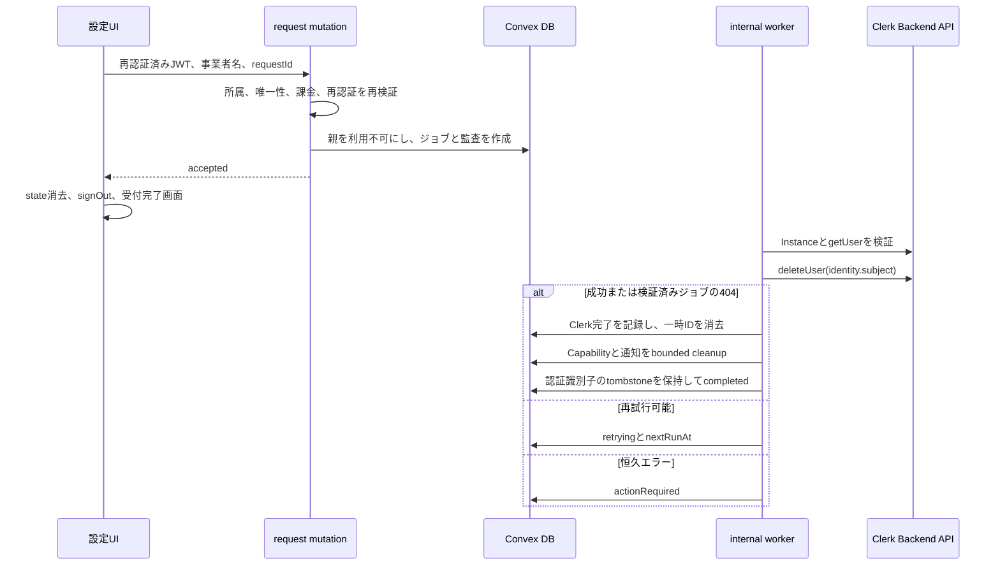

# 店舗とアカウント削除の実装計画

作成日: 2026-07-16

状態: 実装前

## 1. 結論

現状は削除UIだけが不足している状態ではない。

旧モデル向けの `api.shop.mutations.deleteShop` は、現行の `organizationId` を持つ店舗を明示的に拒否している。

また、一人の管理者が複数の事業者と店舗へ所属できるため、一店舗の削除にClerkユーザー削除を無条件で結び付けると、残すべきログイン権限まで失う。

最初の実装では、日常的な店舗整理には既存の「アーカイブ」を使い、不可逆操作を「事業者とアカウントを削除」として別に追加する。

この不可逆操作は、現在の管理者が唯一の事業者、唯一の管理者、唯一の未削除店舗を持つ場合だけ許可する。

条件を満たさない場合はClerkユーザーを削除せず、店舗のアーカイブ、管理者の整理、または別事業者からの退出を案内する。

削除要求を受け付けた時点でローカルのアクセスを停止し、Clerkユーザー削除と子データの失効処理は、再試行可能な永続ジョブで完了させる。

この計画における「削除」は、利用停止、Clerkのログイン主体削除、Capability失効、未送信通知停止を意味する。

シフト、請求、監査などの履歴を即時に物理削除することは意味しない。

## 2. 現状調査

| 領域 | 現在の状態 | 根拠 |
| --- | --- | --- |
| 新規店舗 | 初期設定で事業者、管理者所属、`organizationId` 付き店舗を作る | `convex/setup/mutations.ts` |
| 旧削除API | `organizationId` 付き店舗を拒否し、旧形式の店舗だけを論理削除する | `convex/shop/mutations.ts` |
| 現行店舗操作 | `archiveShop` と `reactivateShop` が正規の操作で、データは保持する | `convex/organization/mutations.ts` |
| 設定UI | 店舗タブには追加、アーカイブ、再稼働だけがある | `src/components/features/OrganizationSettings/ShopsSection.tsx` |
| 旧UI | ユーザーメニューの削除入口は意図的に停止されている | `src/components/features/UserMenu/index.tsx` |
| 複数所属 | `getMyShops` は複数事業者の所属店舗を返す | `convex/dashboard/queries.ts` |
| Clerk連携 | React SDKとJWT認証だけがあり、Server SDKと `deleteUser` は未実装である | `package.json`、`convex/auth.config.ts` |
| 環境変数 | `CLERK_SECRET_KEY` はConvex環境へ同期されていない | `scripts/setupEnv.ts` |
| 通知 | 現行Outboxには終端状態 `cancelled` と送信直前の適格性確認がある | `convex/notificationOutbox/mutations.ts` |
| 旧cleanup | 通知を `failed` にするため、現行Outboxの取消契約と一致しない | `convex/shop/mutations.ts` |

したがって、停止中の旧Dialogを復活させて既存mutationへ接続する案は採用しない。

コメントアウトされた `e2e/scenarios/shop-deletion-flow.test.ts` も、右上メニューから削除し、そのまま再セットアップする旧契約を前提としているため、現行仕様の根拠にはしない。

## 3. 最初の実装範囲

### 3.1 提供する操作

設定画面の店舗タブに、既存のアーカイブとは分離した「事業者とアカウントの削除」領域を追加する。

この操作は次の処理を一つの利用終了フローとして受け付ける。

- 対象事業者と唯一の店舗を利用不可にする。
- 管理者、スタッフ、公開Capability、登録リンク、セッションを失効させる。
- Providerへの送信開始前である通知を `cancelled` にする。
- 操作者本人のClerkユーザーを削除する。
- Jotaiに残る利用者と選択店舗を消し、サインアウト後に公開の受付完了画面へ移動する。

### 3.2 削除可能条件

公開queryと削除要求mutationの両方で、次の構造的な条件をサーバー側から判定する。

- 機能のサーバー側kill switchが有効である。
- 対象環境の `CLERK_SECRET_KEY`、`CLERK_INSTANCE_ID`、`CLERK_INSTANCE_ENVIRONMENT` がConvexへ設定されている。
- 操作者がClerk認証済みで、ローカルの有効な管理者である。
- 認証identityのissuerと `users.authTokenIdentifier` が、対象環境のClerk利用者として一致する。
- 対象事業者が削除済みではない。
- 対象事業者に未削除の店舗が一件だけ存在する。
- 対象事業者に、操作者以外の `active` または `readOnly` 管理者が存在しない。
- 対象の唯一店舗に、操作者以外の未削除 `shopMembers` が存在せず、legacy-onlyのアクセス主体が残っていない。
- 操作者が、対象外の事業者に `active` または `readOnly` で所属していない。
- 操作者が、対象外の旧 `shopMembers` に有効な状態で所属していない。
- 外部の有料契約、Subscription準備、支払い方法のSetupを表す課金状態またはprovider資源が存在しない。
- 同じ利用者または事業者に未完了の削除ジョブが存在しない。
- 確認対象の事業者IDと、画面に表示した事業者名が現在値と一致する。

Clerkの再認証鮮度は、削除要求mutationのみが受付直前に検証する。

`getEligibility` は古い `fva` を理由に削除導線を無効化せず、必要な場合は `requiresReverification` を表示用情報として返す。

これにより、通常の長時間セッションからDialogを開き、再認証を完了して受け付けられる。

初回は、`active.free`、`complimentary.business`、または `selectedPaidPlan` がないTrialだけを削除可能とする。

将来Stripeを接続した後は、ローカル課金状態だけで判断せず、Customer、Subscription、SetupIntentの不存在または取消完了を検証してから削除を許可する。

有料契約、支払い猶予、契約制限、変更処理中、移行状態不明では削除を拒否し、契約終了と最終請求の仕様が決まるまで対象を広げない。

複数店舗や複数事業者に対応した任意店舗の永久削除と、全所属をまとめて閉じるグローバルなアカウント削除は初回の対象外とする。

### 3.3 削除しないもの

次の処理は別の保持・消去計画が必要なため、今回の「アカウント削除」と同一視しない。

- シフト募集、提出、割当、確定スナップショットの即時物理削除。
- 請求状態、利用量、監査イベント、同意証跡の即時物理削除。
- バックアップやログからの即時消去。
- スタッフ、登録申請、通知payloadに含まれる個人情報の全面的な匿名化。
- Clerk Dashboardから直接削除された利用者を同期するWebhook。

UIでは「すべてのデータを完全に消去します」と表示しない。

個人情報の匿名化対象、保持期間、バックアップからの消去時期は、公開前に別の保持マトリクスとして決定する。

## 4. 画面と操作

### 4.1 配置

入口は右上のユーザーメニューへ戻さず、`/settings?tab=shops` の店舗一覧の下に「危険な操作」として置く。

通常の店舗操作と不可逆な事業者終了を同じ行の同格アクションにしない。

削除できない場合も領域を表示し、既存のアーカイブで解決できる場合と、先に必要な操作を説明する。

### 4.2 画面状態

| 状態 | 表示と操作 |
| --- | --- |
| 判定中 | 削除操作を無効にし、Skeletonまたは読み込み中表示にする |
| 削除可能 | 影響範囲を表示し、「削除手続きへ」を有効にする |
| 複数店舗 | 「店舗ごとの整理にはアーカイブを利用してください」と表示する |
| 他事業者所属あり | 「ほかの事業者にも所属しているため、ログインアカウントを削除できません」と表示する |
| 他管理者あり | 権限移譲または他管理者の削除が先に必要であることを表示する |
| 課金状態で不可 | 契約終了が先に必要であることを表示する |
| 送信中 | Dialogを閉じず、入力とボタンを無効にする |
| 受付成功 | ローカルstateを消し、Clerkからサインアウトして受付完了画面へ移動する |
| 受付失敗 | Dialogを維持し、安全なエラー文言と再操作を表示する |

受付後のClerk処理は非同期なので、完了画面の見出しは「削除が完了しました」ではなく「削除手続きを受け付けました」とする。

受付済みなら `signOut` がClerk削除との競合で失敗しても、`finally` でローカルstateを消し、公開画面へ `replace` する。

この場合もバックエンドは削除済み利用者のアクセスを拒否する。

### 4.3 確認Dialog

確認Dialogは `role="alertdialog"` を使い、事業者名の完全一致入力を確定条件にする。

店舗切り替え、権限変更、名称変更がDialog表示後に起きても、確定時にサーバーで現在値を再検証する。

削除確定処理にはフロントの同期ガードと `requestId` を使い、短時間の連続操作で複数ジョブを作らない。

文言案は次のとおりとする。

- 見出しは「事業者とアカウントを削除」とする。
- 本文は「この事業者にある店舗を利用できなくなり、スタッフ向けリンクと、まだ送信処理を開始していない通知を停止します。ログインに使っているアカウントも削除します。過去のシフト、請求、監査記録は保持方針に従って保持されます。」とする。
- 入力ラベルは「確認のため事業者名を入力」とする。
- 確定ボタンは「削除手続きを開始」とする。

画面上ではClerkというサービス内部名を使わない。

### 4.4 再認証

Clerkの `useReverification()` を使い、削除要求の直前に最も強い利用可能な要素で再認証を求める。

削除要求mutationでもJWTの `fva` tupleを検証し、第一要素と、存在する場合の第二要素が10分を超えた認証や、不正なclaimを拒否する。

第一要素は0分以上10分以下を必須とし、第二要素は `-1` または0分以上10分以下だけを許可する。

Mutationが `reverificationRequired` を返した場合は、controllerのadapterが `@clerk/shared/authorization-errors` の `reverificationError("strict")` へ変換し、再認証後に同じ `requestId` で要求を再実行する。

再実行時は `sessionClaims.aud === "convex"` ならtemplate指定なし、それ以外なら `template: "convex"` とし、どちらも `skipCache: true` で新しいJWTを取得する。

取得したtokenだけを設定した短命な `ConvexHttpClient` から削除要求mutationを呼ぶ。

通常の `ConvexProviderWithClerk` が保持するWebSocket認証tokenの更新時刻には依存しない。

フロントの再認証だけを削除許可の根拠にしない。

現行の `@clerk/clerk-react` は必要なhookを含み、`fva` はClerk session tokenの既定claimであるが、developでConvexのidentityへ届くことを公開前に確認する。

`fva` が届かない場合はClerkのsession token設定とConvex用JWT templateを調査し、サーバー検証を省略した状態では公開しない。

## 5. バックエンド設計

### 5.1 公開API

`convex/accountClosure/` を新しいユースケース境界として追加する。

`getEligibility` queryは `organizationId` を受け取り、認証identityからその事業者への有効な所属を検証したうえで、削除可否、拒否理由のcode、表示用の事業者名と店舗名だけを返す。

他事業者のID、管理者一覧、Clerk user ID、ジョブ内部状態は公開DTOへ含めない。

`request` mutationの入力は `organizationId`、`confirmOrganizationName`、`requestId` とする。

Clerk user IDはクライアントから受け取らず、認証identityの `subject` からサーバー側で確定する。

`request` は `accepted` または `reverificationRequired` を返す。

`request` は、認証identityから削除済み利用者を含むローカルuserを解決し、同じ利用者と `requestId` の既存ジョブを通常の削除可否より先に確認する。

既存ジョブの `organizationId` が入力と一致する場合は、利用者、事業者、店舗が削除済みでも同じ `accepted` を返す。

同じ `requestId` で異なる事業者を指定した場合は拒否する。

既存ジョブがない場合だけ、削除可否を再計算し、再認証の鮮度を確認してから、次の更新を一つのトランザクションで行う。

1. 同じ利用者または事業者の別の未完了ジョブがないことを確認する。
2. `accountClosureJobs` を作成する。
3. `users.isDeleted` と `organizations.isDeleted` を `true` にする。
4. 対象店舗を `isDeleted: true` にし、必要なら稼働状態もアーカイブへそろえる。
5. 操作者の事業者所属と人物状態を削除済みへ変更する。
6. 課金stateのversionを進め、通知cutoffを設定して古いdeadlineを無効化する。
7. 事業者終了の監査イベントを、個人情報を含まないcorrelation ID付きで記録する。
8. 最初のinternal workerをscheduleする。
9. `accepted` と受付IDだけを返す。

親となる利用者、事業者、店舗を先に無効化し、子レコードのbatched cleanup中も新しいアクセスと通知作成を拒否する。

削除済み利用者を新規利用者として返す現在の `getCurrentUser` は、その利用者の削除ジョブがある場合に `accountClosureAccepted` を返すように変更する。

この返値はジョブが未完了、`actionRequired`、完了のいずれでも変えず、外部処理状態や失敗理由を公開しない。

これにより、サインアウト前の再描画やページ再読み込みで初期設定画面へ入ることを防ぐ。

### 5.2 永続ジョブ

新しい `accountClosureJobs` tableを追加する。

最低限、次の情報を保持する。

- `requestId`、`userId`、`organizationId`、`shopId`。
- identityから取得した一時的なClerk user IDと、受付時の `expectedClerkInstanceId`、`expectedClerkEnvironment`。
- `status`、table単位の `progress`、`attemptCount`。
- `leaseId`、`leaseExpiresAt`、`nextRunAt`。
- 外部へ返さない安全化済みの `lastErrorCode`。
- `createdAt`、`updatedAt`、`providerInstanceVerifiedAt`、`providerUserVerifiedAt`、`deleteAttemptedAt`、`clerkDeletedAt`、`completedAt`。

冪等受付に `by_userId_and_requestId`、重複ジョブ検出に `by_userId_and_status` と `by_organizationId_and_status` を追加する。

再試行、lease回収、運用監視に `by_status_and_nextRunAt`、`by_status_and_leaseExpiresAt`、`by_status_and_updatedAt` の複合indexを追加する。

ジョブは `queued`、`processing`、`retrying`、`actionRequired`、`completed` の状態を持つ。

`progress` は `deleteClerkUser`、`revokeCapabilities`、`cancelNotifications`、`softDeletePeople`、`complete` を区別するdiscriminated unionとする。

複数tableを扱うphaseは `{ phase, resource, cursor }` を保持し、一つのcursorを異なるtableで共有しない。

各phaseは一回100件程度のbounded batchで進め、同じphaseとcursorから再実行できるようにする。

Workerが状態を進めるinternal mutationは `jobId`、`expectedLeaseId`、`expectedProgress` を受け取り、現在が `processing` かつleaseとprogressが一致する場合だけ更新する。

Lease回収後に古いworkerが成功または失敗を返しても、新しいworkerの `retrying`、`actionRequired`、`completed` を上書きしない。

期限切れleaseと期限到来の再試行を回収するreaperを追加し、worker停止後も未完了ジョブを再開できるようにする。

Reaperは対応する複合indexから一回最大50件だけ取得し、残件があれば次回へ繰り越す。

新規要求を止めるkill switchは、すでに受け付けたジョブの完了処理を止めない。

### 5.3 Clerk削除

`@clerk/backend` を直接依存へ追加する。

`"use node"` を宣言したinternal actionで `createClerkClient` を初期化する。

`CLERK_SECRET_KEY` はConvex環境変数からだけ読み、引数、DB、公開DTO、ログへ保存しない。

`scripts/setupEnv.ts` は秘密値をConvex CLIの引数ではなくstdinへ渡し、shell historyとprocess listに値を残さない実装へ変更する。

子プロセスの失敗時は `Error.message`、command、stdout、stderrをそのまま出力せず、環境変数のkey名と固定の失敗codeだけを表示する。

この安全化はClerkだけでなく、同じscriptが扱うWebhookと署名secretにも適用する。

各試行の先頭でClerkのInstance get APIを呼び、返されたinstance IDとenvironment typeがジョブ受付時の `expectedClerkInstanceId` と `expectedClerkEnvironment` に一致することを検証する。

Instance不一致ならuser APIを呼ばず、`actionRequired: clerk_instance_mismatch` としてfail closedにする。

Clerk user IDは削除ジョブへ一時保存するが、Clerk削除の確定後に消去する。

Instance一致後の最初のuser APIでは、同じclientの `getUser(clerkUserId)` が成功し、認証identityから得たIDと一致することを確認してから `deleteUser(clerkUserId)` を呼ぶ。

初回の `getUser` が404なら、secretまたはClerk instanceの取り違えを疑う `actionRequired` とし、削除済みの成功にはしない。

404を冪等な成功として扱えるのは、同じジョブで `getUser` 成功を記録済みの場合、または `deleteUser` を開始した後にtimeoutして結果が不明な場合だけとする。

429、5xx、timeout、通信失敗は指数backoff付きで再試行する。

認証不良などの恒久的な4xxは `actionRequired` にし、利用者を復活させず運用確認へ回す。

Clerk削除後にローカル確定前で停止しても、検証済みジョブの再実行時に返る404から完了できるようにする。

Clerk Webhookは主処理に使わず、Dashboard起点の削除も同期する必要が生じた場合の補助経路として別途追加する。

### 5.4 Capabilityと通知

削除要求直後から、manager/staff/public functionが `users.isDeleted`、`organizations.isDeleted`、`shops.isDeleted` を再確認して拒否することを監査する。

親状態を確認していないCapability verifierがあれば、個別レコードのcleanup完了を待たず拒否できるように修正する。

次の有効情報をbatched cleanupで失効させる。

- `organizationMembers`、`organizationPeople`、旧 `shopMembers`、`staffs`、`staffLineAccounts`。
- `sessions`、`magicLinks`、`lineLinkTokens`、`legalConsentTokens`。
- `shopRegistrationLinks`、未完了の `staffRegistrationRequests`、`organizationInvitations`。

未完了の `staffRegistrationRequests` には `cancelled` と `closedAt` を追加し、管理者による却下を表す `rejected` を流用しない。

通知は現行Outboxの取消helperを拡張し、対象事業者または店舗の `pending` と `processing` を `cancelled` にする。

取消理由は既存の `organization_inactive` または `shop_inactive` を再利用する。

`failed` は取消状態として使わない。

送信直前の `prepareForDelivery` でも、削除済み事業者または店舗を理由に取消する契約を維持する。

遅れて完了したworkerが `cancelled` を `sent`、`failed`、`retrying` へ戻さないことをテストする。

`prepareForDelivery` の最終確認後にProvider呼び出しが始まった通知は、削除要求から取消までの間に送信される可能性がある。

この競合は完全には取り消せないため、UIと運用上の残余リスクとして扱い、送信開始前だけを停止保証の範囲とする。

### 5.5 遅延処理の終端ガード

削除要求前に予約されたscheduled functionや、遅れて届くprovider callbackは、子データcleanupとは別に停止させる。

Schedulerのjob IDを保持していない処理は取消を試みず、実行時に `organizations.isDeleted` または `shops.isDeleted` を確認して副作用なしで終了する。

少なくとも次の入口へ終端ガードを追加する。

- `organizationBilling.mutations.processDeadline` と、検証済み課金結果を反映するinternal mutation。
- 課金通知actionと、将来追加するStripe callbackまたは再同期処理。
- `organizationInvitation` の期限切れ、通知、承認後通知。
- 店舗有効化リマインダー、募集リマインダー、シフト確定リマインダー、登録申請digest。
- 通知のenqueue、fanout、fallback、Provider送信直前の最終確認。

分析集計と保持対象データの読み取りは、削除後も履歴保持のために動作してよい。

削除要求transactionで課金stateのversionとcutoffを更新し、既存の `expectedVersion` を持つdeadlineを直ちにstaleにする。

Version一致だけには依存せず、各internal入口でも削除済み親を確認する。

### 5.6 ローカル認証識別子

Clerk削除後も、既発行JWTは有効期限までConvexへ到達する可能性がある。

初回実装では、削除済み `users.authTokenIdentifier` と `isDeleted` を無期限に保持し、ローカルのセキュリティ用tombstoneとする。

`authenticatedQuery` と `authenticatedMutation` は、削除済み利用者をデフォルトで拒否するよう強化する。

削除要求の冪等な再送と `getCurrentUser` の受付状態参照だけは、削除済み利用者を解決できるaccount closure専用の狭いwrapperを通す。

`setupShopAndManager` を含む他の公開functionが、古いJWTでデータを読み出し、新規作成、または更新できないことを横断テストする。

`authTokenIdentifier` はoptional化せず、同等の再作成防止契約がないまま消去しない。

将来この識別子を匿名化する場合は、システム秘密鍵で作る照合用ダイジェストなど、同等の再登録防止手段を別計画で先に導入する。

名前、メール、スタッフ情報などの匿名化は、第3.3節の保持判断に従って別のphaseまたは別計画で扱う。

## 6. 処理フロー

ConvexとClerkを同じトランザクションにはできないため、ローカル状態を元に戻すrollbackは行わない。

Clerk失敗中もローカルアクセスを停止し、同じ対象を冪等に再試行して最終的な整合へ収束させる。

## 7. schemaとmigration

新しい `accountClosureJobs` tableは既存行のbackfillを必要としない。

`staffRegistrationRequests.status` の `cancelled` およびoptionalな `closedAt` の追加は、既存データを受け入れる加算的なWidenとして扱う。

Widen対応コードをdevelopとproductionへ先に反映し、その後に削除機能を有効化する。

既存利用者を削除状態へ変換するmigrationは実行しない。

旧 `api.shop.mutations.deleteShop` は移行期間のlegacy APIとしてUIから呼ばず、m009とm010のNarrowで旧店舗がなくなったことを確認した後に削除する。

## 8. 実装対象ファイル

### 8.1 バックエンド

- `package.json` に `@clerk/backend` と、reverification hintに使う `@clerk/shared` の直接依存を追加する。
- `scripts/setupEnv.ts` に `CLERK_SECRET_KEY`、`CLERK_INSTANCE_ID`、`CLERK_INSTANCE_ENVIRONMENT`、`ACCOUNT_CLOSURE_ENABLED` のConvex同期を追加し、全値のstdin入力と秘密を含まない固定エラー整形へ変更する。
- `convex/schema.ts` に削除ジョブと必要なWidenを追加する。
- `convex/accountClosure/validators.ts` に公開DTOとジョブ状態を定義する。
- `convex/accountClosure/queries.ts` に削除可否queryを追加する。
- `convex/accountClosure/mutations.ts` に削除要求、ジョブ更新、cleanupを追加する。
- `convex/accountClosure/actions.ts` にClerk削除のNode actionを追加する。
- `convex/accountClosure/service.ts` に所属、課金、唯一性の共通判定を置く。
- `convex/accountClosure/reaper.ts` に期限切れジョブの回収処理を追加する。
- `convex/crons.ts` から期限切れジョブのreaperを定期実行する。
- `convex/_lib/functions.ts` と各Capability verifierで親の削除状態を強制する。
- `convex/organizationBilling/mutations.ts` と課金actionで削除済み事業者への遅延更新を止める。
- `convex/organizationInvitation/` と各リマインダーactionで削除済み親への遅延更新と通知を止める。
- `convex/staffRegistration/` で削除時の `cancelled` とpending集計からの除外を扱う。
- `convex/notificationOutbox/mutations.ts` に事業者または店舗単位の取消処理を追加する。
- `convex/dashboard/queries.ts` にジョブ完了速度に依存しない `accountClosureAccepted` の認証状態を追加する。

ファイルを分ける際は、薄いwrapperを増やさず、外部副作用、永続状態遷移、再利用する業務判定の境界に合わせる。

### 8.2 フロントエンド

- `src/components/features/OrganizationSettings/types.ts` に削除可否DTOを追加する。
- `src/components/features/OrganizationSettings/ShopsSection.tsx` に危険な操作領域を追加する。
- `src/components/features/OrganizationSettings/AccountClosure/AccountClosureDialog.tsx` を追加する。
- `src/components/features/OrganizationSettings/AccountClosure/requestAccountClosure.ts` に、再認証済みJWTだけを使う短命なHTTP client処理を置く。
- `src/components/features/OrganizationSettings/AccountClosure/useAccountClosureController.ts` を追加する。
- `src/pages/settings/index.tsx` で既存の設定queryと削除可否queryを呼び、featureへDTOを渡す。
- `src/components/features/OrganizationSettings/index.tsx` でcontrollerとDialogを組み立てる。
- `src/components/features/AuthenticatedApp/AuthGuard.tsx` で `accountClosureAccepted` の利用者を、ジョブ完了前後とも初期設定ではなく公開の受付完了画面へ送る。
- `src/stores/shop/index.ts` では `selectedShopAtom` を `null` に戻す。
- `src/stores/user/index.ts` の未使用でhook規約に反する `resetUserAtom` は、正しいwritable reset atomへ置き換えて受付成功時に使う。
- `src/routes/account-deletion-accepted.tsx` と `src/pages/account-deletion-accepted/` に公開の受付完了画面を追加する。

受付完了画面のURLには、受付ID、事業者名、メールアドレスを含めない。

既存の `src/components/features/UserMenu/index.tsx` へ削除入口は戻さない。

### 8.3 ドキュメント

- `doc/features/shop-settings.md` を現行の入口と削除契約へ更新する。
- `doc/features/account-closure.md` に機能説明、関連ファイル、画面、APIを記録する。
- `doc/INDEX.md` に機能概要へのリンクを追加する。
- 個人情報の匿名化まで実施する場合は、保持マトリクスを別文書で確定する。

## 9. テスト計画

### 9.1 Convex Function Test

- 未認証、権限不足、他事業者ID、確認名不一致を拒否する。
- kill switchが無効、またはClerk secret、instance ID、environmentのいずれかが未設定なら、ローカル状態を変更せず拒否する。
- 環境変数同期helperが値を子プロセス引数に含めず、失敗時のログにsecret、command、stdout、stderrを出さないことをunit testで確認する。
- 古いDialogからの要求と、店舗切り替え後の要求を拒否する。
- 複数店舗、他管理者、他事業者所属、操作者の対象外legacy所属、対象外の課金状態を拒否する。
- 対象店舗に操作者以外の未削除 `shopMembers` だけでアクセスできる利用者がいる場合も拒否する。
- `getEligibility` は `fva` 不在または期限超過でも構造的に削除可能と返し、`request` は `reverificationRequired` としてローカル状態を変更しない。
- 再認証後の鮮度の高い `fva` だけで削除要求を受け付ける。
- 同じ `requestId` と短時間の重複要求でジョブを一件だけ作る。
- 初回commit後にレスポンスを失った同じ要求が、削除済み親に阻まれず同じ `accepted` を返す。
- 同じ利用者と `requestId` で異なる事業者を指定した再送を拒否する。
- 受付トランザクション直後に利用者、事業者、店舗へのアクセスを拒否する。
- `getCurrentUser` がジョブの未完了、`actionRequired`、完了のすべてで `accountClosureAccepted` だけを返し、新規利用者として扱わない。
- ジョブ内部情報とClerk user IDを公開DTOへ返さない。
- Clerk成功と、検証済みジョブの404を完了扱いにする。
- 初回の `getUser` 404、401、403を成功扱いにせず、secretまたはinstance不一致として止める。
- Instance get APIのIDまたはenvironment typeが想定と異なる場合は、`deleteUser` を呼ばずに止める。
- Provider user検証後にsecretが別instanceへ変わった再試行でも、404を完了扱いにしない。
- `getUser` 検証済み、またはdelete開始後の結果不明状態に限り、再試行時の404を完了扱いにする。
- 429、5xx、timeoutを再試行し、恒久4xxを `actionRequired` にする。
- Clerk成功後、ローカル確定前に停止しても再開できる。
- 状態更新mutationがleaseとprogressのCAS不一致を副作用なしで無視する。
- Reaperと運用queryが複合indexから上限件数だけ読み、残件を全走査せず繰り越す。
- 有効期限内の既発行JWTでもtombstoneにより削除済み利用者として解決し、専用状態参照以外の公開query、公開mutation、再セットアップを拒否する。

### 9.2 Convex Scenario Test

`convex/_scenario/accountClosure.test.ts` を主担当の結合テストとする。

- 一店舗、一事業者、一管理者の削除要求からClerk削除、cleanup、完了までを通す。
- 二事業者所属の一方だけを対象にした要求がClerk削除へ進まないことを確認する。
- 対象の唯一店舗に、別利用者のlegacy-only `shopMembers` が残る場合はClerk削除へ進まないことを確認する。
- 100件を超えるスタッフ、token、通知を複数batchで処理する。
- enqueue後、claim後、送信直前の削除競合で通知が送られないことを確認する。
- Provider呼び出し開始後の競合は取消不能な境界としてfixtureで分離し、保証範囲を誤って広げない。
- 期限切れleaseをreaperが回収し、同じcursorから再開することを確認する。
- Reaperが新しいleaseを発行した後に古いworkerが成功または失敗を返しても、新しい状態を上書きしないことを確認する。
- 削除前に予約したTrial deadline、課金callback、招待期限、各リマインダーを削除後に実行しても、課金状態、監査、通知を新しく変更しないことを確認する。
- 未完了の登録申請を `cancelled` にし、pending一覧とdigestから除外することを確認する。
- 対象外の事業者、店舗、利用者、通知を変更しないことを確認する。
- 履歴と監査を保持し、Capabilityだけを失効することを確認する。

Clerk APIはテストダブルで置き換え、通常の自動テストから実ユーザーを削除しない。

### 9.3 UI、Storybook、VRT

- 削除可能、複数店舗、他所属、他管理者、課金中の各状態をStoryで表す。
- デスクトップとモバイルで危険な操作領域と開いたDialogをVRT対象にする。
- 長い事業者名、確認入力不一致、送信中、受付失敗を確認する。
- Behavior Testでは、Dialogを開く、入力一致で確定可能になる、キャンセルする、callbackが一度だけ呼ばれる状態遷移を検証する。
- VRT対象の静的文言を存在確認だけのplay functionで重複検証しない。
- controller testでは、連打、権限喪失、stale target、sign-out、Jotai reset、完了遷移を検証する。
- 古い `fva` でもDialogを開け、`reverificationRequired` から再認証し、同じ `requestId` で `accepted` まで進むことをcontroller testで検証する。
- 再認証後の要求が `skipCache: true` で取得したJWTを使い、共有のHTTP clientへ認証tokenを残さないことを検証する。
- `AuthGuard` testでは削除ジョブの未完了、`actionRequired`、完了のどの時点でもセットアップへ遷移せず、公開の受付完了画面へ進むことを検証する。

### 9.4 E2Eとprovider canary

共有のClerk E2E利用者を削除すると後続テストを破壊するため、通常のE2Eへ実Clerk削除を組み込まない。

コメントアウトされた旧 `shop-deletion-flow.test.ts` は復活させず、削除するか現行契約に置き換える。

実Clerk連携は、使い捨てのClerk利用者と専用事業者を作成できるprovider canaryで確認する。

canaryでは、削除要求、ローカルアクセス停止、Clerk Dashboard上の削除、ジョブ完了を一つの証跡として確認する。

## 10. リリース計画

### PR 0: 再認証とtoken更新のspike

1. 現行 `@clerk/clerk-react` の `useReverification()` と `@clerk/shared/authorization-errors` を使い、破壊的更新を行わない検証用処理でreverification hintを扱えることを確認する。
2. 再認証前後の `fva` をConvexで検証し、短命な `ConvexHttpClient` が `skipCache: true` で取得した新しいJWTを送ることを確認する。
3. React SDK、Convex認証、再認証Dialog、キャンセル、再試行をdevelopで確認する。
4. この契約が成立しない場合は、公式の `@clerk/react` への移行またはcustom verification flowを別計画にし、再認証なしでは削除機能を実装しない。

Spikeのためだけの公開functionは本実装へ残さない。

### PR 1: バックエンドとWiden

1. 新しいtable、`staffRegistrationRequests.closedAt`、削除可否判定、ジョブ、Clerk action、cleanup、遅延処理の終端ガード、環境変数同期の秘密保護、テストを追加する。
2. `ACCOUNT_CLOSURE_ENABLED=false` のままdevelopへデプロイする。
3. DevelopのConvex環境へClerkのDevelopment secret、instance ID、environmentを設定する。
4. `fva` claim、instance不一致、初回404、検証済み404、再試行、reaperをテスト利用者で確認する。

### PR 2: UIと受付完了画面

1. 事業者設定へ危険な操作領域、Dialog、再認証、sign-out、完了画面を追加する。
2. Story、VRT、Behavior Test、controller testを追加する。
3. developだけkill switchを有効にし、使い捨て利用者でprovider canaryを通す。
4. 機能概要と運用手順を更新する。

### Production公開

1. ProductionのConvex環境へClerkのProduction secret、instance ID、environmentを設定し、Instance get APIのIDとenvironment typeが一致することを確認する。
2. kill switchを無効のままコードをproductionへ反映する。
3. Production環境の変更と実Clerkユーザー削除について明示的な承認を得る。
4. 監視担当がいる時間帯に `ACCOUNT_CLOSURE_ENABLED=true` とし、直後に使い捨てのproduction利用者で一件だけcanaryを実行する。
5. 未完了ジョブ、最終エラー、再試行回数、最古の待機時間を確認する。
6. Canaryが失敗した場合は直ちにkill switchを無効へ戻し、成功した場合だけ有効状態を維持する。

問題が起きた場合はkill switchで新規受付だけを停止し、受け付け済みジョブは冪等に完了させる。

## 11. 運用と監査

`queued`、`retrying`、`actionRequired`、lease期限を超えた `processing` と最古の対象を複合indexから確認できるinternal queryを用意する。

運用queryもstatusごとに一回最大51件に制限し、50件超は `hasMore` として返し、完了ジョブを含むtable全走査で件数を数えない。

運用者向けの再実行mutationはジョブIDだけを受け取り、対象利用者やClerk user IDを上書きできないようにする。

受付時のinstance設定が誤っていたジョブを修復する場合は、現在のInstance get APIと `getUser` が保存済みsubjectに一致したときだけ、専用internal actionがinstance bindingを監査付きで更新する。

運用入力からClerk user IDやinstance IDを直接上書きする修復APIは作らない。

ログにはジョブID、phase、試行回数、安全化したerror codeだけを残す。

Clerk user ID、メールアドレス、JWT、secret、providerの生レスポンスはログへ出さない。

監査には操作者、対象事業者、受付時刻、correlation ID、結果を残すが、復元用の認証情報は残さない。

## 12. Security Lens

| 観点 | 設計 |
| --- | --- |
| Entry point | 認証済み設定画面と `accountClosure.request` だけを公開する |
| Identity | 操作者とClerk削除対象を同じ認証identityから確定する |
| Tenant boundary | 事業者所属、店舗所属、他事業者所属をサーバーで横断確認する |
| Protected assets | 店舗データ、全Capability、管理者のグローバルなログイン主体を保護する |
| Abuse cases | IDOR、古いDialog、店舗切替競合、二重送信、他所属を持つ利用者の誤削除を拒否する |
| Lifecycle | 受付直後にアクセスを止め、外部削除とcleanupを永続ジョブで完了する |
| External effect | Provider検証後のClerk 404だけを冪等成功とし、再試行可能エラーをbackoff、設定不一致を運用確認へ分ける |
| Logging | secret、token、Clerk user ID、メール、provider本文を記録しない |
| Residual risk | Provider送信開始後の通知は取消不能であり、履歴と個人情報の保持期間も別途決定する |

## 13. 完了条件

- 現行の事業者付き店舗で削除受付が成功する。
- 複数店舗、他管理者、他事業者所属、対象外課金状態では、Clerk削除へ到達しない。
- 削除対象のClerk user IDをクライアントから指定できない。
- 削除要求の直後から、manager、staff、公開Capability、通知の新規利用を拒否する。
- Clerk成功、検証済みジョブの404、再試行可能失敗、設定不一致、恒久失敗から状態が収束する。
- 連打、再送、worker再開で削除ジョブと外部削除が重複しない。
- 受付後にサインアウトし、初期設定ではなく公開の受付完了画面へ遷移する。
- UIが物理削除していない履歴まで「完全に消去した」と説明しない。
- developとproductionで使い捨て利用者のprovider canaryが完了する。
- 未完了と `actionRequired` のジョブを運用者が検出して再実行できる。

## 14. 実装前に確認する判断

この計画は、初回を「単一事業者、単一店舗、単一管理者の利用終了」に限定する前提である。

任意の一店舗だけを永久削除し、他店舗の利用とClerkアカウントを残す操作も同時に必要な場合は、別の店舗ライフサイクルとして追加設計する。

公開前には、次の二点だけプロダクト判断を確定する。

1. シフト、請求、監査、スタッフ個人情報の保持期間と匿名化範囲。
2. 将来の有料契約終了後に削除を許可する条件と、未払い・返金の扱い。

## 15. 参照先

### リポジトリ

- `doc/specs/organization-billing-business-flow.md`
- `doc/features/shop-settings.md`
- `doc/features/organization-billing.md`
- `doc/features/manager-shop-membership.md`
- `doc/rules/frontend-architecture.md`
- `doc/rules/security-strategy.md`
- `doc/rules/convex-design-strategy.md`
- `doc/rules/testing-strategy.md`
- `convex/schema.ts`
- `convex/setup/mutations.ts`
- `convex/shop/mutations.ts`
- `convex/shop/mutations.test.ts`
- `convex/organization/mutations.ts`
- `convex/organization/shopManagement.test.ts`
- `convex/dashboard/queries.ts`
- `convex/_lib/functions.ts`
- `convex/notificationOutbox/mutations.ts`
- `src/components/features/OrganizationSettings/`
- `src/components/features/UserMenu/index.tsx`
- `src/components/features/AuthenticatedApp/AuthGuard.tsx`
- `e2e/scenarios/shop-deletion-flow.test.ts`

### Clerk公式ドキュメント

- [Delete user](https://clerk.com/docs/reference/backend/user/delete-user)
- [Get user](https://clerk.com/docs/reference/backend/user/get-user)
- [Get instance](https://clerk.com/docs/reference/backend/instance/get)
- [Add reverification for sensitive actions](https://clerk.com/docs/guides/secure/reverification)
- [Session tokens](https://clerk.com/docs/guides/sessions/session-tokens)
- [Sync Clerk data with webhooks](https://clerk.com/docs/guides/development/webhooks/syncing)
