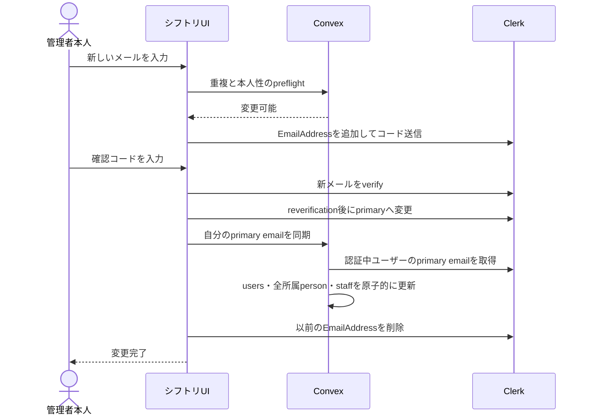

# 管理者メールアドレス変更とClerk同期 実装計画

作成日: 2026-08-03  
状態: reviewing  
対象: 管理者本人のメールアドレス変更、ClerkとConvexの同期、Dashboardヘッダー

## 1. 目的

管理者のメールアドレスを、連絡用とログイン用に分けず、一つのアカウント属性として扱う。

管理者本人がメールアドレスを変更した場合は、同じClerk Userのprimary emailを更新し、`users`、本人に紐づく`organizationPeople`、各店舗の有効な`staffs`へ同じ値を同期する。

別の管理者によるアカウント連携済みユーザーのメール変更を、画面とserver-side enforcementの両方で禁止する。

Dashboardヘッダーのアバタードロップダウンには、Convexの複製値ではなく、現在ログインに使われるClerk primary emailを表示する。

## 2. 現状と問題

現在のスタッフ情報画面は、名前とメールアドレスを同じ`PersonProfileForm`で編集する。

`organization.mutations.updatePersonProfile`は、対象の`organizationPeople`と有効な`staffs`を更新し、対象が操作中の本人なら`users`も更新する。

一方、このmutationはClerk Userを更新しない。

そのため、管理者が自分のメールアドレスを変更すると、Convexには新しいメールアドレスが保存されても、Clerkには以前のメールアドレスだけが残り得る。

この状態で新しいメールアドレスを使ってログインすると、Clerkには該当ユーザーが存在しないためログインできない。

Dashboardヘッダーの`UserMenu`も現在は`userAtom.email`を表示しており、Clerkの実際のログインメールと異なる値を表示し得る。

## 3. 決定事項

| 論点 | 決定 |
|---|---|
| メールの意味 | アカウント連携済み管理者では、連絡用とログイン用を分けず一つのメールアドレスとして扱う |
| 正本 | Clerkのverified primary emailをログインメールの正本とし、Convexには業務利用のため同じ値を複製する |
| Clerk User | 新しいClerk Userを作らず、現在ログイン中の同じClerk Userへメールアドレスを追加、検証、primary化する |
| 変更権限 | Clerkアカウントへ連携済みのメールアドレスは本人だけが変更できる |
| 他者編集 | 他の管理者は、連携済みユーザーの名前は変更できるが、メールアドレスは変更できない |
| 未連携スタッフ | `userId`を持たないスタッフのメール編集は既存仕様を維持する。Clerk Userが存在しないため、本計画の本人変更フローには入れない |
| 同期範囲 | `users`と、同じ`userId`へ紐づく全グループの有効な`organizationPeople`および有効な`staffs`を一回のConvex mutationで同期する |
| ヘッダー表示 | Clerk primary emailを直接表示し、`userAtom.email`へfallbackしない |
| 既存不一致 | ClerkとConvexのどちらかを自動採用せず、本人へ選択肢を提示して復旧する |
| 旧メール | 新メールのprimary化とConvex同期が完了した後に削除する。削除失敗時は完了扱いにせず再試行導線を残す |

`organizations.billingEmail`は組織の請求先であり、個人のログインメールとは別の業務属性なので同期対象にしない。

過去の監査、削除済みスタッフ、送信済み通知、完了済み招待に保存されたメールは履歴として書き換えない。

## 4. 成立させる不変条件

アカウント連携済みユーザーの現在有効なデータでは、次を成立させる。

```text
Clerk verified primary email
  = users.email
  = userIdで紐づく有効なorganizationPeople.email
  = 各personへ紐づく未削除staffs.email
```

各Convex documentでは、`email`と`emailNormalized`を既存の`normalizeEmail`で同じ正規化値へ更新する。

`staffs.userId`は既存documentで欠損し得るため、同期対象の特定を`staffs.userId`だけに依存しない。

同じ`userId`を持つ`organizationPeople`を先に収集し、その`organizationPersonId`へ紐づく未削除`staffs`も同期対象にする。

削除済みまたはremovedの履歴を現在の連絡先として扱わない。

removed personを再有効化する処理では、その時点の`users.email`を採用し、古いメールを有効データへ戻さない。

## 5. UI設計

### 5.1 スタッフ情報画面

メール項目のラベルは一貫して「メールアドレス」とする。

「連絡用メールアドレス」と「ログイン用メールアドレス」という二つの項目は作らない。

| 対象 | 表示と操作 |
|---|---|
| 本人 | 現在のClerk primary emailを表示し、「メールアドレスを変更」ボタンを表示する |
| 他のアカウント連携済みユーザー | メールをread-onlyで表示し、「メールアドレスは本人のみ変更できます」と案内する |
| アカウント未連携スタッフ | 既存どおり、書き込み権限を持つ管理者がメールを編集できる |

名前の編集とメール変更は操作を分ける。

名前の「変更を保存」は既存のprofile mutationを使い、メールアドレスの変更は専用フローを開く。

メール変更中も、元のスタッフ情報Dialogで編集中だった名前を不用意に破棄しない。

実装では名前formのdirty stateを確認し、未保存なら先に保存または取り消すよう案内してからメール変更へ進む。

### 5.2 メール変更フロー

既存のresponsive Dialogを使い、PCでは通常Dialog、モバイルでは全画面表示とする。

| Step | 見出し | 主な内容 | 主操作 |
|---|---|---|---|
| 1 | メールアドレスを変更 | 現在のメール、新しいメール入力、変更後はログインと通知の両方に使われる説明 | 確認コードを送信 |
| 2 | 確認コードを入力 | 新しいメールへ送ったコード、送信先、再送、入力先へ戻る | 確認する |
| 3 | 本人確認 | Clerkのreverification UI | Clerkが提示する確認操作 |
| 4 | メールアドレスを更新中 | Clerk primary化とConvex同期の進行表示 | 操作不可 |
| 5 | 変更完了 | 新しいメールで次回からログインする案内 | 閉じる |

確認コードは新しいメールアドレスの所有確認であり、Clerkのreverificationは現在のログインユーザー本人であることの再確認である。

二つを同じ確認として省略しない。

送信先をコード画面へ表示する場合は部分的に伏せ、確認コード、Clerkレスポンス、メール全文をログへ出さない。

### 5.3 エラーと復旧

| 状態 | 画面の扱い |
|---|---|
| 入力または重複エラー | 入力画面に留まり、該当項目へエラーを表示する |
| コード誤りまたは期限切れ | コード画面に留まり、再入力または再送を可能にする |
| reverificationのキャンセル | primaryを変更せず、メール変更Dialogへ戻る |
| Clerk primary変更前の失敗 | Convexを変更せず、安全に再試行できる |
| Clerk primary変更後、Convex同期前の失敗 | 「ログインメールは変更済みですが、シフトリ内の同期が完了していません」と表示し、同期再試行と旧メールへ戻す操作を出す |
| Convex同期後、旧メール削除の失敗 | 新メールへの変更は維持し、旧メール削除の再試行を必須状態として表示する |

成功Toastだけで部分成功を隠さない。

処理中はDialogを閉じられないようにし、`useSingleFlight`と同期的なsubmit guardで二重実行を防ぐ。

## 6. Dashboardヘッダー

`UserMenu`は`@clerk/react`の`useUser()`から`user.primaryEmailAddress?.emailAddress`を取得して表示する。

名前、feature visibility、選択店舗は既存どおりアプリ側のstateを使う。

Clerkがloading中またはprimary emailを返せない場合は、誤ったメールへfallbackせず、メール行をSkeletonまたは「メールアドレスを確認中」として扱う。

メール変更完了時は`user.reload()`後のClerk resourceを表示へ反映し、Convex queryの更新を待たずに新しいログインメールがヘッダーへ出るようにする。

`userAtom.email`は通知先や既存処理との互換のためこの変更では削除しないが、`UserMenu`の表示元にはしない。

## 7. 処理設計

### 7.1 正常系



Clerk frontend SDKでは、現在導入済みのSDKが提供する次の操作を使う。

- `user.createEmailAddress({ email })`
- `emailAddress.prepareVerification({ strategy: "email_code" })`
- `emailAddress.attemptVerification({ code })`
- `user.update({ primaryEmailAddressId })`
- 以前の`EmailAddress.destroy()`
- primary変更と旧メール削除に対する`useReverification`

### 7.2 preflight

新しいauthenticated mutationを追加し、Clerkへ確認コードを送る前に次を確認する。

- actorが現在ログイン中の有効な`users`であること
- 対象がactor本人であること
- 新しいメールが現在値と異なること
- メール形式と最大長が既存schemaに適合すること
- actorに紐づく各グループで、別の`organizationPeople`が同じ正規化メールを使用していないこと
- actorに紐づく各店舗で、別の未削除`staffs`が同じ正規化メールを使用していないこと
- 対象件数が明示したscan上限内であること

preflightは競合を早く知らせるための確認であり、最終同期mutationでも同じ競合検査を再実行する。

### 7.3 Clerk primaryのserver-side確認

frontendからConvexへ、新しいメール文字列や対象Clerk User IDを同期値として渡さない。

public Convex actionは`ctx.auth.getUserIdentity()`から`tokenIdentifier`、subject、issuerを取得し、現在の`users`とClerk Userをserver側で解決する。

既存の`CLERK_SECRET_KEY`、publishable key、expected issuerの組み合わせを検証し、現在の認証subjectと同じClerk UserだけをBackend APIで取得する。

Clerk Userの`primaryEmailAddressId`が指すverified emailだけを同期値として採用する。

provider instance不一致、primaryなし、未検証、別userのresourceはfail closedとする。

アカウント削除で既に持つClerk providerの設定検証、timeout、429、4xx、5xxの分類を共通化し、secret keyをfrontendへ出さない。

### 7.4 Convexの原子的同期

actionから呼ぶinternal mutationで、次を一回のtransactionとして実行する。

1. `users.email`と`users.emailNormalized`を更新する。
2. 同じ`userId`を持つ有効な`organizationPeople`を全グループで更新する。
3. 対象personへ紐づく未削除`staffs`を全店舗で更新する。
4. 各グループと店舗のメール重複を再検査し、一件でも競合すれば書き込み前に失敗する。
5. 変更対象の各グループへ、メール値を含まないaudit eventを記録する。
6. 既存のメール変更と同様に、対象staffの募集中通知を新しいメールへ再送する処理をscheduleする。

同じClerk primary emailで繰り返し実行しても追加documentや重複通知を作らないよう、`requestId`と現在値で冪等にする。

通常の所属数と店舗数を超える不整合データを無制限に`collect()`せず、既存のproduct limitから導いた上限を定数化してfail closedにする。

新しいtable、queue、定期jobは追加しない。

Clerk primary変更後の同期は同じactionを再実行すれば回復できるため、まずは本人操作とログイン時の不一致画面から再試行可能にする。

### 7.5 既存profile mutationの防御

既存の`updatePersonProfile`は、アカウント連携済みpersonのメールが現在値から変わる要求を拒否する。

このserver-side guardは本人からの直接呼び出しにも適用し、メール変更は専用フローだけを通す。

アカウント連携済みpersonに対する名前変更と、未連携スタッフに対する既存の名前・メール変更は維持する。

frontendだけでinputをdisabledにして、旧frontendや直接API呼び出しからClerk同期を迂回できる状態を残さない。

## 8. 既存不一致の復旧

既にClerk primary emailと`users.email`が異なる場合は、どちらが本人の意図した最新値かをシステムだけでは判断できない。

ログイン後の認証境界で両者の正規化値を比較し、不一致なら通常画面より先に専用の復旧状態を表示する。

本人には次の二つを提示する。

1. シフトリに現在登録されているメールへ変更する。
2. 現在ログイン中のClerkメールをシフトリ全体へ反映する。

一つ目は通常の新メール所有確認、reverification、primary化、全所属同期を実行する。

二つ目はserverが取得した現在のClerk primary emailを全所属へ同期し、browserから任意のメール値を渡さない。

自動的にClerkの値でConvexを上書きすると、今回のようにConvex側で先に行われた意図的な変更を失うため実施しない。

既存ユーザーをBackend APIだけで一括変更せず、対象メールを受信できる本人の確認を必須とする。

## 9. Security Lens

- **Actor**：現在ログイン中の管理者本人。別の管理者、盗まれたsessionの利用者、直接APIを呼ぶ第三者を攻撃者として扱う。
- **Asset**：Clerkアカウントのログイン識別子、本人のセッション、各グループの通知先、個人情報であるメールアドレス。
- **Trust boundary**：browserからClerk、browserからConvex、Convex actionからClerk Backend API、Clerk由来値からConvex transactionへの境界。
- **Abuse case**：他人のClerk User IDやperson IDを指定する。未検証メールをprimaryとして同期する。別管理者のメールを変更する。コード送信や同期を連打する。Clerk変更後に通信を切って不一致を残す。古いfrontendから従来mutationを直接呼ぶ。
- **Server-side enforcement**：actorと対象userを認証identityから解決する。browserから渡されたuser IDやメールを同期の正本にしない。Clerk providerのissuerとinstanceを検証する。全所属の重複検査後に一transactionで同期する。既存profile mutationから連携済みメールの変更を拒否する。
- **Rate limit / idempotency**：確認コードはClerkの制限に従う。preflightと同期actionにはactor単位の短時間rate limitを設ける。UIはsingle-flight化し、serverは同じrequest IDとprovider primaryに対する再実行を安全にする。
- **Lifecycle / recovery**：旧メールは同期完了まで残し、部分失敗時のrollbackに使えるようにする。次回ログイン時の不一致検出と本人選択による復旧を用意する。
- **Logs / PII**：メール全文、確認コード、Clerk User payload、secret keyをconsole、Convex log、audit event、analyticsへ出さない。auditにはactor ID、対象ID、非PIIの状態とcorrelation IDだけを残す。
- **Regression test**：他者変更拒否、verified primary以外の拒否、issuer不一致、全所属同期、重複時の全体rollback、部分失敗からの再試行、ヘッダーのClerk表示を自動テストで固定する。

## 10. テスト計画

### 10.1 Convex Function Test

主担当はConvex Function Testとする。

- `updatePersonProfile`が連携済みpersonのメール変更を本人・他者のどちらからも拒否する。
- `updatePersonProfile`が連携済みpersonの名前変更と未連携スタッフのメール変更を維持する。
- 未認証actionはproviderを呼ばずに拒否する。
- actionがbrowser指定のuser IDやメールを受け取らず、認証identityとClerk primaryから同期対象を決める。
- issuer、Clerk User、primary、verified状態の不一致を拒否する。
- 同じuserに紐づく複数グループのpersonと、`staffs.userId`が欠損した有効staffも更新する。
- 他personまたは他staffの同一メール競合時は、どのdocumentも更新しない。
- 削除済みstaff、別user、請求先メール、履歴documentを更新しない。
- 同じrequestを再実行しても重複auditや重複通知を作らない。
- rate limit超過時はproviderを呼ばない。

### 10.2 Frontend Unit Test

- 本人、他の連携済みユーザー、未連携スタッフのメール操作可否を正しく導出する。
- 新メールのverification完了前にprimary変更やConvex同期を実行しない。
- primary変更前にpreflightを実行する。
- Convex同期成功前に旧メールを削除しない。
- reverificationのキャンセルを成功または一般エラーとして扱わない。
- Clerk primary変更後の同期失敗で、再試行とrollbackを表示する。
- 二重submitでも外部操作を一回だけ実行する。
- ClerkとConvexの不一致時に自動上書きせず、二つの復旧操作を表示する。
- `UserMenu`がClerk primaryを表示し、異なる`userAtom.email`へfallbackしない。

### 10.3 Storybook Behavior TestとVRT

- 本人のメール表示と変更入口。
- 他の連携済みユーザーのread-only表示。
- 未連携スタッフの既存編集状態。
- 新メール入力、コード入力、同期中、部分失敗、完了の代表状態。
- 既存不一致の復旧状態。
- DashboardヘッダーでClerk primaryを表示する状態。
- PC Dialogとモバイル全画面Dialogの代表VRT。

appearanceは`findBy...`と`expect(...)`で確認し、外部メール配送やClerk UIそのものをStorybookで検証しない。

VRTはCIで確認し、ローカルcaptureやbaseline更新は行わない。

### 10.4 E2Eと実環境受入

実メールの受信、Clerkのreverification、primary変更は外部環境へ依存するため、通常の自動E2Eには追加しない。

Production相当環境で、テスト用管理者本人により次を手動確認する。

1. 新しいメールへ確認コードが届く。
2. コード確認とreverification後もClerk User IDが変わらない。
3. 完全にsign outした後、新しいメールでログインできる。
4. 旧メールを削除した後、旧メールではログインできない。
5. Dashboardヘッダー、`users`、全所属の有効personとstaffが新しいメールで一致する。
6. 別の管理者は対象メールを変更できない。
7. 通信失敗を挟んでも、再ログイン後に復旧状態から完了できる。

## 11. 変更予定ファイル

| ファイルまたは領域 | 変更内容 |
|---|---|
| `src/components/features/UserDetail/` | 本人・連携済み他者・未連携スタッフの表示分岐、名前更新との分離、メール変更入口を追加する |
| `src/components/shared/PersonProfileForm/index.tsx` | emailの編集方針を呼び出し側から指定できる形へ整理するか、名前formとメール領域を分離する |
| `src/components/features/AccountEmailChange/` | 新メール入力、コード確認、reverification、同期、rollback、部分失敗のcontrollerとviewを追加する |
| `src/components/features/AuthenticatedApp/AuthGuard.tsx` | ClerkとConvexの既存不一致を検出し、本人選択の復旧状態へ分岐する |
| `src/components/features/UserMenu/index.tsx` | Clerk primary emailを表示する |
| `src/components/templates/Header/index.stories.tsx` | Clerk primaryを与えるStoryと表示契約を更新する |
| `convex/organization/userDetailQueries.ts` | PIIを増やさず、personがアカウント連携済みかを示すbooleanを返す |
| `convex/organization/mutations.ts` | 既存profile mutationから連携済みメール変更を拒否する |
| `convex/organization/personProfile.ts` | 名前更新、未連携メール更新、既存通知再送の責務を維持しつつ専用同期と重複しない境界へ整理する |
| `convex/accountEmail/` | preflight、Clerk provider read、全所属同期、rate limit、error分類、テストを追加する |
| `convex/_lib/rateLimits.ts` | 本人メール変更のpreflightと同期action用budgetを追加する |
| `convex/organization/audit.ts` | メール値を含まない専用audit actionを追加する |
| `doc/features/user-detail.md` | 本人だけが連携済みメールを変更できる現行仕様へ更新する |
| `doc/features/auth-pages.md` | メール所有確認、reverification、既存不一致の復旧を追記する |
| `doc/manual/security-validation.md` | Production相当のClerk設定と受入確認を追加する |

新しいtableや保存形式を追加しないため、schema migrationとbackfillは不要とする。

実装中にdurable jobが必要になる規模または失敗条件が確認された場合は、この計画へ状態、lease、retry、retentionを追記し、実装前に再レビューする。

## 12. 実装順序とrollout

1. Convexへpreflight、provider read、全所属同期、rate limit、Function Testを追加する。
2. 既存`updatePersonProfile`へ、連携済みメール変更を拒否するserver-side guardを追加する。
3. User Detailを名前更新、本人メール変更、連携済み他者のread-only、未連携スタッフ編集へ分ける。
4. Clerkの追加、コード確認、reverification、primary化、旧メール削除をcontrollerへ実装する。
5. AuthGuardへ既存不一致の復旧状態を追加する。
6. UserMenuの表示元をClerk primaryへ変更する。
7. Frontend Unit Test、Storybook Behavior Test、VRT対象を追加する。
8. `doc/features/`と手動検証文書を、実装された現在仕様に更新する。
9. lint、type-check、targeted test、全test、build、docs checkを実行する。
10. Production相当環境で新旧ログイン、全所属同期、部分失敗の復旧を確認する。

backendの迂回防止を先に反映するため、旧frontendが連携済みメール変更を送った短い互換期間では安全側にエラーとなり得る。

新frontendは専用APIが利用可能になった後に公開する。

既存不一致の二名を含むProductionデータは一括上書きせず、本人が現在のClerkメールでログインして復旧フローを完了する。

本人が現在のClerkメールでログインできない場合は、個人情報をログや計画書へ転記せず、Clerkの本人確認を伴う個別サポート手順へ切り替える。

## 13. 完了条件

- 連絡用とログイン用に分かれたメール項目を作っていない。
- アカウント連携済みユーザーのメールを本人だけが変更できる。
- 他の管理者による変更をfrontendとConvexの両方で拒否する。
- 同じClerk Userへ新メールを追加、verify、primary化し、新しいClerk Userを作らない。
- Clerk primaryと`users`、全所属の有効person、未削除staffが同じ正規化メールになる。
- DashboardヘッダーがClerk primaryを表示する。
- ClerkとConvexの既存不一致を自動上書きせず、本人が復旧先を選べる。
- partial failureから同期再試行または旧メールへのrollbackができる。
- 旧メール削除まで完了状態を偽らない。
- メール、確認コード、Clerk payloadをlog、audit、analyticsへ記録しない。
- 主担当のConvex Function Test、Frontend Unit Test、Storybook Behavior Testが成功する。
- lint、type-check、test、build、docs checkが成功する。
- Production相当環境の受入確認に証跡があり、証跡へ個人情報を含めない。

完了後はこの計画の状態を`implemented`へ変更し、`doc/plans/INDEX.md`の行を`History`へ移す。

外部設定または実環境受入だけが残る場合は`Active`へ移し、具体的な未完了条件をINDEXへ記載する。

## 14. 参照した正本と現行実装

- `AGENTS.md`
- `src/AGENTS.md`
- `convex/AGENTS.md`
- `convex/_generated/ai/guidelines.md`
- `doc/rules/frontend-architecture.md`
- `doc/rules/ui-design.md`
- `doc/rules/security-strategy.md`
- `doc/rules/testing-strategy.md`
- `doc/rules/convex-design-strategy.md`
- `doc/features/user-detail.md`
- `doc/features/auth-pages.md`
- `src/components/shared/PersonProfileForm/index.tsx`
- `src/components/features/UserDetail/UserInformationTab.tsx`
- `src/components/features/UserDetail/UserInformationDialog.tsx`
- `src/components/features/UserDetail/useUserProfileUpdate.ts`
- `src/components/features/UserMenu/index.tsx`
- `src/components/features/AuthenticatedApp/AuthGuard.tsx`
- `src/stores/user/index.ts`
- `convex/organization/userDetailQueries.ts`
- `convex/organization/mutations.ts`
- `convex/organization/personProfile.ts`
- `convex/dashboard/queries.ts`
- `convex/accountDeletion/provider.ts`
- `convex/accountDeletion/config.ts`

