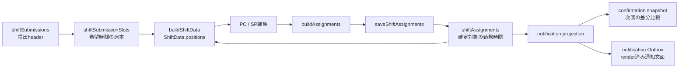

# ShiftForm PC・SP時間編集不具合 実装計画

作成日: 2026-08-08
状態: rollout
対象: 時間入力方式の管理者向けシフト割当、下書き保存、確定通知、既存分割データの互換表示
関連する不具合: PCの完全隣接枠の分割保存、SPの単一区間短縮時の旧範囲残存、SPの複数区間編集
方針改訂: 2026-08-08。既存DBを一括補正するmigrationと専用readinessは行わず、read-time正規化と再保存時の収束を採用する。
実装完了: 2026-08-08。PC・SP、canonical writer、互換read、通知rolling互換、テスト、現行文書まで完了した。未完了条件はdeploy後canaryだけである。

## 1. 結論

時間入力方式のShiftFormには、原因の異なる二つの不具合がある。

PCでは、スタッフの希望から作った割当バーと管理者が追加したバーが同じ時間として連続していても、デフォルトポジションのIDが異なるため、フロント内部と`shiftAssignments`で二つの区間として残る。
PC画面は境界を目立たせないため一本に見えるが、SP画面と確定通知は区間の分割を表示する。

SPでは、開始・終了フォームの確定処理が既存区間の置換ではなく、PCドラッグ用の塗り足し処理を呼んでいる。
既存`12:00–14:00`を`12:00–13:00`へ短縮すると、新しい`12:00–13:00`と旧末尾`13:00–14:00`が残る。

二つの修正を同時に設計し、SPの置換処理を先に直す。
デフォルトポジションIDの統一や連続区間の正規化だけを先に入れると、SPで短縮した二本が`12:00–14:00`へ再結合され、操作が反映されない状態になるためである。

既存DBの分割行は一括変更しない。  画面と通知は読み込み時に正規化し、管理者が既存募集を再保存した場合だけ、その募集の`shiftAssignments`が保存境界で正規形へ収束する。

## 2. 調査範囲

調査では、管理者の編集状態が保存と通知へ渡るまでを追った。



| データ | この機能での責務 | 通知時間の直接の入力か |
|---|---|---|
| `shiftSubmissions` | スタッフ、募集、提出状態などのheader | いいえ |
| `shiftSubmissionSlots` | スタッフが提出した希望時間の原本 | いいえ |
| `shiftAssignments` | 管理者が編集・保存した確定対象の勤務時間 | はい |
| `shiftConfirmationSnapshots` | 確定または再通知時点の割当比較記録 | `shiftAssignments`から作る |
| `notificationOutbox` | 同じ割当projectionから作るrender済みの配送payload | 配送時はこのpayloadを使う |

ShiftFormは、下書きが未保存のセルでは希望時間を割当バーの初期値として使う。
管理者が時間を変更しても、希望の原本である`requestedTime`と`requestedTimes`は変更しない。

## 3. 確認した不具合

### 3.1 PCで連続区間が分割される

希望から作るバーは、店舗の実デフォルトポジションIDを使う。
PCでポジション未選択のまま追加するバーは、仮想ID`default`を使う。

連続バーの統合は`positionId`の完全一致を条件にしている。
そのため、見た目と意味が同じデフォルトポジションでもIDが異なれば統合されない。

保存payloadは各バーを一件ずつ割当に変換する。
サーバーは省略された仮想デフォルトを実IDへ解決するが、解決後に区間を統合せず、それぞれを`shiftAssignments`へinsertする。

通知は`shiftAssignments`を読み、同日の複数区間を` / `で連結する。
この流れにより、`11:30–12:30`と`12:30–19:30`が通知でも二つに分かれる。

### 3.2 SPで短縮後の旧末尾が残る

SPの開始・終了フォームは、確定時に`paintPosition`を呼ぶ。
`paintPosition`は、ドラッグで塗った範囲を追加し、塗られていない既存範囲を残すための処理である。

次の結果は`paintPosition`の契約どおりだが、単一範囲フォームの契約とは一致しない。

| 状態 | 区間 |
|---|---|
| 変更前 | `12:00–14:00` |
| SPで選択 | `12:00–13:00` |
| 新しく追加される区間 | `12:00–13:00` |
| 残る旧末尾 | `13:00–14:00` |

新旧バーのポジションIDが異なる場合は二本として表示される。
ポジションIDを統一した場合は正規化で`12:00–14:00`へ戻るため、短縮操作そのものが無効になる。

PCは既存バーの端を`resizePosition`で変更しているため、同じ問題は発生しない。

### 3.3 SPの単一範囲フォームは複数区間を表現できない

SPフォームは、複数の勤務区間がある場合も最初の開始から最後の終了までを一組の入力として表示する。
この状態で確定すると、`12:00–13:00 / 14:00–15:00`の空白や異なるポジションの境界を失う。

一組の開始・終了だけでは、どの区間を変更するかを特定できない。
複数区間を単一区間へ暗黙に変換する修正は採用しない。

## 4. 修正後の不変条件

### 4.1 連続区間の保存契約

時間入力方式では、次の条件をすべて満たす区間だけを一件へ統合する。

- `staffId`が同じ
- `date`が同じ
- 実IDへ解決した`positionId`が同じ
- `shiftTypeOptionId`を持たない時間入力方式の区間である
- 前の`endTime`と次の`startTime`が完全一致する

重複区間は統合前のvalidationで拒否する。
正の空白、異なるポジション、異なる日付、勤務区分方式の区間は統合しない。
時刻を分へ変換できない入力も統合せず、validation errorとしてfail closedにする。

### 4.2 SPの編集契約

SPの時間フォームは、勤務区間数に応じて三つの状態を持つ。

| 勤務区間数 | 操作 | 更新結果 |
|---:|---|---|
| 0 | 新規追加 | 実デフォルトポジションで一件作る |
| 1 | 開始・終了を変更 | 既存セグメントの時間を置換し、一件のまま保持する |
| 2以上 | 詳細確認 | 単一範囲フォームでの確定を許可せず、PC版からの編集を案内する |

一件を編集するときは、既存セグメントID、ポジションID、名前、色を維持する。
新規追加だけが、店舗の実デフォルトポジションを選ぶ。

`requestedTime`、`requestedTimes`、`requestedShiftTypeOptionIds`は変更しない。
希望を示す点線は提出時刻のまま残し、割当を示す実線だけを変更後の時刻にする。

### 4.3 代表ケース

| ケース | 画面状態 | DB | 通知 |
|---|---|---|---|
| 希望`11:30–12:30`と管理者追加`12:30–19:30` | 一本 | `11:30–19:30`の一件 | `11:30–19:30` |
| `12:00–13:00`と`14:00–15:00` | 空白を挟む二本 | 二件 | `12:00–13:00 / 14:00–15:00` |
| `12:00–13:00`と別ポジションの`13:00–14:00` | 境界を持つ二本 | 二件 | 二区間 |
| SPで`12:00–14:00`を`12:00–13:00`へ短縮 | 一本 | `12:00–13:00`の一件 | `12:00–13:00` |
| SPで複数区間のセルを開く | 既存区間と案内を表示 | 変更なし | 変更なし |
| 重複した不正入力 | validation error | 保存しない | 通知しない |
| 開始と終了が同じ | validation error | 保存しない | 通知しない |

## 5. 実装方針

### 5.1 実デフォルトポジションをフロントへ伝える

`PositionType`へ`isDefault`を保持し、ShiftBoardのcontrollerでConvexの値を落とさない。
実デフォルトポジションは`isDefault`、既存互換の仮想ID、先頭ポジション、`DEFAULT_POSITION`の順で解決する。

PCの新規ドラッグとSPの新規追加は、取得済みなら実デフォルトポジションIDを使う。
仮想ID`default`は、ポジションが取得できない互換fallbackに限定する。

### 5.2 SPの確定処理を置換へ変える

SPの確定処理から`paintPosition`と`normalizePositions`を外す。
勤務区間を既存表示契約と同じID・名前判定でBREAK以外へ絞り、0件なら新規作成、1件なら既存セグメントの時刻置換、2件以上なら更新不可と判定する。

一件の置換は既存の`sp/DailyView/script.ts`にfeature-localな純粋処理として分け、0件・1件・複数件をdiscriminated resultで返す。
この処理は、既存Shiftを展開して対象セグメントの`start`と`end`だけを変更し、派生BREAK、旧前半、旧末尾は結果へ残さない。
初期時刻もBREAKを除いた勤務区間だけから計算する。

複数区間では入力欄を編集可能として表示しない。
現在の各時間帯を確認できる状態とし、「複数の勤務時間はスマートフォンでは編集できません。PC版のシフト表から変更してください。」と次の行動を表示する。

全削除を残す場合は、複数区間をすべて削除することを操作名と周辺文言で明示する。

### 5.3 フロントの読み込みとpayloadを正規化する

時間入力方式専用の純粋処理で、完全に隣接する同一ポジション区間だけを統合する。
既存の`mergeAdjacentPositions`は重複も統合するため、保存契約へそのまま流用しない。

`buildShiftData`は、既存の分割済み割当を画面状態へ変換するときに同じ正規化を使う。
`buildAssignments`は、BREAK除外、仮想デフォルトIDの実ID化、完全隣接区間の統合、payload化の順で処理する。

保存前validation、warning、dirty判定、下書き保存、確定保存は同じcanonical payloadを使う。
画面の判定対象とサーバーへ送る内容を一致させる。

### 5.4 サーバーの保存境界で正規形を保証する

`saveShiftAssignments`は、受信した生の割当を先に既存validationへ通す。
これにより、重複入力を正規化で隠さない。
時間入力方式へ`shiftTypeOptionId`を付けたpayloadも提出方式との不整合として拒否する。

validation後にスタッフとポジションの所属・削除状態を検証し、省略されたポジションを店舗の実デフォルトIDへ解決する。
時間入力方式だけを対象に完全隣接区間を統合し、正規化後の配列で一募集分を全置換する。

同じ純粋な正規化処理を、ShiftBoard、確定シフト閲覧、通知のread projectionでも使う。
既存DBの行を書き換えなくても、新しい画面と通知へ表現上の分割を出さない。

### 5.5 確定通知を勤務内容で比較する

既存のsnapshot signature生成方式と、raw配列の整列・signature整合性を検証するhelperは変更しない。
別の時間入力方式専用semantic canonicalizerを追加し、新規snapshotの割当配列、通知ラベル、再通知の勤務内容比較に使う。

保存済みsnapshotは、最初に従来方式でraw assignmentsとsignatureの整合性を検証する。
検証に成功した後、保存済みassignmentsと現在値の両方をsemantic canonicalizeして比較し、分割と統合だけの差では再通知しない。
新規snapshotは、サーバーがcanonicalizeした配列と、既存方式でその配列から再計算したsignatureを保存する。
signatureが壊れたsnapshotは同値判定へ使わず、安全側で再通知対象として扱う。

新しい`signatureVersion` fieldは追加しない。
旧snapshotはraw assignmentsから従来signatureを検証でき、新snapshotも同じsignature方式を使えるため、schema変更を増やす必要がない。

既存のOutboxは、render済みpayload、dedupe key、fanout operation、provider idempotency keyを変更しない。
デプロイ前に作られたジョブは、その内容のまま完走または既存のsupersede判定へ進める。
operation version、dedupe key、provider idempotency keyの生成方式も変更しない。

### 5.6 既存の分割済み割当は読み込みで吸収する

`shiftAssignments`のschemaは変更せず、m041、専用runner、専用readiness queryは追加しない。  既存DBの分割行を一括でpatchまたは削除するmigrationも実行しない。

ShiftBoard、確定シフト閲覧、通知projectionは、時間入力方式の完全隣接行をread-timeで正規化する。  そのため、既存行を変更しなくても画面と新しく作る通知は一つの連続時間として扱う。  作成済みOutboxのrender済みpayloadは書き換えない。

`saveShiftAssignments`は一募集分を全置換するため、管理者が既存募集を再保存した場合だけ、その募集の安全に統合できる行がDBでも正規形へ収束する。  閲覧または通知生成だけでDBの行は変更しない。

## 6. 既存データの復旧限界

PC起因の完全隣接行は、read-time正規化により、DBを書き換えずに画面と新しい通知で一件として扱える。

SP短縮バグで作られた`12:00–13:00`と`13:00–14:00`から、管理者が本来`13:00`で終了させたかったことは復元できない。
DBには新しい区間と消すべき旧末尾を区別する情報がないためである。

読み込み時は現在保存されている勤務時間の和集合である`12:00–14:00`として表示するが、本来の短縮時刻を推測して自動削除しない。  影響を受けたシフトは、必要に応じて管理者が希望原本と照合し、正しい時刻へ再編集・再保存する。

閲覧だけではDBは変わらない。  再保存した募集だけがDBでも収束し、一括復旧の対象一覧、readiness、migration実行記録は作らない。

## 7. Security Lens

| 項目 | 契約 |
|---|---|
| Actor | 対象店舗のシフト編集権限を持つ管理者、旧版を含むbrowser client、確定通知worker |
| Asset | 保存済み割当、希望原本、正しい通知対象と通知時間、Outboxの重複排除 |
| Trust boundary | ShiftFormからmanager mutation、Convex DB、fanout、Outbox、providerまで |
| Abuse case | clientが不正な重複時間、time方式のoption ID、他店舗のposition IDを送り、正規化でvalidationや所属検証を回避する。表現差だけで再通知を増やす |
| Server-side enforcement | 生payloadのvalidation、提出方式とoptionの整合性、staff・position・shopの所属確認、削除状態確認、正規化後だけの保存 |
| Rate limit / idempotency | 既存のfanout operation、Outbox dedupe、provider idempotency keyを維持する |
| Lifecycle / recovery | 旧raw snapshotと新canonical snapshotを同じsignature方式で検証し、既存Outboxと既存DB行を読み込みだけで書き換えない。DBの収束は管理者の再保存に限定する |
| Logs / PII | 既存データの一括抽出・一覧化を行わず、スタッフ名、メール、勤務時刻、raw通知payloadを新たなlogへ出さない |
| Regression test | 表現差だけの再通知0件、不正入力のDB・scheduler・Outbox副作用0件、旧Outbox重複0件を完全一致で検証する |

## 8. テスト計画

### 8.1 Frontend Logic Test

デフォルトポジション解決、SP単一区間置換、読み込み正規化、保存payload正規化を主担当とする。

- デフォルトポジションが配列の先頭でなくても解決できる
- 既存`12:00–14:00`を`12:00–13:00`へ変更すると一件だけ残る
- 開始側の短縮、両端変更、範囲移動、延長でも旧範囲が残らない
- 既存セグメントIDと非defaultポジション情報を維持する
- `requestedTime`、`requestedTimes`、`requestedShiftTypeOptionIds`とShiftのidentityを維持する
- BREAKだけなら0勤務区間として実デフォルトポジションの一件を作る
- gapあり、隣接別ポジションを含む複数区間はunsupported resultになり、入力を作り替えない
- 仮想デフォルトと実デフォルトの完全隣接区間を一件へ変換する
- 正の空白、別ポジション、勤務区分方式を統合しない

### 8.2 Storybook Behavior TestとVRT

SPのフォーム接続はBehavior Testで確認する。

- 終了時刻を短縮して確定すると、`onShiftUpdate`が一件の短縮済み区間で一度だけ呼ばれる
- 複数区間では各時間帯と案内を表示して確定を無効化し、更新callbackを呼ばない
- 複数区間の明示的な全削除は、確認できる文言のまま全件削除callbackを呼ぶ
- 新規追加では実デフォルトポジションを使う

複数区間向け案内はモバイルStoryへ追加する。
静的な見た目はVRT、操作後のcallbackと状態はBehavior Testへ分ける。
VRTは既定のCI確認に任せ、ローカル実行を完了条件にしない。

### 8.3 Convex Function Test

`saveShiftAssignments`と通知query・mutationの単一API契約を確認する。

- 省略defaultと実defaultの完全隣接区間を一行で保存する
- 正の空白、別position、勤務区分方式を複数行のまま保存する
- overlap、時刻順序違反、他店舗positionを拒否し、DB副作用を0件にする
- 既存分割DBから通知時間を一つの範囲として返す
- 空白勤務は通知の` / `を維持する
- 旧raw snapshotのsignatureを従来方式で検証し、新規保存はcanonical assignmentsと既存signature方式へ揃える
- 壊れたsignatureを同値扱いせず、安全側で再通知対象にする

### 8.4 Convex Scenario Test

保存、確定、再通知、Outboxまでの業務フローを確認する。

- 旧split snapshotと新merged currentの差だけなら`no_changes`になる
- 実時刻を変更したスタッフだけを再通知対象にする
- 未配送スタッフは意味が同じでも対象にする
- scheduler、fanout operation、Outboxの対象と件数が完全一致する
- 既存Outboxを重複作成しない

### 8.5 実行する検証

対象testを先に実行し、最後に次を実行する。

```bash
pnpm lint
pnpm type-check
pnpm test
pnpm build
```

E2Eは追加しない。
時間計算、component callback、Convex保存、通知workflowをそれぞれ下位の主担当層で検証でき、実ブラウザと実backendの接続だけに固有の新しい失敗境界がないためである。

## 9. 実装順序

### Phase 1: SPの置換処理とデフォルトID

- SP単一区間編集を置換へ変更する
- 複数区間の編集制限と案内を追加する
- PC・SPの新規区間へ実デフォルトポジションを使う
- Frontend Logic TestとBehavior Testを追加する

### Phase 2: canonical readとwriter

- フロントの読み込みとpayloadを正規化する
- Convexの生payload validation後に正規化して保存する
- ShiftBoardと確定シフト閲覧へcompatibility readを入れる
- Logic TestとFunction Testを追加する

### Phase 3: 通知互換

- 通知時間とsnapshot assignmentsを意味正規化する
- 既存signature方式のまま旧raw・新canonical snapshotを互換検証する
- 再通知判定をcanonical assignmentsの比較へ変更する
- 既存Outboxの不変条件をScenario Testで固定する

### Phase 4: 現行文書

- 実装完了時に[シフト表](../features/shift-board.md)へPC・SPの現在契約を反映する
- [希望シフト提出](../features/shift-submission.md)へ希望原本と確定割当の保存責務、確定閲覧の連続区間表示を反映する
- 通知互換を変更したら[通知配送outbox](../features/notification-outbox.md)へsnapshotとrolling互換を反映する
- 既存DBを一括変更しないこと、読み込みだけではDBが変わらないこと、再保存した募集だけが収束することを現行文書に明記する
- コード、テスト、現行文書が完了した後も、deploy後canaryが残る間は本計画を`Active / rollout`に置く

## 10. Rolloutとrollback

### 10.1 Rollout

旧フロントは、SP確定時の置換意図をserverへ伝えられない。
Convex側だけを先に直しても、旧SPでは短縮が元の時間へ再結合される。

deploy後のcanaryでは、新しいフロントが読み込まれていることを確認してからSP短縮を試す。
キャッシュされた旧画面ではreloadを案内する。

既に表現差だけの再通知operationが作成されている場合、そのpayloadは書き換えない。
該当通知を一件も許容できないreleaseでは、既存fanoutをdrainしてから通知互換を切り替える。

### 10.2 Rollback

一括migrationを実行しないため、rollback時に既存DB全体を戻す操作はない。  新版で再保存した募集は既に正規形で保存されているため、機械的に旧二行形式へ戻さない。

SP短縮バグで失われた編集意図は既存DBに存在しないため、必要な募集は管理者が希望原本と照合して再確認する。

互換readと旧raw・新canonical snapshotの検証は、pending actionと旧Outboxがdrainするまで削除しない。

## 11. 対象ファイル

### Frontend

- `src/domains/shift/types.ts`
- `src/domains/shift/date.ts`
- `src/domains/shift/buildAssignments.ts`
- `src/domains/shift/operations.ts`
- `src/components/features/Shift/ShiftForm/stores.ts`
- `src/components/features/ShiftBoard/ShiftBoardPage/buildShiftData.ts`
- `src/components/features/ShiftBoard/ShiftBoardPage/useShiftBoardPageController.ts`
- `src/components/features/ShiftBoard/ShiftBoardPage/warningVisibility.ts`
- `src/components/features/Shift/ShiftForm/pc/DailyView/hooks/useDrag.ts`
- `src/components/features/Shift/ShiftForm/sp/DailyView/ShiftEditSheet.tsx`
- `src/components/features/Shift/ShiftForm/sp/DailyView/script.ts`
- `src/components/features/Shift/ShiftForm/sp/DailyView/ShiftEditSheet.stories.tsx`

### Convex

- `convex/shiftBoard/mutations.ts`
- `convex/shiftBoard/queries.ts`
- `convex/shiftView/queries.ts`
- `convex/_lib/shiftAssignmentNormalization.ts`
- `convex/notification/confirmationSnapshots.ts`
- `convex/notification/queries.ts`
- `convex/notification/mutations.ts`
- `convex/notificationOutbox/mutations.ts`

### Tests and docs

- `src/domains/shift/buildAssignments.test.ts`
- `src/domains/shift/date.test.ts`
- `src/domains/shift/operations.test.ts`
- `src/components/features/ShiftBoard/ShiftBoardPage/buildShiftData.test.ts`
- `src/components/features/ShiftBoard/ShiftBoardPage/warningVisibility.test.ts`
- `src/components/features/Shift/ShiftForm/stores.test.ts`
- `src/components/features/Shift/ShiftForm/sp/DailyView/script.test.ts`
- `convex/_lib/shiftAssignmentNormalization.test.ts`
- `convex/shiftBoard/queries.test.ts`
- `convex/shiftBoard/mutations.test.ts`
- `convex/shiftView/queries.test.ts`
- `convex/notification/confirmationSnapshots.test.ts`
- `convex/notification/queries.test.ts`
- `convex/notification/mutations.test.ts`
- `convex/notificationOutbox/mutations.test.ts`
- `convex/_scenario/shiftBoardConfirmation.test.ts`
- `doc/features/shift-board.md`
- `doc/features/shift-submission.md`
- `doc/features/notification-outbox.md`
- `doc/plans/INDEX.md`

実装時は、feature-localな純粋処理と共通normalizerを上記の近接ディレクトリへ追加する。
新しい汎用service、registry、table、job、cronは追加しない。

## 12. 対象外

- スタッフが提出した希望原本の変更
- SPで複数区間を個別編集する新しい多枠フォーム
- 異なるポジション間を一つへ統合する仕様変更
- 勤務区分方式の区間統合
- 既存の誤保存データから管理者の短縮意図を推測する処理
- notification providerやOutbox state machineの再設計
- schema fieldとtableの追加
- 既存DBを一括補正するmigration、専用runner、専用readiness

## 13. 完了条件

- PCで同一デフォルトポジションの連続時間が一つの画面区間になる
- PCの連続時間が`shiftAssignments`へ一件で保存される
- SPで単一区間を短縮・延長しても旧前半・旧末尾が残らない
- SPの複数区間を単一区間へ暗黙変換しない
- 正の空白を持つ勤務を画面、DB、通知で二区間のまま保持する
- 分割と統合だけの差で再通知しない
- 実時間の変更と未配送だけを従来の条件どおり再通知する
- 既存Outbox、dedupe、provider idempotencyを維持する
- 既存DBは閲覧・通知生成だけで書き換えず、一括migrationも実行しない
- 既存募集を再保存した場合だけ、その募集の安全に統合できる行がDBで正規形へ収束する
- 対象test、`pnpm lint`、`pnpm type-check`、`pnpm test`、`pnpm build`が成功する
- [シフト表](../features/shift-board.md)と[通知配送outbox](../features/notification-outbox.md)を実装後の現在仕様へ更新する
- [希望シフト提出](../features/shift-submission.md)へ希望原本、確定割当、確定閲覧の現在契約を反映する

## 14. 参考にしたファイル

- `src/components/features/Shift/ShiftForm/sp/DailyView/ShiftEditSheet.tsx`
- `src/components/features/Shift/ShiftForm/sp/DailyView/script.ts`
- `src/components/features/Shift/ShiftForm/stores.ts`
- `src/components/features/Shift/ShiftForm/pc/DailyView/hooks/useDrag.ts`
- `src/domains/shift/operations.ts`
- `src/domains/shift/buildAssignments.ts`
- `src/components/features/ShiftBoard/ShiftBoardPage/buildShiftData.ts`
- `src/components/features/ShiftBoard/ShiftBoardPage/useShiftBoardPageController.ts`
- `convex/shiftBoard/mutations.ts`
- `convex/shiftBoard/queries.ts`
- `convex/shiftView/queries.ts`
- `convex/notification/confirmationSnapshots.ts`
- `convex/notification/queries.ts`
- `convex/notificationOutbox/mutations.ts`
- `doc/features/shift-board.md`
- `doc/features/shift-submission.md`
- `doc/features/notification-outbox.md`
- `doc/rules/frontend-architecture.md`
- `doc/rules/ui-design.md`
- `doc/rules/convex-design-strategy.md`
- `doc/rules/security-strategy.md`
- `doc/rules/testing-strategy.md`

## 15. 実行用ゴールプロンプト

```text
/Users/natani/work/yps-crispy-carnival の現在のcheckoutで、doc/plans/2026-08-08_ShiftForm_PC_SP時間編集不具合_実装計画.mdを実装してください。

PCの完全隣接枠が内部とDBで分割される不具合と、SPの単一区間短縮で旧前半・旧末尾が残る不具合を、計画書の不変条件、実装順、通知互換、テスト契約に従って修正してください。

SPの置換処理を、連続区間の正規化より先に実装してください。
時間入力方式だけを対象にし、完全隣接する同一スタッフ・同一日・同一実positionだけを統合してください。
正の空白、異なるposition、勤務区分方式は統合せず、overlapは正規化前のvalidationで拒否してください。

SPでは、勤務区間0件を新規追加、1件を既存セグメントの時刻置換、2件以上を編集不可として扱ってください。
希望原本と既存position metadataを維持し、複数区間にはPC版から編集する案内を表示してください。

通知snapshotはraw assignmentsと既存signatureの整合性を先に検証し、保存済み・現在値の双方を意味正規化して比較してください。
signature生成方式は変えず、旧raw snapshotと新canonical snapshotをrolling互換で扱い、壊れたsignatureは安全側で再通知対象にしてください。
既存Outboxのpayload、dedupe key、fanout operation、provider idempotency keyは変更しないでください。

既存DBの分割行は一括補正しないでください。  m041、専用migration runner、専用readinessは追加せず、既に追加済みなら削除してください。
画面と通知は時間入力方式の完全隣接行をread-timeで正規化し、読み込みだけでDBを書き換えないでください。
既存募集を管理者が再保存した場合だけ、その募集の割当がcanonical writerの全置換でDBでも収束する契約にしてください。

Frontend Logic、Storybook Behavior、Convex Function、Convex Scenario Testを計画書の責務分担どおり追加してください。
対象testの後にpnpm lint、pnpm type-check、pnpm test、pnpm buildを実行し、機能文書と本計画を更新してください。
実装後は独立レビューを行い、指摘を修正して再検証してください。

新しいbranchやworktreeを作らず、依頼外の既存変更をrevert、削除、stageしないでください。
今回の変更だけを目的別にcommitし、現在のbranchをforceなしでpushしてください。  PRは作成しないでください。
Convex、Vite、Storybookの開発サーバーを新規起動せず、generated filesとpnpm-lock.yamlを手動編集しないでください。

最後に、変更ファイル、PC・SPの保存契約、読み込みと再保存の契約、テスト結果、独立レビュー結果、commitとpush、未実行項目を日本語で報告してください。
```
