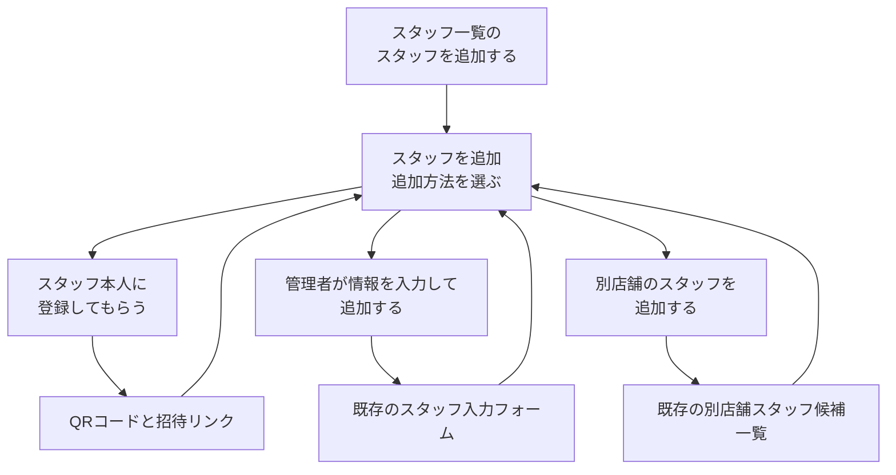

# スタッフ追加モーダルの方法選択UI 実装計画

作成日: 2026-08-10  
実装完了日: 2026-08-11  
状態: implemented  
対象: Dashboardのスタッフ追加導線、スタッフ追加ダイアログ、関連するFrontend Unit Test、Storybook、機能文書

## 1. 結論

Dashboardのスタッフ追加ダイアログは、3つのタブを並べる構造から、最初に追加方法をカードで選ぶ構造へ変更する。

カードを選ぶと、同じダイアログ内で現在の各タブ内容に相当する詳細画面へ進む。
新しいダイアログやStepperは追加しない。

変更はfrontendの表示、状態管理、文言、テスト、機能文書に限定する。
既存のConvex public API、認可、schema、登録token、通知処理は変更しない。

## 2. 利用者のタスク

主な利用者は、選択中の店舗へスタッフを追加できるシフト作成担当者である。

最初のタスクは「どの追加方法を使うか決める」ことである。
QRコード、手入力、別店舗所属という内部の分類を同時に操作させず、目的を表すカードから詳細へ進める。

完了条件は、次のいずれかである。

- スタッフ本人へ登録用QRコードまたはリンクを共有できる
- 管理者がスタッフ情報を入力して追加できる
- 同じグループの別店舗にいるスタッフを現在の店舗へ追加できる

## 3. 現在の実装

| 対象 | 現在の挙動 | 変更理由 |
|---|---|---|
| `StaffInvitationDialog.tsx` | 「リンクから招待」「管理者が登録」「他店舗スタッフを招待」の3タブを表示する | 追加したい目的より、UI上の分類が先に見える |
| `useStaffInvitation.ts` | ダイアログを開いた時点で登録リンクを取得する | 本人登録を選ばない場合もmutationが実行される |
| `StaffRegistrationLinkPanel/index.tsx` | URLがない状態をすべてSkeletonとして表示する | 読み込み失敗後もLoadingに見え、利用者が復旧できない |
| `OrganizationPeopleCandidateList.tsx` | 他店舗タブを選んだ間だけ候補queryを開始する | 遅延開始の契約は新しいカード遷移でも維持する必要がある |
| `StaffManagementView.tsx` | ダイアログを閉じると遅延読込したsubtreeをunmountする | 同じopen中の入力保持と、再open時のresetを両立できる |
| `StaffRoster/index.tsx` | 入口を「スタッフを招待する」と表示する | 手入力と他店舗追加も含むため「追加」のほうが操作全体を表す |

## 4. 変更後の画面遷移



詳細画面からTOPへ戻る操作は、本文上部の「追加方法に戻る」に統一する。

閉じるボタン、Escape、ダイアログ外の操作、ブラウザバックは、TOPへ戻るのではなくダイアログ全体を閉じる。
追加mutationの実行中は、既存どおり閉じる操作と経路変更を禁止する。

## 5. UI契約

### 5.1 ダイアログと入口

| 要素 | 文言 |
|---|---|
| スタッフ一覧のボタン | スタッフを追加する |
| ダイアログタイトル | スタッフを追加 |
| TOPの案内 | 追加方法を選んでください |
| 詳細から戻る操作 | 追加方法に戻る |

閲覧専用店舗では、入口をdisabledのまま維持する。
説明は「閲覧のみの店舗ではスタッフを追加できません」に変更する。

### 5.2 追加方法カード

| state key | カード名 | 説明 | 遷移先 | 表示条件 |
|---|---|---|---|---|
| `link` | スタッフ本人に登録してもらう | QRコードや招待リンクを共有し、スタッフ本人に登録を依頼します。 | 既存のQRコード・リンク表示 | 常に表示 |
| `manual` | 管理者が情報を入力して追加する | 氏名とメールアドレスを入力し、管理者がスタッフを直接追加します。 | 既存の`AddStaffForm` | 常に表示 |
| `organization` | 別店舗のスタッフを追加する | 別の店舗に登録済みのスタッフを、この店舗にも追加します。 | 既存の候補一覧 | `showOrganizationPeopleAddition`がtrueの場合だけ表示 |

優先順位は並び順で示し、「おすすめ」badgeは追加しない。

各カードは全体が一つの実`button`となるように実装する。
カード内へ別のbuttonやlinkを入れない。

カード面はwhite、gray、blackAlpha、既存の中立semantic tokenを使う。
低階調tealはアイコンの背景fillに限り、カードrootの通常、hover、active背景には使わない。
focus ringは`teal.500`以上を使う。

モバイルではカードを一列に並べ、見出し、説明、アイコン、遷移を示すchevronが狭い幅でも重ならないようにする。

### 5.3 詳細画面

詳細画面には、次の順で要素を置く。

1. 「追加方法に戻る」
2. 選択した方法名の見出し
3. 現在のタブ内容に相当する既存panel

本人登録では、現在のQRコード、招待リンク、説明を維持する。
footerは現在と同じ「閉じる」とする。

管理者入力では、現在の人数上限案内、`AddStaffForm`、footerの「閉じる」「スタッフを登録する」を維持する。

別店舗スタッフでは、現在の候補一覧、Loading、Empty、Error、追加中表示を維持する。
footerを非表示にする現在の構成も維持し、本文上部の戻る操作と右上の閉じる操作を使う。

削除済み人物の再追加確認ダイアログは変更しない。

## 6. 状態契約

新しい汎用state machineは作らない。
既存hookへ`selectedMethod: "link" | "manual" | "organization" | null`を持たせ、既存の処理中stateと組み合わせる。

| 状態 | 表示 | 開始する処理 | 許可する操作 |
|---|---|---|---|
| ダイアログclosed | なし | なし | 入口からopen |
| `selectedMethod === null` | 追加方法カード | なし | カード選択、閉じる |
| `link`かつ初回Loading | QR・リンクのSkeleton | `ensureShopRegistrationLink`を一度開始 | TOPへ戻る、閉じる |
| `link`かつSuccess | QRコードとリンク | なし | コピー、TOPへ戻る、閉じる |
| `link`かつError | 固定のエラー文と再試行 | 再試行時だけ同じmutationを開始 | 再試行、TOPへ戻る、閉じる |
| `manual` | 手入力フォーム | submitまでなし | 入力、TOPへ戻る、閉じる、submit |
| `organization` | 候補一覧 | 候補queryを開始 | 候補追加、TOPへ戻る、閉じる |
| staff追加mutation中 | 選択中の詳細 | 既存mutationだけ継続 | 経路変更とcloseを禁止 |

### 6.1 openとclose

open時は`selectedMethod`を`null`へ戻し、登録URL、登録URLのエラー、人数上限案内、選択中の組織人物、再追加候補をresetする。
openしただけでは`ensureShopRegistrationLink`を呼ばない。

close時はダイアログsubtreeをunmountする。
再open時はTOPと未入力フォームから始める。

登録URLの非同期結果は、開始したダイアログsessionが古くなった場合に現在のUIへ反映しない。
raw errorはstate、Toast、logへ渡さず、固定の局所エラーへ変換する。

### 6.2 TOPと詳細の切替

本人登録カードの明示click後にだけ登録URLを取得する。
同じopen中に取得済みであれば、TOPから再度進んでもmutationを繰り返さない。

手入力フォームはダイアログが開いている間だけmountを維持し、非選択時は`hidden`で操作とアクセシビリティツリーから外す。
これにより、TOPや別の方法へ移動して戻っても、入力値とクライアント側validationを保持する。

人数上限などsubmit結果に対応するserver alertは、手入力詳細を離れるときにclearする。
alertが示す入力時点と現在の入力内容が食い違うことを防ぐためである。

別店舗候補一覧は`organization`を選んでいる間だけmountする。
TOPへ戻るとquery subtreeをunmountし、再選択時に取得を再開する。

`showOrganizationPeopleAddition`がfalseへ変わった場合は、カードを消し、表示中ならTOPへ戻す。
古いcallbackから`organization`を選択または追加しようとしても、既存のref guardで拒否する。

### 6.3 Loading、Error、Empty、Success

登録URLの取得失敗は「招待リンクを読み込めませんでした。もう一度お試しください。」と表示し、「もう一度読み込む」を提供する。
URLがないだけで永続的なSkeletonを表示しない。

別店舗候補のError Boundaryは、「追加方法に戻って、もう一度お試しください。」と案内する。
TOPへ戻って再選択するとquery subtreeが再作成される。

別店舗候補が0件の場合は、現在の「追加できるスタッフはいません」を維持する。
別の方法を使う場合は、共通の「追加方法に戻る」から選び直せる。

追加成功後のダイアログclose、Toast、通知予約は現在の動作を維持する。

## 7. フォーカスとアクセシビリティ

ダイアログを開いた直後は、先頭の方法カードを最初の操作対象にする。

カードを選択した後は、詳細画面の方法名見出しへfocusを移す。
見出しには必要に応じて`tabIndex={-1}`を設定する。

「追加方法に戻る」を押した後は、選択元のカードへfocusを戻す。
別店舗カードが非表示になった場合は、先頭カードへ戻す。

アイコンとchevronは`aria-hidden`とし、カード名と説明をbuttonのaccessible nameまたはdescriptionとして関連付ける。

追加処理中はdisabled表示だけに頼らず、controllerの同期guardと`Dialog`の`preventClose`を併用する。
このfeatureのために共通`Dialog` APIは変更しない。

## 8. 実装対象

| ファイル | 変更内容 |
|---|---|
| `src/components/features/Dashboard/StaffManagement/StaffInvitationDialog.tsx` | `Tabs`を撤去し、TOPカード、詳細見出し、戻る操作、panel表示、focus制御を実装する |
| `src/components/features/Dashboard/StaffManagement/useStaffInvitation.ts` | `activeTab`を`selectedMethod`へ置換し、URLの遅延取得、局所Error、retry、session guard、戻るguardを実装する |
| `src/components/features/Dashboard/StaffRegistrationLinkPanel/index.tsx` | Loading、Error、Successを分離し、retry UIを追加する。Story専用の`manualEntryAction`を削除する |
| `src/components/features/Dashboard/StaffManagement/OrganizationPeopleCandidateList.tsx` | query開始条件を新しいmethod stateへ接続し、Error文を更新する |
| `src/components/features/Dashboard/StaffManagement/StaffManagementView.tsx` | 遅延Dialogのタイトルを「スタッフを追加」へ変更する |
| `src/components/features/Dashboard/StaffRoster/index.tsx` | 入口と閲覧専用説明を「追加」へ統一する |
| 関連するtestとStory | タブ操作をカード遷移へ置換し、新しい状態契約を検証する |
| `doc/features/staff-registration.md` | 3タブの説明を「方法選択TOPから詳細へ進む」仕様へ更新する |
| `src/components/features/HowToSite/content/add-staff.mdx` | 入口名と追加方法を現行UIへ合わせる |
| `src/components/features/FaqSite/content/add-staff.mdx` | 入口名と、別店舗カードの表示条件を含む説明へ合わせる |

新しい汎用カードcomponent、Dialog wrapper、registry、global stateは追加しない。
方法カードの描画は`StaffInvitationDialog.tsx`内の業務上の意味を持つ局所componentまたは局所関数に留める。

HowTo本文を実装時に変更する際は、`src/components/features/HowToSite/AGENTS.md`を読み、`write-help-content`を使う。

## 9. Security Lens

| 項目 | 契約 |
|---|---|
| Actor | Clerkで認証され、選択店舗へ書き込めるactiveなシフト作成担当者 |
| Asset | 店舗専用登録URLとtoken、候補者の氏名・メール・所属店舗、staff所属、追加後の案内通知 |
| Trust boundary | Browserのカード選択と入力から、既存のmanager query/mutation、Convex DB、通知予約まで。共有後の登録URLは匿名Capabilityになる |
| Abuse case | 非表示カードや古いhandlerからAPIを直接呼ぶ、別組織の`personId`を送る、連打でstaffや通知を重複させる、URL内tokenや候補者PIIをlogへ出す |
| Server-side enforcement | 既存のmanager wrapperがidentity、active membership、店舗状態、書込可否を検証する。候補queryは同一組織のactive人物へ限定し、追加mutationは`personId`を再取得して同一組織と状態を再検証する |
| Rate limit / idempotency | `ensureShopRegistrationLink`は有効な既存linkを再利用する。追加処理は既存の`useSingleFlight`、同期ref guard、`requestId`、server-side checkを維持する |
| Lifecycle / recovery | URL取得は本人登録カードの明示click後だけ開始する。古いdialog sessionの結果を破棄し、局所Errorから再試行できる。mutation中は戻る、close、別経路開始を禁止する |
| Logs / PII | URL、token、氏名、メール、`personId`を新しいconsole、analytics、文書へ出さない。raw errorを表示せず固定文へ変換する |
| Regression test | openだけではURL mutationを呼ばないこと、カード選択で一度だけ呼ぶこと、retry、feature flag、single-flight、処理中guardをFrontend UnitとBehaviorで確認する |

`showOrganizationPeopleAddition`は表示制御であり、認可境界として扱わない。
APIを直接呼ばれた場合も、既存のserver-side enforcementが成立することを前提とし、その実装は変更しない。

今回確認した範囲に、計画を止めるsecurity blockerはない。

## 10. テスト計画

一つの契約を複数層で重複させず、controllerの開始条件をFrontend Unit、利用者操作をStorybook Behavior、見た目をVRTへ分ける。

### 10.1 Frontend Unit Test

`src/components/features/Dashboard/StaffManagement/useStaffInvitation.test.ts`を更新する。

- openすると`selectedMethod`が`null`になり、URL mutationを呼ばない
- `link`を選ぶとURL mutationを一度だけ呼ぶ
- 同じopen中に取得済みなら、戻って再選択しても再取得しない
- 取得失敗で局所Errorになり、retry成功でURLを表示できる
- 古いdialog sessionのSuccessとErrorを現在のsessionへ反映しない
- staff追加中はTOPへ戻らず、別の方法も選べない
- feature flagがfalseなら`organization`を選べず、表示中の変更ではTOPへ戻る
- 古いhandlerから別店舗追加を呼んでもmutationを実行しない
- 現在の人数上限、再追加確認、single-flight、成功、失敗のテストを維持する

`src/components/features/Dashboard/StaffManagement/OrganizationPeopleCandidateList.test.tsx`を追加する。

- `enabled=false`では`useShopQuery`を開始しない
- `enabled=true`へ変わると候補queryを開始する
- TOPへ戻る条件でquery subtreeがunmountされる

### 10.2 Storybook Behavior Test

`src/components/features/Dashboard/StaffManagement/StaffInvitationDialog.stories.tsx`を更新する。

- TOPから3つの各詳細へ進み、TOPへ戻れる
- 詳細へ進むと見出しへfocusし、戻ると選択元カードへfocusする
- 手入力後にTOPと別の方法を経由しても入力値を保持する
- close後に再openするとTOPと空フォームへresetする
- URL取得Errorからretryできる
- feature flagがfalseなら別店舗カードを表示しない
- 別店舗候補の追加成功で既存どおりcloseする

現在の`TabSwitchBehavior`はカード遷移のBehaviorへ置換する。
`AddStaffForm/index.stories.tsx`に残る本番未使用の旧「QRから手入力へ進む」fixtureと`BackToQrFromManual`は削除し、入力保持契約を所有するDialog Storyへ移す。

`StaffRegistrationLinkPanel/index.stories.tsx`へErrorとretryのStoryまたはBehaviorを追加する。

`StaffRoster/index.stories.tsx`と`DashboardContent/index.stories.tsx`は、入口とDialog名のselectorを追従更新する。
`DashboardContent/index.stories.tsx`には依頼外の未コミット変更があるため、対象selectorだけを局所的に編集する。

### 10.3 VRT

次の代表状態を静的Storyとして維持または追加する。

- 方法選択TOP
- 本人登録のLoading、Error、Success
- 管理者入力
- 別店舗候補のLoading、Empty、Error、候補あり、追加中
- feature flagで別店舗カードがないTOP

desktopに加えて、方法選択TOPと長いカード文言を`vrt-mobile1`で確認する。
VRTはローカルで実行せず、GitHub Actionsの差分確認へ委ねる。

### 10.4 追加しないテスト

Convex public API、認可、永続化、通知処理を変更しないため、Convex Function TestとScenario Testは追加しない。
既存suiteは`pnpm test`で回帰確認する。

実ブラウザとbackendの接続に固有の新しい契約がないため、E2Eは追加しない。

## 11. 実装順序

### Phase 1: controller契約

- `activeTab`を`selectedMethod`へ置換する
- open、方法選択、戻る、close、feature flag変更のstate遷移を実装する
- URLの遅延取得、Error、retry、session guardを実装する
- 対応するFrontend Unit Testを更新する

### Phase 2: 方法選択UI

- タブを撤去し、TOPカードと詳細見出しを追加する
- 既存panelを各詳細へ接続する
- 手入力のmount保持と、別店舗queryの選択中だけのmountを実装する
- focus移動、戻り先focus、mutation中のclose guardを実装する

### Phase 3: 局所Errorと文言

- 登録リンクpanelへErrorとretryを追加する
- 別店舗候補の復旧文を変更する
- Dashboardの入口、遅延Dialog、閲覧専用説明を「スタッフを追加」へ統一する

### Phase 4: Storyと現行文書

- Behavior StoryとVRT Storyを更新する
- 旧タブと旧QR戻り導線を固定するStoryを削除する
- 機能文書、HowTo、FAQを新しい導線へ更新する

### Phase 5: 検証と自己レビュー

- targeted Unit TestとStorybook Behavior Testを実行する
- repoの必須検証を実行する
- 不要なwrapper、二重state、重複する文言、依頼外の変更がないか自己レビューする

## 12. 検証コマンド

対象testを先に実行する。

```bash
pnpm vitest run --project=logic \
  src/components/features/Dashboard/StaffManagement/useStaffInvitation.test.ts \
  src/components/features/Dashboard/StaffManagement/OrganizationPeopleCandidateList.test.tsx

pnpm vitest run --project=ui \
  src/components/features/Dashboard/StaffManagement/StaffInvitationDialog.stories.tsx \
  src/components/features/Dashboard/AddStaffForm/index.stories.tsx \
  src/components/features/Dashboard/StaffRegistrationLinkPanel/index.stories.tsx \
  src/components/features/Dashboard/StaffRoster/index.stories.tsx \
  src/components/features/Dashboard/DashboardContent/index.stories.tsx
```

最後に次を実行する。

```bash
pnpm lint
pnpm type-check
pnpm test
pnpm build
```

`pnpm lint`に含まれる`docs:check`で、計画、機能文書、HowTo、FAQの参照とfrontmatterも確認する。

Vite、Storybook、Convexの開発サーバーは新規起動しない。
AI Agentによるブラウザ手動確認も追加しない。

## 13. 対象外

- Convex schema、index、migration、backfill
- public API、manager wrapper、認可policyの変更
- 登録tokenの形式、TTL、rotation、失効、cleanup
- 匿名登録HTTPのTurnstile、Origin、rate limit、承認フロー
- 通知Outbox、配信内容、再送、provider idempotency
- 削除済み人物の再追加確認フロー
- feature flagをserver-side entitlementへ置き換えること
- 共通Dialog、共通Card、global stateの再設計
- E2Eの新設とローカルVRT

## 14. 完了条件

- ダイアログを開くと、表示可能な追加方法カードだけがTOPへ並ぶ
- TOPを開いただけでは登録URLのmutationと別店舗候補queryを開始しない
- 各カードから対応する既存内容へ進み、共通の戻る操作でTOPへ戻れる
- 同じopen中は手入力値を保持し、close後の再openではresetされる
- URL取得にLoading、Error、retry、Successがあり、永続Skeletonにならない
- 別店舗feature flagの表示変更と古いhandlerを安全に処理できる
- mutation中の戻る、close、別経路開始をUIとcontrollerの両方で禁止する
- keyboard操作、見出しfocus、戻り先focus、モバイル表示が成立する
- 既存の追加成功、人数上限、再追加確認、通知、認可契約を維持する
- Frontend Unit TestとStorybook Behavior Testが成功する
- lint、type-check、test、buildが成功する
- 機能文書、HowTo、FAQが新しい入口と方法選択導線に一致する
- Convex、schema、migration、E2E、共通UI基盤へ変更を広げていない

完了条件を満たしたら、本文の状態を`implemented`へ変更し、`doc/plans/INDEX.md`の行を`History`へ移す。
未完了条件がある場合は`Active`に残し、具体的な残件を索引へ記載する。

## 15. 実装結果

2026-08-11に実装と検証を完了した。

- 3タブを廃止し、利用可能な追加方法を最初にカードで選ぶ構造へ変更した
- 本人登録を選んだ場合だけ登録URLを取得し、同じopen内のcache、局所Error、retry、古いsessionの結果破棄を実装した
- 手入力フォームの同一open内保持とclose後reset、別店舗候補queryの選択中だけのmountを実装した
- 方法選択と詳細間のfocus移動、mutation中の戻る・close・別経路開始のguardを実装した
- 登録URLの非同期Errorを`role="alert"`で通知し、固定文と再試行操作を表示した
- Dashboard、機能文書、HowTo、FAQの入口名と追加方法を現行UIへ合わせた
- Frontend Unit Testは対象2ファイル13件、関連Storybook Behavior Testは対象5ファイル62件が成功した
- `pnpm lint`、`pnpm type-check`、`pnpm test`、`pnpm build`が成功した。`pnpm test`は4 project、合計3,805件が成功した
- VRT用の代表Storyと`vrt-mobile1`を更新した。規約どおりローカルVRTは実行せず、GitHub Actionsの差分確認対象とした
- Convex public API、schema、migration、E2E、共通Dialog APIは変更していない

## 16. 参考にしたファイル

### 規約

- `AGENTS.md`
- `src/AGENTS.md`
- `doc/rules/frontend-architecture.md`
- `doc/rules/ui-design.md`
- `doc/rules/security-strategy.md`
- `doc/rules/testing-strategy.md`
- `convex/_generated/ai/guidelines.md`
- `convex/AGENTS.md`
- `doc/rules/convex-design-strategy.md`

### 現在の実装

- `src/components/features/Dashboard/StaffManagement/StaffInvitationDialog.tsx`
- `src/components/features/Dashboard/StaffManagement/useStaffInvitation.ts`
- `src/components/features/Dashboard/StaffManagement/OrganizationPeopleCandidateList.tsx`
- `src/components/features/Dashboard/StaffManagement/StaffManagementView.tsx`
- `src/components/features/Dashboard/StaffRegistrationLinkPanel/index.tsx`
- `src/components/features/Dashboard/StaffRoster/index.tsx`
- `src/components/ui/Dialog/index.tsx`
- `src/hooks/useSingleFlight.ts`
- `convex/_lib/functions.ts`
- `convex/staffRegistration/mutations.ts`
- `convex/staff/queries.ts`
- `convex/staff/mutations.ts`

### 現在のテストと文書

- `src/components/features/Dashboard/StaffManagement/useStaffInvitation.test.ts`
- `src/components/features/Dashboard/StaffManagement/StaffInvitationDialog.stories.tsx`
- `src/components/features/Dashboard/AddStaffForm/index.stories.tsx`
- `src/components/features/Dashboard/StaffRegistrationLinkPanel/index.stories.tsx`
- `src/components/features/Dashboard/StaffRoster/index.stories.tsx`
- `src/components/features/Dashboard/DashboardContent/index.stories.tsx`
- `doc/features/staff-registration.md`
- `src/components/features/HowToSite/content/add-staff.mdx`
- `src/components/features/FaqSite/content/add-staff.mdx`
