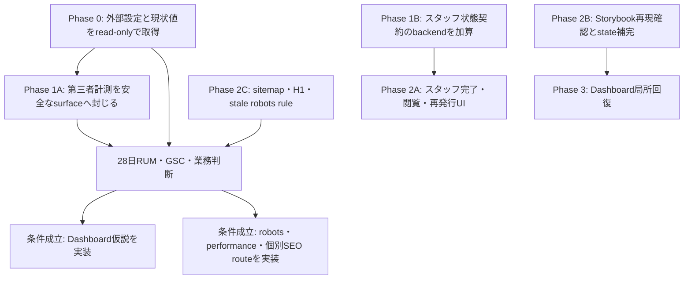

# UI・UX・SEO監査残件 実装計画

## 文書の状態

- 状態: `Active / rollout verification`
- 作成日: 2026-08-12
- 実装結果の基準commit: `449ee9b06c756c6c176530c14b01434cd005aaca`
- 対象: [UI・UX・SEO全体監査 最終報告・改善計画](2026-08-12_UI_UX_SEO全体監査_最終報告・改善計画.md)で確認した残件のうち、本書で除外しないもの
- 実装状態: 確定不具合のrepository実装と主担当の自動テストは完了。外部GTM・GA4・Clarity設定、deploy、Production・GSC・RUM確認、Product判断を要する仮説は未実施

この文書は、監査結果をそのまま一括修正する指示書ではない。  確定した不具合は実装単位へ分解し、効果が未確認の項目は検証ゲートを先に置く。  現在仕様の正本は`doc/features/`、恒常規約は`doc/rules/`、人が行う外部設定は`doc/manual/`とする。

## 結論

実装対象は、次の四群に分ける。

1. スタッフ向けURLの完了・閲覧・再発行を、一つの安全な状態契約として修正する。
2. Web計測、DashboardのStorybook、Dashboardの局所回復、sitemap、H1という、改善判断と品質保証の基盤を直す。
3. robotsと`noindex`、公開ページの初期JS、FAQ・HowToの個別URL化は、Search Console、RUM、Production相当traceの証拠を取得してから変更する。
4. Dashboardの「全員提出済み」「TODOの並び順」「オンボーディング終了条件」は、業務判断または利用データを確定してから実装する。

次の二項目は、ユーザー指定により修正しない。

- `F-DEMO-01`: ShiftBoardデモに見える終了操作がなく、SPに代替デモ導線がない。
- `F-DUX-01`と従属する`H-DUX-01`: Dashboardで日常タスクより組織・店舗contextが先に表示される。

`F-SEO-02`のH1重複は、同じShiftBoardデモrouteに関する別のHTML構造上の問題である。  終了導線やSPの代替導線には触れず、H1だけを修正する。

## スコープと判断

| 監査ID・契約 | 扱い | 実装または次の判断 | 完了の証拠 |
|---|---|---|---|
| `F-TRUST-01` | 実装修正 | serverが提出済みを確認した場合だけ完了を表示する | Function、Frontend、E2E |
| `F-PUX-01` | 実装修正 | 募集IDの有無に応じて再発行CTAと案内を一致させる | Frontend Unit、Story |
| `F-PUX-02` | 実装修正 | query欠落・不正ID・対象なし・query実行エラーを分け、castとreload loopを除く | Function、Frontend Unit、Story |
| `O-MEAS-01` | 実装修正と外部設定ゲート | 第三者タグのsurface制限、型付きevent、RUM、release識別を整える | Logic、Frontend Unit、GTM Preview、GA4 DebugView |
| `O-QA-01` | 再現後に必要分だけ修正 | 現checkoutでUI Testは29件成功したため、fresh build・VRT runnerで再現した境界だけを直し、不足するmobile stateは追加する | UI Test、Storybook build、VRT |
| Dashboard `D6` recovery gap | 実装修正 | query失敗を空配列にせず、募集・スタッフ・運用TODOを局所回復できる状態へ分ける | Frontend Unit、Behavior Story |
| `F-SEO-01` | 実装修正 | sitemapをrouteと記事metadataから再現可能に生成する | Logic、static build |
| `F-SEO-02` | 実装修正 | `/demo/shiftboard`のraw HTMLをH1一件にする | static build、PC/SP VRT |
| `O-SEO-03` | 一部即時、一部検証後 | 不在routeの`/welcome`だけ削除し、七prefixはGSC確認後に判断する | static test、GSC evidence |
| `O-PERF-01` / `H-PERF-01` | 検証後に条件付き実装 | RUMと三回以上のcold traceでroute外JSの影響を確定する | RUM、trace、bundle比較 |
| `O-SEO-04` / `H-SEO-02` | 検証後に条件付き実装 | 検索需要がある項目だけ個別URL化する | GSC比較、static build |
| `H-DUX-02` | 業務判断後に条件付き実装 | 全員提出済みを「確認開始可能」と扱うか決める | fixture、Logic、PC/SP Story |
| `H-DUX-03` | データ取得後に条件付き実装 | TODOの優先順位を固定種別順から変える必要があるか決める | 頻度、初回click、未解消時間、Logic |
| `H-DUX-04` | 業務判断後に条件付き実装 | 4/4を手動終了のままにするか、自動で一度だけ終了するか決める | Story、Frontend Unit、仕様記録 |
| `F-DEMO-01` | 対象外 | 変更しない | 本書のdiffに終了・SP代替導線がない |
| `F-DUX-01` / `H-DUX-01` | 対象外 | 変更しない | OperationContextとTODOの表示順を維持する |
| 専用Accessibility監査 | 対象外 | frameworkと既存componentのrole、focus、labelを通常の実装品質として維持する | 専用axe監査や網羅的keyboard smokeは追加しない |

## 実装原則

### 事実と仮説を混ぜない

確定不具合はコードと自動テストで閉じる。  `H-DUX-*`、`H-SEO-*`、`H-PERF-*`は、検証結果が採用条件を満たすまでproduction UI、route構造、preload方針を変えない。

検証の結果、現行仕様を維持すると決めた場合も、必要データ、判断者、取得日時、理由を本書または後続の現行文書へ記録すれば完了とする。  「調査したが判断記録がない」状態は完了に含めない。

### URLだけで成功を主張しない

成功表示は、直前のclient navigationやquery parameterを証拠にしない。  スタッフのsubmit session、募集、スタッフ、提出recordをserverで照合し、最小DTOを返す。

### 外部計測はdefault closedにする

GTM IDが存在するだけでは第三者scriptを起動しない。  Consent、container設定、対象surface、release環境が確認できた場合だけ明示的に有効化する。  Capability、OAuth callback、スタッフ登録・提出・閲覧・再発行、スタッフ法務同意ではGTMとClarityを起動しない。

### 失敗を「0件」に変換しない

Dashboardのquery失敗を、募集0件、スタッフ0名、通知不達0件、参加申請0件として扱わない。  `loading / ready / unavailable`を区別し、依存するCTAとオンボーディング判定を抑止する。

### 新しい永続基盤を増やさない

本計画には、新table、migration、receipt token、first-party行動event tableを追加しない。  提出確認は既存sessionと`shiftSubmissions`、業務KPIは既存Convex Analytics、検索はSearch Consoleを使う。

## 依存関係と実装順



Phase 1A、1B、2B、2Cは相互に独立して進められる。  スタッフfrontendはbackend queryのdeploy後、Dashboard局所回復はStorybookの現行runner再現matrixとfull state baselineを固定した後に進める。

## WP1 スタッフlink状態契約

### 目的

`F-TRUST-01`、`F-PUX-01`、`F-PUX-02`を別々の文言修正にせず、URL、session、server fact、利用者表示の対応として閉じる。

### 状態契約

| 画面 | 入力とserver fact | 表示 | 許可する操作 |
|---|---|---|---|
| 提出完了 | `recruitmentId`あり、保存済み`submit` sessionあり、session・店舗・スタッフ・募集が一致し、本人の`shiftSubmissions`あり | 「提出が完了しました」 | 履歴がある場合だけ「前の画面に戻る」 |
| 提出完了 | ID欠落、不正ID、sessionなし、期限切れ・失効、access kind不一致、提出recordなし | 「提出完了を確認できません」 | 元のLINE・メールを開くか担当者へ連絡する案内 |
| 提出完了 | query待機 | spinnerまたはskeleton | なし |
| 提出完了 | query実行エラー | 成功を断言しない読込エラー | query componentを再mountして再試行 |
| シフト閲覧 | 期限切れで`recruitmentId`あり | 閲覧不可と再発行案内 | 再発行へ進む |
| シフト閲覧 | 期限切れで`recruitmentId`なし | 閲覧不可。ボタンを示す文言を出さない | 元のLINE・メールを開く、または担当者へ連絡 |
| 再発行 | ID欠落・不正・対象募集なし | 「このページから再発行できません」 | 元の案内へ戻るか担当者へ連絡 |
| 再発行 | `isShopParentActive`がtrueの店舗・組織に属するconfirmed募集 | 店舗名、対象期間、入力form | 既存のgeneric responseで申請 |
| 再発行 | query実行エラー | 対象なしと混同しない読込エラー | query componentを再mountして再試行 |

### Backend変更

1. `convex/shiftSubmission/queries.ts`へ`getSubmissionResult`を追加する。
   - `staffSessionQuery`を使い、`sessionToken`と`accessKind = submit`をserverで検証する。
   - `staffSessionQuery`の`accessKind`はcallerが指定できるため、handler内でも`sessionMatchesAccessKind(ctx.session, "submit")`を固定検証する。実在する提出があっても`view` sessionでは取得不可にする。
   - route由来の`recruitmentId`は`v.string()`で受ける。空文字または128文字超をDB参照前に拒否し、`ctx.db.normalizeId("recruitments", value)`に失敗した場合と同じ`unavailable`を返す。Argument validator errorを利用者状態の分岐に使わない。
   - sessionの`recruitmentId`、店舗、スタッフ、募集を照合し、`shiftSubmissions.by_recruitmentId_staffId`で本人の提出recordを確認する。
   - returnは`{ status: "submitted", shopName }`または`{ status: "unavailable" }`の最小DTOとし、token、staff name、メール、内部IDを返さない。
2. `convex/staffAuth/queries.ts`の`getRecruitmentInfo`は`v.string()`で受け、IDをnormalizeする。
   - 同じ1〜128文字の入口制限を使い、不正ID、削除済み募集、confirmed以外、`isShopParentActive`がfalseの店舗・組織は`null`を返す。
   - `active`を新しい`operatingStatus === "active"`条件とは定義しない。現行`isShopParentActive`の非削除parent semanticを維持し、現行で閲覧可能な制限状態を意図せず狭めない。
   - 正常時は既存表示情報とcanonicalな`recruitmentId`だけを返す。
3. `requestReissue`のgeneric response、二段階rate limit、重複抑止、対象照合、通知schedulerは変更しない。

新しいschema、index、migrationは不要である。

### Frontend変更

1. `src/components/features/StaffSubmit/index.tsx`は提出mutation成功後、`shopName`ではなく`recruitmentId`を付けて完了routeへ遷移する。
2. `src/routes/_unregistered/shifts.submit_.completed.tsx`は、1〜128文字の`recruitmentId`だけを受けるvalidatorへ変更する。
3. `src/components/features/StaffAccess/sessionStorage.ts`の保存済みsession取得を、featureのpublic入口から安全に利用できる形でexportする。
4. `src/pages/staff-shift-submit-completed/index.tsx`は保存済み`submit` sessionと`getSubmissionResult`を使い、状態表どおりに描画する。client由来の店舗名だけで成功表示しない。
5. `src/pages/staff-shift-view/index.tsx`は、募集IDがない場合の説明から「下のボタン」を除き、募集IDがある場合だけ再発行CTAを出す。
6. `Link`と`Button`を入れ子にせず、既存Buttonの`asChild`契約へ揃える。
7. `src/routes/_unregistered/shifts.reissue.tsx`は1〜128文字の`recruitmentId?: string`を明示し、castをやめる。
8. `src/pages/staff-shift-reissue/index.tsx`はID欠落時にqueryをskipし、不正・対象なし・query実行エラーを別状態で描画する。
9. `src/components/features/StaffShiftReissue/index.tsx`はcanonicalな`Id<"recruitments">`だけを受け、`as Id`を削除する。
10. 完了画面の履歴操作は`useCanGoBack`だけで提出画面由来と断定せず、labelを「前の画面に戻る」へ中立化する。提出画面へ戻ると保証する場合は、権限に使わないnavigation stateを別途検証する。

### Security Lens

- **Actor**: LINE・メールから到達した匿名スタッフ、URLを直接開く第三者、再発行を連打するcaller。
- **Asset**: 提出済みという業務事実、submit session、店舗名、スタッフのメール、通知quota。
- **Trust boundary**: URLとlocalStorageからConvex public query・mutationへ渡る境界。
- **Abuse case**: IDだけで提出有無を推測する、view sessionをsubmit proofに使う、他店舗・他スタッフの提出を確認する、不正IDでvalidator error loopを起こす、再発行でメール存在を列挙する。
- **Server-side enforcement**: access kind、session、店舗、スタッフ、募集、提出recordをserverで照合する。UI分岐やTypeScript castを認可根拠にしない。
- **URL / log / artifact**: `recruitmentId`は権限を持たないselectorとして完了・再発行URLに許可する。token、完全なメール、`shopName`はURLへ入れない。server診断logの内部IDは許可するが、token、完全なメール、自由入力を出さない。E2Eではsynthetic IDだけを使い、bearer token・PIIがtrace、video、screenshot、HTML、JSONへ残らないことを検査する。

### テストと受入条件

- Convex Function Testを主担当とし、正常提出、提出なし、sessionなし、期限切れ、失効、callerが`accessKind = view`を指定したview session、募集不一致、他スタッフ、他店舗、空・129文字・不正ID、最小DTOを検証する。
- `getRecruitmentInfo`は空・129文字・不正ID、対象なし、open、deleted、inactive parentで`null`、confirmedかつ現行`isShopParentActive`の各許可状態で最小DTOを返すことを検証する。
- search validatorの欠落、空、非文字列、128文字、129文字はLogic Testを主担当にする。
- queryを含むpageからpresentational viewを抽出し、Frontend Unit Testは状態変換とretry remount、Storybook Behaviorはverified、unverified、loading、query error、CTA有無を担当する。
- desktopの正常提出、完了、refresh、back/forwardは既存`E2E-SHIFT-01`、SPの直URLunverifiedと正常提出は`E2E-MOBILE-01`へ割り当てる。両projectへ同じ全分岐を重複させない。
- E2Eのtrace・video設定だけを根拠にせず、`scripts/assertNoSensitiveArtifacts.mjs`でHTML・JSONを含むartifactにbearer token・PIIがないことを確認する。新しい巨大E2E契約は作らない。
- `doc/features/shift-submission.md`を状態契約へ更新する。

## WP2 Web計測の安全境界とRUM

### 既存計画との関係

[GA4計測基盤とSkill整備 実装計画](2026-08-12_GA4計測基盤とSkill整備_実装計画.md)は、event catalog、Consent、外部設定、Skill設計の調査素材としてだけ参照する。  アプリへ実装するsurface、event、優先phaseは本書WP2を正とし、旧計画の`staff_capability` page view、staff提出event、login event、初期Dashboard計測は採用しない。

1. `staff_capability`のpage viewと提出funnelをGA4対象から外す。スタッフの提出事実は既存Convex Analyticsだけを正本にする。
2. Capability、callback、スタッフ登録・法務同意・提出・閲覧・再発行routeでは、sanitized eventを送るだけでなくGTM・Clarity script自体をloadしない。
3. 初期releaseはindex可能な公開SSGだけを対象とする。DashboardのGA4は外部tag契約の安全性確認後に別gateで有効化し、Clarityは管理画面で有効化しない。
4. `VITE_GTM_ID`の存在だけで有効化せず、明示的なmeasurement enable、Consent、environmentをすべて満たすdefault-closed policyにする。

この差分は、credential queryをアプリ側serializerで除いても、GTM containerや外部tagが`document.location`を独自取得できるため必要である。  さらに、一度loadした第三者scriptはSPA遷移先でも残るため、client entryの初期surface判定だけでは非公開routeの通信0件を保証できない。

### 実装契約

1. `src/domains/webMeasurement/`に純粋なroute surface policy、route family、event union、exact serializerを置く。
2. `src/client.tsx`は第三者tagを初期化する前にsurface policyを評価する。unknown routeと非公開routeはclosedとする。
3. 計測する公開documentと、`/login`、`/signup`、Dashboard、Capability、callbackなどの非公開documentの境界を越えるlinkは、security上の意味を持つ`MeasurementBoundaryLink`へ集約し、ordinary anchorによるfull-document navigationを使う。公開→非公開、非公開→公開のどちらもTanStack RouterのSPA遷移を許可しない。
4. programmatic navigationも同じboundary helperを通す。計測surface境界をrouterの`navigate`で越えるcallsiteがないことをstatic/Logic Testで列挙する。同じ分類内の公開同士、非公開同士はSPA navigationを継続できる。
5. `src/lib/gtm/index.ts`のgenericな`sendEvent(event, Record<string, unknown>)`をfeatureへ公開しない。
6. 初期eventは、公開CTA、デモの価値checkpoint、公開page view、Web Vitalsに限定する。
7. Web Vitalsはdocument lifecycleへ帰属するため、初回documentのroute familyを初期化時にimmutableに保持する。callback時点の現在routeを付けない。SPA遷移の性能は将来の別指標とし、Web Vitalsへ混ぜない。
8. Web Vitalsは`LCP / INP / CLS / FCP / TTFB`のname、value、rating、navigation type、document route family、viewport class、release、environmentだけを送る。
9. `__RELEASE_ID__`と`__APP_ENVIRONMENT__`をbuild defineへ追加し、CIではcommit SHAと`develop / preview / production`を渡す。localは固定fallbackにする。
10. query、hash、raw URL、referrer path、title、内部ID、店舗名、氏名、メール、token、code、state、自由入力、raw countを送らない。件数が必要なら有限bucketにする。
11. analytics送信失敗は、業務mutation、成功画面、遷移を失敗させない。

### 外部設定ゲート

外部状態はread-onlyで先に棚卸しし、変更・publishはユーザーの明示承認後に行う。

- GTMの初回page view、History Change、All Clicks、広いtrigger、Custom HTML。
- GA4 Enhanced Measurement、Google Signals、Ads、User-ID、cross-domain、data retention、data redaction。
- Clarityのload surface、input masking、session recording、環境分離。
- Consent default、update、revokeと、許可前request・遡及flush。
- develop、preview、productionのcontainer・property・stream分離。

初期推奨はBasic Consent Mode、GA4保持期間は必要最小限、Google Signals・Ads・User-IDは無効である。  法務判断が終わらない場合は安全なcoreだけを実装し、Productionのtag有効化を保留する。

### テストと受入条件

- Logic Testで全route family、unknown、slash、動的ID、credential query、exact payload、余分なkeyの破棄をtable testする。
- Frontend Unit TestでConsent前script 0件、非公開direct load 0件、公開許可後1件、revoke後停止、StrictModeと公開route遷移の重複なしを検証する。
- browser contractで公開direct load、公開→非公開full-document navigation、非公開direct load、back/forwardを確認し、非公開document上の`googletagmanager.com`、Google Analytics、`clarity.ms` requestを0件にする。外部scriptはroute mockで置き換え、bearer credentialは使わない。
- Web Vitals callbackはsampling前後の値と低cardinalityだけを送る。
- GTM Preview、Tag Assistant、GA4 DebugViewは、synthetic markerだけで確認し、raw URL、ID、token、PIIが0件であることを記録する。
- repository implementation、container/property configured、Production observedを別状態で報告する。
- `doc/features/web-measurement.md`と`doc/manual/ga4-gtm.md`を作成し、現在のeventと外部設定の正本を分ける。

### RUMの判定可能性

RUMを構造変更の根拠に使うには、route family × device × releaseごとに最低200件の有効metricと14日以上の観測を必要とする。  28日経過しても200件に届かないsliceはrelease効果を判定せず、より上位のroute familyへ集約してbaselineとしてだけ使う。

計測が初期化された同意済みpage viewを分母に、Web Vitals callbackの取得率を記録する。取得率80%未満、またはrelease間で20 percentage points以上変動する場合は、p75の比較だけで実装判断しない。Consent拒否、ad blocker、第三者script blockによる全訪問者に対する欠測率は算出できないlimitationsとして明記する。

## WP3 Dashboard StorybookとVRTの復旧

### 現在の証拠と再現方針

監査時はfull Dashboard Storyがlogger errorへ到達したが、2026-08-12の同じ基準commitで`pnpm vitest run --project=ui src/components/features/Dashboard/DashboardContent/index.stories.tsx`を再実行した結果は、1 file、29 tests成功でlogger errorを再現しなかった。  したがって、`convex-helpers/react`のmodule解決を確定root causeとしない。

freshなStorybook buildとVRT runnerで再現条件を先に固定する。  UI Test、Storybook build、VRTのどれで失敗するか、解決module、stack、runner cacheの有無を記録し、再現したrunnerにだけ最小のmockを追加する。  再現しなければglobal aliasを追加せず、監査時の観察をtransientまたは解消済みとして記録する。

### 変更

1. 最初にUI Test、fresh Storybook build、desktop VRT、mobile1 VRTを別々に実行し、再現matrixを残す。
2. `convex-helpers/react`からproject hookを経由して実queryへ到達することが再現した場合だけ、`.storybook/mocks/useShopCustomPaginatedQuery.ts`を追加し、`{ results: [], status: "Exhausted", isLoading: false, loadMore: noop }`を返す。
3. aliasは失敗したrunnerの設定だけへ追加する。三設定へ予防的に一括追加せず、同じ再現が確認できた場合だけ共有する。
4. production hookと既存`src/hooks/useShopCustomPaginatedQuery.test.ts`は変更しない。
5. `Normal`、`SingleShop`、`SingleShopMobile`、`ReadOnlyShop`、`OnboardingStaffAdded`、staff loadingのfull Storyが引き続き描画可能であることを確認する。
6. `MultiShopMobile`、`ReadOnlyShopMobile`、`OnboardingStaffAddedMobile`を追加し、実際のmobile VRT対象には`vrt-mobile1` tagを付ける。

### 受入条件

- UI Testでlogger errorとErrorBoundary fallbackが発生しない。mockを使う場合、この成功はproduction query接続ではなくStory fixtureの閉じた描画契約を証明する。
- `pnpm storybook:build`が成功する。
- full StoryのPC/SPで、募集、スタッフ、TODO、読み取り専用、オンボーディングの代表状態が描画される。
- VRTはレイアウト差分を担当し、query接続契約はFrontend Unit TestとUI Testが担当する。

## WP4 Dashboardの局所回復

### 目的

full Dashboardのquery失敗が全画面fallbackへ波及する状態を解消する。  Storyを追加するためだけのtest propではなく、productionで同じ`loading / ready / unavailable`状態を扱う。

### 状態境界

| 失敗箇所 | 維持する領域 | unavailableにする領域 | 抑止する判断 |
|---|---|---|---|
| 募集query | OperationContext、法務、課金、スタッフ一覧 | TODOの募集項目、募集一覧 | 募集依存CTA、募集状態を使うオンボーディング |
| スタッフquery | OperationContext、法務、課金、募集一覧・募集TODO | スタッフ一覧 | スタッフ0名扱い、自動オンボーディング完了 |
| 参加申請query | 募集、スタッフ、通知不達 | 参加申請TODO | 申請0件扱い |
| 通知不達query | 募集、スタッフ、参加申請 | 通知不達TODO | 不達0件扱い、再送操作 |
| OperationContext・現在user・法務前提 | なし | Dashboard全体 | 局所表示を作らず、既存のroute-level回復を維持 |

### 変更

1. `DashboardContent`のquery-owning controllerを、募集、スタッフ、参加申請、通知不達の兄弟Sourceとして分離する。各Source内だけを`DashboardQueryStageBoundary`で包み、取得結果をselected shop ID付きstage snapshotとして親へ報告する。
2. `DashboardContentView`は4つのquery boundaryの外で一度だけ合成する。通常Viewのrender errorはquery失敗として捕捉せず、既存のroute-level回復へ渡す。店舗切替後はshop IDが一致しないsnapshotを同期的に`loading`扱いとし、切替前店舗の結果を描画しない。
3. 各stageは`loading / ready / unavailable`のdiscriminated unionとし、`unavailable`を空配列へ変換しない。状態変換は純粋関数へ置く。
4. `DashboardQueryStageBoundary`はfeature固有のboundaryとし、retry時に`retryRevision`を増やして該当Sourceのquery-owning childだけを新しい`key`でremountする。再試行直後に同じerrorをthrowした場合は局所errorを維持し、ページ全体の再読み込みを次の操作として示す。
5. `HeroSummary`は一部TODOがunavailableなら「一部のTODOを読み込めませんでした」を表示し、取得できたTODOだけを操作可能にする。
6. RecruitmentBoardとStaffRosterは各sectionのinline error、再試行、既存のskeletonを持つ。
7. onboardingは募集またはスタッフがunavailableの間は表示・自動判定しない。
8. このboundaryが扱うのはConvex query ownerのrender errorである。offlineや接続待ちは現行queryが返すloading・cached stateに従い、独立した「通信断」と断定しない。
9. React 19の捕捉済みrender errorはclient rootで固定categoryだけを記録し、raw error、component stack、query名、token、IDを利用者表示、console、analyticsへ出さない。

### テストと受入条件

- 純粋なstate変換とCTA抑止はLogic Testを主担当にする。
- React controller、boundaryのcatch、`retryRevision`、remount、連続失敗はFrontend Unit Testを主担当にする。
- Behavior Storyで募集error、スタッフerror、運用TODO error、retry後のsection復帰、兄弟section維持を確認する。
- PCで三error state、SPで最も情報量の多い一代表stateをVRTへ追加する。
- retry callbackは`expect`で直接確認し、単なる時間待ちに`waitFor`を使わない。
- 既存の正常、loading、read-only、onboarding Storyが退行しない。

## WP5 sitemapのsingle source化

### 変更

1. `src/components/features/ArticleSite/articleMeta.ts`から、frontmatter schemaと`parseArticleMetadata`のNodeでも読める純粋部分を別moduleへ抽出する。`import.meta.glob`と画像解決はbrowser側moduleへ残す。
2. `scripts/sitemap.ts`に、公開route、canonical、記事frontmatterからXML modelを作る純粋関数を置く。
3. Node側は既存`yaml`と`extractFrontmatterSource`を使い、公開記事の`updatedAt ?? publishedAt`を読む。
4. locは`getIndexableCanonicalRoutes`から作り、alias、noindex公開route、CSR shell、draft、unknownを除く。
5. 記事だけに正確な`lastmod`を付ける。significant updateのsourceがない固定page、一覧、categoryは`lastmod`を省略する。build日時を使わない。
6. `changefreq`と`priority`は順位付けの根拠にせず、generatorの出力から除く。
7. XML serializerは`& < > " '`をentity escapeし、URL objectでorigin、query、hash、no-slashを検証してから出力する。
8. `pnpm sitemap:generate`は明示実行時だけ`public/sitemap.xml`を更新する。通常buildはworktreeを書き換えず、期待値と`public`・`dist/client`の不一致で失敗する。
9. `scripts/validateStaticBuild.ts`はsitemapのloc、重複、lastmod形式、記事metadataとの一致を検証する。
10. `src/components/features/ArticleSite/AGENTS.md`に手動編集指示がある場合は、generator実行とcheckへ更新する。正本を二つにしない。

### テストと受入条件

- canonical URLが各一件で、alias、CSR、noindex、draftが含まれない。
- 一記事の`updatedAt`変更はその記事の`lastmod`だけを変える。
- build日時、timezone、列挙順がXMLを変えない。
- XML予約文字を含むfixtureがwell-formed XMLへescapeされ、parse後に元のURLへ戻る。
- `public/sitemap.xml`とbuild artifactが期待値に一致する。
- `free-shift-tool-selection`の表示・JSON-LD・sitemap更新日が同じsourceへ揃う。
- `doc/features/public-pages.md`へ生成方法と更新契約を記載する。

## WP6 `/demo/shiftboard`のH1を一件にする

### 変更

1. `src/pages/demo-shift-board/index.tsx`のroute shellが、PC/SP共通のH1を一度だけ所有する。
2. `src/components/features/Demo/DemoShiftBoardPage/index.tsx`の内部見出しは、route shellと重複しないpresentationへ変更する。
3. PCの操作可能デモとSPの現行案内内容、TOPへ戻るlink、終了操作の有無は変更しない。
4. `scripts/validateStaticBuild.ts`は、全公開SSGでH1が「一件以上」ではなく「正確に一件」であることを検証する。

### 受入条件

- raw HTMLの`<h1>`が全公開SSGで一件である。
- H1はCSS上もPC/SPの双方で利用者に見える。
- feature Storyだけではroute shellのH1を含まないため、`DemoShiftBoardRoutePage`を描画するpage単位Storyを追加し、PC/SP VRTでデモの主要領域に意図しない移動がないことを確認する。
- `F-DEMO-01`の対象外指定に反する終了・SP代替導線を追加していない。

## WP7 robotsと`noindex`の検証ゲート

### 即時変更

実在しない`/welcome`の`Disallow`だけを`public/robots.txt`から削除し、route inventory testで不在routeのruleが再発しないようにする。

### GSCで先に確認する対象

`/dashboard`、`/shiftboard/{synthetic-id}`、`/shifts/view`、`/staff/register`、`/line/callback`、`/legal/staff/consent`、`/sso-callback`を確認する。  実token、OAuth code、state、人物・店舗・募集IDを使わない。

各証拠には次のmetadataを必須とする。

- sourceとproperty。
- 取得日時と対象期間。
- URL粒度かorigin粒度か。
- device、country、search type、filter、aggregation。
- sample・欠測の有無。
- 対応するreleaseまたは「対応不明」。
- URL Inspectionのindexed resultとlive testを別行にし、Google-selected canonicalはindexed resultだけに記録する。

### 判断規則

| route分類 | 初期方針 | URL-only indexが確認された場合 |
|---|---|---|
| 認証済みshellでcredentialをURLに持たない`/dashboard` | `noindex / no-store / no-referrer`を維持し、Disallow削除候補 | Disallowを外してcrawlerに`noindex`を読ませる |
| manager認証が必要な`/shiftboard/:id` | shellが中立・認証必須であることを再確認 | security review後にDisallow削除を検討 |
| token・code・stateを持ち得るCapability・callback | Disallowとheaderを維持 | robotsだけで秘密を守らない前提で、発見source、link lifecycle、URL設計を別security判断にする |

変更する場合は、公開、CSR shell、alias、404、index方針を`staticSite`のmanifestへ集約し、robotsとheadersを同じ分類から生成する。  Productionの`robots.txt`にはCloudflare Managed Content Signalsが付加されるため、repository fileとのbyte一致を完了条件にしない。

## WP8 公開ページ性能の検証と条件付き実装

### Baseline

- Production相当buildで、`/`、`/faq`、代表記事、`/demo/flow`、`/login`をmobile cold cacheで各三回以上測る。
- request priority、開始時刻、LCP element、long task、main-thread scripting、unused JS、compressed transferを保存する。
- LCP前に取得・評価されたroute外chunkを、owner routeとbytesで分類する。
- RUMは最低28日、route family、mobile/desktop、release別にLCP、INP、CLSをp75で見る。
- CrUXはURLまたはoriginの28日rolling dataであり、特定releaseの効果証明には使わない。

### 実装へ進む条件

次のどちらかを満たし、traceでroute外JSとの因果が説明できる場合だけ変更する。

1. 三回中二回以上、LCP前にroute外JSが20KB gzip以上または50ms以上のscriptingを消費する。
2. LCP p75が2.5秒を超え、同じroute family・device・releaseのtraceで対象JSがcritical pathにある。

### 条件成立時の変更

1. rootと公開routeのeager import graphを調べ、dashboard、auth、Capability固有importを切る。
2. 現在のTanStack Start versionで公式に対応するroute code splittingを小さいPOCで確認する。
3. `.lazy`分割またはVite `build.modulePreload.resolveDependencies`は、hydration、prefetch、route遷移にwaterfallを作らないことをPOCで証明してから採用する。
4. blanketなlazy化、全preload停止、手書きchunk registryは行わない。

### 受入条件

- 対象外route固有JSの初期transferを80%以上減らす。
- 三回以上の同条件比較でLCPまたはmain-thread scriptingが改善し、中央値が100ms超退行しない。
- 公開SSGのhydration、direct load、SPA遷移、404、CSR shell境界が維持される。
- 改善後にだけroute別JS budgetをstatic checkへ追加する。

## WP9 FAQ・HowToの個別検索意図

### 検証ゲート

Search Consoleでpropertyが保持する利用可能な最大期間について、日本、Web、page×queryを取得する。  propertyの運用期間が短い場合は、短いこと自体をlimitationsへ記録する。  次のすべてを満たす項目だけ候補にする。

- 直近90日で50 impressions以上、またはFAQ・HowTo全体impressionsの5%以上。
- 平均掲載順位4〜20、または同じdevice、query intent、country、検索タイプ、近い掲載順位帯のpage/query群に比べてCTRが低い。CTRは最低28日を一期間とし、impressions加重と分布を併記する。
- 既存ArticleSiteの記事と検索意図が重複しない。
- 一問一答または一手順として、固有title、description、H1、本文を持つ価値がある。

### 条件成立時の変更

1. 手順意図は`/howto/:slug`を優先し、`/howto`を検索・一覧の入口にする。
2. FAQは機械的に全件分割せず、需要と固有回答がある項目だけ`/faq/:slug`候補にする。
3. 既存fragmentは削除せず、同じanchorに概要とdetail linkを残す。
4. route、head metadata、static manifest、sitemap、`llms.txt`、内部linkを同時に更新する。
5. draftとunknown slugはSSG対象外・404とし、fake `lastmod`を付けない。
6. slugはFAQ内、HowTo内、既存固定route、aliasのすべてで一意にし、重複をbuild時に拒否する。
7. aggregate FAQの可視回答を概要へ短縮する場合、`FAQPage` JSON-LDも可視内容と同じ範囲へ更新するか削除する。community型の複数回答pageではないため`QAPage`へ置き換えない。
8. HowTo本文を変更するときは`write-help-content`を使い、現行機能と画面文言へ照合する。

### 実装時の機械契約

- Logic/static testでslug一意性、draft除外、unknown 404、unique title・description・canonical・H1、sitemap、内部link、旧fragment維持を検証する。
- FAQ structured dataはparse可能で、各question・answerが同じpageの利用者可視内容に存在することを検証する。
- detail pageのPC/SP StoryとVRTを追加し、aggregate pageは一覧・検索・fragment linkのBehaviorを確認する。
- 公開route追加後もCSR shellやunknown article/categoryを200 shellへ落とさない。

### 効果判定

公開後8〜12週間、旧aggregate pageと新detail pageをquery cluster別に比較する。  impressionsだけでなくCTR、平均順位、detailから次のhelp・製品CTAへの遷移を見る。  cannibalizationが強い場合はcanonical、内部link、統合を再判断する。

## WP10 Dashboard仮説の検証と条件付き実装

### `H-DUX-02` 全員提出済みの次行動

先に業務担当者が次を決める。

- 全員提出済みなら締切前でもシフト表の確認を開始してよいか。
- スタッフが締切まで再提出できる事実をどう伝えるか。
- 複数募集がある場合、締切超過と全員提出済みのどちらを優先するか。

採用する場合は、`totalStaffCount > 0 && responseCount >= totalStaffCount`を`readyToReview`とし、0/0は完了にしない。  推奨copyは「全員の希望がそろいました」「シフト表を確認する」で、締切までは変更される場合がある補足を付ける。

候補の完全なprecedenceは、confirmed・期間終了をaction候補から外したうえで、`締切超過 > 全員提出済み > 締切当日 > 締切間近 > 通常回収中`とする。複数募集では各募集を同じrankへ写像し、同rankは締切昇順、期間開始昇順、作成日時昇順で決める。業務判断で異なる順を採用する場合も、全五状態とtie-breakを省略しない。

`pickNextAction`のLogic Testは、未来・今日・期限超過、0/0、全員提出、confirmed、期間終了、複数募集のprecedenceをtable testする。  PC/SP Storyを追加し、Convex queryとE2Eへ同じ分岐を重複させない。

### `H-DUX-03` TODOの並び順

実装前に、通知不達、参加申請、シフト作業が同時に存在する頻度、最初のclick、未解消時間、業務上のSLAを取得する。  Dashboard計測をWP2の外部設定ゲート後に有効化できる場合は、有限の`task_set`と`task_type`によるimpression・最初のclick、時間bucketだけを送る。  ID、氏名、店舗名、募集数・スタッフ数の生値は送らない。

計測する場合は28日以上かつ、二種類以上のTODOが同時表示されたimpression 100件以上を母数にする。現行で下位にある同一task typeが最初に選ばれる比率30%以上、または合意済みSLA超過中のtaskが上位taskより継続して後回しになる場合をrank変更候補とする。母数不足なら順位を変えない。

Dashboard計測を承認しない場合は、少なくとも5名の管理者へ同じmulti-task fixtureを使った構造化ヒアリングと操作観察を行う。3名以上が同じ下位taskを先に選び、業務SLAと整合する理由を説明した場合だけ変更候補とする。計測導入自体をこの仮説の必須条件にはしない。

固定順が不適切と確認できた場合は、feature内のpureなtask builder/rankerへ切り出す。  rank、tie-break、同一種別内順序を明示し、組合せLogic Test、AllTasksのPC/SP VRT、一つのBehavior Storyでcallback接続を確認する。

### `H-DUX-04` オンボーディング4/4

現行testは、スタッフ追加後も自動で閉じない契約を明示しているため、不具合として即変更しない。  次をProduct判断する。

- 「スタッフ追加済み」の定義を、activeな非manager・shift対象スタッフの存在とするか。
- 4/4を一度見せて手動終了させるか、条件成立時に即終了するか。
- 既にスタッフがいる初回表示、後日のスタッフ削除、dismiss mutation失敗をどう扱うか。

自動終了を採用する場合の推奨契約は、初回評価時からpredicateがtrueの場合も完了対象とし、named predicateがfalseからtrueへ変わった場合と同じく`dismissOnboarding`を一度だけ呼ぶことである。  serverのdismiss保存が成功するまではcalloutを消さず、失敗時は現在sessionで手動終了操作を残し、次の明示操作または次回page loadで再試行できる。成功後は永続化し、後のスタッフ削除で再表示しない。

純粋predicateと初期trueはLogic Test、mutation一回・重複なし・失敗後の表示維持・再試行はFrontend Unit Test、4/4未完了のPC/SPはVRT、スタッフ追加後に消える遷移はscreenshotを取らないBehavior Storyで確認する。`doc/features/dashboard-onboarding.md`も更新する。

手動終了を維持する場合は、`OnboardingStaffAdded` Storyの復旧と理由の文書化でこの仮説を閉じる。

## 変更単位

| 単位 | 内容 | 依存 | 想定規模 | rollback |
|---|---|---|---|---|
| `I-01` | 計測surfaceをdefault closedにし、Capability・callbackで第三者tagをloadしない | 外部設定棚卸しは並行可能 | M | enableをoff、旧container version |
| `I-02` | 提出確認queryを追加し、既存再発行info queryの入力を後方互換にwidenする | なし | M | 旧frontendの`Id`文字列も受け付ける |
| `I-03` | スタッフ完了・閲覧・再発行UIとE2E | `I-02` deploy | M | frontend rollback。backend queryは残せる |
| `I-04` | Storybook再現確認、必要時だけproject hook mock、full PC/SP Story | なし | S | alias・mockを追加した場合だけ戻す |
| `I-05A` | sitemap generatorとmetadata source | なし | M | generatorとartifactを同時に戻す |
| `I-05B` | `/demo/shiftboard` H1一件 | なし | S | pageとfeature見出しを同時に戻す |
| `I-05C` | stale `/welcome` robots rule削除 | なし | S | robots ruleを戻す |
| `I-06` | Dashboard stage stateと局所回復 | `I-04` | L | feature flagを増やさず変更単位でrollback |
| `I-07` | 型付き計測、RUM、公開event、外部設定 | `I-01`とConsent判断 | L | tag disableとcontainer rollback |
| `I-08` | `H-DUX-02/03/04`採用分 | 各decision gate | S〜M | pure logicとUIを同時に戻す |
| `I-09A` | robots七prefixのpolicy変更 | GSC gate | M | robotsとmanifestを戻す |
| `I-09B` | 公開route code splitting・preload変更 | RUM・trace gate | L | bundle構成を戻す |
| `I-09C` | FAQ/HowTo detail route | GSC需要gate | L | detail routeとaggregate linkを戻す |

`I-02`と`I-03`を一度にProductionへ出さない。  後方互換なbackend追加・入力widenを先にdeployし、Function Testとdeployment healthを確認してからfrontendを出す。  外部GTM・GA4設定のpublish、Production deploy、Search Console操作は、本計画の承認だけでは実行権限を含まない。

## テスト責務

| Contract | 主担当層 | 追加・更新する検証 | 重複させないもの |
|---|---|---|---|
| submit sessionと提出factの照合 | Convex Function Test | access kind、tenant、staff、recruitment、submission、invalid ID | UIで認可を再現しない |
| スタッフ各routeの状態表示 | Frontend Unit、Behavior Story | loading、verified、unavailable、query error、CTA有無 | 全分岐E2E |
| 正常提出から完了・refresh | 既存E2E契約 | PC/SPの一代表journey | token artifact、巨大回帰 |
| 計測surfaceとpayload | Logic、Frontend Unit | route table、exact allowlist、Consent、dedupe | 外部GA到達の通常E2E |
| GTM・GA4設定 | 手動運用検証 | Preview、Tag Assistant、DebugView、rollback version | repository testで外部設定を推測しない |
| Dashboard state変換 | Logic Test | ready・loading・unavailable、CTA抑止、rank | Reactとnetwork |
| Dashboard boundary | Frontend Unit | catch、reset key、remount、連続失敗 | layout差分 |
| Dashboard full state | UI Test、Storybook Behavior、VRT | fixture描画、retry後のsection復帰、兄弟維持、PC/SP layout | production query接続、backend edge case |
| sitemapとH1 | Logic、static build | canonical、lastmod、H1 exactly one | 手動目視だけのSEO判定 |
| robots/index | static test、GSC手動検証 | repository policy、indexed result、live test | curlだけでGoogle indexを推測しない |
| performance | RUM、Production相当lab | p75、cold trace三回以上、bundle差 | 一回のLighthouse score |
| FAQ・HowTo detail | Logic、static build、Behavior Story、VRT | slug、metadata、404、JSON-LD、fragment、PC/SP | query需要の推測 |
| Dashboard task判断 | Logic、Story | 条件、precedence、copy、PC/SP | 不要なE2E |

局所検証後、変更範囲に応じて次を実行する。

```bash
pnpm vitest run --project='convex(logic)' convex/shiftSubmission/queries.test.ts convex/staffAuth/queries.test.ts
pnpm vitest run --project=logic
pnpm vitest run --project=ui
pnpm storybook:build
pnpm lint
pnpm type-check
pnpm test
pnpm build
pnpm e2e:ci
node scripts/assertNoSensitiveArtifacts.mjs --root test-results --root test-results.json --root playwright-report
git diff --check
```

ブラウザをAI Agentが手動操作する検証は新設せず、UI契約は自動テストへ置く。  VRT差分の採否、GTM Preview、Search Console、field dataだけは人の確認証跡を残す。

## 証拠metadata

RUM、CrUX、GSC、GTM、GA4、lab trace、Production HTTPを同じ「field data」として混ぜない。  各表の一行に次を持たせる。

| 項目 | 必須値 |
|---|---|
| source | GSC Performance、URL Inspection indexed、URL Inspection live、CrUX URL、CrUX origin、RUM、GA4、GTM Preview、labなど |
| target | property、origin、具体URL、route family |
| time | 取得日時、対象期間、timezone |
| slice | device、country、search type、filter、aggregation |
| quality | sample、欠測、row上限、rolling window |
| release | 対応release、または対応不明 |
| result | Confirmed observationかHypothesis supportか、no change判断か |

CrUXの28日rolling値を現在deployの結果と断定しない。  URL Inspectionのlive testからGoogle-selected canonicalを予測しない。  GSC Performance APIの返却行が全件とは限らないことをlimitationsへ残す。

## 文書更新

実装に伴い、次の現在仕様だけを更新する。

- `doc/features/shift-submission.md`: 完了確認、閲覧期限切れ、再発行の状態契約。
- `doc/features/public-pages.md`: sitemap生成、H1、robots、SSG/CSR分類。
- `doc/features/dashboard-onboarding.md`: `H-DUX-04`の最終判断を採用した場合だけ更新。
- `doc/features/web-measurement.md`: 計測surface、event、欠測、release状態。WP2で新設する。
- `doc/manual/ga4-gtm.md`: Consent、container、property、Preview、rollback。WP2で新設する。
- `doc/manual/release-status.md`: repository implementation、外部設定、Production観測を証跡がある段階だけ更新する。

詳細なevent一覧、route mapping、validator shapeを文書へ複製せず、TypeScriptとConvex validatorsを正本にする。

## 実行結果（2026-08-12）

現在のcheckout `449ee9b06c756c6c176530c14b01434cd005aaca`を基準とする未コミットworktreeで、確定不具合を実装した。  このSHAはProduction artifactとの対応が未確認であり、同じworktreeには本計画外の既存変更も含まれる。commit、push、deploy、外部設定のpublishは行っていない。

### 実装済み

| 対象 | repositoryで閉じた契約 | 実環境の残件 |
|---|---|---|
| `F-TRUST-01` | submit session、募集、店舗、スタッフ、提出recordをserverで照合し、照合できた場合だけ完了を表示する。URL直開き、未提出、無効session、query失敗を成功と分けた | Convex backendを先にdeployし、その後frontendを出す段階公開とcanary |
| staff session期限 | 新規session発行と同transactionで`expiresAt`の内部mutationを予約した。期限時は`sessionId + expectedExpiresAt`が一致するrowだけを冪等に物理削除し、既存row・予約漏れは1分cronのbounded batchで回収する。期限の時間経過をDB writeとして公開queryの購読へ反映する | Convex deploy後にcron登録と期限後の実環境利用不可をcanary |
| `F-PUX-01` / `F-PUX-02` | 閲覧の募集ID欠落時は存在しないCTAを案内しない。再発行はID欠落、不正、対象なし、query失敗を分離し、serverが返すcanonical IDだけをmutationへ渡す | 対象E2Eの実行とdeploy後canary |
| `O-MEAS-01` | 計測対象公開routeのexact allowlist、Consent、低cardinality event、Web Vitals、environment・release識別を追加した。初回許可は同じURLを再読み込みし、同意前entryを後送信しない。許可取消の保存失敗と別tab変更もfail-closedで停止・再評価し、既存loaderやtransport例外を製品操作へ伝播させない。計測surfaceを越える遷移はfull-documentにした | GTM container、GA4 property、Clarity、Consent Modeのread-only棚卸し、Preview、DebugView、Production request確認 |
| `O-QA-01` | full DashboardにSP代表stateを追加した。VRT baseline欠落、Deployed Smoke契約欠落、静的HTMLへの計測markup埋め込みをfail-closedで検知するCI契約を現在のcheckoutで確認した。外部へ送信しないsynthetic計測ON buildと専用Playwright契約も追加した | GitHub Actions上のVRT比較、Preview Deployed Smoke、計測browser契約の実走、差分採否 |
| Dashboard `D6` | 募集、スタッフ、参加申請、通知不達を兄弟query Sourceへ分け、`loading / ready / unavailable`を維持する。Viewは全query boundaryの外で合成し、retryは該当Sourceだけをremountする。selected shop IDの不一致時は旧店舗のstageを表示せず、未知状態を0件やオンボーディング完了に変換しない。Reactが捕捉したrender errorは固定categoryだけをconsoleへ記録する | Preview・Productionの実queryでのcanary |
| `F-SEO-01` | 公開route manifestと記事frontmatterからsitemapを決定的に生成し、buildでstale artifactを拒否する。記事の`lastmod`だけを`updatedAt ?? publishedAt`から出す | deploy後の配信artifactとSearch Console再送信判断 |
| `F-SEO-02` | `/demo/shiftboard`のraw HTMLをH1一件にした。デモ終了操作とSP代替導線は変更していない | VRT差分採否 |
| `O-SEO-03`の確定部分 | 不在routeの`/welcome`だけをrobotsから削除し、残す七prefixを自動テストで固定した | GSC evidenceに基づく七prefixの判断 |

新table、migration、receipt token、first-party tracking tableは追加していない。  `F-DEMO-01`、`F-DUX-01`、`H-DUX-01`、専用Accessibility監査は対象外のまま維持した。

### 検証ゲート未成立のため現行維持

| 仮説 | 2026-08-12の判断 | 実装へ進むために不足する証拠・判断 |
|---|---|---|
| `H-DUX-02` | 全員提出済みでも締切前の次行動は変更しない | 業務担当者による確認開始可否、再提出案内、複数募集のprecedence判断 |
| `H-DUX-03` | TODOの固定種別順を維持する | 28日以上かつmulti-task 100 impressions以上の有限event、または管理者5名以上の同一fixture観察と業務SLA |
| `H-DUX-04` | 4/4の手動終了を維持する | Productによる対象スタッフ定義、自動終了時点、削除・mutation失敗時の契約判断 |
| `H-SEO-01` | 非公開七prefixのrobotsと`noindex`を変更しない | GSC property、URL Inspection indexed resultとlive testを別々に取得した証拠。実token、code、stateは使わない |
| `H-SEO-02` | FAQ・HowToを個別URL化しない | 利用可能な最大期間のGSC page×query dataと、90日impressions・順位・CTR・検索意図の採用条件 |
| `H-PERF-01` | module preload、route code splitを変更しない | route family・device・release別RUMと、各route三回以上のmobile cold traceでcritical pathとの因果を示す証拠 |

これらは「効果がなさそう」と推測して見送ったのではない。  field data、外部property、Product判断を本作業では取得しておらず、計画の採用条件を満たさないためno changeとした。後続確認では、次のmetadataを一行ごとに残す。

### 証拠とlimitations

| source | target | 取得日時・対象期間 | slice・quality | 対応release | 結果 |
|---|---|---|---|---|---|
| 現在のrepositoryと自動テスト | 未コミットcheckout `449ee9b06c756c6c176530c14b01434cd005aaca` | 2026-08-12 JST、point-in-time | task-specific、Function・Scenario・Logic・UI・static build・Storybook。外部通信なし | 未deploy、Production対応不明 | Confirmed: repository実装と対象契約 |
| GSC Performance・URL Inspection | property、公開URL、非公開七prefix | 未取得 | device、country、search type、filter、aggregation、sample可否は未取得 | 対応不明 | Not measured: robots、FAQ・HowToは現行維持 |
| RUM・Production相当lab・CrUX | 公開route family、URLまたはorigin | 未取得 | 28日window、device、release、cold traceは未取得 | 対応不明 | Not measured: preloadとcode splitは現行維持 |
| GTM Preview・GA4 DebugView・Clarity・browser network | 計測対象公開routeとsyntheticな非公開route | 未取得 | container version、property、Consent、request sampleは未取得 | 未publish、未deploy | Not verified: runtimeはdefault closedを維持 |
| Product・業務判断 | `H-DUX-02/03/04` | 未取得 | 判断者、fixture、SLA、観察母数は未取得 | 該当なし | No decision: Dashboard挙動は現行維持 |

主担当検証では、staff session期限のFunction 3件とScenario 2件、Dashboard production compositionと関連Unit 24件、Dashboard Story / Behavior 39件、client error redactionを含む2 files / 5件、static SEO Logic 33件が成功した。Web計測はroute・event・runtime・Consent・transport・AST境界・static/result gateの対象test、synthetic計測ON build、専用Playwright二契約の列挙と結果gateが成功した。

最終のrepo全体実行は、Logic 192 files / 1,494件、Convex Logic 131 files / 1,808件、Scenario 25 files / 97件、UI 140 files / 867件がすべて成功した。`pnpm lint`、`pnpm type-check`、Storybook build、Production相当static build（公開35 pageをprerenderし、公開33 routeを検証）、`pnpm docs:check` 143文書、`git diff --check`も成功した。

UI Testでは意図的にError Boundaryを発火させるStoryのconsole error、既存の`:first-child` SSR warning、Storybookのargs循環warningが出力された。Storybook buildでも既存のdocgen対象外とchunk size warningが出力されたが、いずれも成功statusで完了した。localhost:3000が停止中のためスタッフ提出E2Eと計測browser契約の実走は未実行であり、Preview Deployed Smoke、CI VRT、外部GTM・GA4・Clarity、Production・GSC・RUM確認も未実施である。これらのため本計画は`History`へ移さず、`Active / rollout verification`に残す。

追加のsecurity limitationとして、`magicLinks.token`は現行schemaでraw bearerを保存し、token自体のdigest化・redact・pruneはない。また、再利用可能なstaff registration linkには管理者操作によるrevoke / rotationがない。現行実装とFull Regression契約の記述は一致させたが、前者はdigest migrationとretention、後者はProduct判断と失効契約が必要な別作業とした。

## 完了条件

本計画は、次をすべて満たした時に完了とする。

1. `F-TRUST-01`、`F-PUX-01`、`F-PUX-02`が状態契約と自動テストで閉じている。
2. Capability・callback・スタッフrouteで第三者tag requestが0件であり、公開計測もConsentとexact allowlistを満たす。
3. full Dashboard StoryがPC/SPで描画され、query失敗を0件に見せず局所回復できる。
4. sitemapがmetadataから再現可能で、全公開SSGのH1が一件である。
5. `/welcome`のstale robots ruleが除かれている。
6. robots七prefix、performance、FAQ・HowTo、Dashboard三仮説は、必要データと判断者を記録し、実装または明示的no-changeのどちらかへ閉じている。
7. `F-DEMO-01`、`F-DUX-01`、`H-DUX-01`へ変更を広げていない。
8. dedicated accessibility監査を追加していないが、変更した操作要素の既存role、focus、labelを壊していない。
9. 新schema、migration、first-party tracking tableを追加していない。
10. lint、type-check、test、build、対象E2E、Storybook build、文書checkが成功し、warningを残していない。

## 参照したリポジトリファイル

- `AGENTS.md`
- `doc/rules/agent-instructions.md`
- `doc/rules/frontend-architecture.md`
- `doc/rules/ui-design.md`
- `doc/rules/testing-strategy.md`
- `doc/rules/security-strategy.md`
- `doc/rules/convex-design-strategy.md`
- `convex/_generated/ai/guidelines.md`
- `convex/AGENTS.md`
- `convex/_lib/functions.ts`
- `convex/constants.ts`
- `convex/crons.ts`
- `convex/shiftSubmission/queries.ts`
- `convex/shiftSubmission/mutations.ts`
- `convex/staffAuth/queries.ts`
- `convex/staffAuth/mutations.ts`
- `convex/staffAuth/sessionExpiry.test.ts`
- `convex/_scenario/staffSessionExpiry.test.ts`
- `src/components/features/StaffAccess/sessionStorage.ts`
- `src/components/features/StaffSubmit/index.tsx`
- `src/pages/staff-shift-submit-completed/index.tsx`
- `src/pages/staff-shift-view/index.tsx`
- `src/pages/staff-shift-reissue/index.tsx`
- `src/components/features/StaffShiftReissue/index.tsx`
- `src/components/features/Dashboard/DashboardContent/index.tsx`
- `src/components/features/Dashboard/DashboardContent/index.test.tsx`
- `src/components/features/Dashboard/DashboardContent/index.stories.tsx`
- `src/components/features/Dashboard/HeroSummary/pickNextAction.ts`
- `src/components/features/Dashboard/HeroSummary/ActionTaskList.tsx`
- `src/components/features/Dashboard/DashboardOnboarding/index.tsx`
- `src/hooks/useShopCustomPaginatedQuery.ts`
- `src/components/ui/ErrorBoundary/index.tsx`
- `.storybook/main.ts`
- `vitest.config.ts`
- `vitest.vrt.config.ts`
- `src/client.tsx`
- `src/client.test.tsx`
- `src/reportWebVitals.ts`
- `src/lib/gtm/index.ts`
- `src/lib/webMeasurement/index.ts`
- `src/domains/webMeasurement/events.ts`
- `src/domains/webMeasurement/routePolicy.ts`
- `src/components/features/WebMeasurementConsent/index.tsx`
- `src/components/shared/MeasurementBoundaryLink/index.tsx`
- `src/routes/__root.tsx`
- `src/components/features/ArticleSite/articleMeta.ts`
- `src/components/features/ArticleSite/articleFrontmatter.ts`
- `src/components/features/ArticleSite/AGENTS.md`
- `scripts/staticSite.ts`
- `scripts/staticSite.test.ts`
- `scripts/sitemap.ts`
- `scripts/sitemap.test.ts`
- `scripts/validateStaticBuild.ts`
- `scripts/validateStaticBuild.test.ts`
- `scripts/assertDeployedSmokeResults.mjs`
- `scripts/assertMeasurementResults.mjs`
- `playwright.measurement.config.ts`
- `e2e/scenarios/measurement-enabled.test.ts`
- `.github/workflows/deploy.yml`
- `.github/workflows/vrt.yml`
- `public/sitemap.xml`
- `public/robots.txt`
- `src/pages/demo-shift-board/index.tsx`
- `src/components/features/Demo/DemoShiftBoardPage/index.tsx`
- `doc/features/shift-submission.md`
- `doc/features/public-pages.md`
- `doc/features/dashboard-onboarding.md`
- `doc/specs/full-regression-contracts.md`

## 外部一次資料

- [Google Search Central: Block Search indexing with noindex](https://developers.google.com/search/docs/crawling-indexing/block-indexing)
- [Google Search Central: Build and submit a sitemap](https://developers.google.com/search/docs/crawling-indexing/sitemaps/build-sitemap)
- [Google Search Console API: Search Analytics query](https://developers.google.com/webmaster-tools/v1/searchanalytics/query)
- [Google Search Console: URL Inspection](https://support.google.com/webmasters/answer/9012289?hl=en)
- [Chrome for Developers: CrUX API](https://developer.chrome.com/docs/crux/api)
- [web.dev: Web Vitals](https://web.dev/articles/vitals)
- [Microsoft Learn: Clarity FAQ](https://learn.microsoft.com/en-us/clarity/faq)
- [Google Developers: Set up consent mode](https://developers.google.com/tag-platform/security/guides/consent)
- [Google Tag Manager Help: Preview and debug containers](https://support.google.com/tagmanager/answer/6107056?hl=en)
- [Google Analytics Help: Monitor events in DebugView](https://support.google.com/analytics/answer/7201382?hl=en)
- [Google Search Central: FAQ structured data](https://developers.google.com/search/docs/appearance/structured-data/faqpage)
- [Google Search Central: Q&A structured data](https://developers.google.com/search/docs/appearance/structured-data/qapage)
- [TanStack Router: Code Splitting](https://tanstack.com/router/latest/docs/guide/code-splitting)
- [Vite: build.modulePreload](https://vite.dev/config/build-options.html#build-modulepreload)
