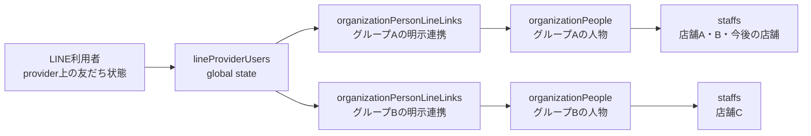
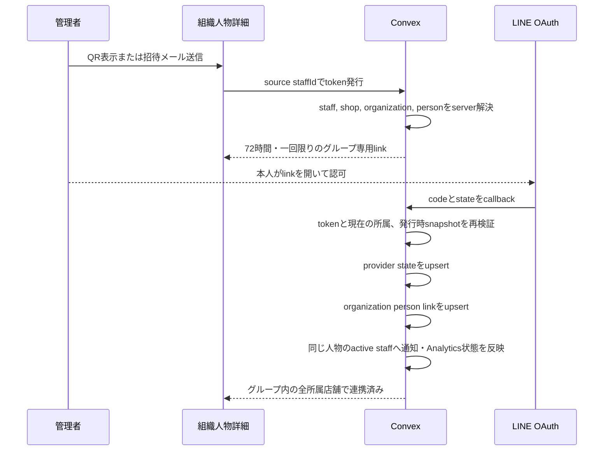
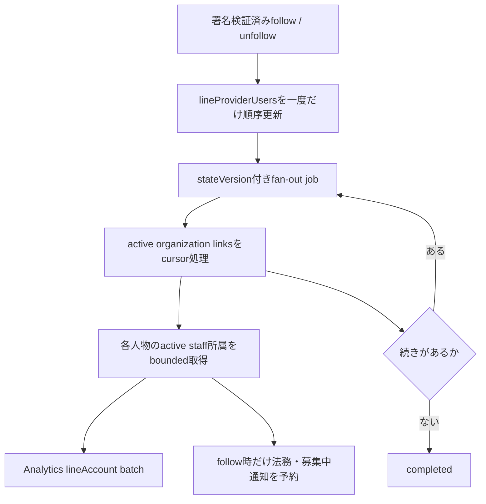
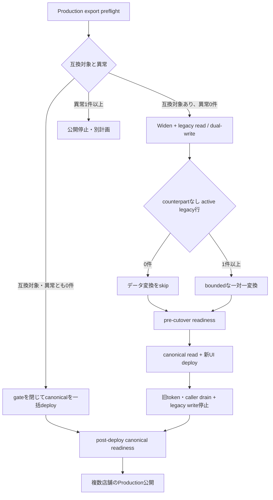

# LINE連携のグループ内共通化 実装計画

## 文書の状態

- 状態: `Active / rollout verification`
- 作成日: 2026-08-13
- 調査基準: `b4f83ea97cb3d18cf22b7cbbe87b4157a32c46dc`と作成時点のworktree
- 対象: LINE連携、LINE友だち状態、通知先解決、スタッフ所属、ユーザー詳細、Analytics、削除cleanup、schema変更、条件付き既存データ変換
- 実装状態: repositoryのコード、テスト、現在仕様の文書、migration runner、readiness verifierを実装済み。Production事前確認、データ変換の実行またはskip判定、deploy、環境変数切替、実LINE canaryは未実施

この計画は、LINE連携の正本を店舗スタッフからグループ内の人物へ移す。
現在仕様の正本は、[LINE通知連携](../features/line-notification.md)を含む`doc/features/`に置く。
本書は実装順、移行条件、受入条件の履歴であり、deploy済みであることの証拠にはしない。

Productionでは複数店舗機能をまだ公開していないというProduct前提を用いる。
現行repositoryは複数店舗機能を常時開放する実装だが、Production artifactとConvex deploymentの状態はリポジトリから推定せず、公開前のread-only確認で固定する。

## リポジトリ実装結果

2026-08-13のcurrent checkoutで、additive schema、組織人物単位のlink、LINE利用者単位のprovider state、legacy readとの段階互換、通知先の世代検証、友だち状態fan-out、削除寿命、所属追加時の継承、人物共通UI、Analytics、migration、readiness、rollout gate、現在仕様の文書を実装した。  Productionデータを参照しないscopeだったため、既存LINE行が完全ゼロとは仮定せず、legacy readとdual-writeを維持できる段階経路も残している。

ローカルでは`pnpm lint`、`pnpm type-check`、`pnpm test`、`pnpm build`が成功した。  Production export、backup、migration実行、deploy、環境変数切替、実LINE API canary、Preview E2E、CI上のVRT、法務確認は実施していない。

残る作業は、完全修飾Production deploymentとartifactを確定し、read-only preflightで完全ゼロ経路か段階経路かを選び、必要な変換とreadinessを完了してからcanonical readと複数店舗rollout gateを順番に開くことである。

## 結論

同じグループでは、一人のLINE連携を現在および今後の所属店舗で共通利用する。
別のグループでは、同じLINE利用者であっても、そのグループ専用の連携操作を新たに必要とする。

グループとの連携状態と、LINE公式アカウント上の友だち状態は別の寿命を持つ。
前者を組織人物単位、後者をLINE利用者単位の正本として分離する。
この分離により、別グループへの自動転用を防ぎながら、友だちブロックはLINE側の実態どおり、明示連携済みの全グループへ反映できる。

本書では、activeな旧LINE行と同じorganization、organization person、LINE利用者を指し、友だち状態の順序証跡も一致するactiveなprovider userとorganization linkの組を**canonical counterpart**と呼ぶ。

| 変更 | この計画での扱い |
|---|---|
| 新table、index、optional fieldのadditive schema変更 | 必要。document fieldのbackfillは不要。既存tableのindexは件数に応じてstaged deployを判断 |
| 複数店舗の既存競合を部分移行・個別解消する基盤 | 不要。Productionの単店舗不変条件で置き換える |
| 旧`staffLineAccounts`を新しい正本へ移すデータ変換 | runnerは実装済みで、実行は条件付き。canonical counterpartがないactive行が0件なら実行をskip |

複数店舗が未公開であることだけでは、既存LINEデータ変換のskip条件にならない。
単店舗でもactiveな旧LINE連携が一件でもあれば、現在の連携を保つために原則として一対一変換が必要になる。

## 完成後の利用者契約

| 操作・状態 | 完成後の結果 |
|---|---|
| 店舗Aで初めてLINE連携する | 同じグループで同じ人物に属する店舗A、Bの双方が連携済みになる |
| 同じ人物を後から店舗Cへ追加する | 新しいLINE連携案内を送らず、既存のグループ共通連携を直ちに利用する |
| 同じLINE利用者を別グループで使う | 別グループの専用リンクから本人が連携した後だけ利用できる |
| 別グループに同じメールアドレスがある | LINE連携を検索、推測、継承しない |
| LINE公式アカウントをブロックする | グループとの連携は残し、明示連携済みの全グループで`通知不可`になる |
| LINE公式アカウントを再び友だち追加する | 明示連携済みの全グループでLINE通知を再開する |
| 同じグループの一店舗から外す | その店舗への通知だけを止め、グループ共通LINE連携は残す |
| 最後の店舗所属から外す | 組織人物がactiveである限り連携を残すが、配送対象は0件になる |
| 後から店舗所属へ戻す | 組織人物が継続してactiveなら、保持していた共通連携を利用する |
| 人物をグループから削除する | そのグループのLINE連携を終了する。他グループの連携には触れない |
| 削除済み人物を再有効化する | 削除前の連携を復活させず、新しい明示連携を必要とする |
| 同じ人物を別のLINE利用者へ再連携する | そのグループにある同じ人物の全店舗で通知先を置き換える |
| 同じグループの別人物が同じLINE利用者を連携しようとする | 自動で奪わず、generic errorで停止する。管理者が既存連携を明示解除してからやり直す |
| グループを削除する | そのグループの人物リンクだけを終了し、他グループから参照中のLINE利用者情報は残す |

店舗所属が0件でも連携を残すのは、共通化の寿命を`staffs`ではなくactiveな`organizationPeople`に合わせるためである。
一方、removedへ変わった人物の連携は終了するため、人物削除後の意図しない復元は起こらない。

## 対象外

- メールアドレスを使ったグループ間の人物照合とLINE連携の継承
- LINE利用者が連携中の別グループ名、人物名、件数の開示
- LINE公式アカウントまたはLINE Login providerの複数化
- `lineLinkedCount`をユニーク人物数またはユニークLINE利用者数へ変えるKPI改定
- スタッフのメールアドレス任意化
- 本計画作成時点でのdevまたはProduction migration実行

## 現行実装との差分

現行の`staffLineAccounts`は`staffId`と`shopId`を持ち、LINE ID、友だち状態、Webhook順序も店舗スタッフ行ごとに保存する。
同じLINE IDは複数店舗で利用できるが、別店舗への所属追加時には連携行を作らず、新しい連携案内を送る。

Webhookは同じLINE IDを持つ全`staffLineAccounts`をグローバルに更新する。
したがって現行でもブロックは全店舗、全グループへ反映されるが、保存行が増えるほど同じ友だち状態を重複保持する。

画面は店舗別ユーザー詳細にLINE連携操作を置き、所属店舗一覧にも店舗ごとのLINE状態を表示する。
組織人物一覧は「いずれかの店舗で連携済み」を人物単位へ集約するため、一覧と詳細で粒度が一致しない。

主な現行根拠は次である。

- `convex/schema.ts`の`staffLineAccounts`と`lineLinkTokens`
- `convex/line/service.ts`のstaff単位CRUD
- `convex/line/mutations.ts`のtoken発行、連携確定、Webhook更新
- `convex/staff/mutations.ts`と`convex/staffRegistration/mutations.ts`の所属追加後通知
- `convex/notificationOutbox/mutations.ts`の配送直前の宛先再検証
- `convex/organization/userDetailQueries.ts`の店舗所属ごとのLINE DTO
- `src/components/features/UserShopDetail/UserShopLineSection.tsx`の店舗別連携UI
- `src/components/features/UserDetail/UserShopMembershipList.tsx`の店舗別LINE badge
- `doc/features/line-notification.md`と`doc/features/staff-registration.md`の現行仕様

## データモデル

### 正本を二つに分ける



**provider state**は、LINE公式アカウント上の同一利用者に対する友だち状態である。
**organization link**は、そのLINE利用者を特定グループの特定人物へ使うことについて、グループ専用Capabilityから成立した明示連携である。

| 保存先 | 主なfield | 不変条件と寿命 |
|---|---|---|
| `lineProviderUsers` | `lineUserId`, `following`, `stateVersion`, `friendshipObservedAt`, `friendshipObservationSource`, `lastWebhookAt`, `lastWebhookEventId`, `lastWebhookEventTimestamp`, `isDeleted` | activeな`lineUserId`は一行。友だち状態は全グループ共通。activeなorganization linkが0件になった時だけraw IDをtombstoneする |
| `organizationPersonLineLinks` | `organizationId`, `organizationPersonId`, `lineProviderUserId`, `generation`, `linkedAt`, `isDeleted`, `unlinkedAt` | 一人物につきactive一行。personの現在generationと一致する。同一グループでは同じprovider userをactiveな二人物へ割り当てない |
| `lineFriendshipFanoutJobs` | `lineProviderUserId`, `stateVersion`, `following`, `status`, `cursor`, `version`, `attemptCount`, `nextRunAt`, `leaseId`, `leaseExpiresAt`, `lastErrorCode`, `createdAt`, `updatedAt`, `completedAt`, `expiresAt` | WebhookまたはOAuth観測後のbounded fan-outを再開可能にする。raw LINE ID、token、氏名、メールを持たず、完了後30日で削除する |
| `organizationPeople` | optionalな`lineLinkGeneration` | link、relink、disconnectごとにgenerationを単調増加させ、canonical row不在時に古いlinkや非同期処理を復活させない。既存personの欠損は`0`として読む |
| `lineLinkTokens` | optionalな`organizationId`, `organizationPersonId`, `lineLinkGenerationAtIssue` | 新規tokenは発行時のグループ、人物、連携世代をsnapshotする。段階経路のWiden中だけ旧token shapeを許可する |
| `notificationOutbox` | optionalな`organizationPersonLineLinkId`, `organizationPersonLineGenerationAtEnqueue` | LINE enqueue時の連携世代を保存する。同じLINE IDへ再連携しても、解除前のjobを復活させない |

必要なindexは次とする。

- `lineProviderUsers.by_lineUserId_and_isDeleted`
- `organizationPersonLineLinks.by_organizationPersonId_and_isDeleted`
- `organizationPersonLineLinks.by_organizationId_and_lineProviderUserId_and_isDeleted`
- `organizationPersonLineLinks.by_lineProviderUserId_and_isDeleted`
- `organizationPersonLineLinks.by_organizationId_and_isDeleted`
- `lineFriendshipFanoutJobs.by_status_and_nextRunAt`
- `lineFriendshipFanoutJobs.by_lineProviderUserId_and_stateVersion`
- `lineLinkTokens.by_organizationPersonId_and_expiresAt`

新tableのindexは既存documentを持たない。
一方、`lineLinkTokens`などの既存tableにindexを追加する場合は構築処理が発生するため、Productionのdocument数とdeploy時間を事前に確認し、必要なら機能切替と分けてdeployする。

Convexのindexだけでは一意制約にならない。
writerは各一意候補を上限`2`で読み、複数行を検出した場合は書き込まずに停止する。

現行の`LINE_USER_ACTIVE_ACCOUNT_MAX = 50`は、「一LINE利用者あたりのactive organization link上限」として再定義する。
上限超過と他グループの存在は、どちらも利用者へgeneric errorだけを返す。

段階経路の変換前readinessで同一LINE IDのactive legacy行も50件以下であることを確認し、超過時は簡易変換を停止する。

### 友だち状態の順序

OAuth callbackはFriendship Status APIで現在状態を観測し、Webhookはprovider event timestampとevent IDを持つ。
両者を同じprovider state更新serviceへ通し、`friendshipObservedAt`と決定的tie-breakerで古い観測を拒否する。
Webhookの重複と逆順を拒否する現行契約は、staff行ではなく`lineProviderUsers`で維持する。

状態が実際に変わった場合だけ、`lineProviderUserId + stateVersion`で一意なfan-out jobを作る。
より新しいstateへ置き換わったjobは`superseded`で終了し、古いfollow eventから通知を再開しない。

fan-out jobは`queued / processing / retrying / actionRequired / completed / superseded`を持つ。
既存`deletionCleanupJobs`と同じclaim、version、lease expiry、指数backoff、期限切れlease回収、最大試行後の`actionRequired`、operator retryを使う。
workerはlease IDとexpected versionが一致するpageだけを確定し、scheduler予約の失敗はjobをretryableな状態へ戻す。

## APIと処理フロー

### 明示連携



段階経路のWiden中は、既存public APIの`staffId`をCapabilityの発行元として維持する。
serverはstaffからshop、organization、organization personを導出し、clientが送ったorganization IDやperson IDを連携先の根拠にしない。

新しいtokenを発行するときは、同じ組織人物の未使用tokenを全店舗分失効させる。
tokenは72時間、一回限り、発行時のstaff、shop、organization、person、line link generationがcallback時にもactiveかつ一致する場合だけ利用できる。
確定に成功したtransactionでgenerationを進めるため、同世代の別callbackは後から成功できない。

旧shapeの未使用tokenは、staffからcanonicalなorganizationとpersonを一意に導出できる場合だけ新しい確定処理へ寄せる。
導出できないtokenは既存と同じ`expired`へ閉じ、tenant情報を返さない。

同じ人物の再連携は、一transactionで旧organization linkを終了して新しいprovider userへ置き換える。
同じグループの別人物が同じprovider userを利用中なら全書込み前に停止する。
回復用に、認証済み管理者が人物詳細から行う`disconnectOrganizationPersonLine`を追加し、明示確認、`requestId`、組織監査eventを必須にする。

link、relink、disconnectは同じtransactionで`organizationPeople.lineLinkGeneration`を進める。
明示解除はgenerationを進め、その組織人物へ発行済みの未使用tokenをすべて失効させる。
明示解除はcanonical linkを同じtransactionで終了する。
段階経路のdual-write中は対応するlegacy行も終了し、旧データから復活させない。

招待actionのscheduler引数には、予約時のorganization personとline link generationを持たせる。
実行時のgenerationが異なる予約済みinviteは`superseded`として終了し、新tokenを発行しない。

### 友だち状態とfan-out



Webhook HTTP処理は署名を検証し、provider state更新とjob作成までを一transactionで行う。
一つのLINE利用者が最大50グループ、各グループで最大5店舗に属し得るため、全所属を一transactionへ詰めない。

一pageで処理するorganization link数は、`ANALYTICS_POLICY.batch.sourceEvents`と一人物あたりのactive店舗上限から決める。
cursor更新、Analytics event追加、後続action予約を同じtransactionに置き、transaction retryで二重予約しない。
外部action側も`stateVersion + organizationPersonId + staffId`をoperation keyにし、再実行を冪等にする。

`unfollow`はorganization linkを削除しない。
`follow`へ戻った時だけ、provider stateと一致するactive linkの全所属へ、既存の法務案内と募集中シフト通知を再開する。
LINE送信actionは実送信前にも共通resolverを呼ぶため、fan-out後に再ブロックされた場合は送信しない。

### 共通recipient resolver

`getStaffLineAccount`の直接的な意味を変えずに使い続けるのではなく、`resolveStaffLineRecipient`へ責務を明示する。
resolverは、active staff、対象shop、active organization、active organization person、active organization link、active provider userを順に検証する。

段階経路のWiden版はdeployment全体でlegacyだけを読み、全page readiness完了後のcanonical版はcanonicalだけを読む。
完全ゼロ経路は最初のcanonical deployからcanonicalだけを読む。
personごとのfallbackは作らず、canonical切替後のcanonical link不在は「未連携」と解釈する。
これにより、明示解除や人物削除後に古い`staffLineAccounts`が復活する経路を作らない。

次のconsumerを中央resolverへ寄せる。

- `convex/_lib/shopManagerRecipients.ts`
- `convex/dashboard/queries.ts`
- `convex/legal/queries.ts`
- `convex/line/queries.ts`
- `convex/notification/queries.ts`
- `convex/notification/reminderQueries.ts`
- `convex/notificationOutbox/mutations.ts`
- `convex/organization/queries.ts`
- `convex/organization/userDetailQueries.ts`
- `convex/staff/mutations.ts`

`findStaffByLineUserId`は、一つのLINE利用者から一人のstaffを返せなくなるため削除する。
必要な内部処理はprovider userとboundedなorganization link一覧を返す専用serviceへ置き換える。

## 通知契約

通知は引き続き`staffId + shopId`へ帰属する。
同じLINE宛先であっても、店舗、募集、通知種別が異なるjobをLINE IDだけでdedupeしない。

Outboxの`payload.toUserId`はenqueue時snapshotとして残し、LINE jobにはorganization person link IDとpersonのline link generationも保存する。
claim後と送信直前に、共通resolverが返す現在のLINE ID、`following`、staff、shop、person、link ID、line link generationを照合し、一つでも変わっていれば`recipient_inactive`で取り消す。
再連携後の古いjobを新しい宛先へ書き換えない。

段階経路でcanonical counterpart作成前に作られたOutboxはline link generationを持たない。
legacy read期間だけ現行のLINE ID完全一致検査を許可し、canonical read切替時にpending LINE jobのversion欠損を0件にするか、安全側で`recipient_inactive`へ終了してからversionを必須条件にする。

manager通知は、対象店舗にその管理者人物のactive staffが一意にある場合だけLINEを使う。
別店舗だけにstaff所属がある管理者へ、対象外店舗の通知を送ることはしない。

同じ人物を店舗へ追加した時の通知は次へ変える。

| 共通LINE状態 | LINE連携案内 | 現在募集中の通知 |
|---|---|---|
| 未連携 | 既存どおりメールで案内 | メール |
| 連携済み、友だち | 案内しない | 通常のchannel選択でLINE、quota時はメールfallback |
| 連携済み、友だち解除 | 新規連携案内としては送らない | メールfallback |
| 状態確認失敗 | 自動案内しない | メールfallbackし、管理画面で再試行を促す |

予約済みの`sendInviteEmail`も実行時に共通状態を再検証する。
別店舗で先に連携が完了していれば送信を抑止し、Failure Inboxの古いLINE招待は`superseded`として終了する。
招待のrate limitとtoken rotationはshop＋staffからorganization＋person単位へ変える。

## Analytics契約

`lineLinkedCount`の意味は、「その店舗でシフト対象となるstaff membershipのうち、LINE連携済みの件数」のまま維持する。
グループ内で一つのlinkを共有しても、店舗KPIの分母と分子は店舗所属単位である。

link、unlink、follow、unfollowは、対象人物のactive staff membershipsへ既存`lineAccount.changed` batchをboundedに投影する。
global friendship fan-outは一pageのevent数を既存上限以下に保ち、event keyへPIIを含めない。

新しいstaff membershipの`lineLinked`と`lineFollowing`を`false`固定にせず、共通resolverの状態で初期化する。
`convex/analytics/reset.ts`とexport verifierもcanonical resolverを使い、reset後と通常projectionの意味を一致させる。

KPI計算式と`calculationVersion`は変えない。
ユニーク人物数へ変える要望が出た場合は、別のKPI変更として計画する。

## 削除と保持

| lifecycle | organization link | provider user | legacy projection |
|---|---|---|---|
| 店舗所属解除 | 維持 | 維持 | 対象staff分だけ終了 |
| 店舗削除 | active personなら維持 | 維持 | cleanup対象店舗分だけ終了、raw IDをtombstone |
| active personの所属0件 | 維持、配送対象0件 | 維持 | active projectionなし |
| 管理者権限だけを解除 | 維持 | 維持 | staff所属に応じて維持 |
| 人物をグループから削除 | その人物linkを終了 | 他organization linkがあれば維持 | 全staff分を終了 |
| removed人物を再有効化 | 自動復活しない | 参照状況に従う | 古いprojectionを復活させない |
| グループ削除 | そのグループの全linkを終了 | 最後のactive linkならraw IDをtombstone | 既存cleanupどおり終了、tombstone |
| アカウント削除 | person removalまたはorganization deletionの経路に従う | 他グループ参照を保護 | 対象scopeだけ終了 |
| 管理者による明示解除 | 対象人物linkを終了 | 最後のactive linkならraw IDをtombstone | 対象人物の全staff分を終了 |

provider userをtombstoneする前に、`organizationPersonLineLinks.by_lineProviderUserId_and_isDeleted`を上限付きで再検査する。
一件でも他グループのactive linkがあればraw LINE IDを置換しない。

段階経路のdual-write期間は、canonicalとlegacyの双方からorphanであることをboundedに証明できないprovider userのraw IDをtombstoneしない。
証明できない場合はPIIの早期削除を選ばず`actionRequired`へ停止し、legacy write停止後にorphan判定をcanonical linkだけへ狭める。

`deletionCleanup`はshop cleanup、organization link cleanup、orphan provider cleanupを別phaseへ分ける。
各phaseのverifyは、対象グループにactive linkが残らないことと、共有provider userを消していないことを別々に確認する。

## Security Lens

| 要素 | 契約 |
|---|---|
| Actor | 認証済み管理者、連携Capabilityを受け取った匿名スタッフ、LINE Webhook、scheduler worker |
| Asset | raw LINE ID、グループと人物の対応、友だち状態、通知宛先、token、送信quota、監査event |
| Trust boundary | manager public mutation、bearer tokenとOAuth callback、署名付きWebhook、scheduler、Outbox送信直前 |
| Abuse case | IDOR、tokenの横流し・replay、別グループlinkの推測、同一グループ別人物からの自動奪取、stale通知、偽造・逆順Webhook、fan-out二重実行、共有provider userの誤削除、PII log |
| Server-side enforcement | actorのcurrent organization、staffとshopの所属、person状態、token snapshot、one-time・TTL、同一性上限、Webhook署名、state ordering、Outbox宛先の完全一致照合、reference-aware deletion |

public mutationは、client入力のorganization IDとperson IDだけで対象を決めない。
人物詳細からの操作も、manager contextのorganizationとserver取得したstaff、shop、personの全一致を必要とする。

別グループに同じprovider userがある場合も、callback、query、error、rate limit結果からグループ名、人物名、件数を返さない。
同じグループ内の所有者衝突も匿名callbackにはgeneric errorだけを返す。

監査eventは、link、relink、disconnect、同一グループ内のownership conflictを有限状態で記録する。
manager操作にはactorを残し、OAuth完了にはtarget personとPIIを含まないcorrelation IDだけを残す。
raw LINE ID、token、認可code、氏名、メールをaudit、Analytics、データ変換出力、log、URL以外のartifactへ出さない。

rate limitは、管理者による発行・メール送信をorganization person単位、匿名callbackを有効token単位と固定global bucket、Webhookを既存署名・受信上限で守る。
limit判定で他グループの存在を推測できる差を返さない。

## Schema変更と条件付きデータ変換

### 不要なものと、残るもの

複数店舗機能がProduction未公開なら、複数店舗の既存行を部分移行し、競合tableで個別解消するmigration基盤は作らない。
`organizationMigrationConflicts`のLINE用拡張、personごとのmigration marker、`legacy / shadow / canonical`の長期read mode、処理順に依存しない複数候補分類も不要とする。

一方で、正本を`staffLineAccounts`から`lineProviderUsers`と`organizationPersonLineLinks`へ変えるためのschema変更は必要である。
新tableとoptional fieldの追加はadditiveなschema変更であり、それ自体のためのdocument field backfillは不要とする。
既存tableのindex構築はデータ変換ではないが、件数に応じてschemaを先行deployする。

既存のactiveな`staffLineAccounts`にcanonical counterpartがない行がProductionに一件でもある場合だけ、現在の連携を失わないための一回限りのデータ変換が残る。
これは複数店舗データのmigrationではなく、単店舗の既存LINE連携を新しい正本へ保存し直す変換である。
変換対象が0件であることを証跡付きで確認できた場合は、このデータ変換も実装、実行しない。
Widen後のdual-writeで両方に作られたactive行は変換対象に数えない。

### Production事前確認

実装分岐の確定前にProduction exportで予備確認する。
段階経路ではWidenとserver-side rollout gateをdeployした後のデータ変換前、完全ゼロ経路では一括deploy後にgateを開く前に、bounded readiness queryで再確認する。
どちらも完全修飾Production deploymentとartifact SHAを対象に、次を全page確認する。

| 確認項目 | 必要条件 |
|---|---|
| Production artifactとConvex deployment | 対象deploymentとcommit SHAが特定済み |
| 複数店舗未公開のデータ不変条件 | activeなorganizationのactive shop数がすべて1以下、active personのactive staff数がすべて1以下 |
| canonical staff識別子 | 全active staffからshop、organization、organization personへ一意に到達し、欠損、removed、tenant不一致が0件 |
| 単店舗LINE連携 | 一personのactive LINE IDは0または1、同一organizationの同一LINE ID所有者は0または1 |
| provider state | 同一LINE IDの`following`とWebhook順序に解決不能な不一致が0件 |
| 旧非同期データ | 未使用の旧tokenとgeneration snapshotを持たないactive Outbox jobの件数が判明 |
| 互換対象 | active legacy LINE行、未使用の旧token、generation欠損のactive Outbox、旧scheduled callerのそれぞれの件数が判明 |

出力は件数と有限codeに限定し、raw LINE ID、token、person ID、staff ID、氏名、メールを出さない。
複数店舗またはLINE所有者の異常が一件でもあれば簡易変換を実行せず、そのdeploymentの公開を停止して別の修復計画へ切り出す。
「未公開のはず」をデータの証明の代わりにしない。

### 実装分岐と条件付きの最小変換



active legacy LINE行、未使用の旧token、generation欠損のactive Outbox、旧scheduled callerがすべて0件で、他の不変条件違反も0件なら**完全ゼロ経路**とする。
この経路では、legacy read、dual-write、72時間の旧token wrapper、データ変換、drain期間を実装しない。
rollout gateを閉じたままcanonical schema、read、write、UIを一括deployし、post-deploy readiness後に複数店舗を開く。
既存tableのindex構築に時間がかかる場合はschemaだけ先行deployするが、これをデータ変換経路には数えない。

互換対象が一件でもある場合は**段階経路**とする。
以下のWiden、dual-write、条件付き変換、drainは段階経路だけで実装する。

Widenでは新しい三表、index、person generation、tokenとOutboxのoptional snapshotを追加する。
readはlegacyを正としたまま、新しいlink、relink、disconnect、Webhook、人物削除、organization cleanupをcanonicalとlegacyへdual-writeする。
未変換personへ書き込みが来た場合も、そのwrite transaction内で現行のactive LINE行を一意に検証してcanonical化する。
複数候補があればgeneric errorで停止する。

簡易変換の前提を守るため、Widenと同時に一時的なserver-side rollout gateを入れる。
gate中は二店舗目の作成と、既存personの別店舗へのactive staff作成をserverで拒否する。
`organization.createShop`、`staff.addOrganizationPersonToShop`、スタッフ作成、登録承認など、同じ不変条件を破り得る全writerを共通guardへ寄せる。
一時的な`LINE_COMMON_LINK_CANONICAL_READY`の値が`enabled`と完全一致する時だけ開放し、未設定と不正値はfail closedとする。
完全修飾deploymentごとに明示設定し、UI非表示だけをgateにしない。
このgateは選択した経路のpost-deploy readiness完了後に解除する。
段階経路ではcanonical read、legacy write停止、drain完了も必須とする。
両経路とも公開証跡を記録した後の別deployでcodeと環境変数を削除する。

canonical counterpartがないactive legacy LINE行が1件以上ある場合のみ、`@convex-dev/migrations`によるbounded、idempotent、resume可能な次番号の変換を追加する。
各activeな`staffLineAccounts`を一件ずつ処理し、serverでstaffからorganization personを再解決し、LINE IDから`lineProviderUsers`をupsertし、そのorganizationの`organizationPersonLineLinks`をupsertする。
別organizationに同じLINE IDがある場合は、一つのprovider userとorganizationごとの明示linkとして保存する。
deleted、removed、tombstone行はactive linkへ復活させない。

変換は通知、メール、LINE push、法務案内、Analytics eventを予約しない。
不変条件違反を見つけたbatchは対象を推測で修復せず失敗させ、canonical readへの切替を停止する。
永続conflict rowは作らない。

### Readiness、cutover、Rollback

段階経路では、変換をskipまたは完了した後、次をすべて満たしてからcanonical readをdeployする。
完全ゼロ経路では、一括deploy後に同じcanonical側の条件と互換対象0件を再確認してからrollout gateを開く。

- 段階経路では、各active legacy LINE行にcounterpartのcanonical linkがあり、dual-write中の各active canonical linkに対応するlegacy projectionがある
- 完全ゼロ経路では、post-deploy後もactive legacy LINE行が0件である。新規canonical linkがある場合はactiveなorganization、person、provider userとgenerationへ一意に到達できる
- dangling provider user、dangling organization link、tenant不一致が0件
- 一personのactive link重複と同一organization内のprovider user所有者重複が0件
- provider stateの順序不明が0件である。段階経路ではcanonicalとlegacyが返す`linked / following / channel`の不一致も0件である
- generation欠損のactive Outbox jobをdrainまたは安全にcancel済み
- failedまたは`actionRequired`のfan-out jobが0件

段階経路では、canonical read切替、最大72時間の旧tokenと旧scheduled callerのdrain、legacy write停止、fan-out失敗0件の再確認を、複数店舗のProduction公開の依存条件にする。
`staffLineAccounts`の削除、raw LINE ID redaction、schema Narrowは本実装に含めず、公開後の別のデータ保持変更として判断する。

Rollbackは次の境界に限定する。

- 完全ゼロ経路はdual-writeを持たないため、canonical一括deployを旧readerへのrollback終了点とする。deploy後は新規canonical linkの有無にかかわらずforward recoveryだけを行う
- 段階経路のcanonical read切替前はlegacy readが正本であり、canonical rowを削除せずWiden版で継続できる
- 段階経路のcanonical read切替後もdual-write中は、legacy projectionの一致を確認したうえでWiden互換版へ戻せる
- 段階経路でlegacy writeを停止した後は旧readへのrollbackを行わず、canonicalを修復するforward recoveryとする
- rollback時もprovider state、削除cleanup、Outbox配送直前の宛先再検証を弱めない

## UI変更

### 管理単位を人物詳細へ移す

`/users/<personId>`のスタッフ情報と所属店舗の間へ、グループ共通の「LINE連携」rowを追加する。
rowは共通状態を一度だけ表示し、`panel=line`でQR、メール招待、再連携、明示解除を扱う。

`/users/<personId>/shops/<shopId>`から`UserShopLineSection`を外す。
店舗別画面は通知履歴、手動通知、シフト通知対象を残し、共通LINE状態から「この店舗で現在送れるか」だけを表示する。

所属店舗一覧の店舗別LINE badgeは削除する。
組織人物一覧のLINE badgeはcanonicalな人物状態から返し、人物詳細の状態と一致させる。

canonical staff識別子の欠損0件を公開gateにするため、新UIにLINE migration専用のlegacy staff分岐は作らない。
段階経路のWiden中は現行UIを維持し、canonical readへ切り替えるdeployで人物共通UIへ一括切替する。
完全ゼロ経路はcanonical backendと人物共通UIを同じdeployで切り替える。

server-side rollout gateが閉じている状態は、人物のLINE連携状態には加えない。
backendが返す公開Capabilityを正とし、二店舗目の追加と既存personの別店舗への所属追加の入口を表示しない。
古い画面から送信された場合もserverが拒否し、画面は内部の環境変数名やデータ変換を説明せず、現在は利用できないことと再読み込みを案内する。

### 表示状態

| 状態 | 表示 | 操作 |
|---|---|---|
| `unlinked` | `LINE未連携` | active staff所属があればQRとメール招待 |
| `linked_following` | `LINE連携済み` | 再連携、明示解除 |
| `linked_unfollowed` | `LINEで受け取れません` | 再連携、明示解除 |
| billing read-only | 現在状態 | 新規連携と再連携は不可。安全停止のための明示解除は許可 |
| active staff所属0件 | 保持中の現在状態 | 明示解除だけ。未連携なら所属追加後に設定する案内 |

loading、QR取得中、メール送信中、メール未登録、query error、mutation errorを各状態と混ぜない。
mutationはsingle-flightとし、対象personまたはselected organizationが変わった後の完了結果で現在画面を更新しない。

管理画面は既存の用語に合わせて「組織」を使い、匿名callbackとスタッフ向けメールは「同じ運営グループ」を使う。
対象利用者ごとの基本copyは次とする。

- 共通説明: `LINE連携は、同じ組織の所属店舗で共通です。別の組織では、あらためて連携してください。`
- 未連携: `一度連携すると、この組織で現在および今後所属する店舗のシフト通知をLINEで受け取れます。`
- 連携済み: `この組織の所属店舗からのシフト通知をLINEで受け取ります。`
- 友だち解除: `LINE連携は残っていますが、現在はLINEへ通知を送れません。再連携すると、この組織の所属店舗に反映されます。`
- 店舗所属解除: `この店舗へのシフト通知は送られなくなります。組織のLINE連携は残ります。`
- 明示解除確認: `LINE通知が停止し、登録したメールアドレスに通知します。`
- 招待メールとQR補足: `この連携は、{shopName}を含む同じ運営グループで現在および今後所属する店舗に共通で使われます。`

LINE inviteの件名と差出人は発信元店舗を識別できる現行形式を維持する。
本文、QR周辺、callback結果でグループ共通の範囲を説明する。

### 主なfrontend変更先

- `src/components/features/UserDetail/types.ts`
- `src/components/features/UserDetail/UserDetailView.tsx`
- `src/components/features/UserDetail/UserShopMembershipList.tsx`
- `src/components/features/UserDetail/index.tsx`
- `src/routes/_auth/users.$personId.tsx`
- `src/routes/_auth/users.$personId.test.ts`
- `src/components/features/UserShopDetail/UserShopDetailView.tsx`
- `src/components/features/UserShopDetail/UserShopLineSection.tsx`
- `src/components/features/UserShopDetail/UserShopNotificationSection.tsx`
- `src/components/features/UserShopDetail/index.tsx`
- `src/components/features/UserShopDetail/types.ts`
- `src/components/features/UserShopDetail/useUserShopLineActions.ts`
- `src/components/features/UserShopDetail/useUserShopLineActions.test.ts`
- `src/components/features/UserShopDetail/index.stories.tsx`
- `src/components/shared/MembershipRemovalImpact/index.tsx`
- `src/components/shared/OrganizationPersonRow/index.tsx`
- `src/components/features/Dashboard/StaffRoster/StaffDetailDialog.tsx`
- `src/components/features/OrganizationSettings/ShopsSection.tsx`
- `src/components/features/LineCallback/LineCallbackView.tsx`
- `src/components/features/LineCallback/LineCallbackView.stories.tsx`
- `src/components/features/LineCallback/index.test.tsx`
- `src/devtools/NotificationPreview/LineInvite/index.stories.tsx`

## 実装単位

最初にWP4のexport verifierを実装し、read-onlyのProduction preflightで完全ゼロ経路と段階経路のどちらを実装するか固定する。
段階経路と明記した互換処理は、完全ゼロの証跡が成立した場合には実装しない。

### WP1 Canonical schemaと中央service

1. `convex/schema.ts`へ新三表、index、person line link generation、tokenとOutboxのgeneration snapshotを追加する。person migration markerは追加しない。
2. `convex/line/service.ts`へprovider state、organization link、recipient resolver、一意性guardを追加する。
3. `staffLineAccounts`は段階経路の互換projectionに限定し、新規consumerから直接読まない。完全ゼロ経路では互換readerとwriterを追加しない。
4. 人物、店舗、グループ、アカウント削除のplanとapplyへ新しいlinkとprovider orphan処理を加える。
5. `convex/_lib/config.ts`に`LINE_COMMON_LINK_CANONICAL_READY=enabled`の完全一致helperを追加し、二店舗目と複数店舗staff作成を移行中にserver-sideで拒否する共通rollout guardとUI capabilityに使う。
6. `scripts/setupEnv.ts`のdev向けallowlistとtestを更新する。Productionではこのscriptを使わず、完全修飾deploymentへ個別設定する。
7. 完了fan-out jobの30日retentionを既存LINE maintenance cronへ加える。

### WP2 token、連携、Webhook

1. `convex/line/mutations.ts`のtoken rotationをorganization person単位へ変える。
2. callbackで発行時snapshotと現在のstaff、shop、organization、personを再検証する。
3. provider state更新とorganization link更新を分離し、同一組織内ownership conflictをfail closedにする。
4. manager向け明示解除mutation、person generation更新、未使用token失効、監査event、rate limitを追加する。
5. 招待schedulerへ予約時generationを渡し、解除または再連携前の予約をsupersedeする。
6. Webhookをprovider state一回更新とlease付きdurable fan-outへ変更する。
7. 段階経路だけで、旧tokenと旧scheduled callerのcompatibility wrapperに削除条件を明記する。

### WP3 通知、登録、Analytics

1. 全consumerを共通recipient resolverへ切り替える。
2. Outbox enqueueとpreflightをcanonical link ID、person generation、provider state、snapshot宛先の完全一致へ変更する。
3. 段階経路のWiden中だけ、単店舗link、relink、disconnect、Webhook、削除をcanonicalとlegacyへdual-writeする。新しい複数店舗projectionは作らない。
4. staff追加と登録承認で、連携済みpersonへのLINE inviteを抑止する。
5. staff追加後の募集中通知を共通状態に応じたchannel選択へ変える。
6. linkまたはfollow時の法務案内と募集中通知を全active membershipsへboundedに反映する。
7. staff membership Analytics初期値、Webhook batch、reset、export verifierをcanonical対応にする。

### WP4 Production preflightと条件付きデータ変換

1. `scripts/verifyLineCommonLinkReadinessExport.ts`とbounded readiness queryを追加し、単店舗不変条件、canonical ID、LINE所有者、provider state、旧token、旧Outbox、旧scheduled callerの件数を確認する。既存のAnalytics専用verifierの成功条件は変えない。
2. 互換対象も異常も0件なら完全ゼロ経路を選ぶ。互換対象があれば段階経路を選び、canonical counterpartがないactive legacy LINE行のみを変換対象にする。
3. 段階経路で変換対象が1件以上なら、対象行だけを変換するbounded、idempotent、resume可能な次番号のmigrationを追加する。0件なら追加しない。
4. `organizationMigrationConflicts`のLINE拡張とperson migration markerは追加せず、不変条件違反で変換と公開をfail closedに停止する。
5. 重複、dangling、tenant不一致を全page確認するreadinessを追加する。段階経路ではactive legacy行とcanonical linkの完全一致、token drain、Outbox generation欠損も対象にする。
6. exportとreadinessは件数と有限codeだけを出し、PIIなしでoffline確認できるようにする。

### WP5 UI

1. `getUserDetail`へ人物共通LINE DTOとCapabilityを追加し、membershipごとのLINE DTOを廃止する。
2. 人物詳細へ共通rowと`panel=line`を追加する。
3. 店舗別LINE操作と所属店舗別badgeを取り除き、店舗通知の送信可否表示へ置き換える。
4. 明示解除、友だち解除、メールなし、read-only、所属0件を実装する。migration専用の競合UIは作らない。
5. 店舗所属解除、招待メール、QR、callback、店舗設定のcopyを共通範囲に合わせる。
6. rollout gateの公開Capabilityを既存の店舗追加と所属追加のfeature境界で受け、閉じている間は入口を非表示にする。LINE表示状態とmigration専用UIは追加しない。

### WP6 現行文書と法務確認

実装と同じ変更で次を更新する。

- `doc/features/line-notification.md`
- `doc/features/organization-billing.md`
- `doc/features/user-detail.md`
- `doc/features/staff-registration.md`
- `doc/features/shop-settings.md`
- `doc/features/data-deletion.md`
- `doc/features/notification-outbox.md`
- `doc/features/notification-failure-dashboard.md`
- `doc/features/analytics.md`
- `doc/manual/line-notification.md`
- `doc/manual/narrow-migrations.md`
- `doc/manual/release-status.md`
- `doc/specs/full-regression-contracts.md`
- `src/components/features/FaqSite/content/connect-line.mdx`
- `src/components/features/FaqSite/content/line-not-delivered.mdx`
- `src/components/features/FaqSite/content/staff-membership-differences.mdx`
- `src/components/features/HowToSite/content/notification-channel.mdx`
- `src/components/features/HowToSite/content/add-staff.mdx`
- `src/components/features/HowToSite/content/line-notification-not-delivered.mdx`
- `src/components/features/PrivacyPolicy/content/staff.mdx`（法務判断で改定が必要な場合）
- `convex/notification/templates.ts`
- `convex/notification/templates.test.ts`

`doc/specs/full-regression-contracts.md`では、`CAP-LINE-LINK-01`をorganization person共通linkへ変更する。
`PERSON-MEMBERSHIP-01`には、共通連携済みなら所属追加時のLINE inviteを抑止して通知チャネルを継承する契約を追加する。

現在および今後の所属店舗へ同じLINE IDを利用する説明が、現行プライバシーポリシーと法務同意versionで足りるかをProduction公開前に法務判断する。
改定が必要なら、`doc/manual/legal-versioning.md`に従って文書version、同意対象、再同意時期を決め、LINE共通化の公開gateにする。

## テスト計画

主担当はConvex Function TestとScenario Testである。
実LINE OAuthを使う新しいE2Eは追加せず、tenant境界、移行、fan-out、宛先再検証を直接検知できる層に置く。

### Convex Function Test

- 同一organization personの店舗Aで連携すると、店舗AとBのresolverが同じprovider userを返す。
- 後から店舗Cへ追加するとlink rowを複製せず、inviteを抑止し、channel-awareな募集中通知を予約する。
- 別organizationでは明示token確定前にLINEを使わず、確定後だけ同じprovider userを参照できる。
- 別organizationのlink有無、件数、人物をpublic responseとerrorから取得できない。
- 同一organizationの別personが同じprovider userを使おうとすると、既存linkを変更せずgeneric errorになる。
- 同じpersonのrelinkは全店舗をatomicに置き換え、他organizationを変更しない。
- manager disconnectは全店舗でunlinkedにし、他organizationを変更せず、監査eventを一回だけ作る。
- manager disconnectは同じ人物の未使用tokenを失効させ、canonical linkを終了する。段階経路のdual-write中は対応するlegacy行も同時に終了する。
- token rotation、72時間境界、一回利用、replay、staff削除、shop変更、person変更を検証する。段階経路では旧token fallbackも検証する。
- Webhook署名、unknown user、duplicate、逆順、同時刻tie-breaker、OAuth観測との順序を検証する。
- fan-outの単一page、claim、lease不一致、transaction retry、上限、30日retentionを検証する。
- blockで全明示linkが`linked_unfollowed`になり、unlink rowを作らない。
- followでactive membershipsだけに副作用を一回予約し、削除済みstaffへ送らない。
- Outboxがblock、relink、disconnect、person removal後のstale `toUserId`またはstale line link generationを`recipient_inactive`にする。
- `enqueue(U1) -> disconnect -> 同じU1へ再連携 -> 配送`でも解除前のOutboxを送らない。
- manager通知は対象shopのactive staffが一意な場合だけcommon LINEを使う。
- 店舗所属解除と店舗削除はorganization linkを残し、人物削除とorganization削除はscope内linkだけを終了する。
- 最後のorganization link終了時だけprovider raw IDをtombstoneする。
- 段階経路では、Widen前の各phaseとversionで停止中のdeletion cleanup jobが、新しいlink cleanupとverifyを通って再開する。
- 段階経路では、完了済みorganization deletion、removed person、deletedまたはtombstoneのlegacy行を条件付き変換が再活性化せず、canonical linkを作らない。
- Analyticsの店舗membership KPI、追加時初期値、fan-out、reset結果が一致する。
- preflightは複数店舗、複数staff所属、canonical ID欠損、tenant不一致、同一organization内のLINE所有者重複、順序不明のfollowing不一致を検出し、書き込み前に停止する。
- 条件付き変換を追加する分岐では、activeな単店舗LINE行をprovider userとorganization person linkへ一対一変換し、別organizationの同一LINE IDは一provider userと複数のorganization linkになる。
- 条件付き変換を追加する分岐では、中断再開と再実行がcanonical row数、通知、Analyticsを増やさず、全active legacy行とcanonical linkの完全一致をreadinessが確認する。
- server-side rollout gate中は二店舗目と既存personの別店舗所属を全writerが拒否する。`LINE_COMMON_LINK_CANONICAL_READY=enabled`でのみ許可し、未設定と不正値は拒否する。

主な変更対象は次である。

- `convex/line/mutations.test.ts`
- `convex/line/webhook.test.ts`
- `convex/staff/mutations.test.ts`
- `convex/staffRegistration/mutations.test.ts`
- `convex/notificationOutbox/mutations.test.ts`
- `convex/notificationOutbox/actions.test.ts`
- `convex/organization/userDetailQueries.test.ts`
- `convex/organization/deletion.test.ts`
- `convex/deletionCleanup/mutations.test.ts`
- `convex/analytics/pipeline.test.ts`
- 分岐判定とreadiness test、rollout guard test、段階経路を選んだ場合の条件付きデータ変換test

### Scenario Test

1. 一人物を同じグループの二店舗へ所属させ、片方で一度だけ連携し、両店舗の通知がLINEを使う。
2. 三店舗目を後から追加し、連携案内なしで既存linkを利用する。
3. 同じLINE利用者を別グループへ明示連携し、blockとfollowが両グループへ反映される。
4. 一店舗を外しても残る店舗と共通linkが継続し、外した店舗の通知だけが止まる。
5. 所属0件から再追加したactive personは既存linkを利用する。
6. person removal後に再有効化した人物は未連携になり、新しい連携を必要とする。
7. relinkとdisconnectの直前にenqueueした通知が古い宛先へ送られない。
8. organization deletionが他organizationの共有provider userを壊さない。
9. fan-outを途中で停止して再開し、古いjobのsupersede、取りこぼしなし、重複副作用なしを確認する。

既存の`convex/_scenario/lineNotification.test.ts`と`convex/_scenario/securityBoundaries.test.ts`を拡張する。
複数店舗のScenarioは`LINE_COMMON_LINK_CANONICAL_READY=enabled`を明示し、gateが閉じた状態の拒否と別のtestにする。
外部LINE APIは既存mock境界を使う。

### Logic、Frontend Unit、Storybook、VRT

- Logic Testは、Production export verifierの集合判定、完全ゼロと段階経路の分岐、件数、有限error code、機密field非出力をfixtureで検証する。
- Logic Testは、person共通DTOからの表示状態導出とsource staff選択をtable testする。
- Frontend Unitは、query・mutation接続、single-flight、route panel、対象person変更時のstale完了無視を検証する。
- Frontend Unitまたは近いStorybook Behaviorは、rollout Capabilityが閉じた時に店舗追加と別店舗所属追加の入口が表示されず、開いた時に現行導線が保たれることを検証する。
- 通常StoryとVRTは、未連携、連携済み、友だち解除、メールなし、所属0件、read-onlyの初期表示を担当する。
- Storybook Behaviorは、QR表示、QR失敗、メール送信、送信失敗、解除確認とcancel、解除中close抑止を検証する。
- VRTは人物詳細と共通LINE panelのdesktop、`vrt-mobile1`、必要に応じて`vrt-mobile2`を担当する。
- 店舗所属解除のStoryは、LINE解除ではなくグループに残るcopyを検証する。

### E2E

実LINE OAuth、Webhook、migrationのE2Eは追加しない。
既存`E2E-MEMBERSHIP-01`は所属解除確認copyだけを更新する。
人物詳細を開く既存`E2E-STAFF-01`へ、共通LINE entryがbackend DTOから表示される一assertionだけを追加する。
複数店舗のPreview E2Eは`LINE_COMMON_LINK_CANONICAL_READY=enabled`で実行し、flagによるskipを公開導線のcoverageと数えない。gateが閉じた時のserver拒否はFunction Testを主担当にする。
tenant、IDOR、block fan-out、Outbox、削除はFunctionとScenarioを主担当にする。

### 検証command

局所testを先に実行し、最後に標準検証を通す。

```bash
pnpm vitest run --project='convex(logic)' convex/line convex/staff convex/staffRegistration convex/notificationOutbox convex/organization convex/deletionCleanup convex/analytics
pnpm vitest run --project='convex(scenario)' convex/_scenario/lineNotification.test.ts convex/_scenario/securityBoundaries.test.ts
pnpm vitest run --project=logic
pnpm vitest run --project=ui src/components/features/UserDetail src/components/features/UserShopDetail src/components/shared/MembershipRemovalImpact
pnpm lint
pnpm type-check
pnpm test
pnpm build
```

ブラウザの手動確認を受入条件には追加しない。
レイアウト差分はStorybook BehaviorとVRT、外部API境界はmock済みFunction Testで検証する。

## Rolloutと運用

### 実行順

1. 現行legacy exportを読むoffline verifierとLogic Testを先に実装する。
2. 対象Production deploymentとartifact SHAを確定したうえでread-only exportまたはbackupを取得し、不変条件と互換対象を全件確認する。異常が一件でもあればここで停止する。
3. 互換対象がすべて0件なら完全ゼロ経路、一件でもあれば段階経路に実装範囲を固定する。
4. 完全ゼロ経路はlocalとdevでcanonical schema、read、write、UIの一括切替を検証する。段階経路はWiden、dual-write、条件付き変換、完全一致、中断再開、再実行を検証する。
5. 選択した経路でfan-out、Outbox、Analytics nightly、server-side rollout gate、Function、Scenarioをdevで検証する。
6. Preview相当でUI Test、Storybook、VRT、既存E2Eを確認し、法務gateとProduction用runbookを確定する。
7. Production操作の直前に新しいexportまたはbackupを取得し、選択した経路の前提が維持されていることを再確認する。完全ゼロが崩れていれば段階経路を実装してdev検証からやり直す。
8. 完全ゼロ経路は、ユーザーの明示承認後にrollout gateを閉じたままcanonical schema、read、write、UIをProductionへ一括deployする。post-deploy readinessが0件ならgateを開く。
9. 段階経路は、ユーザーの明示承認後にgateが閉じたWidenをdeployし、dual-write開始後にcoverageを再計測する。canonical counterpartがないactive legacy行がある場合のみ変換を実行し、component statusと全page readinessを別々に確認する。
10. 段階経路でcanonical readと新UIをdeployし、72時間以上かつ旧token、旧caller、generation欠損Outbox、failed fan-out、canonical mismatchが0件になるまでdual-writeを維持する。legacy writer停止後のreadinessを0件にしてからgateを開く。
11. repository実装、選択した経路、schema deploy、データ変換のskipまたは完了、Production利用可能を`release-status.md`で別々に記録する。

Productionのmigration、reset、redaction、deployは本計画だけでは許可しない。
各操作は対象deployment、dry-run結果、変更件数、rollback可否を示して改めて承認を得る。

### 観測項目

- token finalizeの`ok / expired / rate_limited / unavailable`件数
- preflight不変条件のcode別件数と、rollout gateのreject件数
- active legacy LINE行、canonical provider user、organization link、canonical counterpartなし、完全一致失敗の件数
- fan-outのpending、running、completed、superseded、failed、retry回数と遅延
- 旧token、旧scheduled caller、generation欠損のactive Outbox件数
- Outboxの`recipient_inactive`件数
- invite抑止件数
- Analytics現在値のmismatch件数

観測値にraw LINE ID、token、person ID、staff ID、氏名、メールを含めない。
fan-out failed、不変条件違反、ownership重複、canonical mismatch、旧非同期データの残存が一件でもあればread切替、legacy write停止、複数店舗公開を停止する。

## 受入条件

- 同一グループの同一人物は、一度の明示連携で現在および今後の全所属店舗にLINEを使える。
- 別グループは、そのグループ専用tokenを本人が完了するまでLINEを使えない。
- blockは全明示連携先で`通知不可`にするが、`未連携`へ戻さない。
- follow、unfollow、relink、disconnectはOutboxを含めてstale宛先へ送らない。
- 店舗所属解除、店舗削除、所属0件ではactive personのorganization linkを残す。
- person removal、organization deletion、明示解除は対象グループのlinkだけを終了する。
- 同じグループの別人物によるLINE ID奪取と、別グループ情報の列挙をserverが拒否する。
- 新tableとoptional fieldは既存document fieldのbackfillを要求しない。既存tableのindexは件数に応じてstaged deployする。
- 互換対象と不変条件違反がすべて0件なら、legacy read、dual-write、旧token wrapper、データ変換、drainを実装しない。
- 段階経路でcanonical counterpartがないactive legacy LINE行が0件ならデータ変換をskipする。
- canonical counterpartがないactive legacy LINE行がある場合だけ単店舗行を一対一変換し、曖昧なLINE IDを選ばず全page readinessを満たすまでcanonical readへ切り替えない。
- 段階経路ではlegacy write停止前までlegacy readへのrollbackが可能で、legacy write停止後はcanonicalへのforward recoveryだけを許可する。完全ゼロ経路はcanonical一括deployをrollback終了点とする。
- 選択した経路のpost-deploy readinessが完了するまで、server-side rollout gateが二店舗目と複数店舗所属を拒否する。段階経路では旧tokenと旧callerのdrain、legacy write停止も完了条件に含める。
- 人物詳細、店舗別通知表示、招待メール、QR、所属解除copyが同じscopeを説明する。
- Analyticsの店舗membership KPIを維持し、通常処理とresetが一致する。
- audit、Analytics、データ変換出力、log、test artifactにraw LINE IDとtokenを残さない。
- feature docs、manual、HowTo、FAQ、必要な法務文書を実装と同時に更新する。
- `pnpm lint`、`pnpm type-check`、`pnpm test`、`pnpm build`が成功する。

## 参考ファイル

### 現行機能と運用

- `doc/features/line-notification.md`
- `doc/features/organization-billing.md`
- `doc/features/staff-registration.md`
- `doc/features/user-detail.md`
- `doc/features/data-deletion.md`
- `doc/features/notification-outbox.md`
- `doc/features/analytics.md`
- `doc/manual/line-notification.md`
- `doc/manual/narrow-migrations.md`
- `doc/manual/release-status.md`
- `doc/manual/legal-versioning.md`

### Backend

- `convex/schema.ts`
- `convex/_lib/config.ts`
- `convex/line/service.ts`
- `convex/line/mutations.ts`
- `convex/line/actions.ts`
- `convex/line/queries.ts`
- `convex/line/webhook.ts`
- `convex/staff/mutations.ts`
- `convex/staffRegistration/mutations.ts`
- `convex/organization/mutations.ts`
- `convex/setup/service.ts`
- `convex/notification/actions.ts`
- `convex/notificationOutbox/mutations.ts`
- `convex/organization/userDetailQueries.ts`
- `convex/organization/personRemoval.ts`
- `convex/deletionCleanup/mutations.ts`
- `convex/analytics/model.ts`
- `convex/analytics/projection.ts`
- `convex/analytics/reset.ts`
- `convex/migrations/index.ts`
- `convex/migrations/organizationMigrationHelpers.ts`
- `convex/narrowReadiness/queries.ts`
- `scripts/verifyAnalyticsLineReadinessExport.ts`
- `scripts/verifyLineCommonLinkReadinessExport.ts`（新規）
- `scripts/setupEnv.ts`

### Frontend

- `src/components/features/UserDetail/UserDetailView.tsx`
- `src/components/features/UserDetail/UserShopMembershipList.tsx`
- `src/components/features/UserShopDetail/UserShopDetailView.tsx`
- `src/components/features/UserShopDetail/UserShopLineSection.tsx`
- `src/components/features/UserShopDetail/UserShopNotificationSection.tsx`
- `src/components/shared/MembershipRemovalImpact/index.tsx`
- `src/components/shared/OrganizationPersonRow/index.tsx`
- `src/components/features/Dashboard/StaffRoster/StaffDetailDialog.tsx`
