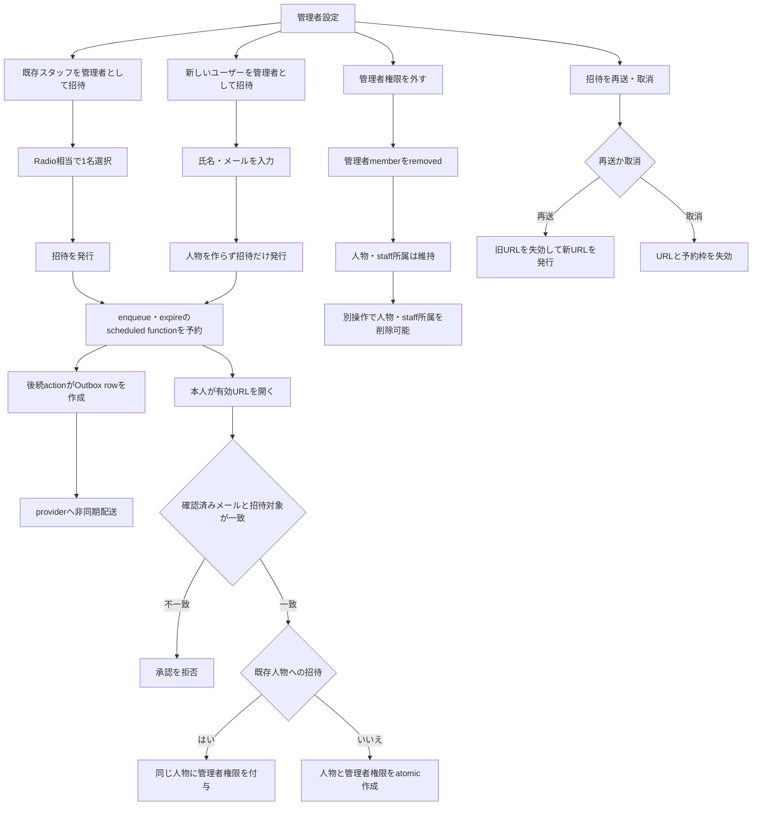

# 管理者設定ページ 実装計画

- 作成日: 2026-08-13
- 状態: Active（repository実装・標準検証完了、Preview / Production rollout未確認）
- 対象: 管理者の招待、再送、取消、権限解除、管理者人物の削除制約
- 基準UI: 2026-08-13に選定した第2案。`スタッフ兼務`バッジは表示しない
- 参考モック: `/Users/natani/.codex/generated_images/019ff707-7ec5-7173-8c23-b1b4099b7637/exec-ccc69067-c119-4971-ab1c-c080304d2cd2.png`（repo外の検討資料であり、product assetにはしない）

## 1. 結論

管理者に関する操作を、組織設定のモーダル、ユーザー詳細、Dashboardのスタッフ詳細へ分散させず、`/settings/managers` の専用ページへ集約する。

現行の招待基盤は、今回合意した安全契約の大部分をすでに満たしている。新しいユーザーは承認前に人物化せず、招待データとして氏名とメールアドレスを保持する。本人が有効な招待URLを開き、確認済みメールアドレスで本人性を証明した時点で、人物と管理者権限を同じtransaction内で作成する。既存スタッフへの招待、再送時の旧URL失効、取消、Freeの管理者交代も現行契約を再利用する。

主な新規実装は次の3点である。

1. 第2案を基準にした管理者設定ページと、2つの招待サブページを追加する。
2. 管理者ページ専用の小さなQuery DTOを追加し、「現在の管理者」「招待中」「操作可否」を正しい意味で投影する。
3. 管理者である人物の削除と個別店舗所属の解除を、すべてのcanonical mutationでサーバー側から拒否する。

保存documentのshape変更や既存データのbackfillは不要である。有効招待を期限付きでbounded readするため、`organizationInvitations`へ複合indexだけをWidenで追加する。旧画面のconsumerを残したまま新Queryと新画面を先に追加し、移行後に不要なDTOと画面責務を狭めるAPI互換の段階導入も行う。

## 2. 現行仕様の再評価

| 論点 | 現行仕様 | 今回の仕様との整合 | 実装方針 |
|---|---|---|---|
| 新規ユーザー招待 | `organizationInvitations`に氏名・メールを保存し、承認まで人物を作らない | 合致 | 現行の内部発行・承認処理を、新しいstrict issue APIから再利用する |
| 既存スタッフ招待 | 同一組織の既存人物を`targetPersonId`へ固定できるが、`createForPerson`はPaid時のstaff資格やreadOnlyを拒否しない | 一部不足 | 新しいstrict issue APIでstaff資格とmanager状態をtransaction内再検証する |
| 本人確認 | Clerk identityと確認済みメールアドレスを承認時に検証する | 合致 | client入力やURL parameterを認可根拠にしない |
| 招待URL | tokenをDBやOutboxへ平文保存せず、状態とversionを配送直前に再検証する | 合致 | 現行のcapability URLとOutboxを維持する |
| 再送 | `resend`だけでなく旧`create*`も暗黙に旧招待を失効して再発行する | 一部不一致 | 新画面はstrict issueと明示的`resend`を使い、旧consumer移行後に暗黙再発行をNarrowする |
| 取消 | issued招待を失効し、予約枠を解放する | 合致 | 招待一覧の「取り消す」から実行する |
| Freeの管理者交代 | 後任承認まで現管理者を維持し、承認transactionで交代する | 合致 | Freeでは追加ではなく交代として案内する |
| 管理者権限解除 | 人物とスタッフ所属を維持し、管理者memberだけを外す | 合致 | 操作文言を「管理者権限を外す」に統一する |
| 現在数の表示 | `billing.managerUsage.current`はactiveとpending additionを含むprojected値 | 不一致 | `active`、`pending`、`projected`、`max`を分けた専用DTOを返す |
| 操作画面 | 組織設定のTabsダイアログ、ユーザー詳細、スタッフ詳細へ分散 | 不一致 | 管理者設定ページへ集約し、旧操作UIを撤去する |
| 管理者人物の削除 | 他の管理者がいれば人物ごと削除できる経路がある | 不一致 | 管理者権限を先に外す不変条件へ変更する |
| 管理者の店舗所属解除 | manager roleを維持したままstaff所属を外せる経路がある | 不一致 | 個別解除を全mutationで拒否する。追加は許可する |
| 新規ユーザーへの案内 | 管理者招待メールはあるが、製品説明は限定的 | 一部不足 | 管理者招待メール1通を自己完結させる。スタッフ法務メールは流用しない |
| 機能公開 | 全導線を常時公開し、取消・期限切れ処理も維持する | 合致 | 公開設定は使わず、認可・プラン・上限・招待状態で操作可否を決める |

## 3. 確定するプロダクト仕様

### 3.1 専用ページ

- URLは`/settings/managers?shop=<shopId>`とする。
- ページ先頭は戻るアイコンと現在地のタイトル`管理者設定`だけを表示する。`← 組織設定`のような親ページ名は表示しない。
- 戻る操作は組織設定のスタッフtabへ戻す。既存の`updateSettingsTabSearch(..., "people")`を使い、既定tabの`people`はcanonical URLでは省略する。
- 組織設定のスタッフsectionにある入口は`管理者を変更`とする。
- 入口は招待枠が満杯でも表示する。枠が満杯でも、招待の再送・取消や管理者権限の確認が必要だからである。
- 入口ボタンの外観はDashboardの`スタッフを追加`と同じ`size="sm"`、ghost、teal foreground、semibold、icon gapの骨格へ揃える。
- 入口のloading placeholderもDashboardと同じ高さ36pxとButton既定の角丸を使う。幅だけは`管理者を変更`の文言に合わせ、長い`スタッフを追加`用の固定幅をそのまま流用しない。

### 3.2 ページ構成

上から次の順に表示する。

1. ページheader `管理者設定`
2. section `管理者を追加`
3. 2つの遷移カード
4. 利用状況 `管理者 n / max`、`招待中 n件`
5. section `現在の管理者`
6. section `送信済みの管理者招待`

遷移カードは次の文言を使用する。

| カード | 補足 | 遷移先 |
|---|---|---|
| 既存スタッフを管理者として招待 | 組織に登録済みのスタッフから選択 | `/settings/managers/invite-staff` |
| 新しいユーザーを管理者として招待 | 経営者・本部担当者などをメールで招待 | `/settings/managers/invite-new` |

Paidでは上記の選定文言を使う。Freeでは追加と誤解させないよう、sectionを`管理者を交代`、既存スタッフのカードを`既存スタッフを次の管理者として招待`へ変える。新しいユーザーのカードは非linkで表示し、`Freeでは組織内の既存スタッフと交代できます`と理由を示す。

`スタッフ兼務`バッジ、所属店舗一覧、LINE連携状態は管理者設定ページでは表示しない。管理者設定で必要なのは、誰が管理者か、招待がどうなっているか、次に何を操作できるかである。

### 3.3 現在の管理者

- 氏名、人物に保存されたシフト連絡先メールアドレス、本人なら`あなた`バッジを表示する。
- current managerのメールを`現在のログインメール`とは表記しない。`organizationPeople.email`はシフト連絡先であり、ClerkのPrimary Emailと継続同期する契約ではない。
- `active`と`readOnly`の管理者を一覧に含める。active利用数は`active`だけを数える。
- 選定したDefault UIに追加のrole badgeは置かない。ただし契約復旧中という例外状態を不可視にしないため、`readOnly`だけは状態専用の`閲覧のみ`バッジを表示する。`スタッフ兼務`バッジはどの状態でも表示しない。
- `readOnly`の権限解除を無効にする。専用Queryが表示用理由`契約状態を復旧してから変更できます`を返す。
- 操作は`管理者権限を外す`に統一する。
- 最後の有効な管理者は外せない。未承認の後任招待は有効な管理者に数えない。
- paid機能が使える状態で、別の有効な管理者がいる場合は、自分自身の権限解除を現行どおり許可する。確認文で`この組織へアクセスできなくなります`と明示し、成功後はアクセス可能な次の画面へ遷移する。本人の人物情報を後から削除する必要がある場合は、残った別管理者が行う。
- Freeでは個別の権限解除を許可しない。既存スタッフへの交代招待を使う。
- billing contactなど既存の解除前条件はサーバー能力値に従う。UIで条件を再実装しない。

### 3.4 送信済みの管理者招待

- 行には氏名、メールアドレス、状態、期限、`再送する`、`取り消す`を表示する。
- 状態は少なくとも`招待中`、`送信エラー`、`上限到達（現在は連携できません）`、`競合`を扱う。`limitReached`は自動再開される保留queueではなく、現在のcapacityでは承認できないというview状態である。
- status barの`招待中 n件`は、Paid追加とFree交代を含む現在有効なeffective issued招待を数える。accepted、revoked、expiredは数えない。
- 一覧は有効期限内のeffective issued招待だけを表示する。accepted、revoked、expiredの履歴一覧にはしない。
- 招待が期限切れになるとoperational listから外れる。再度招待する場合は2つの追加カードから同じ人物またはメールアドレスを指定する。初版では期限切れ招待の履歴閲覧・行内再送を扱わない。
- `再送する`は確認後に新しい招待を発行する。確認文で`以前の招待URLは使えなくなります`と明示する。
- 招待期限は現行の7日を維持する。再送した招待には再送時点から新しい7日の期限を設定する。
- `取り消す`は確認後に招待と予約枠を失効する。確認文で`招待URLは使えなくなります`と明示する。
- 成功toastは`送信を受け付けました`、`再送を受け付けました`とする。メールproviderへの到達を同期成功として断定しない。

### 3.5 既存スタッフを管理者として招待

- 専用サブページに組織内のスタッフを表示する。
- 店舗のスタッフ所属モーダルと同じlist cardの外観を基準にする。
- 一度に選べる人物は1名である。見た目の近さより操作の意味を優先し、DOMと支援技術上は`RadioGroup`相当の単一選択にする。
- 行クリックは選択だけを行い、footerの`管理者として招待する`で確定する。
- current manager、readOnly manager、同一対象への有効な招待、メールアドレスがない人物などは、サーバーが返す理由付きで選択不可にする。
- Paidでは管理者追加、Freeでは後任への交代招待として処理する。Freeの確認文には、承認されるまで現管理者が維持され、承認時に交代することを明記する。
- strict issue mutationは、同一組織のactive人物、有効な店舗に少なくとも1つの未削除staff所属、active/readOnly managerでないこと、有効な同一対象招待がないことをtransaction内で再検証する。他組織の人物ID、削除済み人物、staff資格のない人物を直接指定しても拒否する。
- Paidではstaff資格を発行時の選択条件とする。発行後にstaff所属だけが変わっても、人物自体と招待が有効なら承認を許可する。管理者は店舗staffでなくてもよいからである。Free交代は現行どおり承認時にもstaff資格を再検証する。

### 3.6 新しいユーザーを管理者として招待

- 専用サブページで氏名とメールアドレスを入力する。
- 送信時には`organizationInvitations`だけを作り、`organizationPeople`は作らない。
- 本人が有効な招待URLからログインまたは登録し、確認済みメールアドレスで本人性を証明した時点で、人物と管理者memberを同じtransaction内で作る。
- 同じ組織に同一正規化メールアドレスの人物がすでにいる場合は、重複人物を作らず現行どおりその人物へ固定する。既存人物の氏名は入力値で上書きしない。
- 同一メールの既存人物にactiveまたはreadOnlyのmanager memberがある場合は、新しい招待を発行せず、既存の管理者状態または契約復旧へ案内する。
- Freeでは新規ユーザー招待を無効にする。Freeの管理者交代は既存スタッフだけを対象とする。
- 一度に1名だけ招待する。複数人一括招待、部分成功、CSV入力は初版に含めない。

### 3.7 招待メール

- 新規ユーザー向けにスタッフ招待メールを追加送信しない。
- スタッフ追加時の法務同意・店舗・LINE案内はstaffとshopを前提にしており、店舗スタッフではない経営者や本部担当者へ流用しない。
- 招待発行1回につき、既存スタッフ、新しいユーザーともに管理者招待メールを正確に1件だけenqueueし、その1通を自己完結させる。
- 管理者招待メールには、短い`シフトリとは`、招待した組織名、管理者ができること、登録済みならログインできること、未登録なら登録して承認すること、期限を含める。
- 再送は同じ完全な管理者招待メールを送る。案内メールだけを別管理・別再送しない。
- 承認完了後にactive managerへ送る既存の別目的の連携完了通知は維持し、CTAを`管理者設定を確認する`、リンク先を代表店舗の`/settings/managers?shop=...`へ変更する。これは招待発行時の1件には数えない。

## 4. 画面遷移と永続状態



画面の閉じる操作やnavigationは、招待の永続状態を変更しない。招待発行、再送、取消、権限解除は、明示的な確認とmutation成功によってだけ確定する。

## 5. UI詳細契約

### 5.1 Desktop

- `AuthenticatedPageContent`と既存の最大幅を使う。
- 2つの招待カードは2列gridにする。
- カードは白い操作面、neutral border、neutral hoverとし、低階調tealをButton rootの背景にしない。
- tealの使用はカード内のicon tile、avatar、badgeなど許可された面に限る。
- 利用状況は2セルの横並びにし、`管理者`と`招待中`の意味を分ける。
- current managerとinvitationは、1人物1行のlist cardにする。

### 5.2 Mobile

- 招待カードを1列に積む。
- 利用状況は2列を維持する。
- manager行は人物情報の下へactionを全幅で置く。
- invitation行は人物情報、状態・期限、2つのactionの順で積む。
- tap targetは44px以上とし、footer actionはsafe areaを考慮する。
- 長い氏名とメールアドレスで横scrollを発生させない。

### 5.3 Loading、empty、error

- Skeletonは完成画面と同じheader、2枚のカード、利用状況、2つのlist sectionを再現する。
- header Skeletonは、実画面と同じ戻るアイコン1つとタイトルだけにする。
- pendingがない場合は`送信済みの管理者招待はありません`を中立的に表示する。
- current managerが0件は通常のempty stateにしない。組織不変条件の破損としてfail-safe errorを表示し、変更操作を無効にする。
- Queryまたはmutation中にcapabilityが変わった場合は、古い確認ダイアログを閉じ、最新の無効理由を表示する。
- feature flagが閉じている場合は入口を非表示にし、直URLから管理者データを開けないようsettingsへ戻す。

### 5.4 確認ダイアログ

ページ遷移で行うのは、メインページと2つの招待入力フローである。次の不可逆または副作用のある最終確認だけは小さなダイアログに残す。

| 操作 | 確認に含める内容 |
|---|---|
| 既存スタッフを招待 | 対象人物、送信先、Paidの追加またはFreeの交代 |
| 新しいユーザーを招待 | 氏名、送信先、承認まで人物を作らないこと |
| 再送 | 以前のURLが失効すること |
| 取消 | 招待URLと予約枠が失効すること |
| 管理者権限を外す | 組織への管理権限を失うこと、人物とstaff所属は残ること、その管理者が発行した未承認招待は取り消されること |

## 6. 既存UIの流用と責務移動

| 目的 | 流用元 | 方針 |
|---|---|---|
| 組織設定の入口 | `src/components/features/OrganizationSettings/PeopleSection.tsx`、`src/components/features/Dashboard/StaffRoster/index.tsx` | 文言を`管理者を変更`にし、Dashboardのghost button骨格へ揃える |
| 選択肢カード | `src/components/features/Dashboard/StaffManagement/StaffInvitationDialog.tsx` | icon、title、helper、chevron、spacingを踏襲した管理者設定内の`ManagerActionCard`とする。routeとdisabled理由を所有し、現時点では汎用UIへ抽出しない |
| ページheader | `src/components/ui/DetailPageHeader/` | iconなしのheaderと、それに一致するSkeletonを扱えるようにする |
| スタッフ選択list | `src/components/ui/CheckboxListCard/`、`src/components/features/ShopDetail/ShopStaffMembershipDialog.tsx` | border、row高、avatar、余白、dividerを踏襲し、管理者設定内にChakra `RadioCard`の単一選択listを作る。checkbox componentの責務は広げない |
| 利用状況 | `src/components/features/OrganizationSettings/OrganizationUsageSection.tsx` | 見た目だけを踏襲し、projected値を現在数として再利用しない |
| current manager / invite list | `PeopleSection`のlist card | card shellとresponsive tokenを踏襲する。drilldown前提の人物rowそのものは使わない |
| confirm / async guard | 既存`Dialog`、`useSingleFlight`、`ManagerAssignmentConfirmation` | 既存スタッフの追加・Free交代確認には共通確認を使う。外部招待、再送、取消、権限解除は要件を満たすfeature内確認とし、重複送信防止、処理中close lock、focus restorationを維持する |
| capability理由 | 既存`Alert`とsemantic color | カード直下またはカード内へ理由を表示する。`PeopleCapacityResolutionAlert`は人物上限エラーにだけ流用し、一般的な管理者capability表示には使わない |

旧`ManagerInvitationDialog`のTabs構造は流用しない。新ページへ契約を移した後、次を整理する。

- `src/components/features/OrganizationSettings/ManagerInvitation/`
- `src/components/features/OrganizationSettings/OrganizationSettingsView.tsx`のdialog責務
- `src/components/features/UserDetail/`の管理者招待・権限解除操作
- `src/components/features/Dashboard/StaffRoster/StaffDetailSettingsTab.tsx`と`src/components/features/Dashboard/StaffManagement/useStaffManagerInvitation.ts`の管理者招待・権限解除操作

UserDetailとDashboardには管理者状態の表示、および必要なら`管理者設定で変更`の導線だけを残す。staff削除の禁止表示は残すが、正本はサーバー側guardとする。

## 7. Routeとfrontend構成

`src/routes/_auth/settings.tsx`はOutletを持たないleafであるため、URLだけを`/settings`配下にし、route tree上は`_auth`直下へ逃がす既存規約を使う。

| URL | route file | page責務 |
|---|---|---|
| `/settings/managers` | `src/routes/_auth/settings_.managers.tsx` | overview、current managers、pending invitations |
| `/settings/managers/invite-staff` | `src/routes/_auth/settings_.managers_.invite-staff.tsx` | 既存スタッフ1名の選択と確認 |
| `/settings/managers/invite-new` | `src/routes/_auth/settings_.managers_.invite-new.tsx` | 氏名・メール入力と確認 |

- 各routeは`shop` search paramを検証し、同じselected organizationに解決する。
- 操作可能なカードだけRouterの`Link`とintent preloadを使う。操作不可時は非link cardへ切り替え、serverが返す理由を常に見える形で表示して遷移を止める。
- subpageの戻る操作は`/settings/managers?shop=...`へ戻す。
- metadata titleは`管理者設定`、robotsは`noindex`とする。
- `src/routeTree.gen.ts`はgeneratorに任せ、手動編集しない。
- page、controller、view、Storyの依存方向は`Page → Controller → View`を守る。

## 8. 管理者ページ専用Query

組織設定全体の`getSettings`は、人物、staff、店舗、課金状態、履歴を広く読む。管理者専用ページでは必要データだけを読む専用Queryを追加する。

### 8.1 Overview DTO

概念上、次を返す。

```ts
type ManagerSettingsOverview =
  | { kind: "hidden" }
  | { kind: "integrityError"; message: string }
  | {
      kind: "ready";
      organizationName: string;
      mode: "managerAddition" | "freeManagerExchange" | "restricted";
      usage: {
        activeManagers: number;
        activeInvitationCount: number;
        pendingAdditions: number;
        pendingExchanges: number;
        projectedManagers: number;
        maxManagers: number;
      };
      actions: {
        canInviteExistingStaff: boolean;
        existingStaffDisabledReason?: string;
        canInviteExternal: boolean;
        externalDisabledReason?: string;
      };
      managers: Array<{
        personId: Id<"organizationPeople">;
        name: string;
        contactEmail: string;
        role: "active" | "readOnly";
        isSelf: boolean;
        canRemoveRole: boolean;
        removeRoleDisabledReason?: string;
      }>;
      invitations: Array<{
        invitationId: Id<"organizationInvitations">;
        name: string;
        invitedEmail: string;
        purpose: "managerAddition" | "freeManagerExchange";
        status: "pending" | "sendFailed" | "limitReached" | "conflict";
        expiresAt: number;
        canResend: boolean;
        canRevoke: boolean;
      }>;
    };
```

- Queryは最初にfeature flagを評価し、closedなら人物・招待のPIIを読む前に`hidden`を返す。frontend envや`can* === false`から推測しない。
- `activeManagers`は検証済みのactive membershipだけを数える。表示用の有効manager数とcapacity正本のmanager countが一致しない場合は、通常の数値を混在させず`integrityError`として全actionを閉じる。
- `projectedManagers`をUIの`現在の管理者`として表示しない。
- legacy invitationの意味は`getOrganizationInvitationLifecycleStatus`と`getOrganizationInvitationPurpose`へ揃える。ただし既存`collectIssuedInvitationsByOrganization`は期限を評価せず`.collect()`するため、Overviewからは直接使わない。
- schemaへ`by_organizationId_and_status_and_expiresAt`を追加する。`convex/organizationInvitation/lifecycle.ts`へ、`organizationId`、`now`、`limit`を受けるbounded readerを新設し、raw `issued`とlegacy `pending`をindex上で`expiresAt > now`に絞って各`take(limit + 1)`し、決定的にmergeする。既存helperの挙動はrolling consumerのため変更しない。
- 招待氏名は既存人物名、`invitedName`、メールlocal-partの順で安全にfallbackする。
- 認可済みの同一tenantへ、画面に必要な氏名と連絡先だけを返す。token、tokenDigest、Clerk user ID、通知job、別tenantの情報は返さない。
- active / readOnly managerはplan上限に異常検知用の1件を加えた`take(max + 1)`で読む。有効なeffective issued invitationは、policy由来のoperational最大件数に異常検知用の1件を加えたbounded readerの合算結果で超過判定する。どちらも切り捨てず`integrityError`にする。
- operational invitation listは有効なeffective issuedだけを期限昇順、IDで決定的に並べる。件数はplan上限でboundedなのでpaginationしない。
- `can*`と無効理由はserver policyから導出する。clientで課金状態、最後の管理者、Free交代を再判定しない。

### 8.2 既存スタッフ候補DTO

候補一覧はサブページを開いた時だけ購読する。

```ts
type ManagerCandidate = {
  personId: Id<"organizationPeople">;
  name: string;
  contactEmail: string;
  canSelect: boolean;
  disabledReason?: string;
};
```

- 同一組織のactive人物で、少なくとも1つの有効なstaff所属を持つ人物を対象にする。
- current manager、readOnly manager、有効な管理者招待がある人物、メールがない人物を理由付きで選択不可にする。
- Freeの候補条件は現行`freeManagerPersonId`と交代policyを再利用する。
- 候補はpeople plan上限に異常検知用の1件を足した`take(maxPeople + 1)`で読み、氏名とIDで決定的に並べる。超過時は部分一覧を返さず操作を閉じる。メインページでは購読しない。

### 8.3 Rolling compatibility

1. 専用Queryと既存DTOを同時に提供する。
2. 暗黙再発行を行わない新しいstrict issue APIを追加する。既存の`createExternal`、`createForPerson`、`createForStaff`と、その`reissueExisting: true`の挙動は旧clientのために維持する。
3. 新ページを専用Query、strict issue API、明示的`resend`へ接続する。
4. 組織設定、UserDetail、Dashboardから旧操作consumerと、それに対応するStory / controller testを外す。
5. consumerがないことを確認してから、`getSettings`、`getDashboardStaffs`、UserDetail DTOの不要な管理者操作fieldを狭める。
6. 旧`create*` APIの暗黙再発行testをNarrow時に反転し、不要なAPIは削除またはprivate化する。

保存済みfieldの形は変わらないため、data backfillは行わない。複合indexだけをWidenし、利用するQueryと同じdeployへ含める。`invitedName`と`purpose`のoptional互換も今回に便乗してrequired化しない。

## 9. 招待mutationと非同期契約

### 9.1 新設・再利用するAPI

- 発行: 新設する`api.organizationInvitation.mutations.issue`
- 再送: `api.organizationInvitation.mutations.resend`
- 取消: `api.organizationInvitation.mutations.revoke`
- 標準承認: `api.organizationInvitation.acceptanceActions.accept`
- 権限解除: `api.organization.mutations.removeManagerRole`

`issue`は`recipient`を、`{ kind: "existingStaff", personId }`または`{ kind: "external", invitedName, email }`のunionで受ける。既存の共通発行serviceを再利用するが、次を新しいpublic境界で保証する。

- `existingStaff`は、同一組織のactive人物、active shopにある未削除staff所属、active/readOnly memberなしをtransaction内で確認する。
- `external`は、同一メールの既存人物を安全に再利用するが、active/readOnly memberがあれば拒否する。
- 同一targetまたは同一emailの有効な招待があれば`alreadyPending`を返し、旧招待をrotateしない。
- feature flag、actor、tenant、billing、plan、人物・管理者上限、rate limit、予約枠を発行時に再検証する。
- accept時もtenant、identity、verified email、target、status、expiry、version、capacityを再検証する。

rolling deploy用の`api.organizationInvitation.mutations.linkAccount`と`.accept`は標準経路にせず、新画面から呼ばない。

### 9.2 冪等性と重複操作

- frontendは確認操作ごとに`requestId`を1つ生成し、結果不明のretryでは同じ値を使う。別対象や別操作では新しい値を使う。
- `useSingleFlight`で同じ画面からの二重送信を防ぐ。
- backendでauditから既存結果へ収束する場合は、既存の結果documentから元のintentを照合する。`existingStaff`はperson ID、`external`は正規化emailと正規化氏名、`resend`は元invitation IDと後継のpredecessor、`revoke`と権限解除はtarget IDを比較する。purposeはuser入力ではなくserverがplanから導く結果として、現在も利用可能かを別に確認する。
- 同じrequestIdでもintentが違う場合、quota、scheduler、audit、DB更新より前に副作用0で拒否する。既存documentから十分に照合できないlegacy結果は、別対象の成功へ誤収束させずfail closedにする。新しいschema fieldやintent hashは追加しない。
- 新ページでは同一対象への新規招待を暗黙の再送操作にしない。`alreadyPending`なら管理者設定の該当行へ戻し、URL rotationは`再送する`からだけ行う。旧`create*`の暗黙再発行はrolling compatibility期間だけ残す。
- Outbox dedupeはinvitation IDとversionを正本にし、旧versionのjobはprovider呼出し前にcancelする。

### 9.3 成功の意味

- mutation成功は、招待document、token digest、期限、およびenqueue / expire scheduled functionの予約がtransaction内で確定したことを意味する。
- scheduled actionが後続でOutbox rowを作成し、その後にproviderへ配送する。Outbox作成、provider受付、受信箱への到着、本人の承認はそれぞれ別状態である。
- UI、toast、testはこの境界を混同しない。

## 10. 「管理者は先に権限解除」の不変条件

### 10.1 変更する契約

activeまたはreadOnlyの管理者memberを持つ人物について、次を常に拒否する。member rowが重複し、管理者状態を一意に確認できない場合もfail closedにする。

| 経路 | 現行の問題 | 新しい契約 |
|---|---|---|
| `removePersonFromOrganization` | 他の管理者がいれば人物ごと削除できる | `先に管理者権限を外してください`で拒否する |
| `removePersonFromShop` | managerを維持してstaff所属だけ外せる | 個別店舗所属の解除を拒否する |
| `changeOrganizationPersonShopMemberships` | desired setからmanagerの店舗を外せる | removalが1件でも含まれればtransaction全体を拒否する |
| `changeOrganizationShopStaffMemberships` | 店舗側一覧からmanagerを外せる | 選択済みmanagerの解除を拒否する |

共通のbusiness guardを`convex/organization/service.ts`など既存service境界に置き、各mutationのtransaction内で再確認する。UIのdisabled状態を認可根拠にしない。

### 10.2 許可すること

- 管理者権限を外した後、別操作で人物やstaff所属を削除する。
- 店舗に所属していない管理者をstaffとして新しく追加する。
- desired setに追加だけを含む変更を行う。
- 店舗または組織そのものを削除する既存のresource-wide cleanupを実行する。

店舗・組織全体の削除は、個別人物操作とは別のlifecycleであり、先に全管理者を手動解除する要件にはしない。

### 10.3 権限解除後に維持するデータと副作用

- `organizationPeople`とstaff所属は維持する。
- manager memberだけをremovedにする。
- 対象管理者が発行した有効な管理者招待は現行どおり失効する。
- manager / billing向け通知予約は止める。
- staffとして必要な通知予約は維持する。
- user detailの`canRemove`と店舗所属の`canChange`も同じpolicyから導出する。

## 11. Plan、role、状態別の操作

| 状態 | 既存スタッフ招待 | 新規ユーザー招待 | 個別権限解除 | 備考 |
|---|---|---|---|---|
| Free | 交代として可 | 不可 | 不可 | 後任承認時にatomic交代する |
| Trial / Pro / Business / complimentary Business | 上限内で可 | 上限内で可 | 条件を満たせば可 | pending枠もserverで再検証する |
| 最後のactive manager | 可 | planに従う | 不可 | pending後任はactiveに数えない |
| 自分自身 | planに従う | planに従う | 別active managerがいれば可 | 成功後に組織アクセスを失う |
| readOnly / restricted recovery | 閲覧のみ | 閲覧のみ | 不可 | 契約状態の復旧を先に行う |
| feature flag closed | 入口と発行を閉じる | 入口と発行を閉じる | 現行server契約を維持 | 取消・期限切れcleanupは残す |

画面はこの表を独自に再現せず、Queryが返すcapabilityと理由を表示する。

## 12. Security Lens

### 12.1 Actor、asset、boundary

| 種別 | 対象 |
|---|---|
| Actor | active manager、readOnly manager、招待された既存スタッフ、外部招待者、別組織の利用者 |
| Asset | 組織全体の管理権限、人物・staff情報、確認済みidentity、招待token、予約枠、送信先メール |
| Boundary | 認証済みpage→Convex manager API、public承認URL→Clerk Backend検証、Convex→Outbox→メールprovider |

### 12.2 主なabuse caseと対策

| Abuse case | Server-side enforcement |
|---|---|
| 別組織のpersonIdやinvitationIdを指定する | callerのorganization membershipからtenantを解決し、対象documentのorganizationIdを照合する |
| 別人が招待URLを受け取って承認する | verified emailまたは既存user linkを承認transactionで検証する |
| 取消・再送後の旧URLを再利用する | token digest、status、expiry、version、actor email / targetを検証し、旧tokenを失効する。`predecessorInvitationId`は履歴lineageであり認可根拠にしない |
| clientのdisabled操作を直接APIで迂回する | plan、limit、role、last-manager、削除guardをmutation内で再確認する |
| 別のstaff所属変更APIから管理者を削除する | 4つのcanonical mutationすべてに同じfail-closed guardを置く |
| 連打や通信結果不明でメールを重複送信する | single-flight、requestId intent照合、Outbox dedupe、rate limitを使う |
| tokenや不要なPIIが漏れる | 認可済みQueryは同一tenantの必要最小限の氏名・連絡先だけを返す。Outboxは宛先などの配送metadataとinvitation参照だけを保持し、生tokenとHTMLを保持しない。token、別tenant PII、Clerk IDをDTOへ出さず、PIIをlog・audit・E2E artifactへ出さない |

## 13. テスト計画

変更契約ごとに主担当層を1つ選び、同じことを各層へ重複させない。

### 13.1 Logic / Frontend Unit

- server DTOから利用状況、招待状態、期限の表示labelへ変換する純粋なpresentation logic。
- role removal後の遷移先決定。
- stable requestIdを結果不明retryで維持し、別intentでは更新するcontroller契約。
- `useSingleFlight`により同じ同期操作を1回だけ開始するcontroller契約。

### 13.2 Storybook Behavior / VRT

主担当は新ページの表示・操作契約である。

- Main: Default、招待なし、上限到達、Free、readOnly、restricted、長い氏名・メール、Loading、Error。
- Existing staff: 1名選択、選択不可理由、候補なし、Free交代確認。
- New user: validation、Free disabled、確認。
- Dialog: invite、resend、revoke、remove role、self removal。
- Behavior: action card遷移、Radio単一選択、未選択submit不可、代表componentでの二重操作防止接続、stale capability、focus restoration。
- Main pageのMobile VRTは`vrt-mobile1`、2つのsubpageと確認dialogは`vrt-mobile2`へ固定する。viewport parameterだけで済ませない。
- Main SkeletonはPC 2列／SP 1列のaction card、status bar、manager row、invitation rowを完成状態と一致させる。manager actionと招待の2 actionは異なる幅を再現する。
- Existing staff subpageにはheader、Radio list row、確定領域のSkeletonを用意し、取得失敗、候補0件、全候補選択不可を別Storyで検証する。
- New user subpageにはheader、2 input、確定領域のSkeletonを用意する。
- クリックやfocusだけを検証するBehavior専用Storyには`screenshot.skip`を付け、初期表示、Loading、長文、mobileだけをVRT対象にする。

### 13.3 Convex Function Test

主担当は認可、DTO、上限、削除不変条件である。

- Overview DTOが`hidden`をPII読取前に返し、closed時の直URLを閉じる。
- Overview DTOがactive/readOnly/isSelf、active count、pending count、purpose、capabilityを正しく返す。
- projected countをactive countとして返さない。
- legacy invitationのeffective lifecycle、name、purpose fallback。
- raw legacy `pending`かつ`expiresAt <= now`を招待中に数えず、raw `issued` / `pending`合算がpolicy上限を超える場合に`integrityError`として閉じる。
- valid manager countとcapacity countの不一致、manager / invitationのbounded read超過を`integrityError`として閉じる。
- 有効なissued / pendingの期限昇順とIDによる決定的順序、accepted / revoked / expired除外。
- token、tokenDigest、Clerk ID、別組織情報を返さず、同一tenantに必要な連絡先だけを返す。
- Candidate Queryが同一組織、active人物、staff資格、メール、pending、manager状態を検証する。
- strict `issue`がexisting staffの有効所属とactive/readOnly member不在をtransaction内で再確認し、Paidの発行後staff解除とFreeの承認時再検証を区別する。
- strict `issue`が既存pendingをrotateせず`alreadyPending`へ収束する一方、compatibility中の旧`create*` contractはNarrowまで維持する。
- issue、resend、revoke、remove roleで別組織IDを拒否する。
- requestIdが同じでperson ID、normalized email / name、元invitation ID、target IDが異なるintentを副作用0で拒否する。
- `removePersonFromOrganization`、`removePersonFromShop`、2つのdesired-set mutationでactive/readOnly managerの解除を拒否する。
- 拒否時に人物、staff、assignment、audit、scheduler、Outboxへ副作用がない。
- manager removalを含むmixed desired setが部分成功せず、全体を拒否する。
- managerのstaff追加だけは許可する。
- `removeManagerRole`後は別managerが人物・staff所属を削除できる。
- resource-wideなshop / organization削除は既存契約を維持する。
- 発行mutation成功時に招待rowとenqueue / expire scheduled jobが正確に1組予約される。
- enqueue action実行後のOutbox状態と、配送失敗時の`sendFailed` view投影を検証する。
- 既存スタッフ・外部の各発行で管理者招待email jobが1件、staff法務・LINE案内が0件である。
- 再送で新versionの管理者招待email jobが1件だけ予約され、旧versionはprovider呼出し前にcancelされる。
- `convex/notification/templates.test.ts`で自己完結した本文とHTML escapeを完全一致または構造で検証する。
- Outbox payloadがreference-onlyで、生tokenとrender済みHTMLを保持しないことを対応Function / Scenario Testで検証する。
- 承認完了通知のCTAが`/settings/managers?shop=...`であることを`convex/notificationOutbox/actions.test.ts`または対応action testで検証する。

現行で反対の成功を期待している次のtestは、新しい契約へ反転する。

- `convex/organization/mutations.test.ts`
- `convex/staff/mutations.test.ts`
- `convex/organization/userDetailQueries.test.ts`

### 13.4 Convex Scenario Test

- `convex/_scenario/staffManagerInvitation.test.ts`をstrict `issue`と標準`acceptanceActions.accept`へ更新し、同じpersonとstaffを使う正規経路を確認する。
- 外部招待の`acceptanceActions.test.ts`をstrict `issue`起点へ更新し、承認前personなし、承認時のperson / manager member 1回作成を確認する。
- `convex/_scenario/organizationManagerExchange.test.ts`をstrict `issue`と標準`acceptanceActions.accept`へ更新し、Free交代と前任staff維持を確認する。
- 旧`create*`と`linkAccount`のrolling互換は、正規Scenarioと混ぜずNarrowまで既存Function Testで維持する。
- 既存の再送・取消testで旧token失効を維持する。
- 新規Scenarioは、role解除後に別managerが人物を削除できる複数API lifecycleだけにする。
- scheduled queueを進めた後、招待発行と再送それぞれでOutboxのchannel、recipient、purpose、version、件数を完全一致で確認する。

### 13.5 E2E

代表導線を1本追加する。

`[E2E-MANAGER-01] 組織設定から管理者設定を開き、既存スタッフへ招待し、再読込後も招待中を確認して取り消し、スタッフtabへ戻る`

E2Eではroute、実認証、frontend、Convex mutation、reactive永続状態だけを確認する。メールproviderへの実配送、外部招待者の承認、Free交代、削除guardはFunction / Scenario Testを主担当とする。

- Preview E2Eで常時公開の管理者招待導線を検証する。
- actorが所有する一意なseedとresetを`convex/testing.ts`、`convex/testing.test.ts`、`e2e/helpers/managerSettingsScenario.ts`に追加し、`afterEach`で自分が作成した招待だけをcleanupする。
- scenarioとPage Objectに加え、`scripts/assertE2ECoreResults.mjs`とそのtestへ`E2E-MANAGER-01`を追加する。desktop coreは7件から8件、全coreは8件から9件になる。
- `scripts/assertE2EBurnInResults.mjs`とそのtestへ同じcontract IDを追加し、10回反復とunexpected 0をgateする。
- `e2e/AGENTS.md`、`doc/manual/ci-cd.md`、`.github/workflows/playwright.yml`の件数とfeature flagを同じ差分で更新する。
- PIIを含む画面なので、成功・失敗を問わずscenarioへ`test.use({ trace: "off", screenshot: "off", video: "off" })`を設定する。
- 既存Full Regressionで保留されている管理者招待契約を、今回の確定仕様へ更新する。

## 14. 実装フェーズ

### Phase 0: 仕様テストを先に固定

- current countとprojected countの差をFunction Testで固定する。
- 4つの管理者削除・所属解除経路を失敗契約へ反転する。
- 新ページの主要Storyを作り、選定UIとresponsive状態を固定する。

### Phase 1: Backend Widen

- 管理者overview Queryと候補Queryを追加する。
- feature hidden、integrity error、capability、legacy lifecycle fallback、bounded readを既存policyから投影する。
- 暗黙再発行をしないstrict `issue` APIを追加し、既存の3つの`create*` APIは旧consumerのため変更しない。
- requestIdのintent照合を追加する。
- 既存Queryとmutation signatureはまだ削除しない。

### Phase 2: 削除不変条件

- 共通のmanager protection guardを追加する。
- 4つのmutationへtransaction内再検証を入れる。
- person capability、user detail、shop membership DTOを同じpolicyへ揃える。
- role解除後の削除成功まで検証する。

### Phase 3: 専用ページ

- 3 routesとPage / Controller / Viewを追加する。
- feature内の`ManagerActionCard`とRadio相当list rowを、既存UIのtokenを踏襲して実装する。
- Main、existing staff、new user、Skeleton、Empty、Error、Mobileを実装する。
- confirm dialog、single-flight、stable requestId、toastを接続する。

### Phase 4: 入口と責務の集約

- 組織設定の`管理者を招待`を`管理者を変更`のpage linkへ置換する。
- old Tabs dialogを削除する。
- UserDetailとDashboard staff detailから招待・権限解除操作を撤去する。
- status表示と`管理者設定で変更`の導線だけを必要な場所へ残す。
- 旧dialog、controller、UserDetail、Dashboard manager actionのStory / testを新ページのStory / testへ移管してから削除する。

### Phase 5: 通知と文書

- 管理者招待メールを自己完結する内容へ更新する。
- 承認完了通知のlinkを`/settings/managers`へ変更する。
- `doc/features/organization-billing.md`を専用ページ、再送、Free交代へ更新する。
- `doc/features/user-detail.md`と`doc/features/shop-settings.md`を、先に管理者権限を外す契約へ更新する。
- `doc/features/manager-shop-membership.md`と課金business flowの反対記述を更新する。
- `doc/specs/full-regression-contracts.md`で管理者招待の対象外を解除する。
- `doc/plans/INDEX.md`に残る`管理者招待は仕様確定まで対象外`の記述を、新計画への移管へ更新する。
- E2E契約、CI/CD、Full Regressionの対象表を更新する。

### Phase 6: API Narrow

- 新旧consumerの利用箇所を検索して0件を確認する。
- `getSettings`、`getDashboardStaffs`、UserDetail DTOの旧操作専用fieldを削除する。
- 旧`createExternal`、`createForPerson`、`createForStaff`の暗黙再発行contract testを反転し、不要なAPIを削除またはprivate化する。
- Narrowは旧frontendが残るdeploymentと同時に行わない。

## 15. 主な変更予定ファイル

### Frontend

- `src/routes/_auth/settings_.managers.tsx`
- `src/routes/_auth/settings_.managers_.invite-staff.tsx`
- `src/routes/_auth/settings_.managers_.invite-new.tsx`
- `src/pages/manager-settings/`
- `src/components/features/OrganizationSettings/PeopleSection.tsx`
- `src/components/features/OrganizationSettings/ManagerInvitation/`
- `src/components/features/UserDetail/`
- `src/components/features/Dashboard/StaffRoster/StaffDetailSettingsTab.tsx`
- `src/components/features/Dashboard/StaffManagement/useStaffManagerInvitation.ts`
- `src/components/features/Dashboard/StaffManagement/StaffInvitationDialog.tsx`
- `src/components/ui/DetailPageHeader/`

### Convex

- `convex/schema.ts`
- `convex/organization/queries.ts`または責務を分けたmanager query module
- `convex/organization/personCapabilities.ts`
- `convex/organization/managerInvitationState.ts`
- `convex/organization/mutations.ts`
- `convex/organization/service.ts`
- `convex/organization/userDetailQueries.ts`
- `convex/staff/mutations.ts`
- `convex/staff/service.ts`
- `convex/organizationInvitation/mutations.ts`
- `convex/organizationInvitation/acceptanceActions.ts`
- `convex/organizationInvitation/lifecycle.ts`
- `convex/organizationInvitation/queries.ts`
- `convex/organizationInvitation/actions.ts`
- `convex/notification/templates.ts`
- `convex/notificationOutbox/actions.ts`

### Test、E2E、文書

- 対応する`.test.ts`、`.stories.tsx`、Scenario Test
- `src/components/features/OrganizationSettings/ManagerInvitation/ManagerInvitationDialog.stories.tsx`
- `src/components/features/OrganizationSettings/controllers.test.tsx`
- `src/components/features/UserDetail/useUserManagerActions.test.ts`
- `src/components/features/UserDetail/index.stories.tsx`
- `src/components/features/Dashboard/StaffManagement/useStaffManagerInvitation.test.ts`
- `convex/organizationInvitation/acceptanceActions.test.ts`
- `convex/organizationInvitation/mutations.test.ts`
- `convex/notification/templates.test.ts`
- `convex/notificationOutbox/actions.test.ts`
- `convex/_scenario/staffManagerInvitation.test.ts`
- `convex/_scenario/organizationManagerExchange.test.ts`
- `e2e/scenarios/manager-settings.test.ts`
- `e2e/pages/`
- `e2e/helpers/managerSettingsScenario.ts`
- `convex/testing.ts`
- `convex/testing.test.ts`
- `scripts/assertE2ECoreResults.mjs`
- `scripts/assertE2ECoreResults.test.ts`
- `scripts/assertE2EBurnInResults.mjs`
- `scripts/assertE2EBurnInResults.test.ts`
- `e2e/AGENTS.md`
- `.github/workflows/playwright.yml`
- `doc/features/organization-billing.md`
- `doc/features/user-detail.md`
- `doc/features/shop-settings.md`
- `doc/features/manager-shop-membership.md`
- `doc/specs/organization-billing-business-flow.md`
- `doc/specs/full-regression-contracts.md`
- `doc/manual/ci-cd.md`

## 16. 検証コマンド

局所testを先に実行し、最後にrepository標準検証を行う。

```bash
pnpm vitest --project=logic --run <対象Logic Test>
pnpm vitest --project=ui --run <対象Behavior Test>
pnpm vitest --project='convex(logic)' --run <対象Function Test>
pnpm vitest --project='convex(scenario)' --run <対象Scenario Test>
pnpm e2e e2e/scenarios/manager-settings.test.ts --project=desktop-chromium --retries=0 --workers=1
pnpm e2e:ci
pnpm e2e:burn-in
pnpm docs:check
pnpm lint
pnpm type-check
pnpm test
pnpm build
```

VRTはローカルで新規実行せず、CIでdesktopとmobileの差分を確認する。開発サーバーは既存のものを使い、Agentが新しく起動しない。

## 17. 受入条件

- `/settings/managers`が第2案の情報順序で表示され、`スタッフ兼務`バッジがない。
- `管理者`の現在数と`招待中`が別々の意味で正しく表示される。
- 既存スタッフはRadio相当で1名だけ選び、Paid追加またはFree交代として招待できる。
- 新しいユーザーは承認前に人物が作られず、承認時に人物と管理者権限がatomicに作られる。
- 再送すると旧URLが失効し、取消後は承認できない。
- manager invite email 1通だけで、初めての利用者にも必要な説明が伝わる。
- 最後の管理者、Free、readOnly、上限到達、billing制約をserver capabilityに従って正しく無効化する。
- active/readOnly managerを、4つのcanonicalな人物削除・個別所属解除経路から削除できない。
- 先に管理者権限を外した後は、既存の人物・staff削除フローを実行できる。
- organization / shop全体の削除cleanupは壊さない。
- Queryは認可済み同一tenantの必要最小限の氏名・連絡先だけを返し、別組織情報、Clerk ID、tokenを返さない。Outboxは宛先などの配送metadataとinvitation参照だけを保持し、生token・HTMLを保持しない。PIIをlog、audit、E2E artifactへ残さない。
- Storybook、Function、Scenario、代表E2Eがそれぞれ担当契約を検証し、標準検証が通る。

## 18. 対象外

- 複数人の一括招待・一括権限解除。
- CSVによる管理者招待。
- 管理者招待とは別の製品紹介メールqueue。
- 店舗スタッフではない管理者を承認前に`organizationPeople`へ作ること。
- 招待履歴すべてを閲覧する監査画面。
- readOnly membershipを契約復旧せず直接解除する新API。
- 店舗または組織全体の削除lifecycleの再設計。
- 今回のrepository実装と同時にProductionでfeature flagを有効化すること。

## 19. Rollout

1. devでFunction / Scenario / Storybookを通す。
2. Previewでfeature flagを有効にし、代表E2EとVRTを確認する。
3. WidenされたAPIと新frontendを先にdeployする。
4. 旧consumerがなくなったことを確認してAPI Narrowをdeployする。
5. Productionでのfeature flag有効化は別の公開判断とし、repository実装完了から推測しない。
6. 実環境で発行、再送、取消、承認、Free交代、権限解除をcanaryし、証跡が揃った時点だけ`doc/manual/release-status.md`を更新する。

## 20. 参考にした現行実装と正本

- `src/components/features/OrganizationSettings/ManagerInvitation/ManagerInvitationDialog.tsx`
- `src/components/features/OrganizationSettings/PeopleSection.tsx`
- `src/components/features/ShopDetail/ShopStaffMembershipDialog.tsx`
- `src/components/features/Dashboard/StaffManagement/StaffInvitationDialog.tsx`
- `src/components/features/Dashboard/StaffRoster/index.tsx`
- `src/components/ui/CheckboxListCard/index.tsx`
- `src/components/ui/DetailPageHeader/`
- `convex/schema.ts`
- `convex/organization/queries.ts`
- `convex/organization/mutations.ts`
- `convex/organization/personCapabilities.ts`
- `convex/organization/userDetailQueries.ts`
- `convex/organizationInvitation/mutations.ts`
- `convex/organizationInvitation/acceptanceActions.ts`
- `convex/organizationInvitation/actions.ts`
- `convex/organizationInvitation/queries.ts`
- `convex/organizationInvitation/service.ts`
- `convex/organizationInvitation/lifecycle.ts`
- `convex/organizationInvitation/constants.ts`
- `convex/staff/mutations.ts`
- `convex/staff/service.ts`
- `convex/notification/templates.ts`
- `doc/features/organization-billing.md`
- `doc/features/user-detail.md`
- `doc/features/shop-settings.md`
- `doc/features/manager-shop-membership.md`
- `doc/specs/organization-billing-business-flow.md`
- `doc/rules/ui-design.md`
- `doc/rules/frontend-architecture.md`
- `doc/rules/security-strategy.md`
- `doc/rules/convex-design-strategy.md`
- `doc/rules/testing-strategy.md`
