# SPボトムナビゲーションと画面遷移 実装計画

作成日: 2026-08-14  
状態: History（5目的、responsive shell、実データ接続の判断履歴）
対象: 認証済み管理アプリの情報設計、SPボトムナビゲーション、画面遷移、実データ接続後の正式切替
対象外: 固定画面Phase 1の具体的な実装順、公開サイト、スタッフ向けCapability画面のUI変更、backendの保存形式変更

> 2026-08-15に情報設計と実装経緯を履歴として閉じた。
> `/dashboard`を新Homeのcanonical URLとする正式切替は、[認証済み新ページ正式切替と旧ページ削除](2026-08-15_認証済み新ページ正式切替と旧ページ削除_実装計画.md)へ移管した。
> 複数店舗、複数組織、複数管理者、支払いの公開可否は正式切替から分離した。

## 1. この計画の位置づけ

この文書は、現在のDashboardと組織設定を、利用者の目的に合わせた5つのトップ画面へ再構成する提案を保存する。
固定画面Phase 1は実装済みだが、実データ接続と正式入口の切替は未実装であるため、現在仕様の正本ではない。

現在の挙動は[機能インデックス](../features/INDEX.md)とコードを正とし、採用後に実装、テスト、対応するFeature Docを更新する。
PCでも同じ目的地と名称を共有する。固定文言で先に作る15画面、PC Header、SP bottom、`/app/*`の実装順は、後続の[レスポンシブナビゲーションと固定画面遷移 Phase 1](2026-08-14_レスポンシブナビゲーションと固定画面遷移_Phase1実装計画.md)を優先する。

この文書内の段階的な旧URL互換案は、最終判断で採用しない。Phase 1のレビュー中だけ現行機能を失わないために新旧routeを併存し、正式切替時は互換redirectを作らず旧管理URLを削除する。

## 2. 結論

SPの固定ボトムナビゲーションは、次の5項目とする。

1. ホーム
2. シフト
3. スタッフ
4. 対応
5. 管理

ホームは、選択した1店舗の現在地と次の行動を示す。
シフト、スタッフ、対応は、選択中の組織全体を基本表示とする。
管理は、組織情報、管理者と権限、プランと支払い、各店舗を同じトップ画面から1タップで開ける構造とする。

「通知」は6番目のトップ画面にしない。
通常の通知履歴は人物と店舗の詳細に残し、人の判断や操作が必要な通知不達だけを「対応」へ表示する。

## 3. 現行画面から変えること

現在のDashboardは、店舗文脈、TODO、募集一覧、スタッフ一覧、登録申請、通知不達を一つの画面に置いている。
現在の組織設定は、スタッフ、店舗、プランと支払い、組織設定をタブで切り替える。

この構成では、利用者が「何をするか」を決める前に、店舗、組織、人物、設定タブの関係を理解する必要がある。
新しい構成では、日常業務をトップレベルへ出し、組織や店舗の設定を「管理」へまとめる。

| 現行の領域 | 新しい配置 | 変更理由 |
|---|---|---|
| Dashboardの店舗・組織context | ホーム | 日常業務の対象店舗を最初に認識できるようにする |
| DashboardのTODO | ホームの最優先1件と対応一覧 | 店舗の次の行動と、組織全体の未解決業務を分ける |
| Dashboardの募集一覧と作成 | シフト | 募集、回収、調整、確定を一つの目的へまとめる |
| Dashboardのスタッフ一覧と追加 | スタッフ | 組織全体から人物を探す正本ページにする |
| 組織設定のスタッフtab | スタッフ | 同じ人物一覧を管理側へ重複させない |
| 組織設定の店舗tab | 管理トップの店舗section | 中間の店舗一覧へ潜らず、各店舗を直接開く |
| 組織設定のbilling tab | 管理のプランと支払い | 低頻度の契約管理として整理する |
| 組織設定のsettings tab | 管理の組織情報 | 組織名と重要な組織操作をまとめる |
| 管理者設定 | 管理の管理者と権限 | スタッフ管理と権限管理を分ける |
| 長い全画面Dialog | 目的別の専用ページ | URL、ブラウザバック、未保存確認を成立させる |

## 4. 5つのトップ画面

| 画面 | 基本scope | 主目的 | 主な操作 |
|---|---|---|---|
| ホーム | 選択した1店舗 | その店舗で今見るべきことと次の行動を判断する | 最優先作業を開く、店舗別一覧を開く、店舗管理を開く |
| シフト | 選択組織の全店舗 | 募集、回収、調整、確定状況を横断管理する | 募集作成、シフト表を開く、店舗で絞る |
| スタッフ | 選択組織全体 | 人物を一覧し、所属店舗と連携状態を確認する | 店舗で絞る、スタッフ追加、人物詳細を開く |
| 対応 | 選択組織全体 | 人の判断や操作を待つ未解決業務を処理する | シフト調整、登録申請、通知不達、管理者招待エラーを確認・処理する |
| 管理 | 選択組織全体 | 組織、管理者、契約、各店舗を管理する | 組織設定、権限、課金、店舗詳細、店舗追加 |

シフト、スタッフ、対応は一つの`activeOrg`の正本ページとして扱い、各ページ内に組織切替selectorを表示しない。  組織切替はホームまたは管理で行い、同じ組織を保持して各正本ページへ移動する。  複数店舗の場合だけ、シフト、スタッフ、対応に店舗filterを表示する。

### 4.1 scope状態

次の3状態を同じ値として扱わない。

```text
activeOrg  = 現在操作している組織
homeShop   = ホームに表示する1店舗
shopFilter = シフト、スタッフ、対応を絞る任意の店舗
```

初めてシフト、スタッフ、対応を開くときは、組織全体を表示する。
利用者が一覧内で変更した`shopFilter`は、組織とタブごとに記憶する。
各ページ内では`activeOrg`を変更せず、ホームまたは管理で組織を切り替えた結果を受け取る。

`homeShop`も組織ごとに最後の選択を記憶し、値がある場合は常に`homeShop.organizationId === activeOrg`を満たす。
組織を切り替えたときは、その組織で最後に選んだ有効な店舗を復元する。
記憶がない場合は、1店舗だけならその店舗を選び、複数店舗なら店舗選択を表示し、0店舗なら管理または`/setup`へ案内する。

ホームの店舗別リンクから付与した一時的な`shopFilter`は、利用者が記憶させたフィルターを上書きしない。
組織切り替えで無効になったフィルターは「すべての店舗」へ戻す。

無効な組織IDや店舗IDを、別の組織や店舗へ黙って読み替えない。
開けない理由を表示し、アクセス可能なトップ画面へ戻す。

## 5. SP画面モック

次の画像は、情報順序、画面責務、ボトムナビゲーションの見え方を確認するための概念モックである。
トップ5枚と関連ページ10枚の合15枚は、すべて852×1846pxで、実装完了の証跡ではない。

組織名、店舗名、人物名、日付、件数はサンプルであり、製品仕様値ではない。
実装時は、現在の状態語彙、権限、件数定義、アクセシビリティをコードとFeature Docへ再照合する。

### 5.1 ホーム

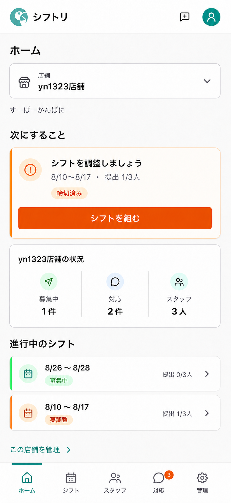

主目的は、選択店舗の現在地を把握し、最優先の作業へ進むことである。
店舗名を主、組織名を補助として表示し、「次にすること」は1件だけを強く見せる。

ホームは、シフト、スタッフ、対応の各ページを埋め込んだ画面ではない。
各正本ページと同じ状態判定と件数定義を使う、店舗別の要約consumerとする。

ホームへフルの募集一覧、スタッフ一覧、通知履歴、契約利用数を置かない。

### 5.2 シフト

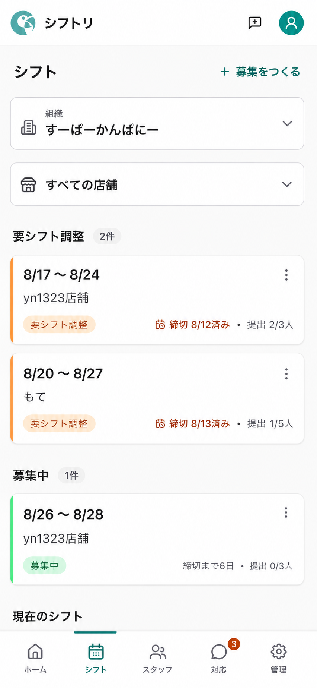

主目的は、組織全体の募集を仕事の優先度から探し、調整または新規作成へ進むことである。
初期filterは「すべての店舗」とし、すべてのカードに店舗名を表示する。

一覧は「要シフト調整」「募集中」「現在のシフト」「確定済み」「過去」の順を基本とする。
ホームと同じ最優先カードや、スタッフ登録申請、通知不達は置かない。

### 5.3 スタッフ

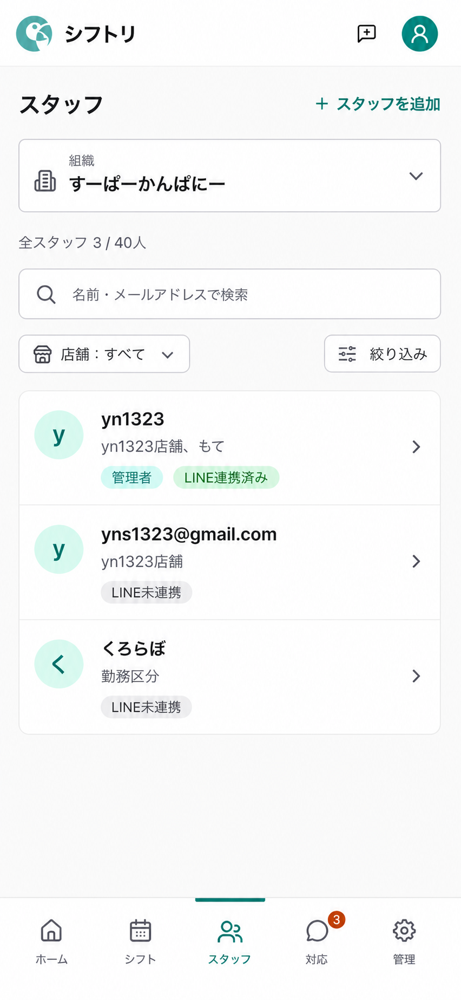

主目的は、組織全体から対象人物を見つけて詳細を開くことである。
店舗filterと人物ごとの所属店舗を初期viewportに置く。  初期実装では検索欄を置かず、一覧量が増えて探索時間が問題になった段階で検索を追加する。

管理者の変更、店舗設定、通知履歴、LINEの具体的操作はトップ一覧へ置かない。
それぞれ管理または人物詳細で扱う。

### 5.4 対応

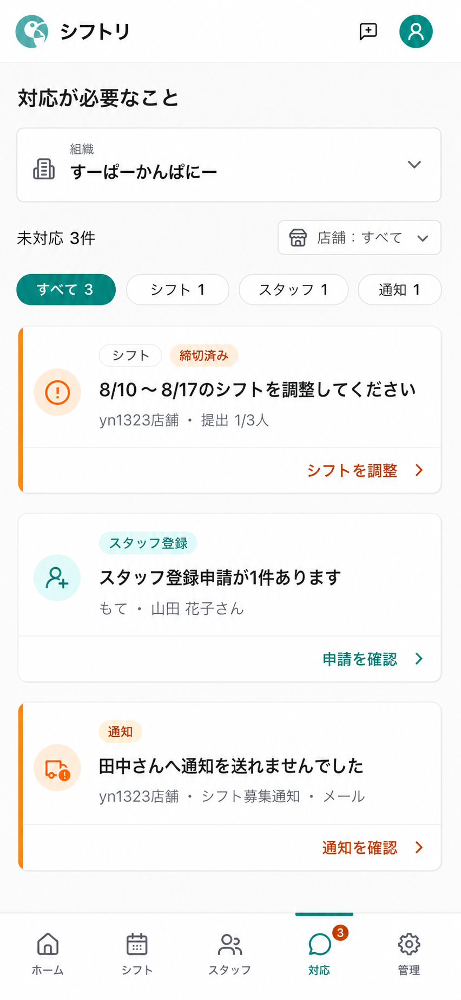

主目的は、人の判断や操作を待っている未解決業務を優先順に処理することである。
対応項目は少量を前提とし、種類別category filterは置かない。  店舗filterの「すべて」は、店舗に属する項目と組織全体の管理項目を含む現在組織内の全件を意味し、特定店舗を選んだときだけその店舗の項目へ絞る。

未解決項目はDialog内へ隠さず、種類、状態、対象、店舗、時刻、主操作だけをコンパクトなカードへ表示する。  承認、再送、取消などが成功した項目は右へ退場し、後続カードを上へ詰める。  `prefers-reduced-motion`では移動animationを省略し、確認が必要な破壊的操作だけ既存の確認Dialogを維持する。

ボトムナビのbadgeは未読通知数ではなく、組織全体の未解決業務数を示す。
ホームの店舗別件数と値が異なる場合は、それぞれのscopeを併記する。

### 5.5 管理

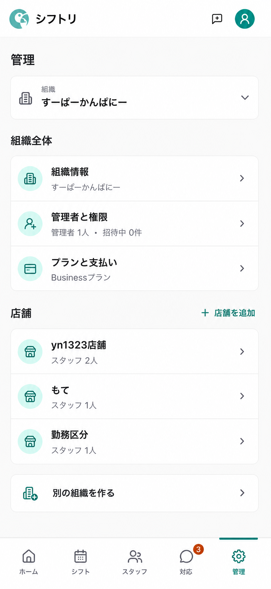

主目的は、組織、管理者、契約、各店舗の設定対象を見つけることである。
「組織全体」と「店舗」を見出しで分けるが、各行はすべて管理トップから1タップで開く。

店舗へ進むための中間ページは作らない。
スタッフ一覧は独立したトップ画面にあるため、管理へ重複させない。

### 5.6 関連ページ

トップ画面から遷移する専用ページのうち、新しいnavigation shell、情報階層、戻り先の確認が必要な10画面を追加する。
通常detailは親タブをactive表示し、シフト表と管理者招待はボトムナビを隠す。

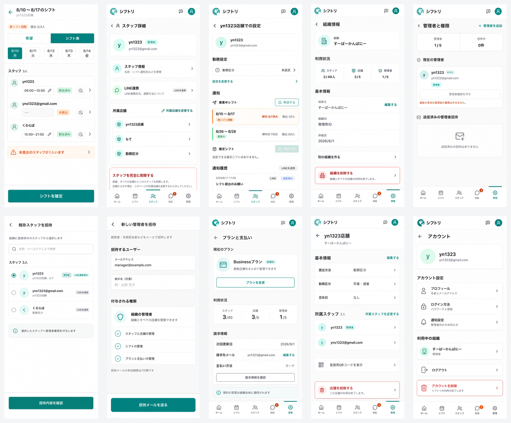

#### 5.6.1 シフト表

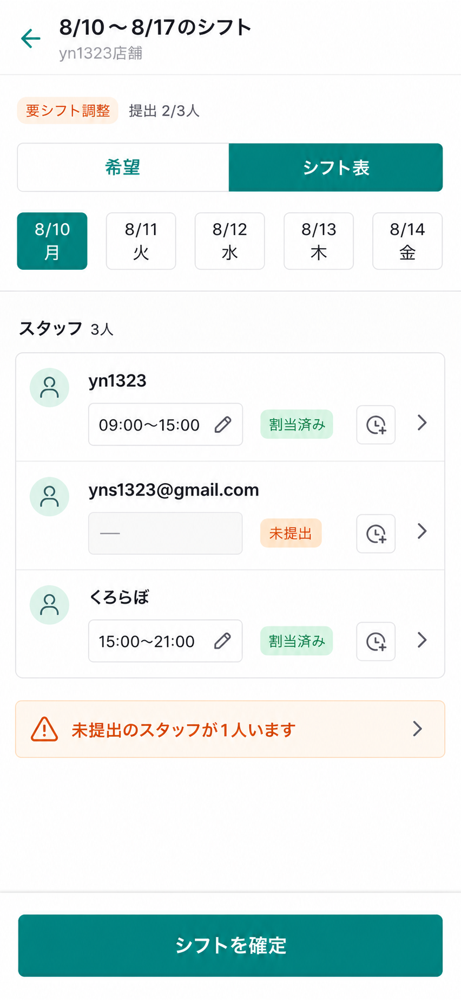

提出状況、日付、スタッフ別の割当を1画面で確認し、シフト確定へ進む集中作業画面とする。

#### 5.6.2 スタッフ詳細

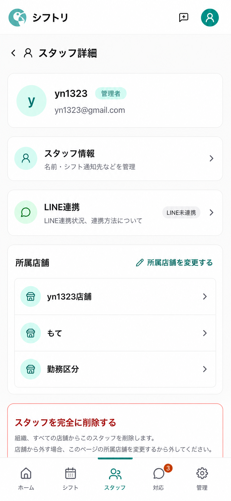

人物の基本情報、LINE連携、所属店舗を確認し、個別の編集や店舗別設定へ進む。

#### 5.6.3 スタッフの店舗別設定

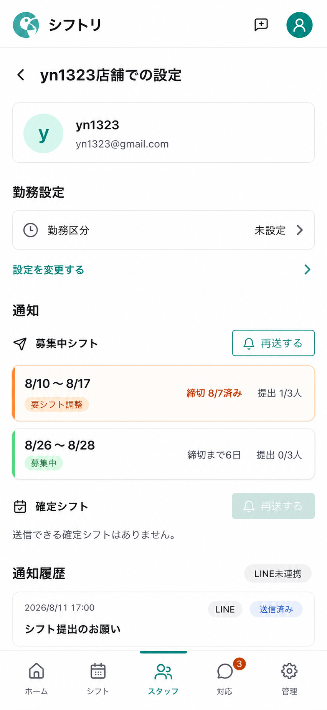

人物と店舗の組み合わせごとに、勤務設定、募集と確定シフトの通知、通知履歴を扱う。

#### 5.6.4 組織情報

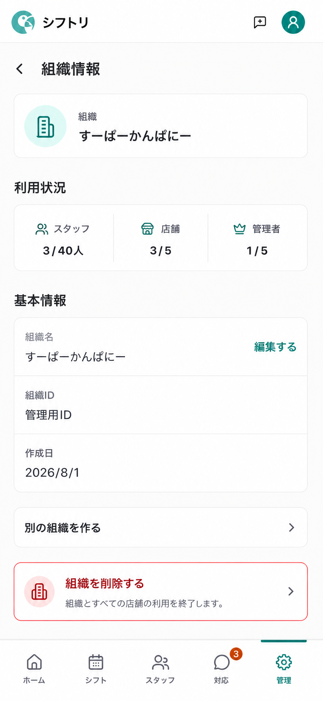

組織名、利用状況、基本情報、重要な操作を組織scopeでまとめる。

#### 5.6.5 管理者と権限

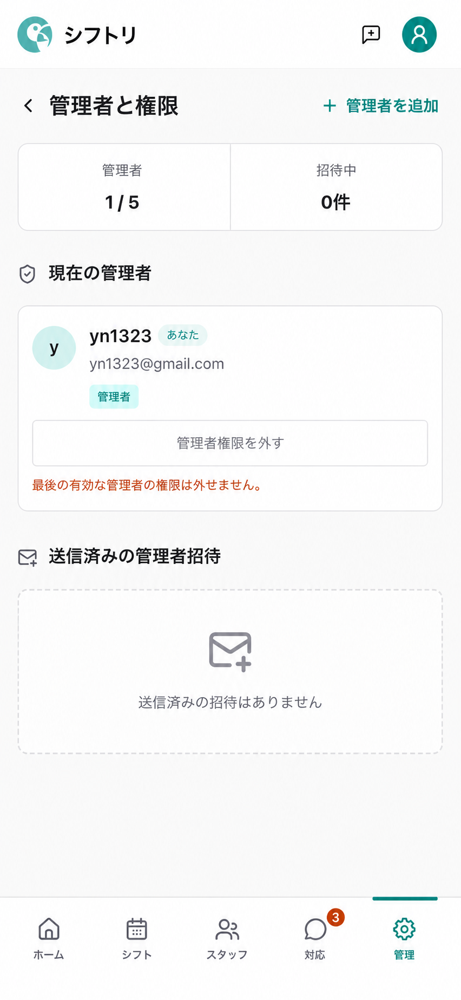

現在の管理者と送信済み招待を確認し、新しい招待へ進む。

#### 5.6.6 既存スタッフの管理者招待

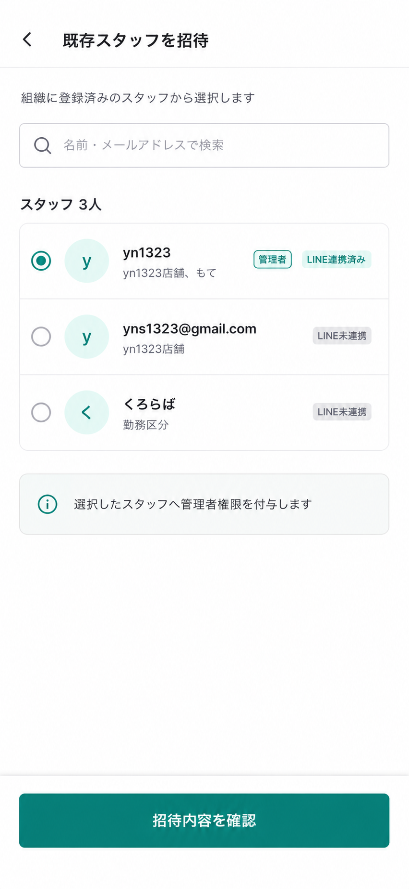

組織内の人物から対象を選び、確認前に付与対象を認識できる集中flowとする。

#### 5.6.7 新しい管理者の招待

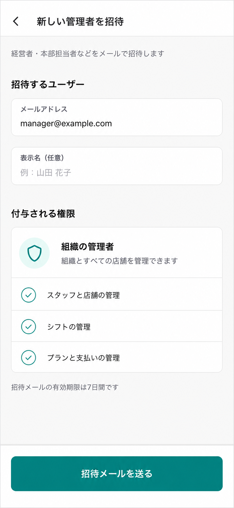

メールアドレスと付与される権限を同じ画面で確認し、招待を送信する。

#### 5.6.8 プランと支払い

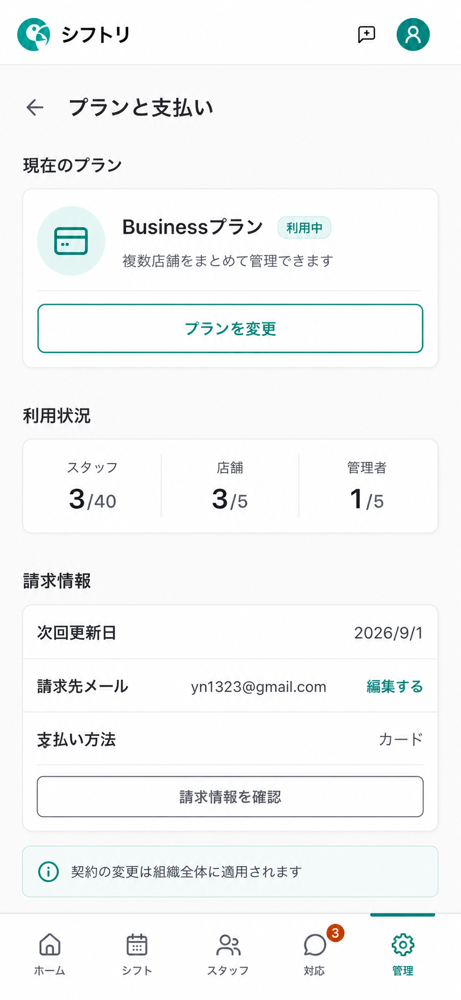

現在のプラン、利用数、請求情報を確認し、必要な場合だけ契約変更やStripeへ進む。

#### 5.6.9 店舗詳細

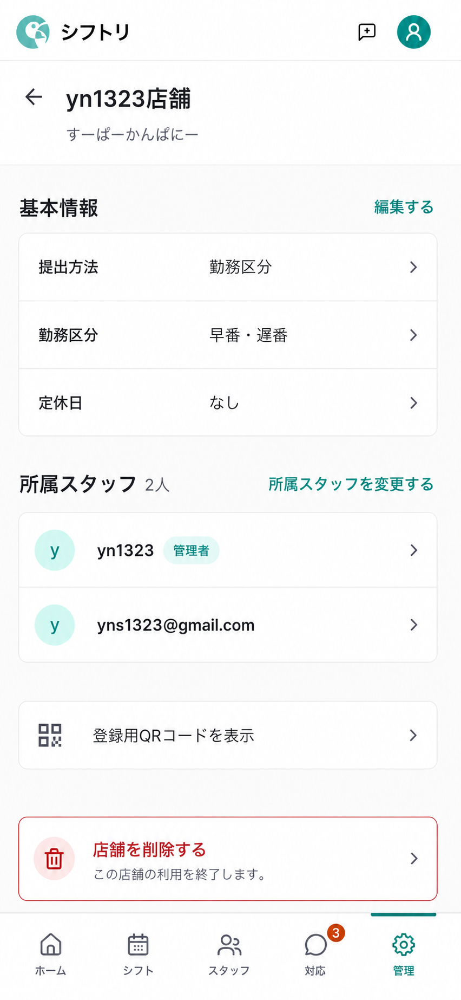

店舗の基本情報、所属スタッフ、登録用QRコード、重要な操作への入り口をまとめる。

#### 5.6.10 アカウント

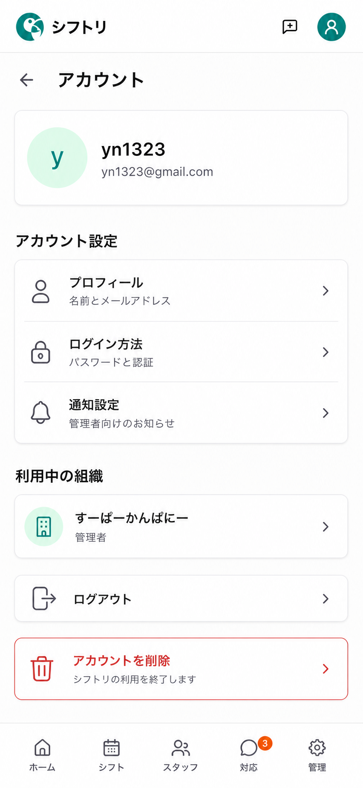

本人のプロフィール、ログイン方法、通知設定、利用中の組織を確認する。
組織または店舗scopeの画面ではないため、ボトムナビは表示するがactive項目を持たない。

### 5.7 今回新規生成しない画面

募集作成、スタッフ追加、LINE連携、所属店舗変更、登録申請審査、通知不達復旧、店舗の追加と編集、店舗所属スタッフ変更、組織作成、アカウント削除、初回設定は、現行Dialogの見た目と内容を流用する。
そのため、この画面構成レビューでは新規モックを作成しない。
これは専用routeの採否とは切り分けたvisual scopeの判断であり、最終的なDialogとpageの境界は実装前に改めて固定する。

## 6. 全体画面遷移

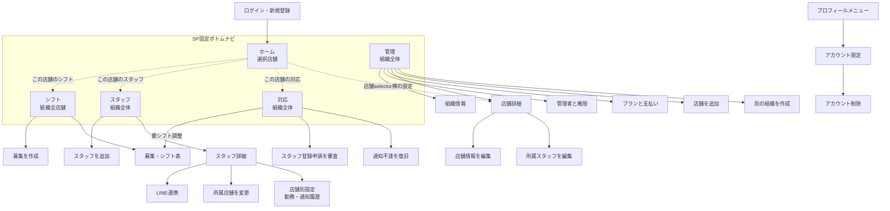

### 6.1 管理トップの並列構造

```text
管理
├─ 組織全体
│  ├─ 別の組織を作る（見出し右）
│  ├─ 組織情報
│  ├─ 管理者と権限
│  └─ プランと支払い
├─ 店舗
│  ├─ 店舗を追加（見出し右）
│  ├─ yn1323店舗
│  ├─ もて
│  └─ 勤務区分
```

視覚上は2sectionだが、組織設定と各店舗は同じnavigation depthに置く。
`/app/manage/shops`のような中間一覧routeは初期実装では作らない。

### 6.2 ホームと正本ページの関係

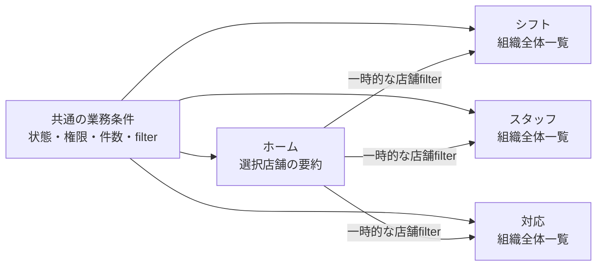

Loadingを0件として表示せず、一部取得の失敗を「対応なし」として扱わない。
ホーム独自の状態判定を作らず、正本ページと同じ業務条件を再利用する。
表示順は共通化せず、ホームは最優先の1件、シフトは状態group順、対応は未解決作業の優先順という各consumerの目的に合わせる。

### 6.3 スタッフ向け外部画面

スタッフ向けCapability画面には、管理アプリのボトムナビゲーションを表示しない。
店舗名と届いたリンクだけで完結する現在の境界を維持する。

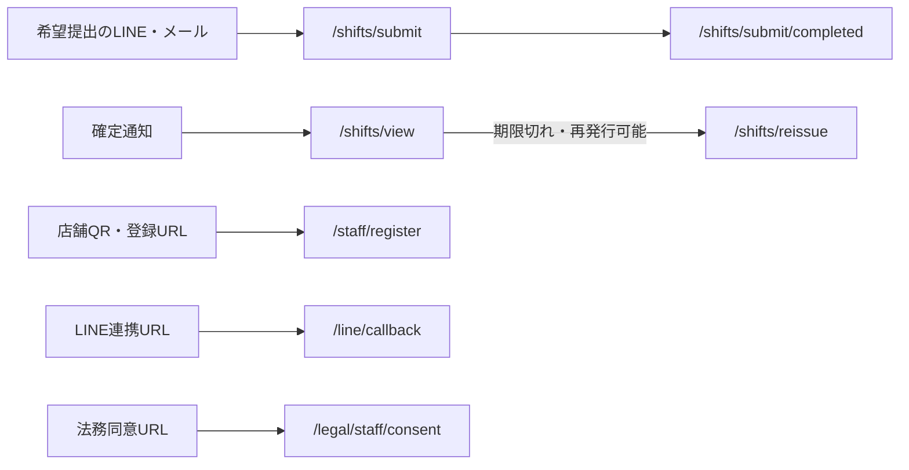

## 7. 「対応」に表示する仕事

対応項目は、次の条件をすべて満たすものに限る。

- 人の判断または操作が必要である
- server上で未解決状態を判定できる
- 対象の組織と、必要に応じて店舗、人物、募集、招待を特定できる
- 完了操作と完了判定がある

初期実装で含める項目は次のとおりである。

| 種類 | 表示条件 | 完了操作 |
|---|---|---|
| 要シフト調整 | 締切後も未確定、または調整が必要 | シフト表で調整または確定する |
| スタッフ登録申請 | 管理者の承認または却下を待っている | 申請を承認または却下する |
| 通知不達 | 再送または無視の判断が必要 | 再送を受け付ける、または無視する |
| 管理者招待の異常 | 送信失敗、人数上限、競合など、管理者の確認が必要 | 管理者と権限で再送、取消、または原因を解消する |

次の情報は初期実装の「対応」へ含めない。

- 通常の募集中や提出待ち
- 募集がないため新しく作るという予防的タスク
- 確定済みシフト
- 通知履歴や送信済み通知
- 正常な送信済み管理者招待と、相手の承認だけを待っている招待
- LINE連携状態
- 法務再同意
- 契約や支払いの制限
- 独立した完了操作を持たない未提出スタッフ

法務再同意は全体警告、課金制限は全体alertと「プランと支払い」で扱う。
未提出スタッフは、要シフト調整カードとシフト表の補足情報として表示する。

## 8. 新しいroute案

既存の`/staff/register`、`/shifts/submit`、`/shifts/view`と認証済み管理画面の概念衝突を避けるため、管理アプリのcanonical routeを`/app/*`へまとめる。
`/app/*`はすべて検証済みの`org=<orgId>`を持つ。
表で`org`を省略した子routeも例外ではなく、対象entityから組織を黙って推測しない。

| Route案 | 画面 | ボトムナビ |
|---|---|---|
| `/app/home?org=<orgId>&shop=<shopId?>` | ホーム。`shop`未選択は店舗選択状態 | ホームを選択 |
| `/app/shifts?org=<orgId>&shopFilter=all` | シフト | シフトを選択 |
| `/app/shifts/new` | 募集作成 | 非表示 |
| `/app/shifts/:recruitmentId/board?org=<orgId>&shop=<shopId>` | シフト表 | 非表示 |
| `/app/staff?org=<orgId>&shopFilter=all` | スタッフ | スタッフを選択 |
| `/app/staff/new` | スタッフ追加 | 非表示 |
| `/app/staff/:personId` | スタッフ詳細 | スタッフを選択 |
| `/app/staff/:personId/line` | LINE連携 | 非表示 |
| `/app/staff/:personId/memberships/edit` | 所属店舗変更 | 非表示 |
| `/app/staff/:personId/shops/:shopId` | 人物の店舗別設定 | スタッフを選択 |
| `/app/actions?org=<orgId>&shopFilter=all` | 対応 | 対応を選択 |
| `/app/manage?org=<orgId>` | 管理 | 管理を選択 |
| `/app/manage/organization` | 組織情報 | 管理を選択 |
| `/app/manage/managers` | 管理者と権限 | 管理を選択 |
| `/app/manage/managers/invite-staff` | 既存スタッフの招待 | 非表示 |
| `/app/manage/managers/invite-new` | 新規管理者の招待 | 非表示 |
| `/app/manage/billing` | プランと支払い | 管理を選択 |
| `/app/manage/shops/new` | 店舗追加 | 非表示 |
| `/app/manage/shops/:shopId` | 店舗詳細 | 管理を選択 |
| `/app/manage/shops/:shopId/edit` | 店舗情報編集 | 非表示 |
| `/app/manage/shops/:shopId/staff/edit` | 店舗所属スタッフ変更 | 非表示 |
| `/app/manage/organizations/new` | 別組織の作成 | 非表示 |
| `/account` | アカウント概要 | 選択なし |
| `/account/delete` | アカウント削除 | 非表示 |
| `/setup` | 初回設定 | 非表示 |

`org`、`shop`、`shopFilter`のsearch schemaと永続場所は、route実装前に型として固定する。
固定detailの対象はpath IDから決め、現在のfilterを理由に別entityへ差し替えない。

### 8.1 認証shellとscope guard

現行の`_auth.tsx`は`/account`以外で店舗contextを必須とし、`AuthenticatedHeader`も店舗選択を前提にしている。
新しいrouteは必要contextを次の3種類に分け、親shellの「店舗がないと開けない」契約を外す。

| Guard | 主なroute | 必要な条件 |
|---|---|---|
| `authenticated` | `/account`、`/setup` | 認証済みidentity。組織や店舗が0件でも開ける |
| `organization` | `shop`未選択のホーム、シフト、スタッフ、対応、管理とその子route | 明示した`activeOrg`へのcanonicalな組織membership |
| `shop` | `shop`選択済みのホーム、店舗設定、店舗と紐づく固定detail | `activeOrg`に属する明示店舗と、対象画面の参照または操作に必要な状態 |

`AuthGuard`はroute metadataから必要contextを受け取り、不足を別の先頭店舗で補完しない。
Headerの店舗switcherを全routeの必須要素にせず、組織選択と店舗選択は各ページのscopeに応じて表示する。
シフト表は`organizationId`と`shopId`を明示し、server側で`recruitment.shopId === shopId`と`shop.organizationId === organizationId`をともに検証する。

### 8.2 組織全体ページの取得境界

シフト、スタッフ、対応を組織全体の正本にするため、組織scopeのqueryとpaginationは実装必須とする。
現行の募集、登録申請、通知不達の店舗scope hookを、店舗数分の購読に置き換えない。
新しい組織queryは明示した`organizationId`を受け、店舗filterとbounded paginationをserver側で適用する。

組織scopeの認可契約は次のとおりとする。

- identityから対象組織のcanonical `organizationMember`を直接解決する
- queryは`active | readOnly`、mutationは`active`だけを許可する
- legacy `shopMembers` fallbackは明示した1店舗だけに限り、組織全体queryのauthorityに使わない
- legacy fallbackを使う店舗scope queryは応答もその1店舗に限定し、`ctx.organization`から兄弟店舗のデータを取得しない
- `shop.organizationId === activeOrg`をserver側で検証し、不一致を別組織へ読み替えない
- `shopId`省略時の「先頭店舗fallback」を組織scopeのauthorityに使わない
- 削除済み組織、店舗、membershipは一般利用不可とし、別tenantの存在を返さない

ホームは明示した1店舗の既存summary契約を保つ。
表示componentと業務判定は再利用してよいが、店舗scopeのquery wrapperを組織scopeのauthorityとして再利用しない。

## 9. ボトムナビゲーションの表示規則

ページ名ではなく、未保存draftと集中作業の有無で表示を決める。

### 9.1 表示する

- 5つのトップ画面
- スタッフ詳細
- スタッフの店舗別設定
- 店舗詳細
- 組織情報の閲覧
- 管理者一覧
- プランと支払い
- アカウント概要（どのタブも選択しない）

通常のdetailでは、所属する親タブをactive表示する。
スタッフ詳細と人物の店舗別設定は「スタッフ」、店舗詳細は「管理」をactive表示する。

### 9.2 非表示にする

- 初期setup
- 募集作成
- シフト表
- スタッフ追加
- スタッフ登録申請の審査
- 通知不達の復旧
- 人物や店舗の長い所属変更
- 店舗追加と編集
- 組織追加
- 管理者招待フォーム
- LINE連携
- ログイン方法やOAuth補助flow
- アカウント削除

集中作業画面には、対象名、キャンセルまたは戻る操作、未保存時の退出確認、成功後の遷移先を持つ専用headerを置く。
Dialogを開いた場合はボトムナビを背後に残してよいが、modalにより操作不可とする。

## 10. シナリオ別の遷移

| シナリオ | 遷移 | 完了後 |
|---|---|---|
| 店舗の状況を見る | ホーム → 店舗選択 → 最優先項目を見る | ホームに留まる |
| 募集を作る | ホームまたはシフト → 募集作成 → 保存 | 対象店舗で絞ったシフト一覧 |
| 希望提出状況を見る | ホーム → 店舗のシフト → シフト表 | 元のホーム、またはシフト一覧 |
| シフトを調整、確定する | シフトまたは対応 → シフト表 → 確定 | 実際の遷移元へ戻る |
| 通知不達を処理する | 対応 → 通知不達 → 再送または無視 | 対応一覧。解決済み項目は消える |
| 登録申請を承認する | 対応 → 登録申請 → 承認 | 元の対応一覧。成功表示からスタッフ詳細を任意で開ける |
| スタッフを直接追加する | スタッフ → 追加 → 店舗と方法を選ぶ | スタッフ一覧で追加人物へfocus |
| LINEを案内する | スタッフ → 人物詳細 → LINE連携 | 人物詳細 |
| 所属店舗を変更する | スタッフ → 人物詳細 → 所属店舗変更 | 人物詳細 |
| ホームの店舗を編集する | ホーム → この店舗を管理 → 店舗詳細 → 編集 | 店舗詳細。戻ると元のホーム |
| 管理から店舗を編集する | 管理 → 店舗行 → 店舗詳細 → 編集 | 店舗詳細。戻ると管理の店舗行 |
| 店舗を追加する | 管理 → 店舗を追加 → 作成 | 管理トップで新店舗へfocus |
| 管理者を招待する | 管理 → 管理者と権限 → 招待方法 → 招待 | 管理者一覧 |
| 管理者招待を受諾する | 招待URL → 認証 → 対象組織を確認 → 受諾 | 対象組織の管理トップ |
| プランを変更する | 管理 → プランと支払い → Stripe | プランと支払いへ復帰 |
| 組織を切り替える | 5つのトップ画面 → 組織選択 | 同じタブで選択組織を表示 |
| 別組織を作る | 管理 → 別の組織を作る → 初期設定 | 新組織の管理。「この店舗でホームを開く」を表示 |
| アカウントを削除する | プロフィール → アカウント → 削除 | 削除受付完了画面 |

新店舗を追加しても、`homeShop`を新店舗へ自動変更しない。
新組織作成後は管理画面で結果を確認し、ホームへ移る操作を明示する。

## 11. 戻り先と履歴

- ボトムナビのタップは、選択組織で記憶した各トップ画面を開く。
- 子画面で現在のタブを再度タップすると、そのタブのトップへ戻る。
- ブラウザバックは、実際の履歴へ戻る。
- 画面内の戻るは、allowlistした`origin`へ戻る。
- 直URLでは、canonicalな親画面をfallbackとする。
- 任意URLを`origin`として受け取らず、`home | shifts | staff | actions | manage`のような型で検証する。
- detailへは、reload後の復帰に必要な`origin`、表示件数、focus、最小限のfilterだけを渡す。

シフト表はボトムナビを隠し、`home`、`shifts`、`actions`の実際の遷移元へ戻す。
ホームから店舗詳細を開いた場合は「管理」をactive表示するが、画面内の戻る先は元のホームとする。

管理から店舗詳細を開いた場合は、管理トップの該当店舗行へfocusを戻す。
削除後は存在しない対象へfocusを戻さない。

店舗または組織の削除、権限喪失により現在scopeが消えた場合は、アクセス可能な残存scopeへ移る。
残存scopeがない場合は`/setup`へ移る。

Stripeからはプランと支払い、認証からは元のdeep link、管理者招待受諾後は対象組織へ戻す。
外部画面から戻った事実だけで、課金、認証、招待の成功を確定しない。

### 11.1 外部flowからの復帰契約

外部境界を越える復帰先は、任意URLではなく、開始時にallowlistしたroute keyと必要最小限のfocusだけで保持する。
復帰時は次をserver状態と再照合する。

- 認証: OAuthのstate、nonce、TTL、単回利用はClerk所有のprovider契約を維持する。アプリは独自stateを追加せず、認証済みidentityとsame-originのallowlist済みdeep linkだけを確定する
- Stripe: checkoutまたはportal session、Customer、対象organization、live/test mode、現在の契約状態
- 管理者招待: tokenの対象組織と権限、TTL、used/revoked状態、ログインidentityとの一致

復帰先の`org`と`shop`も改めて認可し、失効している場合は別scopeへ読み替えず、一般化した利用不可状態を表示する。
token、code、state、providerの応答本文をnavigation logやclient errorに含めない。

## 12. 現行43画面との対応

2026-08-14時点のroute treeを、到達可能なleaf 42画面と404の合計43画面として照合した。
このうち9画面を新しいIAへ移し、残る34画面はURLを維持する。

### 12.1 新しいIAへ移す9画面

| 現行route | 新しい扱い |
|---|---|
| `/dashboard` | 基本は`/app/home`。募集、スタッフ、登録申請、通知不達を各正本ページへ分ける |
| `/shiftboard/:recruitmentId` | `/app/shifts/:recruitmentId/board` |
| `/settings` | `tab`に応じてスタッフ、管理の店舗、課金、組織情報へ分ける |
| `/settings/managers` | `/app/manage/managers` |
| `/settings/managers/invite-staff` | `/app/manage/managers/invite-staff` |
| `/settings/managers/invite-new` | `/app/manage/managers/invite-new` |
| `/shops/:shopId` | `/app/manage/shops/:shopId` |
| `/users/:personId` | `/app/staff/:personId`。LINEと所属店舗panelは専用ページへ移す |
| `/users/:personId/shops/:targetShopId` | `/app/staff/:personId/shops/:shopId` |

### 12.2 URLを維持する34画面

| 分類 | Route |
|---|---|
| アカウント | `/account` |
| 認証と招待 | `/login`、`/signup`、`/forgot-password`、`/sso-callback`、`/manager-invite` |
| スタッフCapability | `/staff/register`、`/legal/staff/consent`、`/line/callback`、`/shifts/submit`、`/shifts/submit/completed`、`/shifts/view`、`/shifts/reissue` |
| 公開サイト | `/`、`/features`、`/pricing`、`/commercial-transactions`、`/faq`、`/howto`、`/articles`、`/articles/:slug`、`/articles/categories/:categorySlug`、`/demo/flow`、`/demo/shiftboard`、`/contact`、`/terms`、`/terms/manager`、`/terms/staff`、`/privacy`、`/privacy/manager`、`/privacy/staff` |
| 結果と例外 | `/account-deletion-accepted`、`/cache-reset`、`/$` |

## 13. 旧URLの互換（不採用になった検討案）

> 最終判断では旧管理URLの互換redirectを作らない。以下は検討履歴として残し、実装しない。
> 固定画面レビュー中の一時併存と正式切替は、[レスポンシブナビゲーションと固定画面遷移 Phase 1](2026-08-14_レスポンシブナビゲーションと固定画面遷移_Phase1実装計画.md)を正とする。

古いブックマーク、LINEとメールのリンク、Stripe復帰URL、管理者招待URLを即時に無効化しない。
旧routeは、検索条件を読み取ってcanonical URLへ`replace`する互換routeとして残す。

| 旧状態 | 互換先 |
|---|---|
| `/dashboard?shop=<id>` | 店舗から権限済み組織を確定し、`/app/home?org=<org>&shop=<id>` |
| `/dashboard?shop=<id>&users=<n>&focus=<person>` | `/app/staff?org=<org>&shopFilter=<id>`とallowlist済みの一覧復帰情報 |
| `/shiftboard/:recruitmentId?shop=<id>` | `/app/shifts/:recruitmentId/board?org=<org>&shop=<id>&origin=<routeKey>` |
| `/settings?tab=people` または`users`/`focus`あり | `/app/staff?org=<org>`。既知の一覧復帰情報を変換 |
| `/settings?tab=shops` | `/app/manage?org=<org>`の店舗section |
| `/settings?tab=billing` | `/app/manage/billing?org=<org>` |
| `/settings?tab=settings` | `/app/manage/organization?org=<org>` |
| `/settings/managers` | `/app/manage/managers?org=<org>` |
| `/settings/managers/invite-staff` | `/app/manage/managers/invite-staff?org=<org>` |
| `/settings/managers/invite-new` | `/app/manage/managers/invite-new?org=<org>` |
| `/shops/:shopId` | `/app/manage/shops/:shopId?org=<org>` |
| `/users/:personId?panel=basic` | `/app/staff/:personId?org=<org>`と短いプロフィール編集Dialog |
| `/users/:personId?panel=line` | `/app/staff/:personId/line?org=<org>` |
| `/users/:personId?panel=addShop` | `/app/staff/:personId/memberships/edit?org=<org>` |
| `/users/:personId/shops/:targetShopId` | `/app/staff/:personId/shops/:targetShopId?org=<org>` |

旧routeの`shop`はclient上の現在組織を信頼するためではなく、server側で店舗、組織、membershipの対応を検証し、canonical `activeOrg`を決めるために使う。
`org=A`と`shop=B`が不一致の場合は、どちらかに黙って寄せず利用不可とする。

legacy converterは、次の入力schemaと棄却規則を持つ純粋関数にする。

- `tab`、`panel`、`returnTo`、`returnShopTo`は既知enumだけを受け付ける
- `shop`、`returnShop`、`personId`、`focus`は既知形式の内部IDだけをparseし、取得時にserverで再認可する
- 不明値、過長値、外部URL、script scheme、重複parameter、依存値が欠けた組み合わせは棄却する
- token、code、stateなどCapabilityやproviderのqueryを管理routeへコピーしない
- 有効な`users`、`focus`、`returnTo`、`returnShop`、`returnShopTo`だけを新しい`origin`と復帰状態へ変換する
- canonical化は`replace`、通常のページ間遷移は`push`とする

legacy routeの撤去時期は、repo内linkと期限内の外部linkがなくなったことを計測してから決める。

## 14. Dialogから専用ページへ移す作業（保留になった検討案）

> 現在のPhase 1では既存Dialogを作り直さず、固定画面からも実mutationを呼ばない。
> 専用ページ化はPhase 1の対象外であり、画面レビュー後に必要な操作だけを改めて判断する。

URL共有、ブラウザバック、複数段階、長い編集、影響previewを持つ作業は専用ページへ移す。

日常業務の正本ページを導入するPhase 2で、募集作成とスタッフ追加のページ化要否を改めて判断する。  シフト調整は既存のシフト表を専用ページとして再利用する。

スタッフ登録申請、通知不達、管理者招待の異常は、対象と主操作を`/app/actions`のカードへフラットに表示する。  既存の確認Dialogが必要な操作だけカードから開き、完了後は対象filterとscroll位置を維持したまま解決済みカードをanimation付きで除去する。

その他のページ化候補は次のとおりである。

- 店舗追加
- 組織作成
- 店舗情報編集
- 店舗所属スタッフ変更
- 人物の所属店舗変更
- LINE連携
- アカウント削除

次の短い操作と最終確認はDialogのまま維持する。

- 名前などの短いプロフィール編集
- 組織名
- 請求先メール
- 削除の最終確認
- 管理者権限解除
- 招待再送と取消
- シフト確定確認
- 未保存変更の確認

長いDialogのページ化は一度に行わず、店舗所属スタッフ変更、人物の所属店舗変更の順に一機能ずつ移す。

## 15. 状態とアクセシビリティ

5つのトップ画面と専用ページは、少なくとも次の状態を個別に設計する。

- Loading
- Empty
- section単位のErrorと再試行
- Success
- PendingまたはAccepted
- 権限不足
- 利用不可
- read-only（参照は維持し、mutationを理由つきで無効化）
- 組織または店舗が0件、1件、複数件

ページ全体を成立させる情報以外は、兄弟sectionの表示を待たせない。
通知操作では「受け付けた」「送信した」「届いた」を区別し、provider到達を確認していない状態で「届きました」と表示しない。

ボトムナビの各項目は44px以上の操作領域を持ち、active状態を色だけに依存させない。
badgeには「未解決の対応がN件」のようなaccessible nameを与える。

固定ボトムナビと本文の間にsafe areaを確保する。
文字拡大、長い組織名と店舗名、ソフトウェアキーボード、本文scrollで主操作が隠れないことを確認する。

管理者、課金、削除操作のvisibilityは、既存のserver-side権限契約を正とする。
画面から操作を隠すことを認可として扱わない。

## 16. Security Lens

| 項目 | 契約 |
|---|---|
| Actor | Clerkで認証され、対象組織または店舗へアクセスできる管理者。スタッフ向けCapabilityのactorは現在の匿名session境界を維持する |
| Asset | 組織と店舗の業務データ、人物情報、管理者権限、募集、登録申請、通知、課金状態 |
| Trust boundary | Browserのroute、search parameter、filterから、既存の認証wrapper、Convex queryとmutation、Stripeと通知providerまで |
| User-controlled input | `org`、`shop`、`shopFilter`、entity ID、legacy query、`origin`。取得後にcanonical membershipのstatus、tenant、削除状態を検証する |
| Abuse case | URLを書き換えて別組織や別店舗を開く、任意originへ遷移させる、旧URL変換で認可を迂回する、再送を連打する、削除や権限喪失後のstale画面からmutationする |
| Server-side enforcement | route guardやボタン非表示に依存せず、明示`organizationId`とcanonical membershipを解決する組織scope用境界、店舗の所属一致、状態、billing policy、entitlementをserverで再確認する |
| Rate limit / idempotency | 再通知、招待、登録承認ごとに現在のrate limit、single-flight、requestId、dedupeの有無を棚卸し、その操作に実装済みの保護を維持する。必要な保護がない操作は「対応」から露出する前に補う |
| Lifecycle / recovery | 削除または権限喪失後はstale IDを無効化し、残存scopeか`/setup`へ退避する。外部復帰はserver状態を再取得してから成功表示する |
| Logs / PII | 計測eventはroute template、scope種別、操作種別、結果categoryをallowlistする。person ID、氏名、メール、token、任意query全文は収集せず、組織または店舗IDが必要なeventだけ用途、保持期間、アクセス範囲を定義する |
| Regression test | Function Testでtenant越境と権限拒否、Logic Testでorigin allowlistとsearch変換、Behavior Testで拒否後のUI退避、代表E2Eで認証済みnavigationと匿名Capabilityの分離を守る |

現行の`managerQuery`が持つ、`shopId`省略時の先頭店舗選択とlegacy `shopMembers` fallbackは、互換用の店舗scope契約である。
これを組織全体queryのauthorityに流用しない。
表示componentや業務判定を再利用しつつ、組織scopeの取得境界は必須変更として切り出す。

### 16.1 public entrypointの実装前棚卸し

各Phaseの実装前に、実際に使うpublic function名、引数validator、戻りDTOを次の表に確定する。
新しいpublic APIを増やす前に、既存境界の引数追加、internal function、共通認可wrapperで閉じられないかを判断する。

| 画面・操作 | public境界 | Actor / authority | User-controlled ID | 副作用 | 主担当test |
|---|---|---|---|---|---|
| ホームの店舗summary | 既存の店舗scope dashboard query | `active | readOnly`の組織memberと対象店舗の一致 | organization / shop | なし | Convex Function Test |
| 組織全体のシフト一覧 | 明示organizationと店舗filterを受ける組織scope query | `active | readOnly`のcanonical organization member | organization / shopFilter / recruitment | なし | Convex Function Test |
| 組織全体のスタッフ一覧 | 組織scopeの人物query。既存DTOを最小化して再利用 | `active | readOnly`のcanonical organization member | organization / shopFilter / person | なし | Convex Function Test |
| 組織全体の対応一覧 | 4categoryの未解決条件と対象filterを受ける組織scope query | `active | readOnly`のcanonical organization member | organization / targetFilter / cursor | なし | Convex Function Test |
| 登録申請の承認・却下 | 現行mutationを維持し、明示organizationと店舗の一致を追加検証 | `active`の組織memberと操作権限 | organization / shop / request | membership変更、通知 | Convex Function Test |
| 通知不達の再送・無視 | 現行mutation/actionを維持し、対象と未解決状態を再検証 | `active`の組織memberと操作権限 | organization / shop / failure | provider送信、解決状態 | Convex Function Test |
| 管理者招待・再送・取消 | 現行の招待境界とtoken lifecycleを維持 | `active`の組織memberと管理者権限 | organization / invite | token発行、メール | Convex Function Test |
| 課金操作 | 現行のbilling policyとStripe境界を維持 | 課金操作が許可された`active` member | organization / price / session | Stripe | Convex Function Test |
| 店舗・組織・アカウント削除の受付 | 現行の削除APIと受付契約を維持 | 操作ごとの既存権限と最後の管理者制約 | organization / shop / account | 論理削除、即時失効、cleanup起動 | Convex Function Test |
| 削除のdurable lifecycle | 現行のcleanup workflowと回復契約を維持 | internal jobと対象の保持ポリシー | cleanup target / cursor | 外部失効、非同期cleanup、再試行 | Convex Scenario Test |

## 17. テスト計画

一つの契約を複数層へ重複させず、異なる失敗境界だけを補う。

| 契約 | 主担当層 | 検証内容 |
|---|---|---|
| `activeOrg`、`homeShop`、`shopFilter`の純粋な遷移規則 | Logic Test | 初期値、組織別の店舗復元、不変条件、明示filterの記憶、一時filterの非永続化 |
| scope状態とrouter、storage、React stateの接続 | Frontend Unit Test | URL反映、組織ごとの復元、無効scopeのclear、listenerとcleanup |
| legacy URL converter | Logic Test | 既知enum、欠落依存値、不明値、過長値、重複parameter、外部URL、token非引き継ぎを完全一致で検証 |
| 実routeのcanonical化 | Frontend Unit Test | 変換済みsearchで`replace`し、通常遷移は`push`、旧routeへ循環しない |
| ボトムナビのactiveと表示条件 | Behavior Test | 5トップ、detail、集中flow、active再タップ、Dialog背面の操作不可 |
| 5トップ画面のSPレイアウト | VRT | 代表状態、Empty、長名、badge、safe area、文字折り返し |
| 対応項目の表示分類 | Logic Test | 含む項目と含まない項目、優先順、店舗filter |
| 組織scopeのシフト、スタッフ、対応query | Convex Function Test | 未認証、別組織、`org=A/shop=B`、複数組織、legacy店舗所属のみ、`active/readOnly`、削除済み、filter、pagination、最小DTO |
| mutation時の組織と店舗の認可 | Convex Function Test | `active`だけを許可し、read-only、別tenant、削除済み、stale membershipを拒否して副作用0 |
| 複数APIを跨ぐ権限喪失後のserver状態 | Convex Scenario Test | ロード後に権限または対象を失効させ、stale mutationが拒否される |
| 失効response後のUI復帰 | Behavior Test | stale scopeを再利用せず、残存scopeか`/setup`へ移る |
| 外部復帰先parserとallowlist | Logic Test | route key、stateの最小変換、任意URLと過長値の棄却 |
| Clerk認証復帰のアプリ側契約 | Frontend Unit Test | `src/lib/auth/redirect.test.ts`とSSO controller testでsame-originのallowlist、無効値のfallback、認証後のdeep link復元を検証。OAuth相関はClerk契約として二重実装しない |
| 招待とStripe復帰のserver照合 | Convex Function Test | tokenまたはsession、organization、identity、TTL、used/revoked、mode不一致の拒否 |
| 主要なSP navigation | E2E | ホームの店舗別リンクからfilter済み正本ページ、detail、戻り、タブrootへ移る |
| `/app/*`の保護と匿名Capabilityのbrowser境界 | E2E | 匿名の`/app/home`とlogout後の再アクセスはログインへ戻し、代表Capability routeは公開shellでボトムナビを持たない。認証deep linkの復帰も1件で確認 |
| 単一Capabilityの用途とlifecycle | Convex Function Test | `accessKind`、TTL、used/revoked、replay、用途違いの拒否を維持する |
| 複数APIを跨ぐCapability失効 | Convex Scenario Test | 再発行後の旧Capability失効、newest-only、削除競合、中断後の復旧を検証する |

VRTは`vitest.vrt.config.ts`が要求するmobile tagを使い、viewport指定だけで対象になると仮定しない。
静的表示の正しさをBehavior TestとVRTの両方で重複検証せず、Behaviorは操作と状態遷移、VRTは見た目を主担当とする。
E2Eは主要なブラウザ接続へ絞り、全filter分岐、DB詳細、通知providerへの実到着を成功条件にしない。

既存の`convex/staffAuth/mutations.test.ts`、`convex/shiftSubmission/queries.test.ts`、`convex/shiftView/queries.test.ts`、`convex/_scenario/securityBoundaries.test.ts`と`e2e/scenarios/auth-logout.test.ts`を維持、更新対象に含める。

## 18. 段階導入（置換前の旧案）

> この段階導入は、固定画面を先に作る判断より前の案である。
> 現在の実装順は、後続の[Phase 1実装計画](2026-08-14_レスポンシブナビゲーションと固定画面遷移_Phase1実装計画.md)を優先する。

### Phase 1: 認証shell、route、scope契約

- `activeOrg`、`homeShop`、`shopFilter`の型と更新規則を固定する
- 新しい`/app/*` routeを既存routeと併存させる
- 認証shellのguardを`authenticated | organization | shop`に分け、Headerの店舗context必須依存を外す
- 明示organizationとcanonical membershipを解決する組織scope用の認可境界を追加する
- 現行Dashboard内の初回設定を、組織や店舗が0件で開ける`/setup`へ切り出す
- route、search、戻り、保護route、匿名Capability分離のテストを追加する

### Phase 2: 組織scopeの取得と5トップ画面

- シフト、スタッフ、対応の組織scope query、店舗filter、bounded paginationを実装し、各ページ内には組織切替UIを置かない
- ホームは明示店舗の既存summaryを使い、組織一覧に店舗数分の購読を作らない
- ホーム、シフト、スタッフ、対応、管理のpage rootを追加する
- 募集作成とスタッフ追加をそれぞれ正本ページ配下の専用ページにする
- 登録申請、通知不達、管理者招待の異常を対応一覧のコンパクトなカードとして接続し、種類別filterは追加しない
- SPへ固定ボトムナビを追加する
- PCは同じ目的地を既存headerへ投影する
- 組織権限のFunction Testと、代表状態のStory、Behavior、SP VRTを追加する

### Phase 3: 入口と互換route

- header、プロフィールmenu、課金callout、メールとLINEの内部URL生成を新canonicalへ変更する
- 旧routeをquery-awareな互換routeにする
- 通常遷移は`push`、legacy canonical化だけ`replace`を使う
- 古いlinkとStripe復帰を維持する

### Phase 4: 長いDialogのページ化

- 店舗所属スタッフ変更を専用ページへ移す
- 人物の所属店舗変更を専用ページへ移す
- 店舗追加と編集、組織作成、LINE連携、アカウント削除を一機能ずつ評価する
- 短い編集と最終確認はDialogのまま残す

### Phase 5: 計測後の調整

- allowlist済みevent schemaで、タブ利用、ホームからの遷移、filter解除、戻り、離脱を計測する
- 「対応」の項目追加は、完了操作と未解決状態を定義できる場合だけ行う
- 店舗数が増えて管理トップが長くなった場合は、まず検索と状態filterを検討する
- 6番目のボトムナビ項目は追加しない

## 19. 受入条件

- SPで5つのトップ目的へ常時到達できる
- 各トップ画面のscopeが見出しまたはselectorから分かる
- `homeShop`を組織ごとに復元し、別組織の店舗を持ち越さない
- ホームの店舗別filterが、各タブで利用者が記憶したfilterを上書きしない
- 管理トップから組織設定3項目と各店舗をすべて1タップで開ける
- 店舗へ進む中間一覧ページがない
- スタッフ詳細はスタッフ、店舗詳細は管理をactive表示する
- 集中作業中はボトムナビを隠し、未保存確認と戻り先がある
- 対応badgeが未読通知ではなく未解決業務数として読める
- 登録申請、通知不達、管理者招待の異常を対応一覧から処理し、完了後も元の一覧状態を維持する
- 旧URLはallowlistしたsearch状態だけを変換し、tokenや任意URLを引き継がずcanonicalへ移る
- 匿名Capability URLが認証済み管理アプリrouteと競合しない
- 組織全体queryが明示した`organizationId`とcanonical membershipを使い、先頭店舗やlegacy店舗所属をauthorityにしない
- read-only memberは組織全体を参照できるが、mutationはserver側で拒否される
- 別tenant、削除済み、権限不足のIDをURLから指定してもserver側で拒否する
- 削除または権限喪失後にstale scopeが残らない
- 5トップ画面の代表SP StoryとVRT、主要操作のBehavior Testがある
- 対応するFeature Doc、HowTo、route manifestを実装と同じ変更で更新する

## 20. 自己レビューの修正履歴

### 1回目

初案では、管理が「組織から店舗へ潜る」構造へ戻る箇所、ホームの店舗scopeが組織全体ページへ残留する箇所、公開routeと新しい認証済みrouteの衝突があった。

次のように修正した。

- 管理トップを「組織全体」と「店舗」の2sectionに分け、すべてを同じ深さへ置いた
- `activeOrg`、`homeShop`、`shopFilter`を分けた
- 認証済み管理アプリのcanonical routeを`/app/*`へまとめた

### 2回目

修正後の案では、「対応」の範囲が広すぎること、`/setup`と`/account/delete`が不足していること、削除、権限喪失、外部サービス復帰後の戻り先が曖昧だった。

次のように修正した。

- 「対応」の包含条件と除外項目を定義した
- 初回設定とアカウント削除を集中flowへ追加した
- query-awareな互換routeとallowlistした`origin`を追加した
- stale scopeを別tenantへ黙って読み替えない退避規則を追加した

### 画像レビュー

5画面を同じ共通shellで生成した後、ホームだけ見出しと対応badgeが不一致だった。
見出しを「次にすること」へ変更し、全画面で対応badgeを3件に統一した。

追加の10画面は、通常詳細、集中flow、アカウントの3種類のshellへ分けて生成した。  
通常詳細では親タブを選択状態にし、集中flowではボトムナビを隠し、アカウントではボトムナビを表示したまま選択状態を付けない。  
すべての画像を`852 x 1846`へそろえ、文字化け、主要action、戻り先の文脈、選択中タブを目視確認した。

### 3回目

コードとsecurity/testing契約の横断レビューで、現行の店舗必須shell、組織queryの権限拡張、対応の子route、外部復帰の相関契約が不足していた。

次のように修正した。

- 認証shellを`authenticated | organization | shop`の3種類に分けた
- 組織scope queryを実装必須とし、canonical membershipとlegacy fallbackの境界を明記した
- 登録申請審査と通知不達復旧のroute、戻り先、Phaseを揃えた
- 外部復帰とlegacy URLのallowlist、相関、棄却規則を追加した
- 一契約ごとに主担当test層を固定した

## 21. 未決事項

- 5タブ構成と`/app/*`への段階移行を実装対象として承認するか
- 「対応」の初期3種類を一度に実装するか、登録申請と通知不達から段階導入するか
- PCのheaderに同じ5目的をどの形で投影するか
- legacy routeを撤去できる計測条件と保持期間
- 管理者、課金、削除操作の画面別visibility
- 今回再描画しなかった既存Dialogをroute上もDialogとして維持するか、内容を流用して専用page shellへ載せるか

## 22. 参考にしたファイル

### 現行画面とnavigation

- `src/routeTree.gen.ts`
- `src/routes/_auth.tsx`
- `convex/_lib/functions.ts`
- `src/components/features/AuthenticatedApp/AuthenticatedHeader/index.tsx`
- `src/components/features/Dashboard/DashboardContent/DashboardContentView.tsx`
- `src/components/features/Dashboard/HeroSummary/ActionTaskList.tsx`
- `src/components/features/OrganizationSettings/OrganizationSettingsView.tsx`
- `src/components/features/UserDetail/UserDetailView.tsx`
- `src/components/features/UserDetail/navigation.ts`
- `src/components/features/UserShopDetail/UserShopDetailView.tsx`
- `src/components/features/ShopDetail/ShopDetailView.tsx`
- `src/components/features/ShopDetail/ShopStaffMembershipDialog.tsx`
- `src/components/features/UserDetail/UserShopMembershipDialog.tsx`
- `src/components/features/OrganizationSettings/ShopManagement/ShopManagementDialog.tsx`
- `src/components/features/OrganizationSettings/OrganizationCreation/OrganizationCreationDialog.tsx`
- `src/components/features/Dashboard/RecruitmentManagement/RecruitmentManagementView.tsx`
- `src/components/features/Dashboard/RecruitmentManagement/index.tsx`
- `src/components/features/Dashboard/StaffRegistrationRequestManagement/index.tsx`
- `src/components/features/Dashboard/NotificationFailureRecovery/index.tsx`
- `convex/staffAuth/mutations.test.ts`
- `convex/shiftSubmission/queries.test.ts`
- `convex/shiftView/queries.test.ts`
- `convex/_scenario/securityBoundaries.test.ts`
- `e2e/scenarios/auth-logout.test.ts`

### 現在仕様と規約

- [UI設計方針](../rules/ui-design.md)
- [セキュリティ方針](../rules/security-strategy.md)
- [テスト方針](../rules/testing-strategy.md)
- [フロントエンド設計](../rules/frontend-architecture.md)
- [シフト募集管理](../features/shift-recruitment-management.md)
- [シフト表](../features/shift-board.md)
- [スタッフ参加QR・承認導線](../features/staff-registration.md)
- [ユーザー詳細](../features/user-detail.md)
- [店舗設定](../features/shop-settings.md)
- [グループ課金、複数店舗、複数管理者](../features/organization-billing.md)
- [スタッフ通知履歴](../features/notification-history.md)
- [通知不達Dashboard](../features/notification-failure-dashboard.md)
- [アカウント削除](../features/account-deletion.md)

### 外部の設計資料

- [Apple Human Interface Guidelines: Tab bars](https://developer.apple.com/design/human-interface-guidelines/tab-bars)
- [Android Developers: Navigation bar](https://developer.android.com/develop/ui/compose/components/navigation-bar)
- [Android Developers: Layout and navigation patterns](https://developer.android.com/design/ui/mobile/guides/layout-and-content/layout-and-nav-patterns?hl=en)
- [GOV.UK Design System: Navigate a service](https://design-system.service.gov.uk/patterns/navigate-a-service/)
