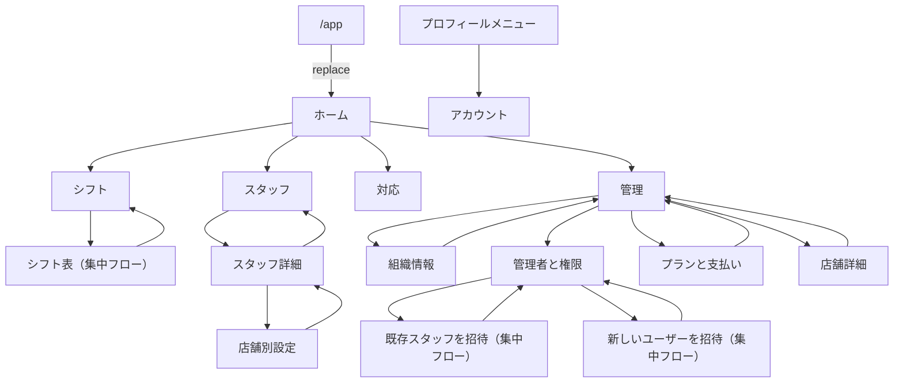

# レスポンシブナビゲーションと固定画面遷移 Phase 1 実装計画

作成日: 2026-08-14
状態: History（固定15画面、navigation shell、既存UI再利用の実装履歴）
対象: 認証済み管理アプリの新URL、SPボトムナビゲーション、PCヘッダーメニュー、固定文言による15画面と画面遷移
対象外: 実データ取得、Convex変更、既存Dialogの作り直し、現行管理URLの互換redirect、本番入口の切替

> 2026-08-15に固定画面とshellの実装履歴として閉じた。
> 実データ接続はPhase 2で完了し、正式切替は[認証済み新ページ正式切替と旧ページ削除](2026-08-15_認証済み新ページ正式切替と旧ページ削除_実装計画.md)へ移管した。

## 1. 結論

最初の実装では、認証済み管理アプリの新しい画面群を`/app/*`へ作る。
画面の本文は固定文言と架空のサンプルデータにし、ページ間の遷移、戻り先、SPとPCのnavigation shellを先に完成させる。

トップレベルの目的地は、SPとPCで共通の次の5項目とする。

1. ホーム
2. シフト
3. スタッフ
4. 対応
5. 管理

表示方法だけを画面幅で変える。

- 1024px未満: 画面下部の固定ボトムナビゲーション
- 1024px以上: 既存Header内の横並びメニュー
- シフト表や招待入力などの集中フロー: SP、PCとも主navigationを隠す

情報設計、各トップ画面の役割、モックの判断根拠は、[SPボトムナビゲーションと画面遷移](2026-08-14_SPボトムナビゲーションと画面遷移_実装計画.md)を全体計画とする。
この文書は、そのうち「固定画面で画面遷移とresponsive shellを先に実装するPhase 1」の実行単位を定める。

## 2. なぜ新旧routeを一時併存させるか

ユーザー判断により、最終的な旧URL互換は不要とする。
ただし、固定文言だけの新画面で現行routeを直ちに置換すると、シフト作成、スタッフ管理、課金など、現在動いている業務機能と主要E2E契約が一時的に到達不能になる。

そのため、実装中だけ次の境界を設ける。

| 段階 | 新しい`/app/*` | 現行管理route | 利用者の入口 |
|---|---|---|---|
| Phase 1 | 固定画面と遷移を実装 | 変更せず維持 | 現行routeのまま。新画面はURLを直接開いてレビュー |
| Phase 2 | 実データと既存機能を接続 | 変更せず維持 | 画面単位で動作を比較 |
| 切替 | 新routeを正式入口にする | route fileを削除 | Header、認証後、メール、Stripe等を新URLへ一括更新 |
| 切替後 | canonical | 404 | 旧URL用redirectは作らない |

この併存は旧URL互換のためではなく、固定画面レビュー中に現行機能を失わないための実装上の安全策である。
Phase 1ではHeaderロゴ、現行UserMenu、認証後のdefault遷移を新画面へ切り替えない。
既存のquery、mutation、業務feature、現行routeは削除せず、Phase 2で新画面へ接続する実装として保持する。

## 3. Phase 1の完了状態

Phase 1完了時には、次を確認できる。

- 認証済み利用者が`/app/home`を直接開ける
- 5つのトップ画面をSPのボトムバーまたはPCのHeaderから移動できる
- 詳細画面でも親目的が選択状態になり、明示した親画面へ戻れる
- 集中フローでは主navigationが消え、専用Headerから完了先または取消先へ戻れる
- 15画面の本文は固定文言だが、routeと画面遷移は最終形のURLを使う
- 現行route、公開画面、スタッフ向けCapability画面は従来どおり動く
- 新画面本文から新規の業務query、mutation、外部副作用は発生しない。`AuthGuard`の本人確認queryは維持する

Phase 1は、実データを使う本番機能の完成ではない。
静的fixtureのまま正式入口へ切り替えないことをrelease gateとする。

2026-08-14時点で、固定15画面、`/app/*`のroute、SP bottom、PC Header menu、集中フロー用Header、認証shell、静的hosting分類まで実装した。
同日、モック専用のCard、見出し、rowによる本文を見直し、既存のDashboard、OrganizationSettings、UserDetail、UserShopDetail、ManagerSettings、ShopDetail、LoginMethods、ShiftFormの純粋ViewまたはSectionへfixtureを渡す構成へ置き換えた。  ホームの組織と店舗、管理の組織表示は既存Dashboardの`OperationContextView`へ統一し、シフト、スタッフ、対応は現在の組織を切り替えるUIを置かず、店舗filterだけを新しい純粋UIとして分離した。

初回UIレビューでは、トップ見出しを既存詳細画面と同じ小さい見出しとiconへ変更し、シフト行の操作menuを閲覧プレビューでも表示した。  ホーム末尾の「この店舗を管理」は削除し、選択店舗横の既存設定iconへ集約した。  対応画面はDashboardのTODO要約を流用せず、シフト調整、スタッフ登録申請、通知不達、管理者招待エラーをフラットな未解決カードとして表示する`ActionInboxView`へ置き換えた。

追加UIレビューでは、スタッフ検索とシフト、スタッフ、対応の組織切替面を削除した。  対応は種類別filterを置かず、店舗だけで絞れるコンパクトな一覧にし、承認、再送、取消などの完了後はカードを右へ退場させて後続項目を詰める。  管理トップの組織作成と店舗追加は各section見出しの右へ移し、管理者画面は利用状況を見出し直下、SPの権限解除を右端のicon操作、送信済み招待を既存rowで表示する構成へ揃えた。

新規Story、自動テスト、全画面VRT、最終画面レビュー、実データ接続は後続作業として残す。  既存のシフト一覧と管理者設定については、対象のSP VRTを実行してレスポンシブ配置を確認した。

## 4. canonical route

Phase 1では15画面と`/app`のcanonical redirectを作る。
`org`、`shop`、`shopFilter`は実データ接続前にはURLへ置かない。固定画面のIDが実際の組織・店舗scopeであるように見せないためである。

Phase 1の`/app/*`はsearch parameterを1つも受け付けない。`_auth`のroute policyは、`shop`、`org`、`token`、`code`、`state`を含むすべてのsearchを、`AuthGuard`がlogin復帰先を作る前に除去し、同じpathnameへ`replace`する。これにより未知queryをlogin URL、log、計測へ引き継がない。

### 4.1 通常navigation shell

| URL | 画面 | active | 戻る先 |
|---|---|---|---|
| `/app/home` | ホーム | ホーム | なし |
| `/app/shifts` | シフト | シフト | なし |
| `/app/staff` | スタッフ | スタッフ | なし |
| `/app/staff/:personId` | スタッフ詳細 | スタッフ | `/app/staff` |
| `/app/staff/:personId/shops/:shopId` | スタッフの店舗別設定 | スタッフ | `/app/staff/:personId` |
| `/app/actions` | 対応 | 対応 | なし |
| `/app/manage` | 管理 | 管理 | なし |
| `/app/manage/organization` | 組織情報 | 管理 | `/app/manage` |
| `/app/manage/managers` | 管理者と権限 | 管理 | `/app/manage` |
| `/app/manage/billing` | プランと支払い | 管理 | `/app/manage` |
| `/app/manage/shops/:shopId` | 店舗詳細 | 管理 | `/app/manage` |
| `/app/account` | アカウント | 選択なし | なし |

### 4.2 集中フロー

| URL | 画面 | 主navigation | 取消・完了後 |
|---|---|---|---|
| `/app/shifts/:recruitmentId/board` | シフト表 | SP、PCとも非表示 | `/app/shifts` |
| `/app/manage/managers/invite-staff` | 既存スタッフを管理者として招待 | SP、PCとも非表示 | `/app/manage/managers` |
| `/app/manage/managers/invite-new` | 新しいユーザーを管理者として招待 | SP、PCとも非表示 | `/app/manage/managers` |

`/app`は`replace`で`/app/home`へ送る。
通常の画面遷移は`push`とし、ブラウザバックを成立させる。

### 4.3 Phase 1で新routeにしない操作

次は現在のDialogまたはModalを後の実データ接続時に再利用するため、Phase 1では専用routeを作らない。

- 募集作成
- スタッフ追加
- LINE連携
- 所属店舗変更
- 登録申請の審査
- 通知不達の復旧
- 店舗追加、店舗編集、店舗所属スタッフ変更
- 組織作成
- アカウント削除
- 初回設定
- 組織名、請求先、権限解除、削除などの短い確認

固定画面上には入口の見た目を置いてよいが、Phase 1では実mutationを呼ばない。
ページ遷移ではない操作は、レビュー中に誤操作を起こさないよう`disabled`または`aria-disabled`で表現する。

## 5. 画面遷移



Phase 1では`window.history.back()`だけに依存しない。
各詳細画面と集中フローは、上表のcanonical親を明示的な`Link`として持つ。

## 6. responsive shell

### 6.1 routeが宣言する3状態

各新routeは、TanStack Routerの`staticData`でshell状態を明示する。

```ts
type AppShellRouteData =
  | {
      mode: "navigation";
      activeKey: "home" | "shifts" | "staff" | "actions" | "manage" | null;
    }
  | { mode: "focused" };
```

`_auth`配下のlayoutは最深matchの宣言を読み、次の3状態に分ける。

| 状態 | 判定 | Header | SP bottom | PC menu |
|---|---|---|---|---|
| `navigation` | `staticData.mode === "navigation"` | 新Header | 表示 | 表示 |
| `focused` | `staticData.mode === "focused"` | 専用Header | 非表示 | 非表示 |
| `legacy` | 宣言なし | 現行Header | 非表示 | 非表示 |

`activeKey: null`はアカウントの「5項目を表示するがどれも選択しない」を表す。
宣言なしは未移行routeであり、`null`と同一に扱わない。

pathnameの単純な前方一致は使わない。
これにより、詳細画面の親active、集中フロー、将来追加する似たURLをrouteごとに確定できる。

### 6.2 SP

- `lg`未満で固定ボトムナビゲーションを表示する
- 項目順は「ホーム、シフト、スタッフ、対応、管理」で固定する
- iconとlabelを併記し、各リンクのタップ領域を44px以上にする
- `nav`へ`aria-label="メインメニュー"`を付ける
- 現在項目へ`aria-current="page"`を付ける
- activeは文字、icon、太字、上端indicatorで示し、色だけに依存しない
- ボトムバー本体と`env(safe-area-inset-bottom)`の合計を本文の下paddingへ反映する
- 「対応」の固定badgeは4種類のサンプル未解決項目に合わせて`4`とし、読み上げ名も持たせる
- 入力中のキーボードやDialogより上へ不用意に重ならないz-indexにする

### 6.3 PC

- `lg`以上でボトムバーを隠し、同じ5項目をHeader中央へ表示する
- ロゴ、5項目、UserMenuを`auto minmax(0, 1fr) auto`相当のGridで配置する
- 項目の名称、順序、href、activeはSPと同じ定義を使う
- サイドバーは追加しない
- 768〜1023pxはHeaderへ5項目を詰めず、SPと同じボトム方式にする
- 1024px、1280px、長い組織名の状態をVRTで確認する

### 6.4 詳細と集中フロー

通常detailは主navigationを維持し、本文先頭の既存`DetailPageHeader`で親へ戻す。
集中フローはブランドHeaderも主navigationも隠し、専用Headerに「戻る」または「キャンセル」、画面名、必要な右側actionだけを置く。

シフト表の未保存guardは、実機能を接続するPhase 2で既存`useBlocker`をそのまま維持する。
Phase 1の固定画面では未保存状態を作らない。

## 7. 固定画面の内容

画面本文は、既に作成したSPモックを視覚仕様として使う。

- トップ: [ホーム](../assets/plans/2026-08-14-sp-bottom-navigation/shiftori-sp-home.webp)、[シフト](../assets/plans/2026-08-14-sp-bottom-navigation/shiftori-sp-shifts.webp)、[スタッフ](../assets/plans/2026-08-14-sp-bottom-navigation/shiftori-sp-staff.webp)、[対応](../assets/plans/2026-08-14-sp-bottom-navigation/shiftori-sp-actions.webp)、[管理](../assets/plans/2026-08-14-sp-bottom-navigation/shiftori-sp-manage.webp)
- [関連画面のモック](../assets/plans/2026-08-14-sp-bottom-navigation/shiftori-sp-related-pages-contact-sheet.webp)

fixtureは実データと混同しないよう、次の契約にする。

- 氏名、メール、店舗名は架空値を使い、メールdomainは`example.com`にする
- 件数、締切、badgeは全画面で矛盾しない1セットへ固定する
- route paramは画面見本の切替以外に使わず、query、mutation、Jotai、logへ渡さない
- Convex hook、Clerk metadataの業務表示、外部APIを固定画面componentから呼ばない
- 画面間Link用のfixture IDは`sample-person`、`sample-shop`、`sample-recruitment`のように用途を明示する
- 固定fixtureは現行`Dashboard`や`OrganizationSettings`へ混ぜず、後で削除できる場所へ隔離する

固定文言であっても、画面本文をモック専用のCard、見出し、rowで再実装しない。  現行画面で調整済みの文字サイズ、余白、状態表示、レスポンシブ挙動を維持するため、queryやmutationを持たない既存の`*View`、`*Section`、共通UIへfixtureとcallbackをpropsで渡す。  新規compositionが必要なのは、ホーム、シフト一覧、スタッフ一覧、対応、管理トップのように既存画面と情報構造が異なるページだけとする。

トップ画面のscope UIは次の契約で統一する。

- ホームは既存Dashboardの組織面と店舗selectorをそのまま使い、選択店舗だけを本文へ反映する
- シフト、スタッフ、対応は現在の組織を切り替える面を表示せず、店舗だけをactive contextを変えない共通filter menuで絞る
- 管理は組織面だけを表示し、店舗は管理sectionのrowから直接開く
- `すべての店舗`を偽の店舗IDとして組織・店舗contextへ混ぜない

## 8. componentとfileの変更単位

### 8.1 route

現行のflat file conventionに合わせ、次のroute群を`src/routes/_auth/`へ追加する。

```text
app.tsx                                      /app → /app/home
app_.home.tsx                                /app/home
app_.shifts.tsx                              /app/shifts
app_.shifts_.$recruitmentId_.board.tsx       /app/shifts/:recruitmentId/board
app_.staff.tsx                               /app/staff
app_.staff_.$personId.tsx                    /app/staff/:personId
app_.staff_.$personId_.shops.$shopId.tsx     /app/staff/:personId/shops/:shopId
app_.actions.tsx                             /app/actions
app_.manage.tsx                              /app/manage
app_.manage_.organization.tsx                /app/manage/organization
app_.manage_.managers.tsx                    /app/manage/managers
app_.manage_.managers_.invite-staff.tsx      /app/manage/managers/invite-staff
app_.manage_.managers_.invite-new.tsx        /app/manage/managers/invite-new
app_.manage_.billing.tsx                     /app/manage/billing
app_.manage_.shops.$shopId.tsx               /app/manage/shops/:shopId
app_.account.tsx                             /app/account
```

route IDとURLは生成後に確認し、`src/routeTree.gen.ts`は手動編集しない。

### 8.2 navigationとshell

追加候補:

- `src/components/features/AuthenticatedApp/AppPrimaryNavigation/index.tsx`
  - 5項目の共通定義からPC menuとSP bottomを描画する
- `src/components/features/AuthenticatedApp/AppPrimaryNavigation/navigation.ts`
  - key、label、icon、href、badgeの型付き定義を所有する
- `src/components/templates/AuthenticatedAppShell/index.tsx`
  - Header、本文、SP bottom、safe-area paddingを構成する
- `src/components/templates/FocusedFlowHeader/index.tsx`
  - 集中フローの戻る、タイトル、右側actionを所有する
- `src/components/features/AuthenticatedApp/appRoutePolicy.ts`
  - 最深routeの`staticData`から`navigation / focused / legacy`を解決する
  - `/app/*`のsearchを空へcanonical化し、認証redirectより先に適用する純粋policyも所有する

変更候補:

- `src/routes/_auth.tsx`
  - `/app/*`は認証を要求するが店舗contextを要求しない
  - `legacy`では現行Headerと`shop`正規化を維持する
  - `navigation / focused`では新shellへ委譲する
- `src/components/features/AuthenticatedApp/AuthGuard.tsx`
  - `/app/*`で`getCurrentUser`と削除済みアカウント確認を維持する
  - `/app/*`では`getMyShops`と`?shop=`正規化を開始条件にしない
- `src/components/templates/Header/index.tsx`
  - user variantへ意味のある`primaryNavigation` slotを追加する
  - 新shellだけロゴの遷移先を`/app/home`にする
- `src/components/features/UserMenu/index.tsx`
  - 新shellだけアカウント遷移先を`/app/account`にできる型付きpropを追加する
  - legacy shellの`/account`は正式切替まで維持する
- `src/components/features/AuthenticatedApp/AuthenticatedHeader/index.tsx`
  - legacy用の既存挙動は維持し、新shellからは直接使わない

新shellでは、現在の店舗contextを必要とする要望受付Dialogを接続しない。Header上の入口をモックに残す場合は「準備中」の無効buttonとし、固定fixtureの店舗IDで送信できないようにする。

### 8.3 pageとfixture

15画面はroute JSXへ本文を直書きせず、`src/pages/app-navigation-prototype/`を公開入口にする。  共通の架空データと、新しい情報構造にだけ必要なcompositionは`src/components/features/AppNavigationPrototype/`へ隔離する。

詳細、管理設定、シフト表は、既存featureの純粋Viewへfixtureとno-op callbackを渡す。  既存View内の遷移先だけが旧routeに固定されている場合は、既存挙動をdefaultにした型付きpropを追加し、新しい`/app/*`からだけ新routeを選ぶ。  connected component、controller、Convex hook、mutation、Dialogは固定画面からmountしない。

1つの巨大な`screenType` switchや、意味のない汎用card registryは作らない。
共通化するのはnavigation、page shell、fixture、既に規約化されているCardやSectionの見た目までとする。

## 9. 認証とSecurity Lens

| 観点 | Phase 1の契約 |
|---|---|
| Actor | Clerkで認証済みの管理者 |
| Asset | 認証session、管理画面境界、利用者のscope認識、公開Capabilityの分離 |
| Trust boundary | browser URL → TanStack Router → `_auth` → `AuthGuard` |
| 保護 | `/app/*`は必ず`_auth`配下。匿名利用者は元の新URLを保持してloginへ送る |
| scope | 固定fixtureであり、実組織・実店舗のauthorityを主張しない |
| ID | path paramをConvex、atom、外部API、計測へ渡さない |
| mutation | Phase 1では実行しない。破壊操作や送信操作は無効表示にする |
| PII | 実在する氏名、メール、IDをfixture、Story、screenshot、logへ入れない |
| Capability | `/staff/register`、`/shifts/*`、`/manager-invite`等へ管理navigationを表示しない |
| lifecycle | 旧管理routeはPhase 1では維持し、切替時にredirectなしで削除する |

Phase 1ではConvex function、schema、保存データ、migrationを変更しない。
実データを接続するPhase 2では、`activeOrg`、`homeShop`、`shopFilter`とserver-side membership検証を別のSecurity Lensで確定してからqueryを追加する。

## 10. hostingとroute分類

新routeは認証済みCSR shellとして扱う。

- `scripts/staticSite.ts`へ`/app/*`の固定routeとdynamic routeを追加する
- `scripts/staticSite.test.ts`のroute tree完全分類を更新する
- security headerは`no-store`、`noindex`、`no-referrer`を維持する
- `public/robots.txt`へ`Disallow: /app/`を追加する
- Web計測では`/app/*`をclosed surfaceのままにする
- 直URLとrefreshで同じ画面を開けることをbuild testで確認する

Phase 1では現行管理routeをhosting分類から削除しない。

## 11. テスト計画

### 11.1 Logic

| 契約ID | 主担当 | 確認内容 |
|---|---|---|
| `NAV-CONFIG-01` | Logic | 5項目のkey、label、順序、hrefが重複せずSPとPCで共通 |
| `SHELL-POLICY-01` | Logic | `navigation / focused / legacy`と`activeKey: null`を区別する |
| `NAV-ROUTE-01` | Logic | 15routeが期待するactiveまたはfocusedを明示する |
| `NAV-SEARCH-01` | Logic | `/app/*`の未知query、`shop`、外部URL、token系を除去し、pathnameとpath paramだけを残す |
| `AUTH-SCOPE-01` | Logic | `/app/*`は認証必須・店舗不要、legacy管理routeは従来どおり店舗必須 |

### 11.2 Storybook Behavior

| 契約ID | 確認内容 |
|---|---|
| `NAV-BEHAVIOR-01` | 5項目のhref、順序、`aria-current`、対応badgeのaccessible name |
| `NAV-BEHAVIOR-02` | PC menuとSP bottomが同じ設定を参照する |
| `NAV-BEHAVIOR-03` | detailで親目的を選び直すとトップ画面へ遷移する |
| `FOCUS-BEHAVIOR-01` | focused shellにPC menuとSP bottomが存在しない |
| `HEADER-ACTIONS-01` | 新shellのプロフィールから`/app/account`へ進み、要望受付は実送信できない |
| `TOP-CTA-01` | 固定画面の有効なpage Linkが新routeだけを生成する |

本文の固定文言をBehavior testで総当たりしない。
画面構成と固定文言はVRTが主担当とし、URLとアクセシビリティ契約だけをBehaviorで確認する。

### 11.3 VRT

- 15画面すべてのSP representative state
- PCの5トップ共通Headerを代表するホーム
- PCの通常detailを代表するスタッフ詳細
- PCのfocused shellを代表するシフト表
- 現行VRT projectに合わせた320px、414px、1280px
- `lg`切替直後の1024pxは、ユーザーの画面レビューでHeader幅を確認する
- 長い組織名、対応badge、本文末尾とbottom bar、safe area

Mobile Storyはviewport指定だけでなく`vrt-mobile1`または`vrt-mobile2`tagを付ける。
fixed Headerを含むStoryは既存VRT設定に従ってrelease対象を宣言する。

### 11.4 E2E

Phase 1では現行13件のcore E2E契約を削除、skip、固定画面へ移管しない。
現行業務routeを残すことで、既存機能のbrowser契約を維持する。

新規E2Eは`E2E-NAV-01`の代表navigation 1件に限定する。認証済み状態で「スタッフ」を押し、`/app/staff`への遷移とactiveを確認する。`scripts/assertE2ECoreResults.mjs`の期待集合へこのIDを追加し、Phase 1以降のcore gateを13件から14件へ更新する。

匿名で`/app/home`を開いたときのlogin復帰は、既存の認証E2Eへ保護routeの代表として追加する。代表Capability routeに新navigationが表示されない契約も、既存Capability E2Eのshell確認を維持する。これらを新しいnavigationシナリオへ混ぜない。

5項目総当たりとresponsiveの見た目はBehaviorとVRTへ置く。
Phase 1はbackend契約を変えないためConvex Function testとScenario testは追加しない。

### 11.5 実装後の検証

```bash
pnpm test:logic
pnpm test:ui
pnpm type-check
pnpm lint
pnpm build
pnpm docs:check
```

対象testを先に実行し、VRTはCIで確認する。
開発サーバーは新規起動せず、既存serverがある場合だけroute tree生成の確認に使う。

## 12. 実装順

### Phase 1A: routeとshell metadata

1. 15画面とcanonical親をこのroute表で固定し、実装上のshell分類は各routeの`staticData`だけを正本にする
2. `StaticDataRouteOption`へshell metadataの型を追加する
3. `/app/*`のroute fileと`/app → /app/home`を追加する
4. route treeをgeneratorで生成し、全URLを確認する
5. `_auth`で`navigation / focused / legacy`を解決する
6. `/app/*`のsearchを空へ`replace`してから認証redirectを解決する
7. `/app/*`だけ店舗contextを要求しないAuthGuard契約を追加する

### Phase 1B: responsive navigation

1. 型付きの5項目定義を作る
2. SPボトムナビゲーションを実装する
3. HeaderへPCメニューslotを追加する
4. `lg`で表示方法を切り替える
5. safe area、本文padding、focus時の非表示を実装する
6. Logic、Behavior、shell VRTを先に通す

### Phase 1C: 固定トップ5画面

1. ホーム
2. シフト
3. スタッフ
4. 対応
5. 管理

各画面の主要CTAは、新routeへ進むものだけ有効化する。
mutationやDialogを必要とする操作はまだ実行可能にしない。

### Phase 1D: 固定detailとfocused画面

1. シフト表
2. スタッフ詳細
3. スタッフの店舗別設定
4. 組織情報
5. 管理者と権限
6. 既存スタッフ招待
7. 新規ユーザー招待
8. プランと支払い
9. 店舗詳細
10. アカウント

明示的な戻り先、親active、focus時のnavigation非表示を画面ごとに確認する。

### Phase 1E: buildとレビュー

1. Story、VRT、route unit、代表E2Eを追加する
2. static hosting、robots、closed measurement分類を更新する
3. 15画面をSPとPCで視覚レビューする
4. URL、戻り先、active、Header幅、bottom barの重なりを修正する
5. ユーザーの画面レビュー承認を得る

## 13. Phase 1後の実データ接続と切替

Phase 2は別の実装単位とし、次の順序を守る。

1. 組織authorityを店舗選択から分離する
2. `activeOrg`、ホーム用`homeShop`、一覧用`shopFilter`を定義する
3. serverで検証したscopeだけをURLとqueryへ反映する
4. 固定pageを既存controller、query、mutationへ画面単位で接続する
5. 現行Dialogを新page内の入口へ再接続する
6. 既存E2Eの能力を新routeで同等に通す
7. Header、UserMenu、認証default、メール、LINE、Stripe returnの新規生成先を新URLへ更新して先にdeployする
8. 旧URLを保持するopenなStripe Sessionが失効済みか自然期限を迎えたことを確認する
9. 旧URLを含むpendingまたはscheduled通知payloadの有無を確認し、存在する場合はdrain、再発行、または安全な取消を完了する
10. runtime Link、navigate、URL generator、route manifestから旧管理URL参照が消えたことを`rg`とtype-checkで確認する。旧URLの404負テストとplan/archiveは許可対象として分ける
11. 現行管理route fileを削除し、route treeを再生成する
12. 旧管理URLがredirectされず404になることをbuildとdeployed smokeで確認する

切替対象の主な旧管理URL:

```text
/dashboard
/settings
/settings/managers
/settings/managers/invite-staff
/settings/managers/invite-new
/shiftboard/:recruitmentId
/shops/:shopId
/users/:personId
/users/:personId/shops/:shopId
/account
```

公開Capability、認証callback、スタッフ向けURLは管理アプリとは別境界なので、この一括削除へ含めない。

```text
/staff/register
/legal/staff/consent
/line/callback
/shifts/submit
/shifts/submit/completed
/shifts/view
/shifts/reissue
/manager-invite
/sso-callback
```

## 14. リスクと対策

| リスク | 対策 |
|---|---|
| 新固定画面を正式入口にして現行機能を失う | Phase 1は直接URLレビューだけにし、Headerや認証defaultを切り替えない |
| `/app/*`でも現行の`?shop=`正規化が走る | route shell policyとAuthGuard testで店舗不要を明示する |
| PC Headerに5項目が収まらない | `lg`開始、Grid配置、1024pxと長名のVRTを必須にする |
| bottom barが本文やsafe areaを覆う | shellが高さとsafe-areaを一元所有し、長い画面でVRTする |
| detailが誤った目的をactiveにする | route `staticData`で親目的を明示する |
| static IDが実データへ渡る | fixture componentからdata hookを呼ばず、mutationを無効にする |
| 固定画面だけ文字サイズや余白が現行UIからずれる | 既存の純粋View、Section、共通UIを優先し、モック専用UIは新しい情報構造に必要なcompositionだけに制限する |
| 新routeの直URLだけ404になる | static site route tree完全分類とbuildでrefreshを検証する |
| 現行業務E2Eを誤って削除する | Phase 1では旧routeと13件のcore契約を維持する |
| 切替後もメールやStripeが旧URLを発行する | URL generatorを先に切り替え、open Sessionの期限とpending通知のdrainを確認してから旧routeを削除する |
| route名と生成URLがずれる | `routeTree.gen.ts`を手編集せず、generator出力とtyped Linkで確認する |

## 15. 受入条件

### Phase 1

- [ ] `/app`を開くと`/app/home`へreplaceされる
- [ ] 15画面を直URLと画面内Linkの両方で開ける
- [ ] SPは5項目のbottom、PCは同じ5項目のHeader menuを使う
- [ ] active、選択なし、focused、legacyの4状態が期待どおり描画される
- [ ] detailとfocused画面の明示的な戻り先が正しい
- [ ] fixed bottomとsafe areaが本文を隠さない
- [ ] 画面内のfixtureは架空値だけで、Convexや外部APIへ到達しない
- [ ] 既存画面と同じ役割の本文は既存の純粋ViewまたはSectionを再利用し、query、mutation、controller、Dialogをmountしない
- [ ] 匿名利用者は新routeを閲覧できない
- [ ] 公開、認証、Capability画面へ管理navigationが混入しない
- [ ] 現行管理routeと既存13件のcore E2Eは従来どおり動き、`E2E-NAV-01`を加えた14件のcore gateが通る
- [ ] route tree、static hosting、robots、closed measurementが新routeを網羅する
- [ ] Logic、Behavior、VRT、代表E2E、type-check、lint、build、docs checkが通る
- [ ] SPとPCの画面遷移、Header、bottom barをユーザーがレビューできる

### 正式切替

- [ ] 15画面が実データと既存業務操作へ接続されている
- [ ] 現行core E2Eの能力が新routeで失われていない
- [ ] 認証後、Header、UserMenu、外部復帰先が新URLを指す
- [ ] runtime Link、navigate、URL generator、route manifestに旧管理URL参照がなく、負テストとplan/archiveだけがallowlistで残る
- [ ] 旧URLを持つopen Stripe Sessionとpending通知のlifecycleを解消している
- [ ] 旧管理routeはredirectを持たず404になる
- [ ] 対応する`doc/features/`が現在仕様へ更新されている

## 16. 自己レビュー

### 1回目: URL変更の許可と機能維持を分離

旧URL互換が不要でも、固定画面だけで即時置換すると現行機能を失う。
そのため、URLは新canonicalで作り、実装中だけ旧routeを残すrelease boundaryを追加した。

### 2回目: 店舗scopeをPhase 1から除外

固定画面で`shop`や`organizationId`を採用すると、未検証値がauthorityであるように見える。
Phase 1はpath-onlyとし、scopeは実データ接続時にserver検証込みで追加する形へ修正した。

### 3回目: PCとSPの構造差を最小化

PC専用sidebarや別メニュー定義を作らず、同じ5項目をHeaderとbottomへ描き分ける。
画面幅の差が目的地、名称、順序の差へ波及しない構成にした。

### 4回目: テストの主担当を分離

activeとshell判定はLogic、hrefとARIAはBehavior、見た目はVRT、認証済み実routerの接続だけE2Eとした。
固定文言の総当たりや5項目総当たりをE2Eへ重複させない。

### 5回目: path-onlyと旧URLの残存lifecycleを明文化

未知queryが認証redirectへ残らないよう、`/app/*`は認証判定前にsearchを空へcanonical化する。
正式切替では新しいURL生成を先に止めるだけでなく、旧URLを保持するopenなStripe Sessionとpending通知を解消してから旧routeを404へ変える。

## 17. 参考にしたファイル

### route、認証、Header

- `src/routes/_auth.tsx`
- `src/components/features/AuthenticatedApp/AuthGuard.tsx`
- `src/components/features/AuthenticatedApp/AuthenticatedHeader/index.tsx`
- `src/components/templates/Header/index.tsx`
- `src/components/templates/DetailPageHeader/index.tsx`
- `src/lib/auth/redirect.ts`
- `src/router.tsx`
- `src/routeTree.gen.ts`

### 現行画面と遷移

- `src/components/features/ActionInbox/ActionInboxView.tsx`
- `src/components/features/AppNavigationPrototype/TopPages.tsx`
- `src/components/features/Dashboard/DashboardContent/DashboardContentView.tsx`
- `src/components/features/Dashboard/HeroSummary/ActionTaskList.tsx`
- `src/components/features/Dashboard/OperationContext/View.tsx`
- `src/components/features/Dashboard/RecruitmentBoard/RecruitmentRow.tsx`
- `src/components/features/OrganizationSettings/OrganizationSettingsView.tsx`
- `src/components/features/UserDetail/navigation.ts`
- `src/components/features/UserDetail/UserDetailView.tsx`
- `src/components/features/UserShopDetail/UserShopDetailView.tsx`
- `src/components/features/ShopDetail/ShopDetailView.tsx`
- `src/components/features/ShiftBoard/ShiftBoardPage/ShiftBoardPageView.tsx`
- `src/components/features/UserMenu/index.tsx`

### build、test、文書

- `scripts/staticSite.ts`
- `scripts/staticSite.test.ts`
- `scripts/assertE2ECoreResults.mjs`
- `public/robots.txt`
- `doc/rules/frontend-architecture.md`
- `doc/rules/ui-design.md`
- `doc/rules/testing-strategy.md`
- `doc/rules/security-strategy.md`
- `doc/features/INDEX.md`
- `doc/plans/2026-08-14_SPボトムナビゲーションと画面遷移_実装計画.md`
