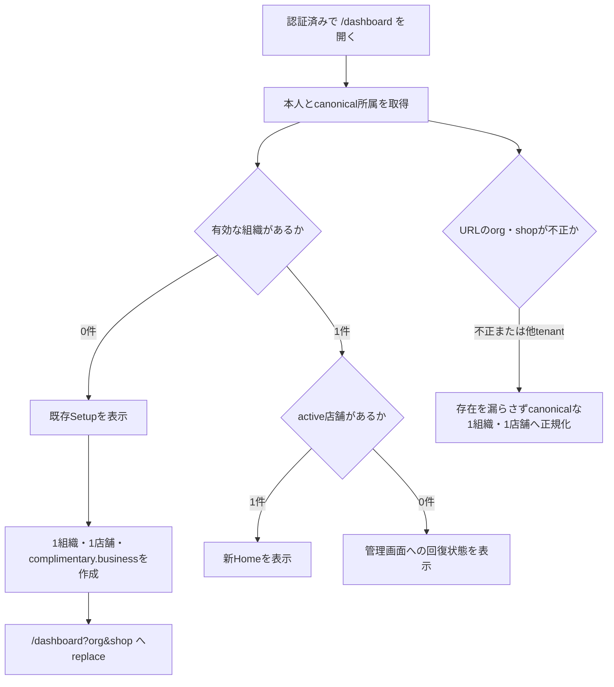

# 認証済み新ページ正式切替と旧ページ削除 実装計画

作成日: 2026-08-15
状態: Active（repository実装、commit、Pull Request更新、GitHub Actions検証を完了。Production rolloutの実環境証跡待ち）
対象: `/dashboard`への新Home切替、認証済み新routeの正式化、旧route・page compositionの削除、未リリース機能の公開制御、全自動テストの実走と修正
対象外: 新しいdata migration、既存migrationの再実行、複数店舗・複数組織・複数管理者・支払い機能の公開、Production deploy

## 1. この計画の位置づけ

この計画は、[レスポンシブナビゲーションの実データ・操作接続 Phase 2](2026-08-14_レスポンシブナビゲーション実データ操作接続_Phase2実装計画.md)のPhase 2-8を置き換える。
Phase 2-0から2-7までの実装経緯は旧計画へ残し、正式切替以降の判断と進捗はこの計画だけで追跡する。

利用者から次のProduction前提が示されている。

- 公開済みの利用形態は、1店舗と1組織と1管理者である。
- 複数店舗、複数組織、複数管理者、支払い周りは未リリースである。
- 既存データを1店舗と1組織へ結び付け、課金状態を`complimentary.business`へ寄せるmigrationは実装済みである。
- 今回は追加migration、backfill、Narrowを行わない。

この前提は今回の実装範囲を決めるために用いる。
実deploymentでのmigration完了を新たに検証したという意味ではないため、[リリース状態](../manual/release-status.md)の未確認項目を確認済みへ変更しない。

repository実装の完了とProductionへ反映できる状態は分けて判定する。
`/dashboard`の新shellはcanonicalな`organizationMembers`を組織authorityに使うため、Productionへ反映する前に、既存の有効管理者がcanonical所属を持ち、legacyな`shopMembers`だけで利用できる管理者が0件であることを対象deploymentの証跡で確認する。
ここでいうcanonical所属は、未削除組織、同じuserと組織に属する一意でactiveな`organizationPeople`、一意でactiveまたはreadOnlyな`organizationMembers`が相互に一致し、`resolveOrganizationReadActor`と同じ条件でactorを解決できる状態を指す。
全pageのread-only exportまたはverifierでこの条件とlegacy-only 0件を確認し、m029実行前のcanonical対応済みrowも数える`verifyLegacyShopMembers.activeRows`だけを完了根拠にしない。
この確認は既存migrationの再実行や新規migrationを意味しない。
証跡を登録できない場合はProduction反映を停止し、組織全体のauthorityへlegacy fallbackを追加して回避しない。

## 2. 確定した判断

| 項目 | 判断 | 実装上の帰結 |
|---|---|---|
| Home URL | `/dashboard`を新Homeのcanonical URLにする | 旧Dashboard compositionを外し、新app shell、組織scope、新Homeを同じrouteへ接続する |
| Account URL | `/account`を新app shellのcanonical URLとして維持する | Google OAuthの公開済みreturn URLを変えず、重複する`/app/account`を削除する |
| `/app` | `/dashboard`へreplace redirectする | `org`が有効な場合だけ引き継ぎ、Home側で再検証する |
| `/app/home` | 未リリースURLとして削除する | redirect互換を作らず404とする |
| その他の旧URL | 旧pageとrouteを削除する | generic redirectを作らず404とする。内部遷移、生成URL、テストを新URLへ同じ変更で移す |
| 未リリース機能 | 今回の切替では公開しない | UI非表示だけでなく、direct routeとpublic mutation/actionもserver-side policyで閉じる |
| 新規Setup | 1組織、1店舗、1管理者、`complimentary.business`で作る | 新規documentだけを既存migration後の正規形へ合わせ、Trial deadlineやStripe objectを作らない |
| 既存migration | 変更、再実行、完了確認を行わない | schema、保存済みdocument、migration runnerへ差分を入れない |
| Convex public API | route削除へ便乗して削除しない | 旧frontendのopen tabとcached assetを考慮し、利用箇所がないAPIの整理は別計画へ分ける |
| E2E | 現在のcontract IDを維持する | 未リリース機能の契約もskipや削除でgreen化せず、明示的に有効化したE2E deploymentで新routeへ移す |
| 完了判定 | E2Eを含む全repository testを実走して修正する | 局所testだけ、`pnpm e2e:ci`だけ、retry込みの成功だけでは完了にしない |

Accountは組織scopeを持たない本人設定であり、既存の`/account`と`/app/account`は同じ`AccountSecurityPage`を描画している。
公開済みOAuth returnとbookmarkを壊さず重複routeを減らせるため、`/account`を残す。

## 3. 正式URL

### 3.1 公開するcanonical route

| URL | 目的 | 許可するsearch |
|---|---|---|
| `/dashboard` | 新Home | `org`, `shop` |
| `/app/shifts` | 募集と確定状況 | `org`, `shopFilter` |
| `/app/shifts/$recruitmentId/board` | シフト表 | `org` |
| `/app/staff` | スタッフ一覧 | `org`, `shopFilter` |
| `/app/staff/$personId` | スタッフ詳細 | `org` |
| `/app/staff/$personId/shops/$shopId` | 店舗別スタッフ詳細 | `org` |
| `/app/actions` | 対応事項 | `org`, `shopFilter` |
| `/app/manage` | 現在の組織と店舗の管理 | `org` |
| `/app/manage/organization` | 現在の組織情報 | `org` |
| `/app/manage/shops/$shopId` | 現在の店舗情報 | `org` |
| `/account` | 本人のログイン方法とアカウント削除 | `flow`, `oauth` |

`org`、`shop`、人物ID、店舗ID、募集IDは認可根拠にしない。
画面表示前と各Convex public function内で、認証actorの所属、対象組織、対象店舗の一致を再検証する。

### 3.2 未リリースのまま保持するroute

次の実装は将来の公開に備えて保持するが、公開policyが閉じている間は通常navigationへ出さない。
direct accessでは情報を描画せず、`/app/manage?org=<organizationId>`へreplaceして利用できない状態を通知する。

| URL | 閉じる機能 |
|---|---|
| `/app/manage/managers` | 複数管理者の一覧、招待、権限変更 |
| `/app/manage/managers/invite-staff` | 既存スタッフの管理者招待 |
| `/app/manage/managers/invite-new` | 外部管理者招待 |
| `/app/manage/billing` | Checkout、Portal、支払い方法、プラン変更 |

組織作成と店舗追加は`/app/manage`内の操作であるため、Buttonを描画しない。
同じ操作のpublic mutationも公開policyをserver-sideで確認し、副作用より前に拒否する。
組織0件の本人が最初の組織、店舗、管理者本人を作るSetupは、この追加機能policyでは閉じない。
Setup mutation自身が所属0件をserver-sideで確認し、二つ目の組織、店舗、管理者を作れない境界を持つ。

### 3.3 旧URLから移す機能

次の表はredirect表ではない。
内部リンク、メール等の新規生成URL、Page Object、仕様文書をどの正本へ移すかを示す。

| 旧URL | 新しい正本 | 備考 |
|---|---|---|
| `/dashboard?shop=<shopId>` | `/dashboard?org=<organizationId>&shop=<shopId>` | pathは維持し、`org`を補完してcanonicalizeする |
| `/settings`、`?tab=people` | `/app/staff?org=<organizationId>` | 旧default tabはpeopleである |
| `/settings?tab=shops` | `/app/manage?org=<organizationId>` | 現在の1店舗を管理する |
| `/settings?tab=settings` | `/app/manage/organization?org=<organizationId>` | 組織名と削除を扱う |
| `/settings?tab=billing` | `/app/manage/billing?org=<organizationId>` | 公開policyが閉じている間は生成、表示、実行しない |
| `/settings/managers*` | `/app/manage/managers*?org=<organizationId>` | 公開policyが閉じている間は生成、表示、受諾を停止する |
| `/shiftboard/$recruitmentId` | `/app/shifts/$recruitmentId/board?org=<organizationId>` | 公開Capability URLは変更しない |
| `/shops/$shopId` | `/app/manage/shops/$shopId?org=<organizationId>` | `returnTo`を廃止しhistory backへ統一する |
| `/users/$personId` | `/app/staff/$personId?org=<organizationId>` | `users`, `focus`, `panel`, `returnTo`を廃止する |
| `/users/$personId/shops/$targetShopId` | `/app/staff/$personId/shops/$shopId?org=<organizationId>` | route param名も`shopId`へ統一する |
| `/account` | `/account` | 新shellとmobile navigationへ接続する |

## 4. 公開範囲を広げない

現行repositoryでは、`src/domains/featureVisibility.ts`と`convex/_lib/config.ts`が対象機能を常時`true`として扱う。
新shellを`/dashboard`へ接続すると、現在はdirect accessだけの新管理画面が通常navigationから見えるため、この状態のまま正式切替しない。

### 4.1 fail-closed policy

既存の公開制御境界を次の四つへ戻し、未設定を`disabled`として扱う。

- `FEATURE_ORGANIZATION_CREATION`
- `FEATURE_SHOP_ADDITION`
- `FEATURE_MANAGER_INVITATION`
- `FEATURE_BILLING`

Convex側を公開状態の正本とする。
Frontendへ返す値は表示用DTOであり、mutationやactionの認可・公開判定には使わない。

| 機能 | 閉状態のUI | server-side enforcement | 残す処理 |
|---|---|---|---|
| 複数組織 | 組織作成Buttonを出さず、1件だけならswitch操作を出さない | `createOrganization`をwrite、audit、rate limitより前に拒否する | 現在組織の名称変更、削除preview |
| 複数店舗 | 店舗追加と他店舗所属追加を出さない | `addShop`と複数店舗化する操作を副作用前に拒否する | 最初の店舗の設定、同じ店舗へのスタッフ登録 |
| 複数管理者 | 管理者row、招待route、権限追加操作を出さない | 発行、再送、preview、受諾を拒否し、送信待ちの招待通知もprovider到達前に取消へ収束する | revoke、expire、残存招待を減らすcleanup |
| 支払い | 支払いrow、課金callout、Checkout・Portal操作を出さない | Checkout、Portal、支払い・プラン変更actionを拒否し、送信待ちの課金通知もprovider到達前に取消へ収束する | `complimentary.business`のentitlement read、署名済みWebhookの安全な処理 |

E2E専用deploymentでは四つを明示的に`enabled`へ設定し、将来機能の既存contractを実走する。
閉状態の安全契約はFrontend Unit、Convex Function Test、必要最小限のE2Eで別に固定する。

### 4.2 初回Setupの正規形

`convex/setup/service.ts`は現在、新規組織をTrialとして作り、課金deadlineをscheduleする。
既存migrationは新規登録後のdocumentへ適用されないため、正式切替と同時に作成時の正規形を揃える。

- `organizationBillingStates.state`は`{ kind: "complimentary", plan: "business" }`で作る。
- Stripe Customer、Checkout Session、Subscriptionを作らない。
- Trial終了deadlineをscheduleしない。
- auditの遷移先も既存migrationと同じ`complimentary.business`にする。
- 既存documentのbackfillとschema変更は行わない。

### 4.3 公開案内と法務文書

初回Setupを`complimentary.business`へ変えるだけでは、登録前の案内と利用条件が実装に一致しない。
公開ページ、Signup、Setup、FAQ、デモ、記事、検索向けmetadataには、次の現在条件だけを表示する。

- 初回登録では、1組織、1店舗、1管理ユーザーを作る。
- 最初の組織には支払い不要のBusinessを適用し、支払い情報の登録と無料体験の終了日を求めない。
- 利用人数はBusinessの上限までとする。
- 複数組織、複数店舗、複数管理者、有料プランの契約と支払いは現在公開していない。

二つ目以降の組織に対する2暦月のTrial契約は、機能を明示的に有効化した将来経路の内部契約として残す。
現在利用できる初回登録条件として公開ページへ表示しない。

管理ユーザー向け利用規約は利用条件の実質変更を含むため、本文の更新日だけを変えず、`documentVersion`と`requiredConsentVersion`を2026-08-15版へ上げる。
既存管理ユーザーには、次回の認証済み利用時に再同意を求める。

## 5. `/dashboard`の状態設計

既存利用者のmigrationと、組織をまだ持たない新規登録者は別の状態である。
旧Dashboardだけが持つSetup導線を新`/dashboard`へ移し、`E2E-SETUP-01`を維持する。



| 状態 | 画面 | 許可する操作 |
|---|---|---|
| 組織0件 | 既存SetupのPC・SP UI | 最初の組織と店舗を一度だけ作る |
| 1組織、active店舗1件 | 新Home | 現在店舗の日常業務を行う |
| 1組織、active店舗0件 | 回復案内 | `/app/manage`で状態を確認する |
| URLの`org`または`shop`が無効 | canonicalize中のspinnerまたは回復案内 | user-controlled IDの対象情報を表示しない |
| readOnly | 新Homeの閲覧状態 | write操作を無効化し理由を表示する |

archived店舗や`planSuspended`店舗を旧Dashboardと同じ一覧へ復元することは、今回の公開契約に含めない。
管理画面での状態確認と既存のserver-side write blockは残す。

## 6. 実装単位

### 6.1 公開policyとSetupを先に直す

1. Convexの四つの公開policyをfail-closedへ戻す。
2. current userとorganization settingsの表示DTOを、旧backendとの混在でも閉状態へ倒れるよう正規化する。
3. 組織作成、店舗追加、管理者招待、billingのpublic mutation/actionへserver-side gateを接続する。
4. `src/pages/app-manage/`のrow、Button、direct routeを同じpolicyへ接続する。
5. 初回Setupを`complimentary.business`作成へ変更し、Trial deadlineを作らない。
6. 閉状態と明示的なE2E有効状態のtest fixtureを分ける。

この単位がgreenになる前に`/dashboard`を新shellへ切り替えない。

### 6.2 HomeとAccountを新shellへ接続する

- `src/routes/_auth/dashboard.tsx`を新Home routeへ置き換え、`staticData.appShell.activeKey`を`home`にする。
- `src/pages/app-home/`の実装を`src/pages/dashboard/`へ移し、旧Dashboard page compositionを削除する。
- `/dashboard`もApp Organization Scopeの対象として扱う。
- `/dashboard`のsearch allowlistを`org`と`shop`にする。
- `/dashboard?shop=<shopId>`はcanonicalな1組織内で店舗を再検証し、`org`を補完する。
- `src/routes/_auth/account.tsx`へ新app shell metadataとmobile navigationを接続する。
- `src/routes/_auth/app_.home.tsx`と`src/routes/_auth/app_.account.tsx`を削除する。
- `src/routes/_auth/app.tsx`のredirect先を`/dashboard`へ変更する。
- `src/components/features/AuthenticatedApp/appRoutePolicy.ts`へ`/dashboard`と`/account`を型付きで組み込む。
- App primary navigation、Header logo、UserMenu、組織切替後のHome復帰先を更新する。

### 6.3 内部遷移と外部URLを更新する

次を`rg`で列挙し、削除対象の旧URLがproduction codeと現行testから0件になるまで同じ変更内で更新する。

- Dashboard、UserDetail、ShopDetail、UserShopDetail、ManagerSettings、OrganizationSettingsのfallback navigation。
- `PeopleCapacityResolutionAlert`のbilling導線。
- Google OAuth接続のreturn URL。canonicalは`/account?flow=connect-google&oauth=google`のままとする。
- 管理者招待受諾後の`/dashboard?org=<organizationId>&shop=<shopId>`。
- 組織削除、自己権限解除、自己所属削除後の`/dashboard`。
- `convex/_lib/dashboardUrl.ts`と通知・リマインド四caller。新規URLには検証済み`organizationId`を含める。
- `convex/organizationInvitation/actions.ts`の将来用管理者URL。
- `convex/organizationBilling/actions.ts`と`convex/organizationStripe/actions.ts`の将来用billing URL。

URL生成元が閉じた機能に属する場合も、将来再公開したとき旧URLを発行しない形へ直す。
閉状態では新規招待、課金session、課金メール自体を生成しない。
deploy前から送信待ちまたはretry中の招待・課金通知は、送信時のeligibility判定で公開policyを再確認し、providerへ到達させず取消へ収束させる。

### 6.4 旧routeとpage compositionを削除する

#### 削除するroute

- `src/routes/_auth/settings.tsx`
- `src/routes/_auth/settings_.managers.tsx`
- `src/routes/_auth/settings_.managers_.invite-new.tsx`
- `src/routes/_auth/settings_.managers_.invite-staff.tsx`
- `src/routes/_auth/shiftboard.$recruitmentId.tsx`
- `src/routes/_auth/shops.$shopId.tsx`
- `src/routes/_auth/users.$personId.tsx`
- `src/routes/_auth/users.$personId_.shops.$targetShopId.tsx`
- `src/routes/_auth/app_.home.tsx`
- `src/routes/_auth/app_.account.tsx`

`src/routes/_auth/dashboard.tsx`と`src/routes/_auth/account.tsx`は削除せず、新shellのrouteへ置き換える。
`src/routeTree.gen.ts`は生成コマンドに任せ、手動編集しない。

#### 削除または移設するpage

- `src/pages/dashboard/`の旧compositionを削除し、`src/pages/app-home/`の新Homeへ置き換える。
- `src/pages/settings/`を削除する。
- `src/pages/manager-settings/`を削除する。
- `src/pages/shift-board/index.tsx`と`meta.ts`を削除する。
- `src/pages/shift-board/useRetainedShiftBoardData*`と`useShiftBoardDayKey*`は新boardが利用するため、削除前に`src/pages/app-shift-board/`またはShiftBoard featureへ移す。
- `src/pages/app-navigation-prototype/`を、実compositionのVRT移植後に削除する。

#### 参照が0件になったら削除するlegacy shell

- `src/components/features/AuthenticatedApp/AuthenticatedHeader/`
- `src/components/features/ShopSwitcher/`
- `src/components/features/AuthenticatedApp/shopContextResolver.ts`
- `src/lib/authenticatedSearch.ts`
- `src/components/features/UserDetail/navigation.ts`
- `src/components/features/OrganizationSettings/OrganizationContext/`
- 旧full-page用の`OrganizationSettingsView`とcomposition Story。
- `src/components/features/AppNavigationPrototype/`

`selectedShopAtom`と`src/stores/shop/`は、共有controllerと`useShop*` hookのfallback参照が0件になった場合だけ同じ変更で削除する。
一つでも新pageから参照される場合は残し、推測で削除しない。

### 6.5 残す共有実装

- `src/components/features/Dashboard/`
- OrganizationSettingsのPeople、Shops、Billing、Usage、Name、Deletion、各Dialogとcontroller。
- `src/components/features/ManagerSettings/`
- `src/components/features/UserDetail/`
- `src/components/features/ShopDetail/`
- `src/components/features/UserShopDetail/`
- `src/components/features/ShiftBoard/`
- `src/pages/account-security/`
- `ManagerShopScopeProvider`と新pageが使う`useShop*` hook。
- 新pageが呼ぶDashboard、organization、shift board、detail系のConvex public API。

未リリースであることは、codeまたはtestを削除する根拠にしない。
今回削除するのは旧UI composition、旧route、旧URL fallback、参照0件のadapterである。

### 6.6 static artifactと文書を更新する

- `scripts/staticSite.ts`から旧routeと`/app/home`、`/app/account`を削除する。
- `/dashboard`と`/account`を新app shellのCSR entryとして残す。
- `/app`のredirect先を`/dashboard`へ変える。
- `public/robots.txt`から削除routeを除き、`/dashboard`と`/account`を認証済みrouteとして維持する。
- `src/domains/webMeasurement/boundaryPolicy.test.ts`のexact callsite allowlistを新しい遷移へ更新する。
- `src/domains/webMeasurement/routePolicy.ts`では`/dashboard`と`/account`をclosed routeとして維持する。

現在仕様が変わるため、少なくとも次を同じ実装で更新する。

- `doc/features/auth-pages.md`
- `doc/features/dashboard-onboarding.md`
- `doc/features/dashboard-announcements.md`
- `doc/features/organization-billing.md`
- `doc/features/manager-shop-membership.md`
- `doc/features/user-detail.md`
- `doc/features/shop-settings.md`
- `doc/features/shift-board.md`
- `doc/features/shift-recruitment-management.md`
- `doc/features/line-notification.md`
- `doc/features/notification-history.md`
- `doc/manual/release-status.md`
- `doc/manual/security-validation.md`
- `doc/manual/ci-cd.md`
- `doc/specs/full-regression-contracts.md`

`doc/manual/release-status.md`にはrepository artifactの公開policyを記録する。
Production値、deploy、migrationを確認済みとは書かない。

## 7. Security Lens

- **Actor**：認証済み管理者、組織をまだ持たない認証済み新規利用者、管理者招待tokenの持参者、Google OAuthから戻る本人。
- **Asset**：組織・店舗・人物・募集のtenant境界、管理者権限、課金状態、Stripe副作用、認証redirect、個人情報を含み得るURL search。
- **Trust boundary**：ブラウザURL、TanStack Router、Clerk認証、App Organization Scope、Convex public function、メール・OAuth・Stripeの外部return URL。
- **Abuse case**：他組織の`org`と`shop`を組み合わせる。人物IDや募集IDを差し替える。非表示の管理者・課金routeまたはpublic APIを直接呼ぶ。未知searchやtokenをlogin redirect、log、計測へ残す。Setupを二重実行する。
- **Server-side enforcement**：actorは認証から取得し、対象IDの所属一致を各public functionで再検証する。公開policyはserver-sideで評価する。閉状態の操作はDB write、scheduler、Outbox、audit、provider到達より前に拒否する。Setupは同じactorによる再実行でも二つ目の組織を作らない。
- **Search policy**：`/dashboard`は`org`と`shop`、`/account`は`flow`と`oauth`だけを残す。`token`、`code`、`state`、未知key、空値を認証復帰前に除去する。
- **External return**：Google OAuthは`/account`のallowlist済みsearchだけを使う。Stripeと管理者招待は閉状態で新規return URLを作らない。
- **PIIとartifact**：E2E、VRT、Playwright report、logへメール、token、招待URLを残さず、既存のartifact検査を通す。

## 8. テスト計画

### 8.1 test layerごとの主担当

| 契約 | 主担当 | 代表的な確認 |
|---|---|---|
| URL allowlistとcanonicalize | Logic | `/dashboard`, `/account`, `/app/*`の許可key、未知key除去、`/app` redirect |
| 新shellと状態分岐 | Frontend Unit | Home、Account、Setup、active 0件、readOnly、closed feature route |
| responsive UI | Storybook Behavior / VRT | Home、Account、Setup、Manage閉状態、実データpageのPC・320px・414px |
| Setupと公開policy | Convex Function | `complimentary.business`作成、deadlineなし、閉状態の副作用0件、二重実行拒否 |
| tenant境界 | Convex Function / Scenario | cross-organization ID差し替え拒否、shop/person/recruitment所属一致、招待と課金の閉状態 |
| 利用者journey | E2E | auth、setup、navigation、staff、shift、manager、shop、organization、tenant、mobile |
| static artifact | Logic / build | 旧route削除、CSR shell、robots、redirect、route tree |

### 8.2 E2E contract

既存contract IDは一つも削除しない。
契約表やresult assertionからIDを外してgreen化しない。

| Contract | 更新内容 |
|---|---|
| `E2E-AUTH-01/02` | `/dashboard`の新shell、認証復帰、logout後の保護を確認する |
| `E2E-SETUP-01` | `/dashboard`からSetupし、1組織・1店舗・`complimentary.business`へ到達する |
| `E2E-NAV-01` | 開始URLを`/dashboard?org&shop`へ変える |
| `E2E-STAFF-01` | `/app/staff`と新detail URLを使う |
| `E2E-SHIFT-01` | `/app/shifts`と新board URLを使う |
| `E2E-MOBILE-01` | Homeだけ`/dashboard`へ変え、新bottom navigationを確認する |
| `E2E-TENANT-01` | 明示的に機能を有効化したE2E deploymentで組織scopeの分離を確認する |
| `E2E-MEMBERSHIP-01` | 新shop detailとstaff detailへPage Objectを移す |
| `E2E-SHOP-01` | `/app/manage`と`/app/manage/shops/$shopId`へ移す |
| `E2E-ORGANIZATION-01/02` | `/app/manage/organization`と`/dashboard`復帰へ移す |
| `E2E-MANAGER-01/02` | `/app/manage/managers*`と受諾後`/dashboard?org&shop`へ移す |

`e2e/pages/DashboardPage.ts`は新HomeのPage Objectへ全面更新する。
`e2e/fixtures/auth.setup.ts`は旧Dashboardの見出しではなく、新shell、Setup、Homeのいずれかがreadyになるまで待つ。
seed helperは必要な`organizationId`を返し、Page Objectが`shopId`から組織を推測しない形へ直す。

### 8.3 StoryとVRT

`AppNavigationPrototype`は現在、実pageに不足するfull-page VRTを補っている。
prototypeを先に削除せず、次の実compositionへdesktopとmobile tagを移してから削除する。

- `/dashboard`のHome、Setup、Loading、Error、readOnly、active店舗0件。
- `/account`のoverview、Google OAuth return、PC、320px。
- Shifts、Staff、Actions、Manageのreleased state。
- Manageの未リリース機能が閉じたstate。
- shift board、user detail、shop detailのfocused flow。

意図したprototype画像の削除は、VRT reportのDeleted一覧を人が確認する。
差分をbaseline更新だけでgreenにしない。

### 8.4 実行順

変更中は、失敗境界に最も近いtestを先に回す。

```bash
pnpm vitest run --project=logic <対象test>
pnpm vitest run --project='convex(logic)' <対象test>
pnpm vitest run --project='convex(scenario)' <対象test>
pnpm vitest run --project=ui <対象story>
pnpm e2e e2e/scenarios/<対象>.test.ts --retries=0 --workers=1
```

局所testがgreenになったら目的別にcommitし、現在branchをpushして同じhead branchのPull Requestを作成または更新する。

全体gateはPull RequestのGitHub Actionsを正本とし、失敗した境界だけをローカルで再現して修正する。

```bash
pnpm docs:check
pnpm lint
pnpm type-check
pnpm test
pnpm build
pnpm vrt:build
pnpm vrt:capture
pnpm vrt:compare
pnpm e2e
pnpm e2e:ci
```

`pnpm test`はLogic、Convex Function、Convex Scenario、Storybook UIを実行する。
`pnpm e2e`は通常E2E全件を収集する。
`pnpm e2e:ci`は`@e2e-core`だけを実行し、core contract ID gateも追加で確認するため、全件実走の代わりにはしない。
`pnpm e2e:burn-in`は同じcore契約を各10回反復する安定性診断であり、固有のtest caseを追加しないため、この切替の完了gateには含めない。局所E2EやCIで不安定性を検出した場合に限り、Preview環境で追加実行する。

VRTはGitHub Actionsのprepare、build、desktop・mobile captureを確認し、最新head SHAでcompareが開始された時点までを自動作業の完了境界とする。

差分の承認やbaseline更新は行わない。

通常E2Eとcontract gateでは、skip、unexpected retry、flaky判定、contract ID重複を成功として扱わない。

Previewが存在する段階で次を実行する。
Production deployをこの計画の権限に含めず、Preview URLがない間はrepository内検証と区別して未実施と記録する。

```bash
E2E_DEPLOYED_BASE_URL=<preview-url> pnpm smoke-test:deployed
pnpm test:e2e:measurement
```

失敗したtestは、今回の変更起因か既存不具合かを記録する。
どちらであっても、ユーザー指定に従い全件greenになるまで修正し、除外やskipで処理しない。

## 9. 実装順とgate

1. 現行testを対象別に実行し、開始時点の失敗を記録する。
2. 公開policyと新規Setupの正規形を実装し、Function TestとFrontend Unitをgreenにする。
3. `/dashboard`と`/account`を新shellへ接続し、search、auth、状態分岐をgreenにする。
4. 内部遷移と外部URL生成元を更新する。
5. 新routeへPage ObjectとE2E contractを移す。
6. 実compositionへStoryとVRT tagを移す。
7. 旧route、旧page composition、prototype、参照0件のlegacy adapterを削除する。
8. static artifactと現在仕様の文書を更新する。
9. push前に変更境界の局所test、文書検査、E2E収集、差分検査を実行する。
10. 自己レビューで旧URL参照、重複shell、unused public API削除、不要なwrapperを確認する。
11. 依頼範囲だけを目的別にcommitし、現在branchをremoteへpushする。
12. 同じhead branchのPull Requestを作成または更新し、baseとの差分全体を日本語で説明する。
13. 最新head SHAのGitHub Actionsで全test、build、全E2E、contract gate、VRT captureを監視し、VRT compareより前の失敗を修正して再pushする。

前のgateが失敗したまま、後ろの削除や全E2Eへ進んで成功件数だけを増やさない。

## 10. 完了条件

- [x] `/dashboard`が新Homeと新shellを描画する。
- [x] `/account`が新shellで既存AccountSecurityPageを描画し、Google OAuth returnが成立する。
- [x] `/app`が`/dashboard`へreplaceされる。
- [x] `/app/home`、`/app/account`、旧settings、users、shops、shiftboard routeがroute treeとstatic artifactから消える。
- [x] 組織0件の認証済み利用者が`/dashboard`からSetupできる。
- [x] 新規Setupが1組織、1店舗、1管理者、`complimentary.business`を作り、Trial deadlineとStripe objectを作らない。
- [x] 複数組織、複数店舗、複数管理者、支払いの通常導線とdirect APIがfail-closedである。
- [x] 公開ページ、Signup、Setup、FAQ、記事、法務表示が初回登録の現在条件と未公開機能を正しく案内する。
- [x] 管理ユーザー向け利用規約の文書版と同意必須版を2026-08-15版へ更新し、既存管理ユーザーの再同意を要求する。
- [x] URLとlocalStorageのIDだけでは他tenantの情報を取得できない。
- [x] 新規生成URLに削除した旧URLが含まれない。
- [x] 旧page compositionと参照0件のlegacy shellが削除される。
- [x] 新pageが使う共有featureとConvex public APIが残る。
- [x] 現在仕様のFeature Doc、release status、Full Regression契約が更新される。
- [x] `pnpm lint`、`pnpm type-check`、`pnpm test`、`pnpm build`に対応するGitHub Actionsの全jobがgreenである。
- [x] Storybook build、desktop・320px・414px VRT captureがgreenであり、最新head SHAのbaseline compare開始を確認する。compare結果の承認とbaseline更新は行わない。
- [x] 全通常E2Eと`@e2e-core` gateが、skip、unexpected retry、flakyなしでgreenである。
- [x] PlaywrightとVRT artifactにtoken、メール、個人情報が残らない。
- [x] 実施記録へ全コマンド、件数、結果、環境要因を記録する。
- [x] 目的別commitをpushし、同じhead branchのPull Requestを作成または更新する。
- [x] 最新head SHAでVRT compareより前のGitHub Actionsがgreenになり、compare開始を確認する。

## 11. rollback

schema変更とdata migrationを行わないため、rollbackはroute、Frontend、Convex functionの同一revisionへの復帰で完結する。
公開policyはrollback中もfail-closedを維持し、未リリース機能を復旧手段として開かない。

旧routeを削除したrevisionをProductionへ出した後に戻す場合は、旧route code、Header、内部遷移、URL生成元を同じrevisionから一組で戻す。
新旧の一部だけを混在させない。

## 12. 実施記録

実装開始後に、次の表へ事実だけを追記する。

| 日時 | 対象 | コマンドまたは確認 | 結果 | 補足 |
|---|---|---|---|---|
| 2026-08-15 | Convexの公開policy、Setup、複数店舗化、招待・課金通知、スタッフ登録 | `pnpm vitest run --project='convex(logic)'`で対象13ファイルを実行 | 463件成功 | DB・scheduler・Outbox・provider到達前の拒否とcleanup維持を確認 |
| 2026-08-15 | route、shell、Frontendの閉状態 | `pnpm vitest run --project=logic`で対象17ファイルを実行 | 179件成功 | 初回のAuthGuard test fixture不足を修正後に全件再実行 |
| 2026-08-15 | Setup、追加組織、管理者、課金の横断契約 | `pnpm vitest run --project='convex(scenario)'`で対象6ファイルを実行 | 30件成功 | 初回Setupと明示有効時の将来機能を分離 |
| 2026-08-15 | 実compositionと公開案内 | 代表Story 8ファイルと公開content Logic 3ファイルを実行 | Story 48件、Logic 34件成功 | PC・mobile tagと現在の公開条件を確認 |
| 2026-08-15 | 型、文書、差分 | `pnpm type-check`、`pnpm docs:check`、変更対象Biome、`git diff --check` | すべて成功 | 文書150件、tracked変更201ファイルとuntracked変更13ファイルを検査 |
| 2026-08-15 | E2E収集 | 通常E2Eと`@e2e-core`を`--list`で収集 | いずれも17件 | setup 3件、desktop 13件、mobile 1件。14 contract IDの欠落・重複なし |
| 2026-08-15 | Pull Request全体gate | PR #793、head `5d1c221578d31479b7884a7ba65fb1f17c4895e2`のGitHub Actions | VRT compare以外すべて成功 | lint、type-check、Logic、Convex Logic、Convex Scenario、UI、Preview deploy、Playwrightを確認 |
| 2026-08-15 | 通常E2Eとcontract gate | 最新headの`playwright-report` | 17件すべて初回成功 | setup 3件と14 contract。unexpected、retry、flaky、skipはいずれも0件。artifact privacyも成功 |
| 2026-08-15 | StorybookとVRT | 最新headのVRT workflow | prepare、build、capture 1〜4が成功し、compare開始を確認 | compare結果の承認とbaseline更新は未実施 |
| 未実施 | Productionのcanonical所属readiness、deploy、canary | 対象deploymentのmigration status、readiness、artifactを確認 | 対象外 | repositoryとPreviewの成功からProduction状態を推測しない |

## 13. 参考にした正本と実装

- `AGENTS.md`
- `src/AGENTS.md`
- `convex/AGENTS.md`
- `e2e/AGENTS.md`
- `.github/AGENTS.md`
- `doc/rules/frontend-architecture.md`
- `doc/rules/ui-design.md`
- `doc/rules/testing-strategy.md`
- `doc/rules/security-strategy.md`
- `doc/rules/convex-design-strategy.md`
- `doc/features/INDEX.md`
- `doc/features/dashboard-onboarding.md`
- `doc/features/organization-billing.md`
- `doc/manual/release-status.md`
- `src/routes/_auth.tsx`
- `src/components/features/AuthenticatedApp/appRoutePolicy.ts`
- `src/components/features/AuthenticatedApp/AppOrganizationScope/`
- `src/pages/app-home/`
- `src/pages/app-manage/`
- `src/domains/featureVisibility.ts`
- `convex/_lib/config.ts`
- `convex/setup/service.ts`
- `scripts/staticSite.ts`
- `package.json`
