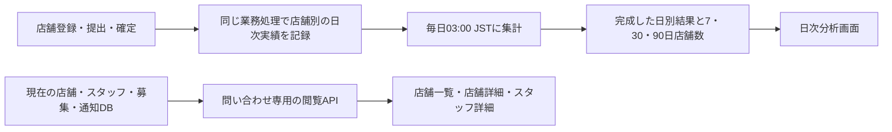

# Analyticsの日次利用指標と問い合わせ閲覧

> 状態: 実装中・CI検証前
>
> 作成日: 2026-09-05

Analyticsを、毎日の利用状況を確認する画面と、店舗・スタッフを調べる画面へ作り直す。  
登録・提出・確定の実績を当日から自動記録し、日次集計を始めるための環境変数操作、reset、backfillをなくす。

## 合意した前提と今回の範囲

本人認証付きのCloudflare常設URLは、すでに利用しているというユーザーの説明を前提にする。  
今回解消する「起動の面倒さ」は、DBの日次集計を開始するまでの設定・手順である。

analytics系テーブルには既存データが一切ないと、ユーザーから確認を得た。  
**Analyticsのschemaを自由に変更し、データmigration、旧データ引継ぎ、互換schemaの段階的切替を実装しない。**  
店舗、スタッフ、募集、提出などの業務データはそのまま利用する。

この文書は合意した設計と実装順序の履歴である。  
実装開始の承認後、アプリコードとschemaを変更した。DB、環境変数、配信設定の直接変更は行っていない。  
空テーブルとCloudflareの利用状況はユーザーからの情報であり、この調査での実環境確認ではない。

| 対象 | 今回の設計 |
|---|---|
| 毎日の分析 | 新規登録店舗数、提出があった店舗数、確定した店舗数と日別推移 |
| 集計開始 | 新実装の最初の対象操作、または定期実行から自動開始 |
| 過去データ | 開始前の利用実績は復元しない。既存店舗の現在情報は初回集計前から閲覧可能 |
| 問い合わせ | 店舗一覧 → 店舗詳細・スタッフ一覧 → スタッフ詳細。閲覧専用 |
| 要望タブ | 既存タブを維持。チェックで削除扱いにし、チェック済みも打ち消し線付きで一覧に残す |
| 配信 | 現在のCloudflare配信と本人認証、既存BFFを利用 |

## 現状の複雑さと変更判断

| 現状の根拠 | 利用者への影響 | 変更判断 |
|---|---|---|
| 日次開始がreset完了と環境変数に依存する | 集計を始めるために複数の設定・実行が必要 | 初期化前提を削除し、記録と日次cronを常時有効にする |
| 13のAnalyticsテーブルで人物・所属・周期などを投影する | 少数のKPIを見るために大きな再構築処理が必要 | 日別の利用事実と集計結果を中心に4テーブルへ再編する |
| 主指標の開始前確定率は、募集期間の開始日を軸にする | 「今日、使われたか」と数値の日付が一致しない | 実際に操作が成功したJST日を集計軸にする |
| 最新runの失敗・実行中が過去結果や店舗閲覧を利用不可にする | 集計障害が問い合わせ対応も妨げる | 日ごとの公開状態と、現在値の問い合わせAPIを分離する |
| 多数の指標・推定状態・絞り込みがトップに並ぶ | 何を見るべきか分かりにくい | トップを3指標、推移、日別表へ絞る |

実装根拠は、末尾の「参照したファイル」に示す。  
旧方式のrollout手順を今回の前提作業として実行しない。

## KPIの定義

### 日別の3指標

| 表示名 | 何を判断するか | 数える条件 |
|---|---|---|
| 新規登録店舗 | 店舗の登録が増えているか | 対象日に新しく作成された店舗。初期店舗と追加店舗を含む |
| 提出があった店舗 | スタッフが提出機能を使っているか | 対象日に有効な希望シフト提出が1件以上保存された店舗。再提出・全休みの提出も含む |
| 確定した店舗 | シフト作成が確定まで進んでいるか | 対象日にシフト確定の業務処理が1回以上成功した店舗。変更後の再確定も含む |

いずれも**店舗の重複を除いた件数**である。  
同じ店舗の複数スタッフ、複数募集、繰り返し操作を、その日の同じ指標へ加算しない。  
翌日に再提出や再確定があれば、その翌日の実績として数える。

保存に失敗した操作、画面表示、下書き、通知だけの再送、変更のない確定の再実行は数えない。  
登録前から存在する店舗を観測開始日に新規登録として数えず、既存店舗で開始後に発生した提出・確定は含める。  
後日店舗や募集が削除されても、すでに記録した日別実績は減らさない。

日付はサーバーが業務操作を受理した時刻からJSTで決める。  
クライアント指定時刻、募集の開始日、最後に編集された現在値から過去の日別実績を作らない。

### 期間と数値の読み方

期間選択は7日・30日・90日とし、終了日はJSTの前日とする。  
URLには相対期間を保存し、同じURLを翌日開いたときに日付が進むようにする。  
前日が未集計でも期間を過去へずらさず、その日を未集計として表示する。

トップの大きい3数値は前日分とし、期間選択は推移と期間内の重複を除いた店舗数へ適用する。  
期間内店舗数も店舗ごとに重複を除くため、日別店舗数を足し合わせない。  
たとえば同じ店舗で7日間毎日提出があれば、日別は各1店舗、7日間では1店舗になる。

| データの状態 | 表示と計算 |
|---|---|
| 完全な一日の集計が成功し、実績なし | 0店舗 |
| 開始前 | 計測開始前。0で埋めない |
| 開始初日の一部だけ観測 | 開始時刻を添えて「初日は途中から計測」。完全日との増減比較をしない |
| 未集計・実行中・失敗 | 日別表に状態を残し、グラフは欠損にする。成功した他の日は表示を続ける |
| 選択期間が開始前や初日の一部を含む | 実際の観測開始日時と観測日数を示した部分期間の件数。通常の7日・30日・90日分と区別する |

選択期間に集計失敗や未集計の日がある場合、期間内店舗数は「未確定」とする。  
正常な日別結果まで隠さず、欠損を除いた合計を完全な期間値として表示しない。

3指標は利用の広がりと日々の活動を確認するための指標であり、売上や継続率そのものではない。  
提出店舗数を登録店舗数で割った値をコンバージョン率と呼ばず、日次の0を離脱と判定しない。  
初版ではプラン別分析、MRR、解約率、推定health、獲得経路、テスト店舗の推定除外を追加しない。

### 店舗詳細での分析

店舗詳細では、観測開始後の提出日・確定日と、別の募集でも確定まで進んだかを確認できるようにする。  
同じ募集の再確定は、2回目の募集利用に数えない。  
既存店舗の初回利用日は推定せず、「観測開始後・保存期間内に確認できた実績」として表示する。

提出率や開始前確定は、根拠が取得できる募集詳細に限って表示する。  
現在の提出状況は現在の対象人数を分母にした値であると明示し、締切時点の提出率へ読み替えない。  
締切時点の対象者集合などが残っていない過去の率は「算出できません」とし、この率のための履歴再構築は行わない。

## 記録・集計の構成



### 4テーブルへの再編

以下の名称とindexは設計案であり、空のAnalytics schemaを置き換える際に確定する。  
現在値を複製する組織・店舗・人物・所属dimensionや、汎用source eventの再生処理は持たない。

| テーブル案 | 保持する情報 | 主なindex・一意性 |
|---|---|---|
| analyticsState | 一つの観測開始時刻、定義version、未処理日の探索位置 | keyで1行 |
| analyticsShopDays | 店舗ID、JST日付、登録・提出・確定の3flag | shopId＋dateで1行。date＋shopIdで日別drilldown・保持期限走査 |
| analyticsCycleEvidence | 店舗ID、募集ID、提出・確定の初回／最終観測時刻、確定時の期間開始日時 | shopId＋recruitmentIdで1行。店舗別履歴と保持期限用index |
| analyticsDailyResults | 日付、観測範囲、部分日情報、run状態・進捗、完成した日別値と7／30／90日値 | dateで1行。status＋dateで復旧対象を取得 |

日次実績のflagはfalseからtrueへ進めるだけとし、すでにtrueなら同じ日への再書込みを避ける。  
一意性はindex検索と書込みを同じmutationで行って保ち、全店舗で共通のカウンターを業務操作ごとに更新しない。

Analytics記録は業務変更と同じtransactionで確定する。  
記録に失敗した場合は業務変更もrollbackし、業務だけ成功して日次実績が欠落する状態を作らない。  
書込み先は当該店舗・当日の1行と当該募集の1行に限定し、業務操作の待ち時間と同時提出時の競合を検証する。

### 自動開始と初日

新実装の最初の登録・提出・確定、または毎日03:00のcronが、観測開始行を同じtransactionで一度だけ作る。  
開始行が存在すればその時刻を引き継ぎ、deployのたびに開始日を変えない。  
旧Analyticsの環境変数が未設定・無効でも、新しい記録と集計は動作する。

たとえば9月5日14:00に最初の操作があれば、9月5日14:00から記録し、9月6日03:00に初日の部分集計を公開する。  
対象操作が一度もなく、9月6日03:00のcronで初めて開始した場合は、9月6日03:00を開始点とし、9月7日03:00にその部分日を公開する。  
この場合、9月5日を実績0の日として生成しない。

開始前の画面には「計測開始待ち」、開始後には開始時刻と次の集計予定を表示する。  
既存店舗の一覧と詳細はどちらの状態でも利用できる。  
開始時点の全店舗をAnalyticsへseedする処理や、正確な過去時点の店舗総数を作る処理は不要とする。

### 日次runと期間集計

毎日03:00 JSTに、前日00:00以上・当日00:00未満の実績を確定する。  
初日だけは観測開始時刻を入力の始点にする。

同じrunで、各店舗の直近90日以内の実績を読み、日別と7日・30日・90日の各flagを店舗内でORしてから店舗数へ加算する。  
店舗順のindexで次の店舗へ進み、各店舗は最大90行、一つの処理は既定20店舗までに区切る。  
全件取得を一つのqueryへ入れず、途中の店舗位置と集計値を日次結果行へ保存する。

ページの加算、cursor更新、stepVersion更新、次ページの予約は同じtransactionで行う。  
古いstepVersionの重複呼出しは何も変更しない。  
途中値はAPIへ返さず、全ページと整合検査を終えた結果だけを公開する。

定義versionと対象日の境界はrun開始時に固定する。  
日付終了後の業務操作は新しい当日行へ記録されるため、完成済みの日別事実を書き換えない。  
保持処理も未完了runの入力を削除しない。

期間countは終了済み日付の実績から計算して保存し、公開可否は期間内の各日の日次状態から読取り時に判定する。  
そのため、期間内の失敗日が復旧すれば、ほかの日の期間countを再計算せずに公開できる。

### 失敗からの復旧と保持

失敗時には安全なerror code、試行回数、最終進捗時刻を保存する。  
一時的な失敗は1分・5分・15分後の最大3回まで自動再試行し、最後に確定したページから再開する。  
次の定期実行では前日分を優先し、観測開始後の未起動日・失敗日・進捗が12時間止まったrunも有界に再予約する。  
一つの日の失敗が別の日の集計を止めないようにする。

再試行や停滞回収の予約時には、再開位置と途中countを保ったままstepVersionを更新する。  
成功・失敗の記録にもversion一致を要求し、停止していた古い呼出しが再開後の状態を書き換えないようにする。

これは記録済みの開始後データから集計を再開する処理であり、開始前のbackfillではない。  
sourceを失った期間は復元せず、欠損として残す。

店舗別の日次実績と募集の観測情報は25か月、店舗IDを含まない日次集計結果は5年を保持する。  
この期間は既存の詳細・サービス集計の保持方針を引き継ぐ。  
完成したrunと再試行を終了したrunでは、店舗IDを含むcursorや作業用の途中値を消去する。  
未完了runは、観測開始日と対象日の89日前のうち遅い日から対象日までの入力を保護する。  
週次の有界削除はその範囲を除外するが、必要な入力の25か月期限に達した場合は、該当runの再試行を終了して欠損理由を残してから削除する。  
未完了を理由に保持期間を無期限に延長しない。  
古い日次結果では日別数値を表示できても、店舗別の内訳は「保存期間外」となる。

AnalyticsにはスタッフID、氏名、メールアドレス、LINE識別子、提出内容、通知本文を保存しない。  
店舗・募集の削除後も実績の件数を保ち、日別内訳で現在情報を取得できない店舗は「削除済み店舗」として詳細遷移を無効にする。

## 画面と閲覧API

### 画面構成

| 画面 | 表示と操作 |
|---|---|
| 日次分析 | 前日の3指標、7／30／90日切替、期間内店舗数、小さな日別推移3つ、日別表、集計状態、集計JSONL出力 |
| 店舗一覧 | 現在の店舗名・組織名・登録日。店舗名の絞り込みとページ送り。日別数値から来た場合は対象日と指標を表示 |
| 店舗詳細 | 現在の店舗設定・組織情報、スタッフ一覧、直近募集、観測開始後の提出・確定実績 |
| スタッフ詳細 | 氏名、メールアドレス、アカウント連携、LINE状態、所属店舗・管理者区分・シフト対象区分、提出・通知の履歴 |
| 募集詳細・要望一覧 | 募集の現在情報と根拠のある分析値。既存の要望タブは日次集計と独立して維持し、チェックによる削除扱いと打ち消し線表示を追加 |

主要導線は次の形にする。

```text
/
/shops
/shops/:shopId
/shops/:shopId/staff/:staffId
/shops/:shopId/cycles/:recruitmentId
/requests
```

スタッフ一覧は店舗詳細内に置く。  
別店舗所属のリンクは、その店舗に対応するスタッフ詳細へ遷移させる。  
旧組織専用画面と多数のsegment・health表示は新導線へ整理し、組織情報と所属店舗は店舗詳細の文脈で確認できるようにする。

日別数値のクリックは、対象日と指標を固定した店舗集合を開く。  
現在の店舗一覧へ戻すための条件解除を用意し、過去の対象集合と現在値を混ぜない。  
内訳の名称・所属は現在の情報であると明示する。

### 要望タブの維持とチェック操作

既存の要望タブとその導線、要望本文・対象店舗／組織・送信者種別・受付日時の表示を維持する。  
受付日時の新しい順で最大50件ずつ取得する現在の並び順とページ送りを引き継ぎ、チェックしても行を消したり末尾へ移動したりしない。

| チェック | 保存する値 | Analyticsでの表示 |
|---|---|---|
| 未チェック | isDeletedがfalse、または既存行で未設定 | 通常の要望本文 |
| チェックを入れる | isDeletedをtrueへ更新 | 行を残し、要望本文を打ち消し線にする。チェック済み状態も表示 |
| チェックを外す | isDeletedをfalseへ更新 | 打ち消し線を外し、通常表示へ戻す |

業務tableのfeatureRequestsへoptionalなbooleanのisDeletedを追加し、新規要望ではfalseを保存する。  
このtableは空と確認されたAnalyticsテーブル群の対象外なので、既存行の未設定値はfalseとして読み、backfillやmigrationを要求しない。  
返却DTOのisDeletedは必須booleanへ正規化する。

一覧queryはisDeletedで絞り込まず、trueの要望も同じページ分割の対象にする。  
このflagは要望を整理するための論理削除であり、本文や行を物理削除する処理を追加しない。  
既存の要望送信の冪等性判定もチェック済み行を対象に含め、送信の再試行で行を作り直したりfalseへ戻したりしない。

チェック更新は、要望documentのIDと希望するbooleanを受け取る専用internal mutationで行う。  
サーバーで値を反転するtoggleにせず、同じ値の再送でも結果が変わらない更新にする。  
対象要望が存在しなければ取得不能を返し、要望元の店舗・組織が削除済みでも、残っている要望のチェックは変更できる。

保存中は対象行のチェック操作を無効にし、保存成功後の状態を表示する。  
失敗時は直前の表示を維持してその行に再試行を案内し、結果が不明な通信断では現在値を再取得する。  
打ち消し線に加えてcheckboxのchecked状態と操作ラベルで状態を伝え、本文を読めるコントラストを保つ。

PCの表とSPのカードに同じ操作を置き、確認Dialogは挟まない。  
保存後は取得済みの要望ページにも返却状態を反映し、ページを戻ったときに古いチェック状態へ戻らないようにする。

### 現在値の取得範囲

問い合わせAPIは業務tableを参照し、Analyticsのrunや投影tableを条件にしない。  
スタッフの人物・所属・LINE状態は既存のcanonical解決処理を再利用する。  
組織管理者の認証を偽装して既存queryを呼ばず、本人用の固定されたinternal queryで必要項目だけを返す。

店舗・スタッフ一覧は既定50件、最大100件とし、絞り込み走査は1回500件までとする。  
上限に達しても続きを取得できるcursorを返し、まだ未走査なのに「該当なし」としない。  
スタッフ総数のために各店舗の全所属を読み込まず、一覧の件数表示は取得済み範囲と続きの有無で表す。

スタッフの提出履歴は、初版ではこの店舗の直近20募集に対する記録とする。  
募集は現在の期間開始日が新しい順に取り、各募集のスタッフ別提出indexから取得する。  
これは全期間の提出履歴ではなく、記録がないことだけで過去の未提出と断定しない。

通知履歴は既存の店舗・スタッフ・受付日時indexから直近20件、最大50件ずつ取得する。  
受付、送信、到達の状態を区別し、LINEの送信済みを到達済みと表示しない。  
通知種別・時刻・状態だけを返し、通知本文や再送操作を持ち込まない。

query条件とcursorはendpoint・店舗・日付・指標・並び順へ結び付け、条件変更時にcursorを破棄する。  
応答は既存の512KiB上限を維持し、切り詰めた値を正確な全集合として返さない。  
スタッフ詳細では指定店舗への所属と人物・組織の整合、削除・アカウント状態をサーバー側で検証する。

### 本人限定閲覧と個人情報

Cloudflare Access → WorkerのBFF → service secret付きのConvex HTTPという既存境界を維持する。  
閲覧はinternal query、要望のチェック変更だけは専用internal mutationへdispatchする。  
許可する操作は固定し、任意tableの読取り・更新、店舗やスタッフなどの業務更新、通知送信APIを追加しない。  
公開時にはAPIパスと代替ホストも同じ本人認証の対象であることを確認する。

要望の更新経路は本人用BFFだけに置き、通常の管理者・スタッフ向け要望送信APIへチェック変更権限を付けない。  
BFFで同一originとJSON入力を検証し、Convex HTTPでもservice認証、既存の利用頻度・bodyサイズ制限、対象IDとbooleanだけの入力検証を行う。  
GETでは更新せず、service認証のない直接呼出しや別originからの更新を拒否する。  
更新応答は対象IDと保存後の値だけとし、本文をログへ出さない。

更新用のpath・method・body転送はCloudflare Workerと既存Vite middlewareの両方で揃える。  
現行のGET専用処理へ更新を紛れ込ませず、有界のJSON bodyを渡す。  
ローカルでも実際の外向きoriginを使って検証し、middleware内部の仮想URLをorigin判定の基準にしない。

問い合わせ一覧には氏名を返し、メールアドレスは明示的に開いたスタッフ詳細へだけ返す。  
token、LINE user ID、providerの生のエラー、通知本文、秘密値はどの画面にも返さない。  
問い合わせ応答はno-storeとし、永続キャッシュ・URL・ログ・外部計測へ個人情報を載せない。  
画面を再表示したときに現在値を更新し、認証切れではキャッシュを破棄する。

アプリ配下の現在の個人情報禁止規則は、問い合わせ時の氏名・メールアドレス表示に限った例外へ、実装と同時に更新する。  
集計API、Analyticsテーブル、JSONLにはこの例外を適用しない。

JSONLは日別3指標、期間、定義version、観測開始、集計状態に限定し、店舗・組織・人物・募集の識別子も含めない。  
旧形式の識別子付き全件exportを置き換え、問い合わせDTOを出力処理へ渡さない。

## 実装順序と完了条件

一つの改善として、基盤だけで止めず、日次分析と問い合わせ導線まで実装する。  
以下は作業の順序であり、互換schemaを使うmigration工程ではない。

| 工程 | 主な変更先 | 完了条件 |
|---|---|---|
| 1. 日次実績の記録 | `convex/schema.ts`、`convex/analytics/`、組織・店舗登録、提出、確定の既存mutation | 4テーブルへ再編。新規・再提出・再確定を正しく記録。旧投影・source eventの発火と設定依存を撤去 |
| 2. 日次自動集計 | `convex/crons.ts`、`convex/analytics/` | 自動開始、初日部分計測、日別と固定期間の重複排除、再試行・再開・保持を実装。旧resetを起動手順から除去 |
| 3. 閲覧APIと要望のチェック更新 | `convex/analyticsDashboard/`、`convex/featureRequest/mutations.ts`、`convex/schema.ts`、既存BFF | 集計前から現在値を閲覧可能にする。所属検証と最小DTO、要望のisDeleted追加・全状態の一覧取得・本人限定の更新を実装 |
| 4. 画面の置換 | `apps/analytics-dashboard/` | 3指標と推移、日別内訳、店舗・スタッフdrilldown、JSONLを接続。既存要望タブにチェックと打ち消し線を追加。重複したカード・不要な旧画面とqueryを削除 |
| 5. 検証と文書の更新 | 対象Convexテスト、Analytics規則・機能文書・運用文書 | 自動テストと静的検証を完了。旧rollout計画・手順をarchiveへ移し、新しい運用を正本にする |

旧Analyticsの空テーブル・field・indexと専用reset処理は削除できる。  
Analyticsを呼び出していた店舗設定、スタッフ所属、LINE、組織監査などの経路から不要な呼出しを外し、業務処理そのものは保持する。  
予約済みの旧scheduled callがある場合だけ、旧入口を何も書き込まない処理として残す。  
これはデータmigrationや新旧集計の二重稼働を必要としない。

既存の接続先・service secretは配信のために保持し、集計を始めるためだけの旧環境変数は参照しなくする。  
環境変数を実際に削除することを開始条件にせず、残っていても新方式を妨げないようにする。

コード完成後の反映順序は、許可された対象へのConvex反映、Cloudflareアプリ更新、自動記録・翌日の集計結果の確認とする。  
手動の初期化、backfill、開始日時の入力、cron有効化は要求しない。  
現在のProduction接続禁止をこの計画で解除せず、反映と実環境確認は別の作業として扱う。

## 検証計画

主担当はConvex Function Testとし、業務保存から集計公開までの代表フローだけをConvex Scenario Testで確認する。  
内部BIアプリには、アプリ配下の規則に従ってLogic・UI・Storybook・VRT・E2Eテストを追加しない。

| 検証する契約 | 主担当の検証 |
|---|---|
| 日付と重複 | JST日境界、同店舗の複数提出・複数募集・再確定、翌日の再操作、全休み提出、失敗操作のrollback |
| 自動開始 | 全Analyticsテーブル空、旧環境変数なし／false、最初の操作で開始、操作なしのcron開始、初日部分計測、開始前の0行を作らない |
| 期間集計 | 同じ店舗が複数日に現れる7／30／90日の重複排除、初日前後、正常な0・未計測・欠損の区別 |
| 復旧と保持 | 複数ページ、古いstepの重複、途中失敗と再開、未起動・停滞回収、別日の継続、保持期限と未完了入力の保護、削除後の件数維持 |
| 問い合わせ境界 | 初回集計前・集計失敗中の閲覧、別店舗staff ID・不整合・削除人物の拒否、一覧にemailを含めない、秘密値を返さない、ページ継続と応答上限 |
| 要望のチェック | 既存未設定値と新規行はfalse、trueの行も一覧・ページ送りへ含む、true／falseへの更新と同値再送、送信の再試行で復元しない、存在しないID・認証なし・不正入力の拒否、集計失敗中も利用可能 |

既存の提出・確定・店舗登録のFunction Testを更新し、Analyticsだけの都合で業務の成功条件を変えていないことを確認する。  
一つのScenarioで、既存店舗の即時閲覧 → 当日操作 → 翌日集計 → 日別店舗内訳までの整合を検証する。  
UI側へ同じ数値計算を重複実装せず、日付・状態・表示用DTOをAPIの検証対象にする。

要望の状態更新・一覧取得はConvex Function Test、service認証と不正な更新入力の拒否は既存のHTTP境界テストで検証する。  
アプリ側は静的検証と変更内容のレビューで、チェック状態と打ち消し線、保存中・失敗時の分岐を確認する。

実装時は対象テストから始め、最終的に次を実行する。  
この計画文書だけの変更では文書検査を実行する。

```bash
pnpm test:convex
pnpm lint
pnpm type-check
pnpm build
pnpm analytics:lint
pnpm analytics:type-check
pnpm analytics:build
pnpm docs:check
```

実環境では、既存URLで本人認証後に店舗・スタッフを閲覧できること、PCを起動せず翌日集計が公開されることを確認する。  
確認したrevision・対象・日時・結果だけをリリース状態に記録し、ローカル検証を実環境の成功として扱わない。

## 参照したファイル

| 判断対象 | 参照先 |
|---|---|
| 現行KPIと起動手順 | [Analytics機能](../features/analytics.md)、[Dashboard機能](../features/analytics-dashboard.md)、[旧rollout手順](../archive/manual/2026-08-08_analytics-reset-rollout.md)、[旧夜間バッチ計画](../archive/plans/2026-08-08_Analytics夜間バッチ簡素化_実装計画.md) |
| 記録・集計・schema | [schema](../../convex/schema.ts)、[registry](../../convex/analytics/registry.ts)、[日別記録](../../convex/analytics/record.ts)、[runs](../../convex/analytics/runs.ts)、[nightly](../../convex/analytics/nightly.ts)、[crons](../../convex/crons.ts) |
| 業務側の記録箇所 | [組織監査](../../convex/organization/audit.ts)、[店舗](../../convex/shop/mutations.ts)、[募集](../../convex/recruitment/mutations.ts)、[提出](../../convex/shiftSubmission/mutations.ts)、[確定](../../convex/shiftBoard/mutations.ts)、[スタッフ](../../convex/staff/mutations.ts)、[LINE](../../convex/line/mutations.ts) |
| 閲覧境界と再利用先 | [HTTP境界](../../convex/analyticsDashboard/httpActions.ts)、[入力schema](../../convex/analyticsDashboard/schemas.ts)、[query](../../convex/analyticsDashboard/queries.ts)、[人物詳細](../../convex/organization/userDetailQueries.ts)、[LINEの所属解決](../../convex/line/service.ts)、[通知履歴](../../convex/notificationOutbox/queries.ts) |
| 要望タブと保存 | [要望受付](../features/feature-requests.md)、[要望送信](../../convex/featureRequest/mutations.ts)、[要望一覧UI](../../apps/analytics-dashboard/src/features/requests/RequestsView.tsx)、[要望ページ](../../apps/analytics-dashboard/src/pages/RequestsPage.tsx)、[BFF経路](../../apps/analytics-dashboard/src/server/analyticsRoutes.ts) |
| 画面・配信・検証規則 | [アプリ規則](../../apps/analytics-dashboard/AGENTS.md)、[Worker](../../apps/analytics-dashboard/src/worker.ts)、[配信設定](../../apps/analytics-dashboard/wrangler.jsonc)、[UI方針](../rules/ui-design.md)、[Convex設計方針](../rules/convex-design-strategy.md)、[セキュリティ方針](../rules/security-strategy.md)、[テスト方針](../rules/testing-strategy.md)、[実環境証跡](../manual/release-status.md) |

## 実装時の検証順序

ユーザーが明示したbabysit-prの手順に従い、初回push前に全体test・lint・型検査・buildを実行しない。変更とテスト契約を自己レビューして先にPRへ反映し、GHAの失敗境界に対して必要なローカル確認を行う。実環境反映はこのPR監視の完了条件に含めない。
