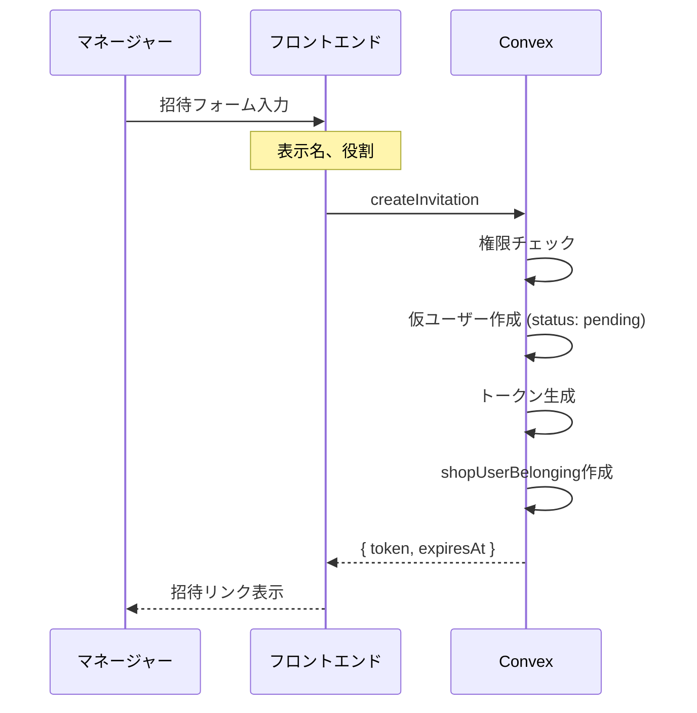

# ユーザー招待機能 仕様書

## 概要

店舗オーナー・マネージャーが新規ユーザーを店舗に招待するための機能。
招待リンクを発行し、受け取ったユーザーがリンクを経由して店舗に参加できる。

---

## 1. 権限（ロール）

### 招待を作成できるロール

| ロール | 招待作成 | 招待キャンセル | 招待再送 | 招待一覧閲覧 |
|--------|:--------:|:--------------:|:--------:|:------------:|
| **owner** (オーナー) | ✅ | ✅ | ✅ | ✅ |
| **manager** (マネージャー) | ✅ | ✅ | ✅ | ✅ |
| **general** (スタッフ) | ❌ | ❌ | ❌ | ❌ |

### 招待時に設定できるロール

招待者は以下のロールを招待対象に付与できる：
- `manager` (マネージャー)
- `general` (スタッフ)

> **注意**: `owner`ロールは招待では付与できない（店舗作成者のみ）

---

## 2. 招待リンクの仕様

### トークン生成

- **形式**: 32文字のランダム文字列（`a-z0-9`）
- **例**: `a1b2c3d4e5f6g7h8i9j0k1l2m3n4o5p6`
- **一意性**: DBインデックスで保証

### 招待URL形式

```
https://{domain}/invite?token={32文字のトークン}
```

### 有効期限

| 項目 | 値 |
|------|-----|
| **有効期間** | 14日間 |
| **起算点** | トークン発行時刻 |
| **期限切れ後** | リンクは無効、エラー表示 |

> 定数定義: `convex/constants.ts`
> ```typescript
> INVITE_EXPIRY_DAYS = 14
> INVITE_EXPIRY_MS = 14 * 24 * 60 * 60 * 1000
> ```

---

## 3. 招待フロー（招待者側）

### 3.1 招待作成



### 3.2 招待キャンセル

- **対象**: `status: "pending"` の招待のみ
- **処理**:
  - `shopUserBelongings` を論理削除 (`isDeleted: true`)
  - 関連する仮ユーザーも論理削除

### 3.3 招待再送

- **用途**: 期限切れ前のトークン更新、または期限延長
- **処理**:
  - 新しいトークンを生成
  - 有効期限を現在時刻 + 14日にリセット
  - 古いトークンは無効化

---

## 4. 招待受け入れフロー（招待された側）

### 4.1 状態判定フローチャート

```
招待リンクアクセス
       │
       ▼
┌─────────────────┐
│ トークンが空？  │──Yes──▶ エラー: 無効なリンク
└───────┬─────────┘
        │No
        ▼
┌─────────────────┐
│ データ取得中？  │──Yes──▶ ローディング表示
└───────┬─────────┘
        │No
        ▼
┌─────────────────┐
│ 招待が存在？    │──No───▶ エラー: 招待が見つかりません
└───────┬─────────┘
        │Yes
        ▼
┌─────────────────┐
│ 有効期限内？    │──No───▶ エラー: 有効期限切れ (オレンジアイコン)
└───────┬─────────┘
        │Yes
        ▼
┌─────────────────┐
│ キャンセル済み？│──Yes──▶ エラー: キャンセルされました
└───────┬─────────┘
        │No
        ▼
┌─────────────────┐
│ 既に承認済み？  │──Yes──▶ 承認済み画面
└───────┬─────────┘
        │No
        ▼
┌─────────────────┐
│ ログイン済み？  │──No───▶ ログイン要求画面 (Clerkモーダル)
└───────┬─────────┘
        │Yes
        ▼
    参加ボタン表示
       │
       ▼
   「この店舗に参加する」クリック
       │
       ▼
   参加完了 → 店舗ページへ
```

### 4.2 各状態のUI表示

| 状態 | タイトル | アイコン色 | 説明 |
|------|----------|------------|------|
| 無効なトークン | 無効なリンク | 赤 | URLにトークンがない |
| 招待不存在 | 招待が見つかりません | 赤 | DBに該当レコードなし |
| 有効期限切れ | 招待の有効期限切れ | オレンジ | 期限超過 |
| キャンセル済み | 招待がキャンセルされました | 赤 | 招待者がキャンセル |
| 承認済み | （既承認画面） | - | 既に参加済み |
| 未ログイン | - | - | ログインボタン表示 |
| ログイン済み | - | - | 参加ボタン表示 |

---

## 5. ログイン状態による処理分岐

### 5.1 未ログイン時

1. Clerkのサインインモーダルを表示
2. サインイン/サインアップ後、招待ページに戻る
3. 参加ボタンが表示される

### 5.2 ログイン済み時

**Case A: 新規ユーザー（初めてこのシステムを使う）**

1. 参加ボタンをクリック
2. 仮ユーザーに `authId` を紐付け
3. `users.status` を `"pending"` → `"active"` に更新
4. `shopUserBelongings.status` を `"pending"` → `"active"` に更新

**Case B: 既存ユーザー（他店舗に所属済み）**

1. 参加ボタンをクリック
2. 招待の `userId` を既存ユーザーのIDに付け替え
3. 仮ユーザーを論理削除 (`isDeleted: true`)
4. `shopUserBelongings.status` を `"active"` に更新

---

## 6. データモデル

### 6.1 users テーブル

| フィールド | 型 | 説明 |
|------------|-----|------|
| `_id` | ID | ユーザーID |
| `name` | string | 表示名 |
| `authId` | string? | Clerk認証ID（仮ユーザーは`undefined`） |
| `status` | string | `"pending"` / `"active"` |
| `createdAt` | number | 作成日時（Unix ms） |
| `isDeleted` | boolean? | 論理削除フラグ |

### 6.2 shopUserBelongings テーブル

| フィールド | 型 | 説明 |
|------------|-----|------|
| `_id` | ID | レコードID |
| `shopId` | ID | 店舗ID |
| `userId` | ID | ユーザーID |
| `displayName` | string | 店舗での表示名 |
| `role` | string | `"owner"` / `"manager"` / `"general"` |
| `status` | string | `"pending"` / `"active"` |
| `inviteToken` | string? | 招待トークン |
| `inviteExpiresAt` | number? | 有効期限（Unix ms） |
| `invitedBy` | ID? | 招待者のユーザーID |
| `createdAt` | number | 作成日時（Unix ms） |
| `isDeleted` | boolean | 論理削除フラグ |

---

## 7. API一覧

### ミューテーション

| 名前 | 権限 | 入力 | 出力 |
|------|------|------|------|
| `createInvitation` | owner/manager | `shopId`, `displayName`, `role`, `authId` | `{ success, data: { token, expiresAt } }` |
| `acceptInvitation` | 認証不要 | `token`, `authId` | `{ success, data: { shopId, shopName } }` |
| `cancelInvitation` | owner/manager | `belongingId`, `authId` | `{ success }` |
| `resendInvitation` | owner/manager | `belongingId`, `authId` | `{ success, data: { token, expiresAt } }` |

### クエリ

| 名前 | 権限 | 入力 | 出力 |
|------|------|------|------|
| `getInvitationsByShopId` | owner/manager | `shopId`, `authId` | 招待一覧 + 招待者情報 |
| `getInvitationByToken` | 認証不要 | `token` | 招待公開情報 |

---

## 8. エラーコード

| コード | 説明 | 発生条件 |
|--------|------|----------|
| `PERMISSION_DENIED` | 権限がありません | owner/manager以外が操作 |
| `INVITATION_NOT_FOUND` | 招待が見つかりません | トークン不一致 |
| `INVITATION_EXPIRED` | 有効期限切れ | 期限超過 |
| `INVITATION_CANCELLED` | キャンセル済み | 論理削除された招待 |
| `INVITATION_ALREADY_ACCEPTED` | 既に承認済み | status="active" |

---

## 9. セキュリティ考慮事項

1. **トークンの強度**: 32文字のランダム文字列（36^32 = 約6.3×10^49通り）
2. **有効期限**: 14日間で自動無効化
3. **公開API制限**: `getInvitationByToken`は最小限の情報のみ返却
4. **権限チェック**: 全ての管理操作で権限を検証
5. **論理削除**: キャンセル時は物理削除せず論理削除

---

## 10. 関連ファイル

### バックエンド（Convex）

- `convex/invite.ts` - 招待ミューテーション・クエリ
- `convex/schema.ts` - DBスキーマ定義
- `convex/constants.ts` - 定数定義
- `convex/helpers.ts` - トークン生成ヘルパー

### フロントエンド

- `src/routes/invite.tsx` - 招待URLルート
- `src/components/pages/Invite/index.tsx` - 招待受け入れページ
- `src/components/pages/Shops/InvitePage/index.tsx` - 招待管理ページ
- `src/components/features/Shop/Invite/` - 招待関連コンポーネント
- `src/components/features/User/Join/` - 招待状態別UI

---

## 改訂履歴

| 日付 | 内容 |
|------|------|
| 2025-11-25 | 初版作成 |
