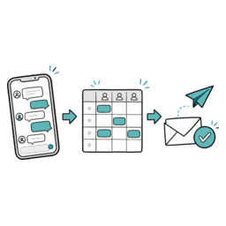

# LINEで集めたシフト希望を、あとから探していませんか

> 深夜に届く「やっぱり明日休みでお願いします」。
> トークをさかのぼって、指折り数えて、Excelに書き写す。
> このひと手間を減らす考え方を紹介します。

## この記事でわかること

- LINEでシフト希望を集めると、なぜ毎月バタバタするのか
- 「提出場所を1つにまとめる」だけで何が変わるのか
- 回収から共有までを同じ流れにすると、確認する場所が減る理由

---

## なぜ、LINEで集めると毎月バタバタするのか

LINEはスタッフとの連絡に欠かせません。
ただ「シフト希望を集める」用途になると、急にやりづらくなります。
理由はシンプルで、**トークは時系列で流れていくから**です。

シフト担当のあるあるを並べると、たぶん心当たりがあります。

- 締切後に「やっぱり入れません」が個別トークで届く
- グループと個別、どっちで言われたか分からなくなる
- 「最新どれだっけ」と上にスクロールして探す
- Excelに写したつもりが、1人ぶん抜けていた

どれも一つひとつは小さい手間です。
でも10人ぶんを毎月くり返すと、**「集める」より「探す、確かめる」に時間が消えていきます**。

問題は担当者の段取りではありません。
**希望が1か所に集まっていないこと**が原因です。

---

## 解き方は「提出場所を1つにまとめる」だけ

やることは難しくありません。
スタッフに自由返信してもらう形をやめます。
**決まった入力フォームに1か所で集める**。
これだけです。

提出場所が1つになると、こう変わります。

| いままで | 提出を1か所にまとめると |
| --- | --- |
| トークをさかのぼって最新を探す | 提出一覧を上から見るだけ |
| 誰が出したか指折り確認 | 未提出の人がひと目で分かる |
| LINEから手で転記 | 入力された希望をそのまま見る |

ツールを使わなくても、考え方は同じです。
「希望はこのフォームに」と決めるだけでも、探す時間はかなり減ります。

ここから先は、**この流れをそのまま回収から共有までつなげる**話です。
シフトリを例に紹介します。

{width=300 align=center}

---

## 回収から共有までを同じ流れにする

### 1. 希望を集める

シフト期間と締切を決めて、募集を作ります。
スタッフには提出リンクが発行されます。
あとは、**そのリンクを普段使っているLINEで送るだけ**。
スタッフは届いたリンクから、出られる日や時間を入力します。

新しいアプリを入れてもらう必要はありません。
スタッフ側は「リンクを開いて入力する」だけです。
説明の手間がほぼ要りません。

### 2. 集まった希望を見ながら調整する

提出された希望は、シフト表の画面でまとめて見られます。
時間を伸ばす、短くする、別の日に動かす。
こうした調整を、**希望と確定予定を同じ画面で見比べながら**進められます。

締切を過ぎたスタッフの画面には「お店で調整中」と表示されます。
スタッフが「私のシフトどうなりました？」と何度も聞いてくる。
あの問い合わせも減ります。

### 3. 確定したらスタッフへ共有する

シフトが決まったら、確定します。
共有用のリンクを送ります。
ここでも、**送り先はLINEでもメールでもOK**。
連絡手段が混ざっているお店でも、同じ管理画面から扱えます。

「シフト表はできたけど、まだ送ってなかった」という共有ヌケも起きにくくなります。

---

## まとめ：探す場所が減ると、毎月のバタバタが減る

紙でもExcelでもLINEでも、シフトは作れます。
ただ「希望を探す」「表に写す」「確定後に送る」を別々にやっていると、**確認する場所がどんどん増えていきます**。

回収、調整、共有を1つの流れにまとめます。
そうすると、いま自分がどこまで終わっているかが見えるようになります。
これが、毎月のバタバタを減らすいちばんの近道です。

---

## まず試すなら、次の1回分から

最初からすべての運用を変える必要はありません。
**次のシフト募集だけ**、回収から共有まで通して試す。
それだけでも、今のやり方と比べやすくなります。

試すときに決めておくのは、これくらいです。

- どの期間のシフトを募集するか
- 提出締切をいつにするか
- 確定後の共有まで通してやってみるか

LINEで希望を集め、シフト表を調整し、確定したら共有する。
この一連を1つの流れで試したいとき、[シフトリ](https://shiftori.app)は選択肢のひとつです。
